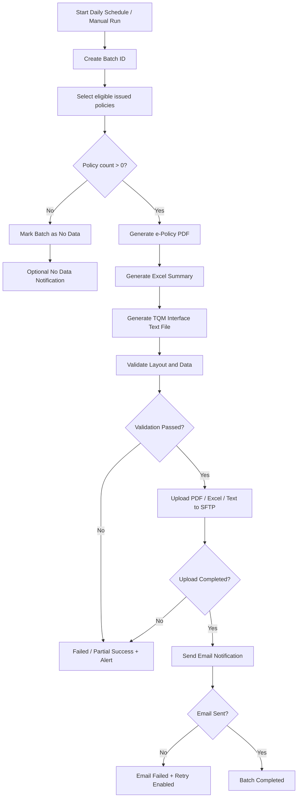
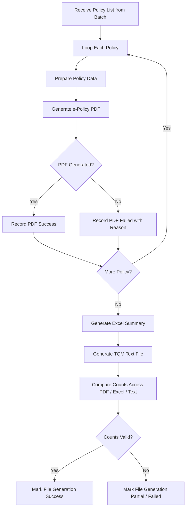
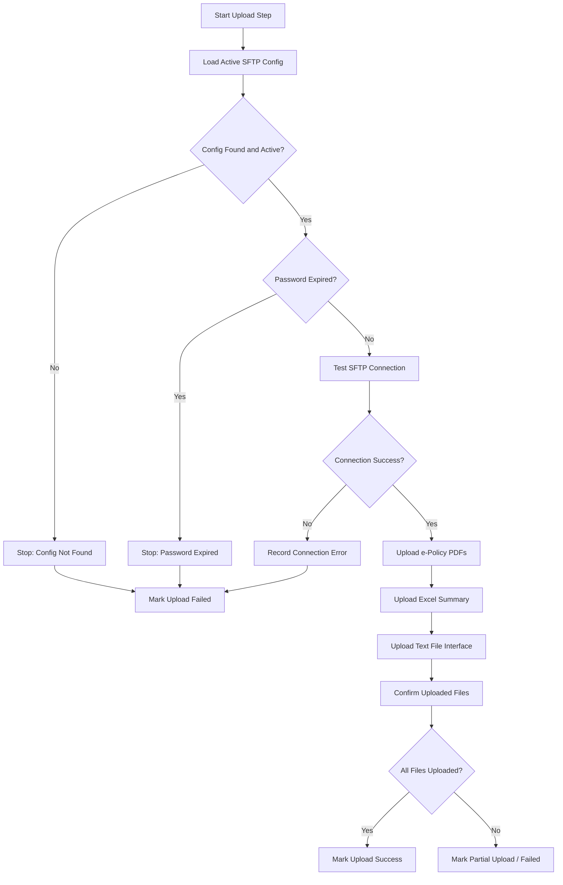
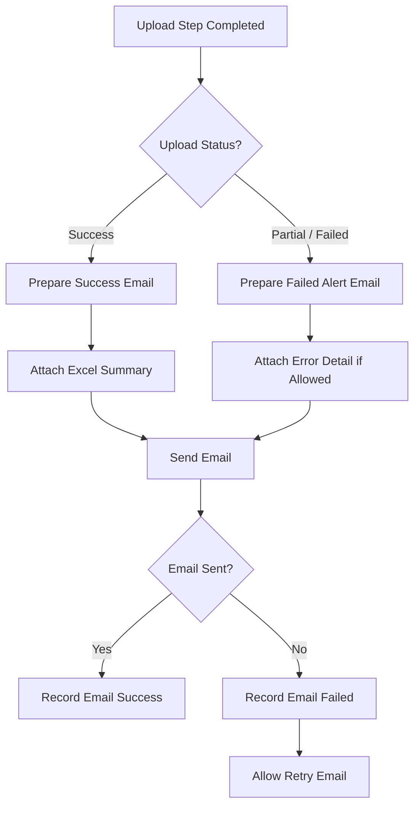
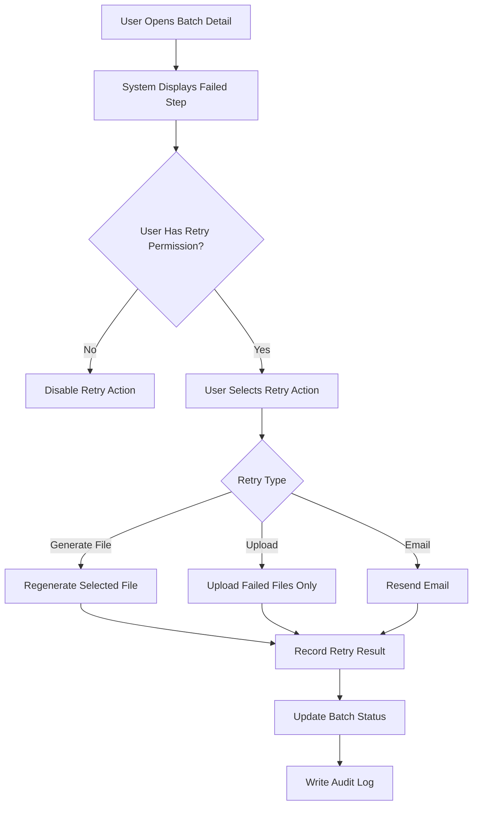
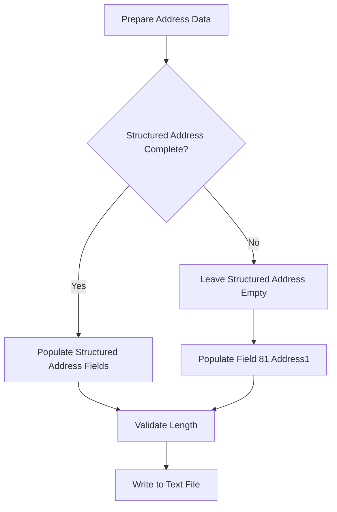
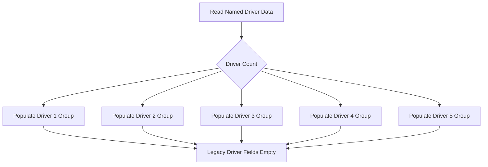
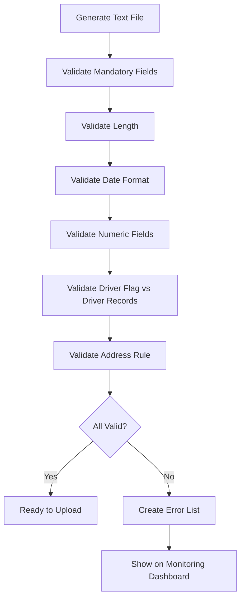

# P2026-012 TQM File Delivery & Integration Specification

**Document Type:** Unified Markdown Specification  
**Project:** P2026-012 ปรับปรุงระบบขายประกันภัยภาคบังคับบน Cloud  
**System:** Deves sale Systems on cloud / DSSC  
**Partner:** TQM  
**Module:** TQM File Delivery, Monitoring, Configuration & Interface Import  
**Version:** Draft 1.0.0  
**Prepared by:** Teerapat Tiangkool  
**Created Date:** 11 July 2026  
**Source Layout File:** `Format กรมธรรม์ขากลับ update (5-7-68)-3(1) แจ้ง IT.xls`  
**Status:** Draft for Review

---

## 1. วัตถุประสงค์ของเอกสาร

เอกสารฉบับนี้รวมการวิเคราะห์ทั้งหมดของงานนำส่งไฟล์กรมธรรม์ช่องทาง TQM ไว้ในไฟล์เดียว เพื่อใช้เป็นเอกสารอ้างอิงสำหรับ Business Owner, BA, SA, Developer, QA, IT Operations และผู้เกี่ยวข้องในการพัฒนา ทดสอบ และดูแลระบบหลังใช้งานจริง

แนวคิดหลักของงานนี้ไม่ใช่เพียงการสร้าง Job เพื่อวางไฟล์ แต่ควรออกแบบเป็น **TQM File Delivery Management** แบบ End-to-End ซึ่งครอบคลุมตั้งแต่การคัดเลือกรายการกรมธรรม์ การสร้างไฟล์ e-Policy PDF การสร้าง Excel Summary การสร้าง Text File Interface สำหรับให้ TQM Import เข้าระบบ การ Upload ผ่าน SFTP การส่งอีเมลแจ้งผล การติดตามสถานะผ่าน Monitoring Dashboard การ Retry/Reprocess และการบริหาร Configuration โดยเฉพาะ SFTP Password ที่มีการเปลี่ยนเป็นรอบ

เอกสารนี้นำ Concept และ Layout ของไฟล์ Import จริงของ TQM มาประกอบเป็น Specification โดยตรง เพื่อให้การ Mapping, Validation และการทดสอบ SIT/UAT มีความชัดเจน ลดปัญหาคำถามระหว่างทีม เช่น Field นี้ดึงจากที่ใด, ความยาวเท่าใด, ส่งค่าว่างได้หรือไม่, และกรณีข้อมูลยาวเกินควรจัดการอย่างไร

---

## 2. Executive Summary

ระบบต้องนำส่งไฟล์ให้ TQM จำนวน 3 กลุ่มหลัก ได้แก่

1. **e-Policy PDF** — ชุดเอกสารกรมธรรม์รายฉบับ
2. **Excel Summary** — ไฟล์สรุปรายวันสำหรับ Recon จำนวนรายการและแนบอีเมล
3. **TQM Interface Text File** — ไฟล์หลักตาม Layout ที่ TQM ใช้ Import เข้าระบบ

จากการวิเคราะห์ Layout พบว่า Text File Interface เป็นหัวใจหลักของ Integration เพราะครอบคลุมข้อมูลผู้เอาประกันภัย ที่อยู่ ข้อมูลรถ ความคุ้มครอง เบี้ย ส่วนลด ภาษี อากร ข้อมูล EV และผู้ขับขี่สูงสุด 5 คน โดยใช้ตัวคั่นข้อมูลเป็น `|`

ระบบควรมี Monitoring Dashboard สำหรับแสดงสถานะระดับ Batch, File และ Policy เพื่อให้ BU/IT ทราบว่ากระบวนการในแต่ละวันสำเร็จหรือไม่ และหากล้มเหลว ล้มเหลวที่ขั้นตอนใด เช่น Generate PDF, Generate Excel, Generate Text File, Validate Layout, Upload SFTP หรือ Send Email

---

## 3. Artefacts / รายการไฟล์ที่ต้องนำส่งให้ TQM

| Artefact | ความถี่ | วัตถุประสงค์ | หมายเหตุ |
|---|---|---|---|
| e-Policy PDF | 1 ไฟล์ต่อ 1 กรมธรรม์ | ใช้เป็นชุดเอกสารกรมธรรม์ให้คู่ค้าใช้อ้างอิงหรือให้บริการลูกค้า | ประกอบด้วยหน้าตารางกรมธรรม์, สำเนากรมธรรม์, ใบเสร็จ/ใบกำกับภาษี, เงื่อนไขกรมธรรม์ และเอกสารแนบท้าย |
| Excel Summary | 1 ไฟล์ต่อ Batch/วัน | ใช้ Recon จำนวนรายการ และแนบอีเมลแจ้งผล | ไม่ใช่ไฟล์ Import หลัก |
| TQM Interface Text File | 1 ไฟล์ต่อ Batch/วัน | ไฟล์หลักสำหรับให้ TQM Import เข้าระบบ | อ้างอิง Layout จากไฟล์ Format กรมธรรม์ขากลับ |

---

## 4. Scope of Work

### 4.1 In Scope

- คัดเลือกรายการกรมธรรม์ที่ Issue แล้วและเข้าเงื่อนไขนำส่ง TQM
- สร้าง e-Policy PDF รายกรมธรรม์
- สร้าง Excel Summary รายวัน/ราย Batch
- สร้าง TQM Interface Text File ตาม Layout ที่ TQM กำหนด
- Validate Data และ Layout ก่อนนำส่ง
- Upload ไฟล์ผ่าน SFTP ไปยัง Path ที่กำหนด
- ส่งอีเมลแจ้งผลการนำส่ง พร้อมแนบหรืออ้างอิง Excel Summary
- แสดงสถานะผ่าน Monitoring Dashboard
- รองรับ Retry/Reprocess ตามสิทธิ์
- มีหน้าจอ Configuration สำหรับ SFTP, Email, Path และ Schedule
- เก็บ Audit Log สำหรับกิจกรรมสำคัญ

### 4.2 Out of Scope / ต้อง Confirm เพิ่ม

- การเปลี่ยน Layout ของ TQM โดยยังไม่ได้รับการยืนยัน
- การทำ API Real-time กับ TQM แทน SFTP
- การแก้ไขข้อมูลต้นทางใน Policy400, DSS, DSSC หรือ Master Data ยกเว้นการอ่านข้อมูลเพื่อ Mapping
- การ Migration ส่งข้อมูลย้อนหลังจำนวนมาก ยกเว้น Manual Run ตามวันที่หรือกรมธรรม์ที่กำหนด

---

## 5. Business Requirements

| BR ID | Business Requirement | Priority |
|---|---|---|
| BR-TQM-001 | ระบบต้องสร้างชุด e-Policy PDF สำหรับกรมธรรม์ที่ออกในแต่ละวัน | High |
| BR-TQM-002 | ระบบต้องสร้าง Excel Summary รายวันเพื่อใช้ยืนยันจำนวนกรมธรรม์และแนบอีเมล | High |
| BR-TQM-003 | ระบบต้องสร้าง Text File Interface ตาม Layout ที่ TQM กำหนด | High |
| BR-TQM-004 | ระบบต้อง Upload PDF, Excel และ Text File ไปยัง SFTP Server ของ TQM | High |
| BR-TQM-005 | ระบบต้องมี Monitoring Dashboard สำหรับดูสถานะ Batch, File และ Policy | High |
| BR-TQM-006 | ระบบต้องมี Configuration สำหรับ SFTP, Email, Path และ Schedule โดยไม่ Hardcode | High |
| BR-TQM-007 | ระบบต้องรองรับ Retry/Reprocess เมื่อ Generate, Upload หรือ Email ล้มเหลว | High |
| BR-TQM-008 | ระบบต้องบันทึก Audit Log ทุกกิจกรรมสำคัญ | High |
| BR-TQM-009 | ระบบต้องแจ้งเตือน Success/Failed/Password Expiry ให้ผู้เกี่ยวข้อง | Medium |

---

## 6. End-to-End Workflow

---

## 7. File Generation Workflow

---

## 8. SFTP Upload Workflow

---

## 9. Email Notification Workflow

---

## 10. Retry / Reprocess Workflow

---

## 11. TQM Interface Text File Specification

| Attribute | Specification |
|---|---|
| File Type | Text File |
| Purpose | สำหรับให้ TQM Import เข้าระบบ |
| Delimiter | `|` |
| Record Structure | 1 Record ต่อ 1 กรมธรรม์ |
| Date Format | dd/MM/yyyy ตามตัวอย่างใน Layout |
| Empty Value | ส่งค่าว่างและยังคงตัวคั่น `|` ตามตำแหน่ง Field |
| Encoding | ต้อง Confirm กับ TQM / DEV ก่อนใช้งานจริง |
| Source Layout | `Format กรมธรรม์ขากลับ update (5-7-68)-3(1) แจ้ง IT.xls` |

---

## 12. Field Group Summary

| Field Group | Description |
|---|---|
| Insured / Address | ข้อมูลผู้เอาประกันภัยและที่อยู่ เช่น เลขกรมธรรม์, คำนำหน้า, ชื่อ, นามสกุล, บ้านเลขที่, จังหวัด, รหัสไปรษณีย์, อาชีพ |
| Driver Flag / Legacy Driver / Beneficiary | กลุ่ม Field เดิมของผู้ขับขี่และผู้รับผลประโยชน์ โดยมีบาง Field ที่ควรส่งว่างตามหมายเหตุ Layout |
| Policy / Vehicle | ข้อมูลกรมธรรม์และรถ เช่น รหัสรถ, ยี่ห้อ, รุ่น, ตัวถัง, ทะเบียน, เลขตัวถัง, ปีรถ, จำนวนที่นั่ง, ขนาดเครื่องยนต์ |
| Coverage | ความคุ้มครอง เช่น TP, OD, Fire/Theft, PA, Medical |
| Premium / Discount / Tax | เบี้ยหลัก เบี้ยแนบท้าย ส่วนลด Loading ภาษี อากร และเบี้ยรวม |
| Usage / Contract / Package | ข้อมูลการใช้งาน สัญญา คู่ค้า Package หรือ Plan ที่เกี่ยวข้อง |
| EV Charger / Battery / Car Value | ข้อมูล EV เช่น Charger Cover, Charger Number, Battery Number, Battery Price และข้อมูลทุนรถ |
| Named Driver 1-5 | ข้อมูลผู้ขับขี่ระบุชื่อสูงสุด 5 คน |

---

## 13. Key Business Rules from Layout

| Rule ID | Rule | เหตุผล/แหล่งอ้างอิงจาก Layout |
|---|---|---|
| BR-TQM-ADR-001 | Field ที่อยู่ย่อยสามารถส่งค่าว่างได้ และให้ส่ง Long Address รวมที่ Field 81 Address1 | หมายเหตุใน Layout ระบุว่า Field ที่อยู่ย่อยว่างได้และใส่ Longtext ที่ row 81 |
| BR-TQM-DRV-001 | Field Driver เดิมให้ส่งค่าว่าง และใช้ Field 101 เป็นต้นไปสำหรับข้อมูลผู้ขับขี่จริงสูงสุด 5 คน | หมายเหตุใน Layout ระบุให้ไปใช้ช่องลำดับ 101 เป็นต้นไป |
| BR-TQM-DATE-001 | วันที่ควรอยู่ในรูปแบบ dd/MM/yyyy และใช้ปี ค.ศ. ตามตัวอย่าง | Layout มีตัวอย่างรูปแบบวันที่ เช่น 21/08/2025 |
| BR-TQM-EV-001 | กลุ่ม EV รองรับข้อมูล Charger / Battery หากไม่มีข้อมูลให้ส่งค่าว่าง | Layout มี CHARGER* และ BATTERY* fields |
| BR-TQM-PREM-001 | กลุ่มเบี้ย ส่วนลด ภาษี อากร และเบี้ยรวม ต้อง Mapping สูตรและแหล่งข้อมูลให้ชัดเจน | Layout แยก Premium, Discount และ Tax หลาย Field |
| BR-TQM-MAP-001 | Field ทุกช่องต้องมี Source System, Source Field, Default Value และ Validation Rule ก่อนส่ง DEV | เพื่อป้องกันปัญหาระหว่าง SIT/UAT |

---

## 14. Address Mapping Rules

กลุ่ม Field ที่อยู่ย่อย ได้แก่ บ้านเลขที่, หมู่ที่, หมู่บ้าน, ตรอก, ซอย, ถนน, ตำบล, อำเภอ, ประเภทอำเภอ, จังหวัด และรหัสไปรษณีย์ สามารถส่งค่าว่างได้ หากต้องใช้ที่อยู่แบบ Long Text ให้ส่งข้อมูลรวมที่ Field 81 Address1 ตามหมายเหตุใน Layout

---

## 15. Driver Mapping Rules

จาก Layout มีแนวทางให้ Field Driver เดิมส่งค่าว่าง และให้ใช้ Driver Group ใหม่สำหรับข้อมูลผู้ขับขี่จริง โดยรองรับสูงสุด 5 คน

ข้อมูลผู้ขับขี่แต่ละคนควรประกอบด้วย

- คำนำหน้า
- ชื่อ
- นามสกุล
- วันเกิด
- เพศ
- เลขบัตรประชาชน
- เลขใบขับขี่
- อาชีพ

---

## 16. EV Support Rules

Layout รองรับข้อมูล EV ในกลุ่ม Charger และ Battery เช่น Charger Cover, Charger Number, Charger Price, Charger Brand, Battery Number, Battery Price, Battery Cover และ Battery Date

กรณีกรมธรรม์ไม่เกี่ยวข้องกับ EV หรือไม่มีข้อมูล Charger/Battery ให้ส่งค่าว่างตาม Format ที่กำหนด โดยยังคงตำแหน่ง Field และตัวคั่น `|` ให้ครบตาม Layout

---

## 17. Validation Rules

| Validation ID | Condition | Error Message ตัวอย่าง | Severity |
|---|---|---|---|
| VAL-TQM-001 | เลขกรมธรรม์ต้องไม่ว่าง | ไม่พบเลขกรมธรรม์สำหรับนำส่ง TQM | High |
| VAL-TQM-002 | Field length ต้องไม่เกินค่าที่กำหนดใน Layout | ข้อมูลเกินความยาวที่ TQM กำหนด | High |
| VAL-TQM-003 | วันเริ่มคุ้มครองต้องไม่มากกว่าวันสิ้นสุดคุ้มครอง | ช่วงวันที่คุ้มครองไม่ถูกต้อง | High |
| VAL-TQM-004 | เบี้ยรวมต้องมากกว่าหรือเท่ากับ 0 และสัมพันธ์กับเบี้ยส่วนอื่น | ข้อมูลเบี้ยไม่ถูกต้อง | High |
| VAL-TQM-005 | Driver Flag ต้องสอดคล้องกับจำนวนข้อมูล Driver | จำนวนผู้ขับขี่ไม่สัมพันธ์กับ Flag ระบุผู้ขับขี่ | Medium |
| VAL-TQM-006 | หาก Field ที่อยู่ย่อยว่าง ต้องมี Address1 ในกรณีที่ต้องส่งที่อยู่ | ไม่พบที่อยู่สำหรับนำส่ง | Medium |
| VAL-TQM-007 | Text File ต้องมีจำนวน Field ครบตาม Layout ต่อ Record | จำนวน Field ไม่ครบตาม Layout | High |
| VAL-TQM-008 | ไฟล์ที่สร้างต้องมีขนาดมากกว่า 0 byte | ไฟล์ Text Interface ว่าง | High |

---

## 18. Monitoring Dashboard / Batch Control

Dashboard ต้องตอบคำถามสำคัญให้ผู้ใช้งานได้ทันที ได้แก่ วันนี้ส่งไฟล์ให้ TQM แล้วหรือยัง ส่งกี่กรมธรรม์ สำเร็จกี่กรมธรรม์ ล้มเหลวกี่กรมธรรม์ และล้มเหลวที่ขั้นตอนไหน

| Level | ข้อมูลที่ต้องแสดง | Action ที่ควรมี |
|---|---|---|
| Batch | Batch ID, Run Date, Total Policy, Overall Status, Start Time, End Time | View Detail, Export Log |
| File | PDF Count, Excel Status, Text File Status, Upload Status, Email Status | Retry Generate, Retry Upload, Retry Email |
| Policy | Policy No, PDF Status, Validation Error, Upload Result | Retry เฉพาะรายการ, Exclude ตามสิทธิ์ |
| Error | Error Code, Error Message, Field Name, Raw Value | Export Error, Reprocess |

### Status Definition

| Status | ความหมาย |
|---|---|
| Waiting | Batch ถูกสร้างหรือรอเวลาเริ่มทำงาน |
| Running | Batch กำลังทำงาน |
| Success | สำเร็จครบทุกขั้นตอน |
| Partial Success | สำเร็จบางส่วน เช่น Upload สำเร็จบางไฟล์ |
| Failed | ล้มเหลวและไม่สามารถดำเนินการต่อ |
| No Data | ไม่มีกรมธรรม์ที่เข้าเงื่อนไข |
| Cancelled | Batch ถูกยกเลิกโดยผู้มีสิทธิ์หรือระบบ |

---

## 19. Configuration Management

### 19.1 SFTP Configuration

| Field | Type | Required | Description |
|---|---|---|---|
| Partner Code | Text/Dropdown | Yes | รหัสคู่ค้า เช่น TQM |
| Host | Text | Yes | Hostname หรือ IP ของ SFTP Server |
| Port | Number | Yes | Default เช่น 22 หรือตามที่คู่ค้ากำหนด |
| Username | Text | Yes | User สำหรับเชื่อมต่อ |
| Password / Secret | Password Field | Yes | ต้องเข้ารหัสและไม่แสดงค่าเดิมแบบ Plain Text |
| Root Path | Text | Yes | Path หลัก |
| Policy Path | Text | Yes | Path สำหรับ PDF |
| Excel Path | Text | Yes | Path สำหรับ Excel Summary |
| Text File Path | Text | Yes | Path สำหรับ Interface Text File |
| Password Last Updated | DateTime | Auto | วันที่เปลี่ยนรหัสผ่านล่าสุด |
| Password Expire Date | Date | Yes | วันที่ครบกำหนดเปลี่ยนรหัสผ่าน |
| Active Flag | Yes/No | Yes | สถานะใช้งาน Config |

### 19.2 Email Configuration

| Field | Description |
|---|---|
| Sender | Mail Auto หรือ Mail กลางที่ใช้ส่ง |
| To | ผู้รับหลัก เช่น TQM |
| CC | ผู้เกี่ยวข้องภายใน |
| BCC | กรณีต้องการเก็บสำเนาแบบไม่แสดงผู้รับ |
| Success Template | Template อีเมลเมื่อ Batch สำเร็จ |
| Failed Template | Template อีเมลเมื่อ Batch ล้มเหลว |
| Password Expiry Reminder | Template แจ้งเตือนรหัสผ่าน SFTP ใกล้หมดอายุ |

---

## 20. Permission Matrix

| Role | ดู Dashboard | ดู Detail | Retry | Manual Run | แก้ไข Config | Export Log | หมายเหตุ |
|---|---:|---:|---:|---:|---:|---:|---|
| Viewer | Yes | Yes | No | No | No | No | ดูสถานะเท่านั้น |
| Operator | Yes | Yes | Yes | Yes | No | Yes | ใช้แก้ปัญหางานประจำวันที่ล้มเหลว |
| BU Admin | Yes | Yes | Yes | Yes | Yes | Yes | ปรับ Config ได้ภายใต้สิทธิ์ที่กำหนด |
| System Admin | Yes | Yes | Yes | Yes | Yes | Yes | ดูแลระบบทั้งหมด |
| Auditor | Yes | Yes | No | No | No | Yes | ดู Log เพื่อการตรวจสอบย้อนหลัง |

---

## 21. Audit Log Requirement

ระบบต้องบันทึก Audit Log สำหรับเหตุการณ์สำคัญ เช่น

| Event Type | Description |
|---|---|
| VIEW_DASHBOARD | เปิดดู Monitoring Dashboard |
| VIEW_BATCH_DETAIL | เปิดดูรายละเอียด Batch |
| RETRY_GENERATE_FILE | Retry การสร้างไฟล์ |
| RETRY_UPLOAD | Retry การ Upload SFTP |
| RETRY_EMAIL | Retry การส่งอีเมล |
| MANUAL_RUN | สั่ง Run Batch แบบ Manual |
| CONFIG_VIEW | เปิดดูหน้าจอ Config |
| CONFIG_UPDATE | แก้ไขค่า Config |
| SFTP_TEST_CONNECTION | ทดสอบการเชื่อมต่อ SFTP |
| EXPORT_LOG | Export Log ออกจากระบบ |

### Audit Log Data Dictionary

| Field | Description |
|---|---|
| log_id | Primary Key ของ Log |
| event_type | ประเภทเหตุการณ์ |
| action_time | วันที่และเวลาที่เกิดเหตุการณ์ |
| actor_user_id | ผู้ดำเนินการ |
| actor_role | Role ของผู้ดำเนินการ |
| batch_id | Batch ที่เกี่ยวข้อง กรณีมี |
| partner_code | คู่ค้าที่เกี่ยวข้อง เช่น TQM |
| result | SUCCESS / FAILED / DENIED |
| error_code | รหัส Error กรณีล้มเหลว |
| description | คำอธิบายเหตุการณ์แบบอ่านเข้าใจง่าย |
| ip_address | IP Address ของผู้ดำเนินการ |

---

## 22. Non-Functional Requirements

| NFR ID | Requirement | Description |
|---|---|---|
| NFR-TQM-001 | Security | Password/Secret ของ SFTP ต้องถูกเข้ารหัสและไม่ถูกบันทึกใน Log, Cookie, Session, Source Code หรือ Hidden Field |
| NFR-TQM-002 | Access Control | การแก้ไข Config ต้องจำกัดเฉพาะผู้มีสิทธิ์เท่านั้น |
| NFR-TQM-003 | Auditability | ทุกกิจกรรมสำคัญต้องมี Audit Log และตรวจสอบย้อนหลังได้ |
| NFR-TQM-004 | Availability | Batch Job ต้องทำงานตาม Schedule และมี Alert เมื่อเกิดความผิดพลาด |
| NFR-TQM-005 | Traceability | ไฟล์ทุกไฟล์ต้องผูกกับ Batch ID และค้นหาย้อนหลังได้ |
| NFR-TQM-006 | Maintainability | ค่า SFTP, Email, Path และ Schedule ต้องปรับผ่าน Config ได้ ไม่ควร Hardcode |
| NFR-TQM-007 | Data Protection | ข้อมูลส่วนบุคคลในไฟล์ต้องใช้เท่าที่จำเป็นและควบคุมการเข้าถึงตามสิทธิ์ |
| NFR-TQM-008 | Usability | Error Message ต้องอ่านเข้าใจง่ายและบอกขั้นตอนที่ล้มเหลวชัดเจน |

---

## 23. PDPA Consideration

งานนำส่งไฟล์กรมธรรม์ช่องทาง TQM มีการใช้และส่งข้อมูลส่วนบุคคลของผู้เอาประกันภัยและข้อมูลกรมธรรม์ไปยังคู่ค้า ดังนั้นต้องใช้ข้อมูลเท่าที่จำเป็นตามวัตถุประสงค์ของการให้บริการและตามข้อตกลงที่เกี่ยวข้อง

| ข้อมูลส่วนบุคคล | ไฟล์ที่เกี่ยวข้อง | วัตถุประสงค์ |
|---|---|---|
| ชื่อ-นามสกุลผู้เอาประกันภัย | PDF / Excel / Text File | ใช้ระบุผู้เอาประกันภัยและจับคู่ข้อมูลกับคู่ค้า |
| ที่อยู่ | PDF / Text File | ใช้ประกอบข้อมูลกรมธรรม์ตาม Layout |
| เลขกรมธรรม์ | PDF / Excel / Text File | ใช้เป็นเลขอ้างอิงหลัก |
| เลขทะเบียนรถ / ข้อมูลรถ | PDF / Excel / Text File | ใช้ระบุวัตถุประกันภัยและความคุ้มครอง |
| อีเมล / เบอร์โทรศัพท์ | เฉพาะกรณี Layout กำหนด | ใช้ตามวัตถุประสงค์ที่จำเป็นเท่านั้น |

---

## 24. Risk Management Plan

| No. | Risk Description | Impact | Mitigation |
|---:|---|---|---|
| 1 | SFTP Password หมดอายุหรือถูกเปลี่ยนแล้วไม่ได้อัปเดต | Upload ล้มเหลวทั้ง Batch | Password Expiry Reminder + Test Connection |
| 2 | Text File Layout ไม่ตรงกับที่ TQM ใช้ Import จริง | TQM Import ไม่ได้ | ใช้ Layout เป็น Appendix และให้ TQM Confirm |
| 3 | ข้อมูลบาง Field เกิน Length | Import Error หรือข้อมูลถูกตัด | Validate Length ก่อน Upload + Error Detail |
| 4 | PDF/Excel/Text สร้างไม่ครบ | ส่งข้อมูลไม่ครบถ้วน | File Count Reconciliation + Partial Success Status |
| 5 | อีเมลแจ้งผลไม่ถูกส่ง | คู่ค้า/ผู้เกี่ยวข้องไม่ทราบสถานะ | Retry Email + Email Status บน Dashboard |
| 6 | User แก้ไข Config ผิด | Upload ไป Path ผิดหรือ Login ไม่ได้ | Permission Control + Test Connection + Audit Log |
| 7 | Retry ซ้ำผิดชุดข้อมูล | ส่งซ้ำหรือข้อมูลไม่ตรง Batch | Batch ID, Run No., Audit Log และ Permission Control |

---

## 25. Open Issues / ประเด็นที่ต้องยืนยัน

| No. | ประเด็นที่ต้องยืนยัน | ผู้เกี่ยวข้อง |
|---:|---|---|
| 1 | ชื่อไฟล์ Text File และรูปแบบ Batch ID ที่ต้องใช้จริง | TQM / BU / IT |
| 2 | SFTP Folder Structure: Policy / Excel / Text File วางแยกหรือรวม | TQM / BU / IT |
| 3 | Field ที่ Mandatory จริงใน Layout | TQM / BU / BA |
| 4 | กฎการตัดข้อความเมื่อเกิน Length | TQM / BU / BA |
| 5 | รูปแบบวันที่ ปี ค.ศ. หรือ พ.ศ. สำหรับทุก Field วันที่ | TQM / BU / BA |
| 6 | การจัดการข้อมูลรถ EV เมื่อไม่มี Charger/Battery | TQM / BU / BA |
| 7 | กรณี No Data Batch ต้องส่งอีเมลแจ้งหรือไม่ | BU / TQM |
| 8 | รายชื่อผู้รับ To/CC/BCC และ Mail Sender | BU |
| 9 | ระยะเวลาเก็บ Batch History, File Log และ Audit Log | IT / Compliance / DPO |

---

## 26. Appendix A: Known Layout Fields / Key Fields ที่วิเคราะห์ได้

| No. | Column | Length | Example | Sample Output | Remark |
|---:|---|---:|---|---|---|
| 1 | เลขกรมธรรม์ | 40 | TQM-2009-0001 | 00/2025-V2469879\| | ใช้เป็น Key หลักในการจับคู่ไฟล์ |
| 2 | คำนำหน้าชื่อ | 30 | คุณ | คุณ\| | ข้อมูลผู้เอาประกันภัย |
| 3 | ชื่อผู้เอาประกัน | 100 | อภิชาติ | กษิตภูมิ\| | ข้อมูลผู้เอาประกันภัย |
| 4 | นามสกุล | 50 | สงวนทรัพย์ | เกษมก์สิริ\| | ข้อมูลผู้เอาประกันภัย |
| 5 | บ้านเลขที่ | 30 | 123 | \| | ว่างได้ ใส่ Longtext ที่ row 81 |
| 6 | หมู่ที่ | 5 | 7 | \| | ว่างได้ ใส่ Longtext ที่ row 81 |
| 7 | หมู่บ้าน | 50 | ลัดดารมณ์ | \| | ว่างได้ ใส่ Longtext ที่ row 81 |
| 8 | ตรอก | 50 | บ้านเงิน | \| | ว่างได้ ใส่ Longtext ที่ row 81 |
| 9 | ซอย | 50 | บ้านทอง | \| | ว่างได้ ใส่ Longtext ที่ row 81 |
| 10 | ถนน | 50 | บ้านเพชร | \| | ว่างได้ ใส่ Longtext ที่ row 81 |
| 11 | ตำบล | 50 | จรเข้บัว | \| | ว่างได้ ใส่ Longtext ที่ row 81 |
| 12 | อำเภอ | 50 | ลาดพร้าว | \| | ว่างได้ ใส่ Longtext ที่ row 81 |
| 13 | ประเภท(กิ่งอำเภอ,อำเภอ) | 50 | อำเภอ | \| | ว่างได้ ใส่ Longtext ที่ row 81 |
| 14 | จังหวัด | 25 | กรุงเทพฯ | \| | ว่างได้ ใส่ Longtext ที่ row 81 |
| 15 | รหัสไปรษณีย์ | 5 | 10400 | \| | ว่างได้ ใส่ Longtext ที่ row 81 |
| 16 | ระบุอาชีพผู้เอาประกัน | 30 | ผู้บริหารระดับสูง | \| | ส่งอาชีพในกรมธรรม์หน้า Risk 99 |
| 81 | Address1 | ตาม Layout | Long Address | Long Address\| | ใช้รองรับที่อยู่แบบ Long Text |
| 86-100 | EV Charger / Battery Fields | ตาม Layout | Charger/Battery | ค่าว่างหรือข้อมูลจริง | รองรับข้อมูล EV |
| 101-140 | Named Driver 1-5 | ตาม Layout | Driver Detail | ค่าว่างหรือข้อมูลจริง | ใช้แทน Driver Field เดิม |

> หมายเหตุ: Appendix นี้สรุป Field สำคัญและกฎที่ต้องนำไปใช้ในการ Mapping/Validation ส่วน Field Mapping รายละเอียดทุกช่องต้องนำจากไฟล์ Layout Excel ล่าสุดมา Confirm อีกครั้งก่อนส่ง DEV เป็น Baseline

---

## 27. Appendix B: Suggested Error Codes

| Error Code | Description | Step |
|---|---|---|
| ERR-TQM-001 | ไม่พบข้อมูลกรมธรรม์ที่เข้าเงื่อนไข | Select Policy |
| ERR-TQM-002 | ไม่สามารถสร้าง PDF ได้ | Generate PDF |
| ERR-TQM-003 | ไม่สามารถสร้าง Excel Summary ได้ | Generate Excel |
| ERR-TQM-004 | ไม่สามารถสร้าง Text File ได้ | Generate Text File |
| ERR-TQM-005 | Text File มีจำนวน Field ไม่ครบ | Validate Layout |
| ERR-TQM-006 | Field length เกิน Layout | Validate Layout |
| ERR-TQM-007 | SFTP Config ไม่พร้อมใช้งาน | Upload SFTP |
| ERR-TQM-008 | SFTP Password หมดอายุ | Upload SFTP |
| ERR-TQM-009 | Upload SFTP ล้มเหลว | Upload SFTP |
| ERR-TQM-010 | ส่งอีเมลแจ้งผลไม่สำเร็จ | Send Email |

---

## 28. Appendix C: Suggested Database / Log Tables

### 28.1 tqm_batch_header

| Field | Description |
|---|---|
| batch_id | เลข Batch เช่น TQM-YYYYMMDD-001 |
| run_date | วันที่ข้อมูลที่นำส่ง |
| run_type | Schedule / Manual |
| total_policy | จำนวนกรมธรรม์ทั้งหมด |
| success_count | จำนวนรายการสำเร็จ |
| failed_count | จำนวนรายการล้มเหลว |
| overall_status | สถานะรวมของ Batch |
| start_time | เวลาเริ่ม |
| end_time | เวลาสิ้นสุด |
| created_by | ผู้สร้าง Batch |

### 28.2 tqm_batch_detail

| Field | Description |
|---|---|
| batch_id | เลข Batch |
| policy_no | เลขกรมธรรม์ |
| pdf_status | สถานะ PDF |
| text_record_status | สถานะ Record ใน Text File |
| validation_status | สถานะ Validation |
| upload_status | สถานะ Upload |
| error_code | Error Code |
| error_message | รายละเอียด Error |

### 28.3 tqm_upload_log

| Field | Description |
|---|---|
| batch_id | เลข Batch |
| file_name | ชื่อไฟล์ |
| file_type | PDF / Excel / Text |
| local_path | Path ฝั่งระบบ |
| remote_path | Path ฝั่ง SFTP |
| file_size | ขนาดไฟล์ |
| upload_time | เวลาที่ Upload |
| upload_result | Success / Failed |

### 28.4 tqm_audit_log

| Field | Description |
|---|---|
| log_id | Primary Key |
| event_type | ประเภทเหตุการณ์ |
| actor_user_id | ผู้ดำเนินการ |
| action_time | วันที่และเวลา |
| result | ผลลัพธ์ |
| description | รายละเอียด |

---

## 29. สรุปสำหรับทีมโครงการ

ระบบนำส่งไฟล์กรมธรรม์ช่องทาง TQM ควรถูกพัฒนาเป็นระบบบริหารการนำส่งไฟล์แบบครบวงจร โดยมี Text File Interface ตาม Layout ของ TQM เป็นส่วนสำคัญที่สุดสำหรับการ Import เข้าระบบ TQM และมี PDF/Excel เป็นเอกสารประกอบและใช้ Recon จำนวนรายการ

การพัฒนาควรให้ความสำคัญกับ Mapping Field, Validation, Monitoring และ Retry/Reprocess ตั้งแต่ต้น เพื่อให้ BU สามารถตรวจสอบสถานะการนำส่งได้เอง ลดการพึ่งพา IT ในการตรวจ Server และลดความเสี่ยงที่คู่ค้าไม่ได้รับข้อมูล หรือรับข้อมูลแล้ว Import ไม่สำเร็จ
