# เอกสารวิเคราะห์ระบบจัดซื้อ (PR → PO) — P2026-030

> สรุปและวิเคราะห์จาก **Software Requirement Specification: F-BP-004_P2026-030**
> โครงการพัฒนาระบบจัดซื้อใหม่ทดแทนระบบเดิม — บริษัท เทเวศประกันภัย จำกัด (มหาชน)
>
> เอกสารนี้จัดทำขึ้นเพื่อใช้ **อธิบายภาพรวมระบบ / ใช้ในการพัฒนา / และใช้เป็นฐานในการวิเคราะห์และออกแบบการทดสอบ (SIT/UAT)**
> เวอร์ชัน SRS อ้างอิง: 1.0.0 (09 July 2026)

---

## สารบัญ

1. [ภาพรวมและวัตถุประสงค์](#1-ภาพรวมและวัตถุประสงค์)
2. [ขอบเขตงาน (Scope)](#2-ขอบเขตงาน-scope)
3. [บทบาทผู้ใช้และสิทธิ์ (Roles & Permissions)](#3-บทบาทผู้ใช้และสิทธิ์-roles--permissions)
4. [Use Case ภาพรวม](#4-use-case-ภาพรวม)
5. [กระบวนการหลัก End-to-End (PR → PO)](#5-กระบวนการหลัก-end-to-end-pr--po)
6. [สถานะเอกสาร (State Machines)](#6-สถานะเอกสาร-state-machines)
7. [การจัดการยอดคงเหลือ (Qty Remaining)](#7-การจัดการยอดคงเหลือ-qty-remaining)
8. [รายละเอียดฟังก์ชันรายหน้าจอ](#8-รายละเอียดฟังก์ชันรายหน้าจอ)
9. [กฎการคำนวณเงินและ VAT](#9-กฎการคำนวณเงินและ-vat)
10. [Data Model (ER Diagram)](#10-data-model-er-diagram)
11. [Business Rules Catalog (สำหรับทดสอบ)](#11-business-rules-catalog-สำหรับทดสอบ)
12. [Non-Functional Requirements](#12-non-functional-requirements)
13. [PDPA & ข้อควรระวังด้านข้อมูล](#13-pdpa--ข้อควรระวังด้านข้อมูล)
14. [แนวทางการทดสอบ (Test Strategy & Scenarios)](#14-แนวทางการทดสอบ-test-strategy--scenarios)

---

## 1. ภาพรวมและวัตถุประสงค์

ระบบจัดซื้อเดิมใช้บริการจากผู้ให้บริการภายนอก (Absolute) ซึ่งจะ **ยุติการให้บริการในเดือนสิงหาคม 2569** จึงต้องพัฒนาระบบทดแทนแบบเร่งด่วนเพื่อใช้งานชั่วคราว โดยมีวัตถุประสงค์หลัก:

| # | วัตถุประสงค์ | ความหมายเชิงระบบ |
|---|-------------|-------------------|
| 1 | ลดขั้นตอน/เวลาทำงาน | ผู้ขอสร้าง PR → ส่งอนุมัติตามลำดับชั้น → จัดซื้อดึงรายการที่อนุมัติแล้วมาออก PO ทันที ไม่คีย์ซ้ำ |
| 2 | ควบคุมการอนุมัติตามอำนาจ (DOA) | เพดานวงเงินอนุมัติต่อบทบาท + แบ่งแยกหน้าที่ (SoD) ป้องกันอนุมัติเอกสารตนเอง |
| 3 | ความถูกต้องของยอดคงค้าง | ติดตามจำนวนสินค้าที่ยังไม่ได้ออก PO (Outstanding) ป้องกันสั่งเกินยอดอนุมัติ |
| 4 | เอกสารมาตรฐาน | พิมพ์ PR ตาม **F-CO-002 (Rev.9)** และ PO ตาม **F-CO-004 (Rev.6)** |
| 5 | ตรวจสอบย้อนกลับได้ (Auditability) | บันทึกทุกการกระทำสำคัญลง Audit Log |
| 6 | บริหารข้อมูลหลักรวมศูนย์ | ผู้จำหน่าย / สินค้า / หมวด / หน่วยนับ / ศูนย์ราคา (Price Center) |

**ข้อกำหนดสำคัญ (AD/LDAP):** ข้อมูลผู้ใช้ ฝ่าย และหน่วยงานทั้งหมด **ต้องดึงจาก Active Directory (AD)/LDAP ขององค์กรเท่านั้น** ระบบต้องไม่สร้าง/บริหารรายชื่อผู้ใช้และโครงสร้างฝ่ายแยกจาก AD (REQ-AD-1..6)

> ⚠️ สถานะปัจจุบัน: build ตัวอย่าง (mockup) ยังจำลอง auth และเก็บ user/ฝ่ายในฐานข้อมูลภายในเพื่อสาธิต — ระบบจริงต้องปรับให้ดึงจาก AD/LDAP ก่อน go-live

---

## 2. ขอบเขตงาน (Scope)

### 2.1 Business Requirements (ใน Phase นี้)

| BR ID | รายละเอียด | Priority |
|-------|-----------|----------|
| BR-001 | ยืนยันตัวตนผ่าน AD/LDAP + จัดการ Session + logout ปลอดภัย | High |
| BR-002 | บริหาร PR: สร้าง/ร่าง/ส่งอนุมัติ/อนุมัติ/ตีกลับ/ยกเลิก/ลบ/พิมพ์ | High |
| BR-003 | บริหาร PO: เลือก PR ที่อนุมัติแล้ว → ออก PO / แยกตามผู้จำหน่าย / อนุมัติ / ยกเลิก / พิมพ์ | High |
| BR-004 | จัดกลุ่มรายการหมวดเดียวกันใน PO + เอกสารแนบท้าย | Medium |
| BR-005 | จัดการ Master Data: ผู้จำหน่าย/สินค้า/หมวด/หน่วยนับ/ศูนย์ราคา | High |
| BR-006 | รายงาน PR/PO ค้นหาตามช่วงเวลา/หมวด/หน่วยงาน/ผู้จำหน่าย | Medium |
| BR-007 | Admin: สิทธิ์/ขอบเขตข้อมูล/วงเงิน/บทบาท/ตั้งค่าระบบ/Audit Log | High |

### 2.2 นอกขอบเขต (Out of Scope)

- การรับสินค้า (Goods Receipt) และการตรวจรับ
- การเชื่อมต่อระบบบัญชี/การเงิน และการตั้งหนี้ (AP)
- การส่งออกรายงานเป็น PDF/Excel จริง (ปัจจุบันเป็นการแสดงผล/แจ้งเตือนเท่านั้น)
- ระบบงบประมาณ (Budget Control) แบบเชื่อมยอดคงเหลือจริง

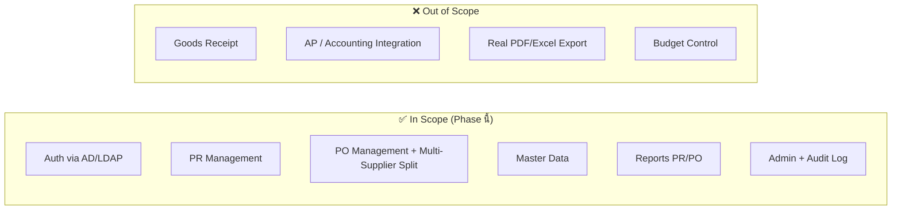

---

## 3. บทบาทผู้ใช้และสิทธิ์ (Roles & Permissions)

### 3.1 บทบาทเริ่มต้น 4 บทบาท

| รหัส | บทบาท | ขอบเขตข้อมูล (Data Scope) | หน้าที่หลัก |
|------|-------|---------------------------|-------------|
| ROLE-001 | ผู้ขอ (Requester) | เฉพาะตนเอง | สร้าง/แก้ไข/ลบ PR ฉบับร่างของตนเอง |
| ROLE-002 | Supervisor | ทั้งฝ่าย | อนุมัติ/ตีกลับ PR, อนุมัติ PO, ดูรายงานฝ่าย |
| ROLE-003 | จัดซื้อ (GA) | ทั้งบริษัท | ออก PO, จัดการข้อมูลหลัก, ยกเลิก PR/PO |
| ROLE-004 | Admin | ทั้งบริษัท | จัดการสิทธิ์/ผู้ใช้/ตั้งค่าระบบ, อนุมัติ PO |

### 3.2 Permission Catalog (สรุปตามโมดูล)

| กลุ่ม | Permission Keys |
|-------|-----------------|
| **PR** | `pr_create`, `pr_view_own`, `pr_view_dept`, `pr_view_all`, `pr_edit_draft`, `pr_delete`, `pr_cancel`, `pr_approve`, `pr_reject` |
| **PO** | `po_create`, `po_submit`, `po_approve`, `po_cancel`, `po_delete`, `po_view_all` |
| **Master Data** | `supplier_manage`, `product_manage`, `price_manage` |
| **Reports** | `report_dept`, `report_all` |
| **Admin** | `role_manage`, `user_manage`, `config_manage` |

### 3.3 Data Scope Logic (ใช้กรองข้อมูลฝั่ง Backend)

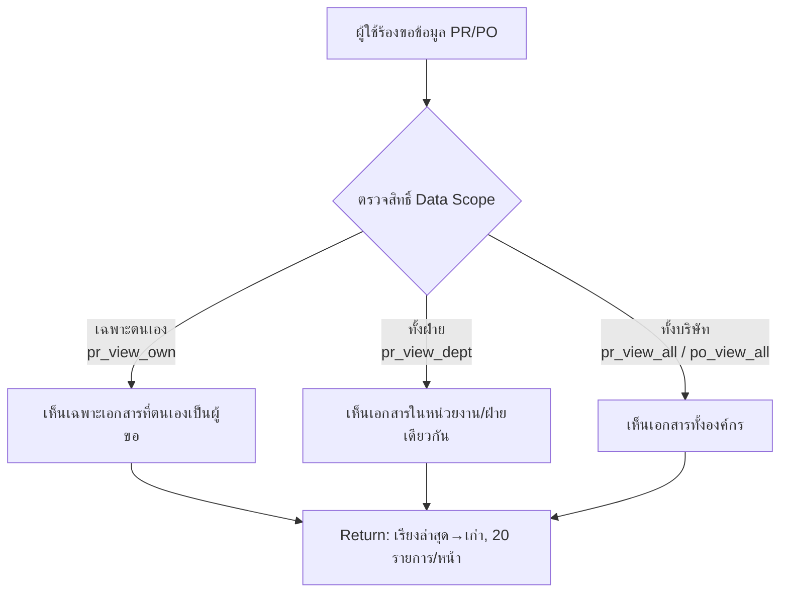

> **สำคัญ:** การกรองตามสิทธิ์ต้องทำที่ **Backend** เท่านั้น (Data Access Control) ไม่ใช่ซ่อนที่ UI

---

## 4. Use Case ภาพรวม

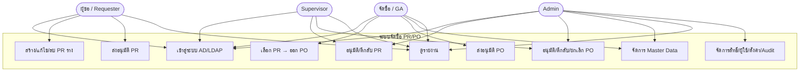

---

## 5. กระบวนการหลัก End-to-End (PR → PO)

### 5.1 หลักการทำงานสำคัญ (Business Invariants)

1. ระบบตัดยอดคงเหลือของ PR **ทันทีเมื่อสร้าง PO** (ส่งขออนุมัติ PO)
2. PR 1 ใบ ออก PO ได้หลายครั้ง (Partial Purchase) — ออกได้เพียงบางส่วนของยอดที่ขอ
3. ระบบคำนวณ/ติดตามยอดคงเหลือที่ยังไม่ออก PO (Outstanding / `qty_remaining`) อัตโนมัติ
4. **SoD:** ผู้สร้าง/ผู้ขอเอกสาร ไม่สามารถอนุมัติเอกสารรายการเดียวกันได้
5. เมื่อยอดคงเหลือ PR ถูกออก PO ครบ → ระบบเปลี่ยนสถานะ PR เป็น `po_issued` อัตโนมัติ

### 5.2 แผนภาพกระบวนการ End-to-End

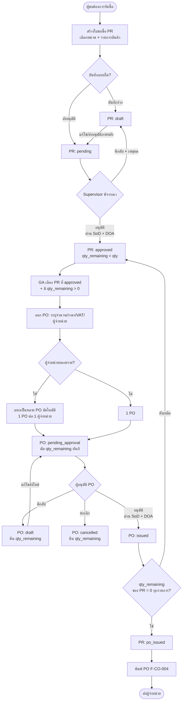

---

## 6. สถานะเอกสาร (State Machines)

### 6.1 สถานะใบขอซื้อ (PR)

| สถานะ | รหัส | ความหมาย |
|-------|------|----------|
| ร่าง | `draft` | สร้างแล้วยังไม่ส่งอนุมัติ แก้ไข/ยกเลิกได้ |
| รออนุมัติ | `pending` | ส่งอนุมัติแล้ว รอพิจารณา |
| อนุมัติแล้ว | `approved` | พร้อมออก PO |
| ออก PO แล้ว | `po_issued` | ออก PO ครบ ไม่มียอดค้าง |
| ยกเลิก | `cancelled` | ยกเลิก ดำเนินการต่อไม่ได้ |

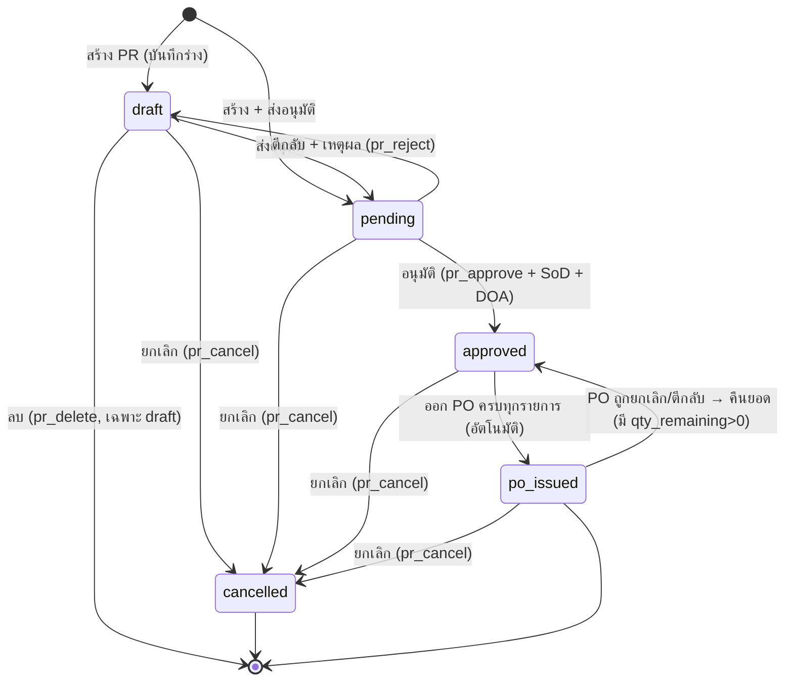

### 6.2 สถานะใบสั่งซื้อ (PO)

| สถานะ | รหัส | ความหมาย |
|-------|------|----------|
| ร่าง | `draft` | จัดทำแล้วยังไม่ส่งอนุมัติ แก้ไข/ลบได้ |
| รออนุมัติ | `pending_approval` | ส่งอนุมัติแล้ว รอพิจารณา (ตัดยอด qty แล้ว) |
| อนุมัติแล้ว | `issued` | อนุมัติแล้ว ตัด qty_remaining ของ PR ที่อ้างอิงแล้ว |
| ยกเลิก | `cancelled` | ยกเลิก (คืนยอด qty_remaining) |

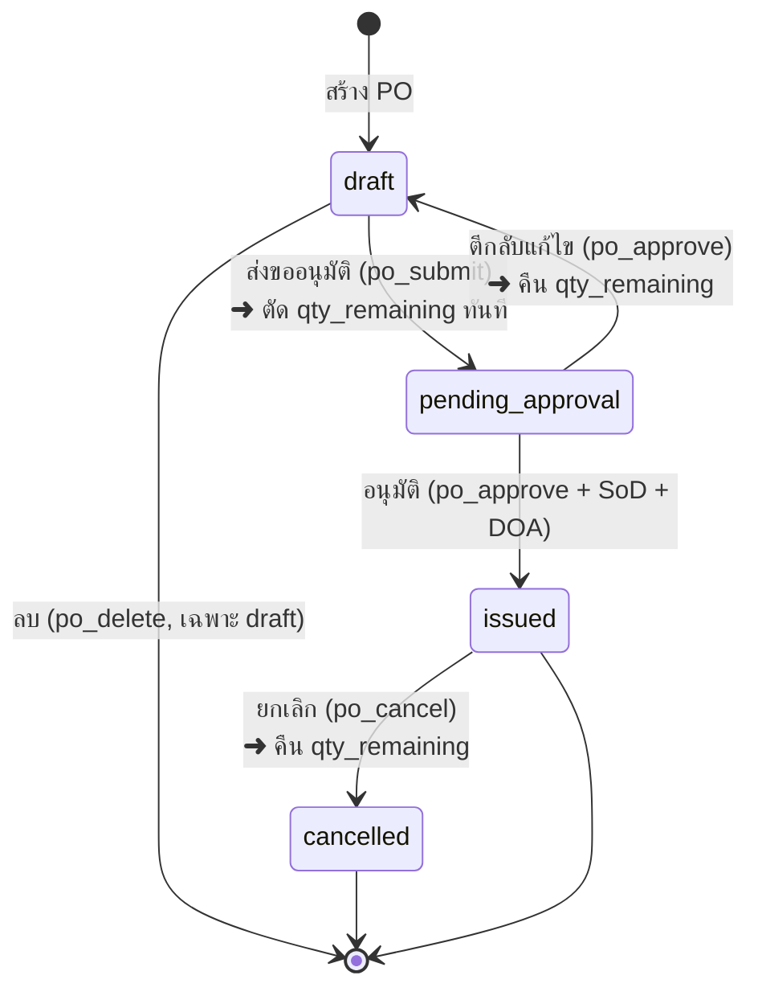

> ⚠️ **จุดตัดยอดสำคัญ:** SRS ระบุการตัด qty_remaining เกิดขึ้น "เมื่อส่ง PO เพื่อขออนุมัติ" (po_submit → `pending_approval`) — ต้องยืนยัน timing นี้ให้ชัดเจนกับทีมพัฒนา เพราะมีอีกจุดกล่าวถึง "เมื่ออนุมัติ" ให้ถือว่า **ตัดตอน submit และคง reservation ไว้จนกว่าจะ cancel/return**

---

## 7. การจัดการยอดคงเหลือ (Qty Remaining)

Logic นี้ทำงานภายใน **Transaction เดียว** เมื่อส่ง PO ขออนุมัติ:

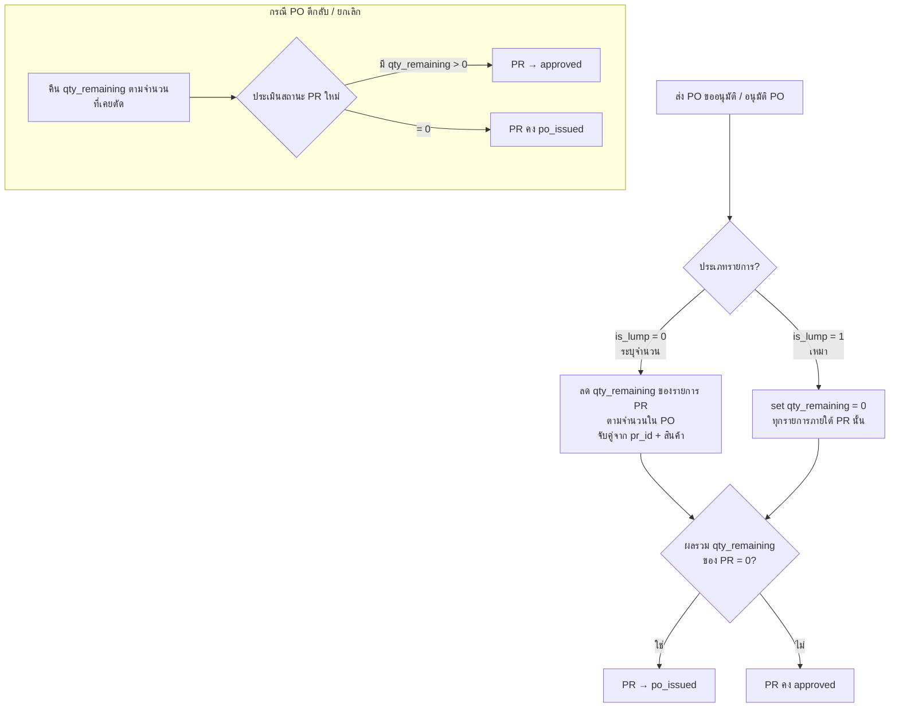

**สรุปกฎการคืนยอด:**
- `is_lump = 0`: คืนยอดตามจำนวนที่ถูกตัดไปใน PO
- `is_lump = 1`: คืนสิทธิ์การใช้งานของ PR กลับทั้งหมด
- หลังคืนยอด ถ้า PR มี `qty_remaining > 0` อย่างน้อย 1 รายการ → PR กลับเป็น `approved` อัตโนมัติ

---

## 8. รายละเอียดฟังก์ชันรายหน้าจอ

### 8.1 การเข้าสู่ระบบ (Login)

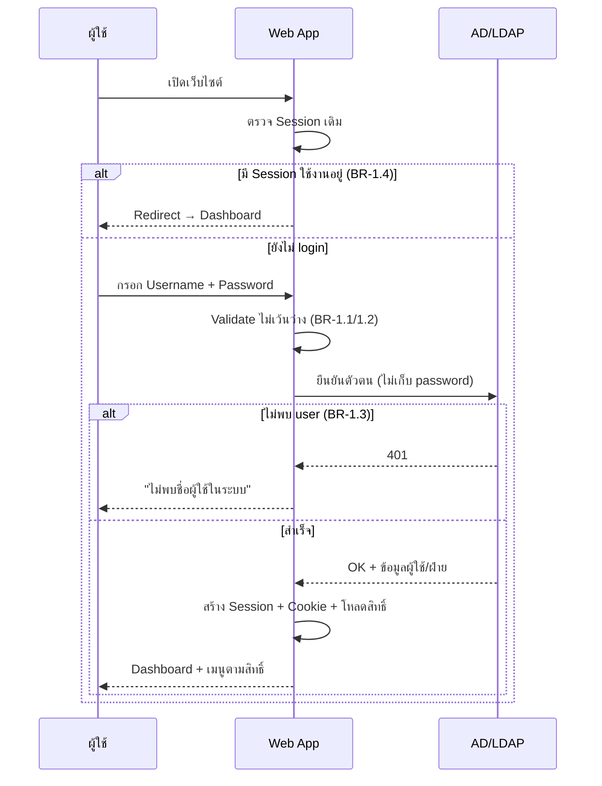

### 8.2 Dashboard (แสดงตามสิทธิ์)

| การ์ด/ส่วน | แสดงเมื่อมีสิทธิ์ | รายละเอียด |
|-----------|-------------------|-----------|
| PR รออนุมัติ | `pr_approve` | จำนวน PR รออนุมัติ (ไม่นับที่ตนเองสร้าง) |
| PO รออนุมัติ | `po_approve` | จำนวน PO ที่มีสิทธิ์อนุมัติและยังไม่เสร็จ |
| พร้อมออก PO | `po_create` | จำนวน PR อนุมัติแล้วที่มียอดคงเหลือ |
| มูลค่าจัดซื้อเดือนนี้ | `po_create`, `report_*` | รวม Grand Total ของ PO เดือนปัจจุบัน |
| Work Queue | ทุกบทบาท | งานค้างเรียงตามความสำคัญ |
| Insights (กราฟ) | `report_*`, `po_view_all` | มูลค่า 6 เดือนย้อนหลัง, สถานะ PR, Top 5 ผู้จำหน่าย |

### 8.3 สร้าง PR (PR Create)

**Header:** เลขที่ PR (auto `PR-2026-NNNN`), วันที่ (auto), หน่วยงาน (จาก AD), ผู้ขอ (จาก AD), หมวดสินค้า, วันที่ต้องการรับ (optional), ระดับความเร่งด่วน (ปกติ/เร่งด่วน/เร่งด่วนมาก)

**Line Items:** สินค้า (ตามหมวด), จำนวน (>0, default 1), หน่วยนับ (auto), ราคาประมาณ/หน่วย (optional ≥0), รายละเอียดเพิ่มเติม

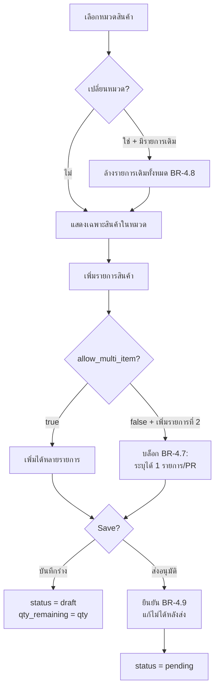

### 8.4 ออก PO (PO Issue) — ฟังก์ชันซับซ้อนที่สุด

รองรับ: Partial Purchase, เลือกผู้จำหน่าย/ราคาต่อรายการ, VAT 3 แบบ, รายการเหมา (Lump Sum), แยก PO ตามผู้จำหน่ายอัตโนมัติ

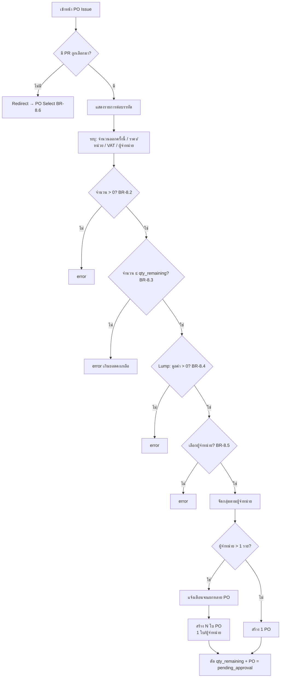

**พฤติกรรมหมวด (Category behavior) ที่ต้องระวัง:**
- `allow_multi_item = true` → รวมหลายรายการในหมวดเป็น 1 แถวใน PO, เก็บรายละเอียดย่อยไว้ในเอกสารแนบท้าย
- `price_mode = lump` → รวมทุกรายการใต้หมวดเป็น 1 แถว ใช้ชื่อหมวดเป็นชื่อรายการหลัก ระบุมูลค่าเหมารวม, จำนวน = 1 (แก้ไม่ได้)

### 8.5 การจัดกลุ่มรายการใน PO Detail (buildPoView)

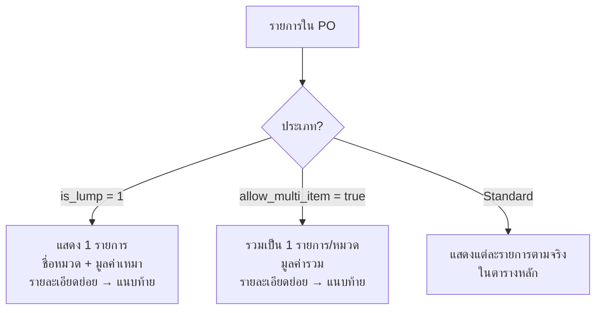

### 8.6 จัดการผู้จำหน่าย (Supplier)

กฎสำคัญ: เลขประจำตัวผู้เสียภาษี = 13 หลัก **ห้ามซ้ำ** (409 Conflict), รหัสไปรษณีย์ 5 หลัก, เครดิต 0–180 วัน (default 30), ผู้จำหน่ายสถานะ "ระงับ" ไม่แสดงในตัวเลือกออก PO

### 8.7 จัดการสินค้า/หมวด/หน่วยนับ/ศูนย์ราคา

- ห้ามลบหมวด/หน่วยนับ ถ้ายังมีสินค้าอ้างอิงอยู่ → 409 "ลบไม่ได้ — มีสินค้า N รายการใช้อยู่"
- Price Center: ผู้จำหน่าย (active), ราคา/หน่วย > 0, จำนวนขั้นต่ำ ≥ 1, วันที่มีผล (บังคับ), วันที่สิ้นสุด ≥ วันที่มีผล

### 8.8 รายงาน (Reports) — 3 ประเภท

1. **PR Report** — ใบขอซื้อทั้งหมด + ผู้ขอ/ฝ่าย/รายการ/สถานะ
2. **PO Report** — ใบสั่งซื้อ + ผู้จำหน่าย/มูลค่า/VAT/สถานะ
3. **PO Summary Report** — ภาพรวม PR→อนุมัติ→PO ครบวงจร + Summary Cards

ตัวกรอง: ช่วงวันที่, หมวดสินค้า, ฝ่าย/ผู้ขอ, ผู้จำหน่าย, สถานะ (ไม่ระบุ = ทั้งหมด). ส่งออก PDF/Excel (หมายเหตุ: ใน scope นี้ยังเป็นการแสดงผล/แจ้งเตือน)

### 8.9 ผู้ดูแลระบบ (Administration)

| ส่วน | รายละเอียด |
|------|-----------|
| A. Permission Matrix | กำหนดสิทธิ์ต่อ Role, เพิ่ม/ลบบทบาท (ห้ามลบบทบาทที่มีผู้ใช้ผูกอยู่), มีผลทันที |
| B. Data Scope + Approval Limit | ขอบเขตข้อมูล + วงเงินอนุมัติสูงสุดต่อบทบาท |
| C. User Role Assignment | ผูก AD user เข้ากับ Role (REQ-AD-2/3/6) |
| D. รูปแบบเลขที่เอกสาร | PR / PO / Supplier Code |
| E. ตั้งค่าระบบ | เปิด/ปิด DOA (**default = Disabled**) |
| F. Audit Log | วันเวลา/ผู้ใช้/การกระทำ/ประเภท+เลขเอกสาร/รายละเอียด, ค้นหาย้อนหลังได้ |

---

## 9. กฎการคำนวณเงินและ VAT

### 9.1 สูตรคำนวณบนเอกสาร PO (F-CO-004)

| รายการ | สูตร / แหล่งที่มา |
|--------|-------------------|
| รวมราคาสินค้า (Subtotal) | `sub_total` |
| ส่วนลด | `discount` |
| รวมราคาก่อนภาษี | `sub_total − discount + freight` |
| VAT 7% | `vat_amount` |
| รวมราคาสุทธิ (Grand Total) | `grand_total` |
| มัดจำ/ชำระแล้ว | `deposit` |
| คงเหลือค้างชำระ | `grand_total − deposit` |

> ยอดเงินทุกค่าจัดรูปแบบจุลภาคคั่นหลักพัน ทศนิยม 2 ตำแหน่ง เช่น `17,000.00`

### 9.2 VAT 3 แบบ และการคำนวณย้อนกลับ

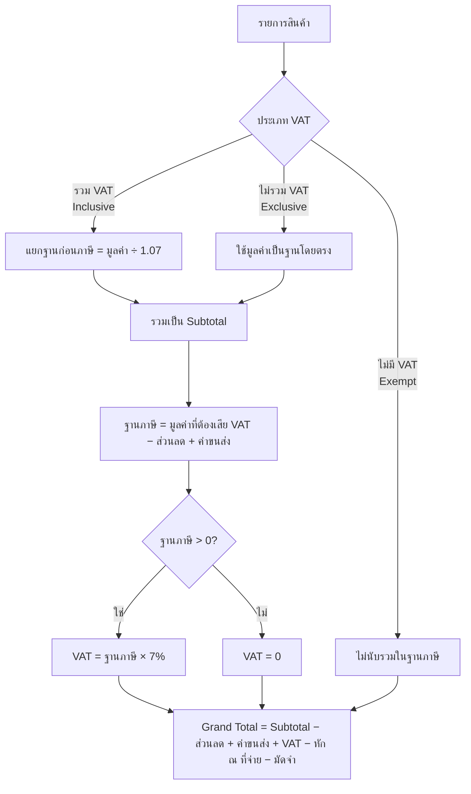

### 9.3 เอกสารที่พิมพ์จากระบบ

| เอกสาร | แบบฟอร์ม | ส่วนประกอบหลัก | ช่องลายเซ็น |
|--------|----------|----------------|-------------|
| ใบขอซื้อ (PR) | **F-CO-002 (Rev.9)** | หัวเอกสาร, ข้อมูลผู้ขอ, ตารางสินค้า, สรุปยอดประมาณการ, ส่วนอนุมัติ, ส่วนคณะกรรมการจัดหา (เว้นว่างให้เขียนมือ) | 4 ช่อง: ผู้ขอ, ผู้ตรวจสอบ, ผู้อนุมัติ, ผู้มีอำนาจอนุมัติ |
| ใบสั่งซื้อ (PO) | **F-CO-004 (Rev.6)** | หัวเอกสาร, ข้อมูลผู้จำหน่าย, สถานที่จัดส่ง, ตารางสินค้า (จัดกลุ่มตาม buildPoView), สรุปยอด, เอกสารแนบท้าย | 4 ช่อง: ผู้ออกเอกสาร, ผู้อนุมัติ, ผู้รับวางบิล, ผู้รับสินค้า |

**เอกสารแนบท้าย PO** สร้างอัตโนมัติเมื่อมีรายการเหมา (Lump) หรือหมวดรวมหลายรายการ — แสดงรายการย่อยครบถ้วน (รหัสสินค้าที่ไม่มี = "-"), พิมพ์บน A4 + Page Break อัตโนมัติ

---

## 10. Data Model (ER Diagram)

> โมเดลนี้ **สรุปเชิงตรรกะ** จากพฤติกรรมที่อธิบายใน SRS (field ปรับได้ตามการออกแบบจริง) — User/Department เป็นข้อมูลอ้างอิงจาก AD/LDAP

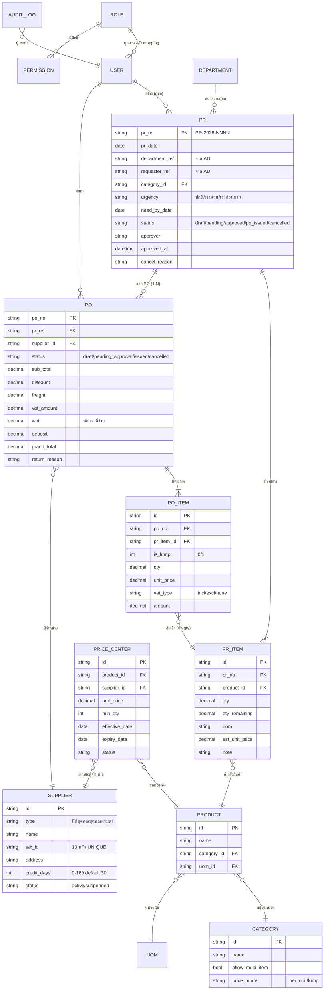

---

## 11. Business Rules Catalog (สำหรับทดสอบ)

รวม Business Rules ทั้งหมดจาก SRS พร้อม HTTP status — ใช้เป็น checklist ในการเขียน Test Case

### 11.1 Login (BR-1.x)

| รหัส | เงื่อนไข | ผลลัพธ์ | HTTP |
|------|---------|---------|------|
| BR-1.1 | ไม่กรอก Username | "กรุณาระบุชื่อผู้ใช้" | 400 |
| BR-1.2 | ไม่กรอก Password | "กรุณาระบุรหัสผ่าน" | 400 |
| BR-1.3 | ไม่พบ user ใน AD/LDAP | "ไม่พบชื่อผู้ใช้ในระบบ" | 401 |
| BR-1.4 | มี Session อยู่แล้ว | Redirect → Dashboard | - |

### 11.2 สร้าง PR (BR-4.x)

| รหัส | เงื่อนไข | ผลลัพธ์ |
|------|---------|---------|
| BR-4.1 | ไม่เลือกส่วนงาน | "กรุณาเลือกส่วนงาน" + บล็อก |
| BR-4.2 | ไม่เลือกผู้ขอซื้อ | "กรุณาเลือกผู้ขอซื้อ" + บล็อก |
| BR-4.3 | ไม่เลือกหมวดสินค้า | "กรุณาเลือกหมวดสินค้า" + บล็อก |
| BR-4.4 | ไม่มีรายการสินค้า | "กรุณาเพิ่มรายการสินค้าอย่างน้อย 1 รายการ" |
| BR-4.5 | มีแถวแต่ยังไม่เลือกสินค้า | "กรุณาเลือกสินค้า" + เน้นแถว |
| BR-4.6 | จำนวน ≤ 0 | "จำนวนสินค้าต้องมากกว่า 0" |
| BR-4.7 | `allow_multi_item=false` + เพิ่มรายการที่ 2 | บล็อก "หมวดนี้ระบุได้ 1 รายการ/PR" |
| BR-4.8 | เปลี่ยนหมวดหลังกรอกรายการ | ล้างรายการทั้งหมด |
| BR-4.9 | เลือกส่งอนุมัติ | ยืนยัน "ส่งแล้วแก้ไขไม่ได้" |

### 11.3 อนุมัติ PR (BR-5.x) — สำคัญมาก

| รหัส | กฎ | ข้อความ | HTTP |
|------|----|---------|------|
| BR-5.1 | **SoD**: ผู้อนุมัติต้องไม่ใช่ผู้สร้าง/ผู้ขอ | "ไม่สามารถอนุมัติใบขอซื้อที่ท่านเป็นผู้ขอซื้อได้" | 403 |
| BR-5.2 | **DOA**: มูลค่า PR ≤ วงเงินอนุมัติ | "มูลค่าใบขอซื้อ (X) เกินวงเงินอนุมัติ (Y)" | 403 |
| BR-5.3 | อนุมัติได้เฉพาะสถานะ pending | "สถานะเอกสารไม่ถูกต้อง" | 400 |
| BR-5.4 | ตีกลับต้องระบุเหตุผล | "กรุณาระบุเหตุผลในการส่งกลับแก้ไข" | - |
| BR-5.5 | ลบได้เฉพาะ draft | "ลบได้เฉพาะสถานะร่าง" | 400 |
| BR-5.6 | ยกเลิกต้องระบุเหตุผล | "กรุณาระบุเหตุผลในการยกเลิก" | - |

### 11.4 ออก PO (BR-8.x)

| รหัส | เงื่อนไข | ผลลัพธ์ |
|------|---------|---------|
| BR-8.1 | ไม่เลือกรายการออก PO | "กรุณาเลือกอย่างน้อย 1 รายการ" |
| BR-8.2 | จำนวนออกครั้งนี้ ≤ 0 | "รายการที่ X: จำนวนต้องมากกว่า 0" |
| BR-8.3 | จำนวน > qty_remaining | "รายการที่ X: ต้องไม่เกินยอดคงเหลือ (Y)" |
| BR-8.4 | Lump มูลค่า ≤ 0 | "รายการที่ X (เหมา): มูลค่าต้องมากกว่า 0" |
| BR-8.5 | ไม่ระบุผู้จำหน่าย | "รายการที่ X: กรุณาเลือกผู้จำหน่าย" |
| BR-8.6 | เข้าหน้า PO Issue โดยไม่มี PR ที่เลือก | Redirect → PO Select |

### 11.5 อนุมัติ PO (BR-9.x)

| รหัส | กฎ | ข้อความ | HTTP |
|------|----|---------|------|
| BR-9.1 | อนุมัติได้เฉพาะ pending_approval | "อนุมัติได้เฉพาะ PO ที่รออนุมัติ" | 400 |
| BR-9.2 | **SoD**: ผู้อนุมัติต้องไม่ใช่ผู้จัดทำ | "ไม่สามารถอนุมัติ PO ที่ตนเองจัดทำได้" | 403 |
| BR-9.3 | **DOA**: มูลค่า PO ≤ วงเงินอนุมัติ | "มูลค่า PO (X) เกินเพดานวงเงิน (Y)" | 403 |

### 11.6 Master Data

| เงื่อนไข | ผลลัพธ์ | HTTP |
|---------|---------|------|
| เลขผู้เสียภาษีซ้ำ | "เลขประจำตัวผู้เสียภาษีนี้ถูกใช้งานแล้ว" | 409 |
| ลบหมวด/หน่วยนับที่มีสินค้าอ้างอิง | "ลบไม่ได้ — มีสินค้า N รายการใช้อยู่" | 409 |

---

## 12. Non-Functional Requirements

### 12.1 Security (NFR-001..030) — สรุปกลุ่ม

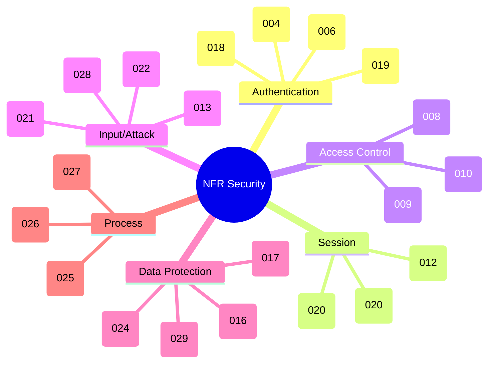

### 12.2 Availability / Recovery / Performance

| ประเภท | NFR | ค่ากำหนด |
|--------|-----|----------|
| Service Time | NFR-031 | 24×7 |
| Critical Service Time | NFR-032 | 08:00–17:00 จ.–ศ. |
| Peak Time | NFR-033 | 10:00–15:00 จ.–ศ. |
| RPO (ความถี่ backup) | NFR-034 | 1 วัน |
| RTO | NFR-035 | ตาม SLA |
| Access/Activity Log | NFR-036/037 | Username/IP/Timestamp/Action |
| ระยะเก็บ Log | NFR-038 | 90 วัน (ตามกฎหมาย) |
| Responsive + CI | NFR-039/040 | ใช่ |
| CCU + Response | NFR-041 | 1,000 CCU @ Avg ≤ 5 วินาที/หน้า |
| Concurrent Requests | NFR-042 | 100 Requests |

---

## 13. PDPA & ข้อควรระวังด้านข้อมูล

- ข้อมูลส่วนบุคคลที่เกี่ยวข้องในตารางระบุใช้งานจริง: **ชื่อ-นามสกุล** (√ ใช้ในการออกกรมธรรม์ให้ลูกค้า)
- ในบริบทระบบจัดซื้อ ข้อมูลที่แตะ PII หลัก ได้แก่: ชื่อผู้ขอ/ผู้อนุมัติ (จาก AD), ข้อมูลผู้จำหน่าย (ชื่อ, เลขผู้เสียภาษี, ที่อยู่, ผู้ติดต่อ)
- โครงการที่มีข้อมูลส่วนบุคคล **ต้องผ่านความเห็นชอบจากคณะทำงาน DPO** (อ้างอิง Appendix 10.2)
- ควบคุมตาม PDPA + พ.ร.บ.คอมพิวเตอร์ + นโยบายความมั่นคงปลอดภัยสารสนเทศ (NFR-030)
- Data Masking สำหรับข้อมูลอ่อนไหว (NFR-024) เช่น เลขบัตรประชาชน/บัญชีธนาคาร ถ้ามีการแสดง

---

## 14. แนวทางการทดสอบ (Test Strategy & Scenarios)

### 14.1 Traceability: BR → พื้นที่ทดสอบ

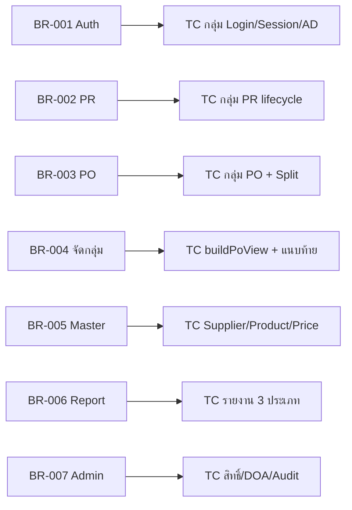

### 14.2 Test Scenarios หลัก (High Priority)

**A. Happy Path — End-to-End**
1. Login (AD) → สร้าง PR (หลายรายการ) → ส่งอนุมัติ → Supervisor อนุมัติ → GA ออก PO → อนุมัติ PO → พิมพ์ F-CO-004 → PR เป็น `po_issued`

**B. Partial Purchase & Outstanding**
2. PR qty=100 → ออก PO 60 → ตรวจ `qty_remaining=40` + PR ยัง `approved` → ออก PO อีก 40 → PR เป็น `po_issued`
3. ออก PO เกิน qty_remaining → ต้อง error (BR-8.3)

**C. Segregation of Duties (SoD)**
4. ผู้สร้าง PR พยายามอนุมัติ PR ตนเอง → 403 (BR-5.1)
5. ผู้จัดทำ PO พยายามอนุมัติ PO ตนเอง → 403 (BR-9.2)
6. Dashboard/Approval Queue ต้องไม่แสดงรายการที่ตนเองเป็นผู้สร้าง

**D. Delegation of Authority (DOA)**
7. เปิด DOA → อนุมัติ PR/PO มูลค่าเกินวงเงิน → 403 (BR-5.2 / BR-9.3)
8. ปิด DOA (default) → อนุมัติได้ไม่ตรวจวงเงิน

**E. Multi-Supplier Split**
9. PO ที่มีผู้จำหน่าย 2 ราย → แจ้งเตือน + สร้าง 2 PO อัตโนมัติ 1 ใบ/ผู้จำหน่าย

**F. Lump Sum & Category**
10. หมวด `price_mode=lump` → รวมเป็น 1 แถว, qty=1 แก้ไม่ได้, ตัด qty_remaining ทุกรายการเป็น 0
11. หมวด `allow_multi_item=false` → เพิ่มรายการที่ 2 ต้องบล็อก (BR-4.7)

**G. Reverse Flow (คืนยอด)**
12. ยกเลิก PO ที่ issued → คืน qty_remaining → PR กลับเป็น `approved`
13. ตีกลับ PO (pending → draft) → คืนยอด → ประเมินสถานะ PR ใหม่

**H. Master Data Integrity**
14. เพิ่มผู้จำหน่ายเลขภาษีซ้ำ → 409
15. ลบหมวดที่มีสินค้าอ้างอิง → 409
16. ผู้จำหน่ายสถานะ "ระงับ" ต้องไม่แสดงในตัวเลือกออก PO

**I. Data Scope**
17. Requester เห็นเฉพาะ PR ตนเอง / Supervisor เห็นทั้งฝ่าย / GA-Admin เห็นทั้งบริษัท

**J. VAT Calculation**
18. รายการ VAT Inclusive → ตรวจการแยกฐาน (÷1.07) และ Grand Total ถูกต้อง
19. รายการ VAT None/Exempt → ต้องไม่ถูกนำเข้าฐานภาษี

**K. Negative / Boundary**
20. ทุก validation (BR-1.x, 4.x, 5.x, 8.x, 9.x) พร้อม HTTP status ที่ระบุ
21. Pagination 20 รายการ/หน้า, คงสถานะการเลือกข้ามหน้า (PO Select)

**L. Non-Functional (ตรวจแยก)**
22. Auto logout 15 นาที, ล็อคบัญชีหลังผิด 3 ครั้ง, HTTPS/TLS, Anti-CSRF, Audit Log ครบถ้วน

### 14.3 ข้อสังเกต/ประเด็นที่ต้องยืนยันกับทีม (Open Questions)

1. **จังหวะตัด qty_remaining** — SRS มีทั้ง "ตอนส่งขออนุมัติ PO (submit)" และ "ตอนอนุมัติ PO" ควรฟิกซ์ให้ตรงกัน (แนะนำ: ตัดตอน submit = reservation, คืนเมื่อ cancel/return)
2. **ลำดับชั้นการอนุมัติ (Approval Hierarchy)** — SRS ระบุ DOA/วงเงิน แต่ไม่ได้ระบุจำนวน "ระดับ" การอนุมัติแบบหลายขั้น ต้องยืนยันว่าเป็น single-level หรือ multi-level
3. **AD/LDAP** — mockup ปัจจุบันยังไม่เชื่อม AD จริง ต้องมีแผนทดสอบ integration แยกก่อน go-live
4. **Export PDF/Excel** — ระบุนอก scope (แสดง/แจ้งเตือน) แต่หน้าจอมีปุ่ม export — ต้องยืนยันขอบเขต UAT
5. **ค่าขนส่ง (freight) / หัก ณ ที่จ่าย (WHT) / มัดจำ** — มีในสูตรคำนวณ ต้องยืนยันว่ากรอกที่หน้าจอ PO Issue ระดับใด (header/line)

---

> **สรุป:** ระบบนี้คือ workflow จัดซื้อ PR→PO ที่หัวใจอยู่ที่ (1) การควบคุมสิทธิ์ + SoD + DOA, (2) การติดตามยอดคงเหลือ qty_remaining อย่างแม่นยำ, และ (3) การจัดกลุ่ม/แยกรายการ PO (Lump Sum, Multi-item, Multi-Supplier Split) พร้อมพิมพ์เอกสารมาตรฐาน F-CO-002/F-CO-004 จุดที่ควรทดสอบเข้มที่สุดคือ **การตัด/คืน qty_remaining** และ **การบังคับ SoD/DOA**
