# F-BP-009 ระบบจัดการตัวแทน/นายหน้า (Agent Management System) — SRS Analysis

**Document Type:** SRS Analysis / Requirement Analysis
**Project:** ระบบจัดการตัวแทน/นายหน้า (Agent Management System — AMS)
**Project Code:** `P2026-xxx` (ยังไม่กำหนดใน SRS — ดู O-35)
**Document Form:** `F-BP-009`
**System:** Agent Management System (AMS)
**Module:** ชุดสัญญาตัวแทน/นายหน้า, การเปิด–ระงับรหัส Agent/Source
**Version:** Draft 1.0.0
**Prepared by:** BA — ฝ่ายพัฒนากระบวนการทางธุรกิจ
**Created Date:** (ระบุวันจัดทำ)
**Source SRS:** `SRS/F-BP-009 Agent Management System.docx` Version 1.0.0 — Created 17 Oct 2025 / Last Updated 22 Oct 2025 (Initial Version 0.1 โดย นริศ เอกอนันต์กิจ)
**Related Document:** `.kiro/flows/F-BP-009_AgentManagement_Flows.md` (Flow / Diagram v2.0 — 16 ไดอะแกรม)
**Status:** Draft for Review — มีประเด็นค้างยืนยัน 34 ข้อ (O-1 … O-34) และชุดคำถามยืนยัน 8 ชุด

---

## สารบัญ

1. [วัตถุประสงค์ของเอกสารและที่มาของข้อมูล](#1-วัตถุประสงค์ของเอกสารและที่มาของข้อมูล)
2. [ภาพรวมระบบและวัตถุประสงค์ทางธุรกิจ](#2-ภาพรวมระบบและวัตถุประสงค์ทางธุรกิจ)
3. [Scope of Work](#3-scope-of-work)
4. [Business Requirements](#4-business-requirements)
5. [Actor / Role และ Permission Matrix](#5-actor--role-และ-permission-matrix)
6. [Use Case ภาพรวม](#6-use-case-ภาพรวม)
7. [กระบวนการหลัก End-to-End](#7-กระบวนการหลัก-end-to-end)
8. [State / Status Model ทั้ง 3 ชุด](#8-state--status-model-ทั้ง-3-ชุด)
9. [Business Rules Catalog สำหรับทดสอบ](#9-business-rules-catalog-สำหรับทดสอบ)
10. [Validation Rules](#10-validation-rules)
11. [Integration / Interface Requirements](#11-integration--interface-requirements)
12. [SLA และ Time-based Rules](#12-sla-และ-time-based-rules)
13. [Notification Requirements](#13-notification-requirements)
14. [Data Model เชิงตรรกะ](#14-data-model-เชิงตรรกะ)
15. [Non-Functional Requirements](#15-non-functional-requirements)
16. [PDPA Consideration และการวิเคราะห์ช่องว่าง](#16-pdpa-consideration-และการวิเคราะห์ช่องว่าง)
17. [Risk Management Plan](#17-risk-management-plan)
18. [Open Issues](#18-open-issues)
19. [ชุดคำถามยืนยันกับ Business Owner](#19-ชุดคำถามยืนยันกับ-business-owner)
20. [แนวทางการทดสอบ Test Strategy และ Scenarios](#20-แนวทางการทดสอบ-test-strategy-และ-scenarios)
21. [Appendix](#21-appendix)

---

## 1. วัตถุประสงค์ของเอกสารและที่มาของข้อมูล

เอกสารฉบับนี้เป็นการ **วิเคราะห์ Requirement** ของระบบจัดการตัวแทน/นายหน้า ตามแบบฟอร์ม `F-BP-009` เพื่อใช้เป็นฐานร่วมกันของ Business Owner, BA, SA, Developer และทีมทดสอบ โดยเน้น 3 เรื่อง

1. แปลง SRS ที่เขียนแบบบรรยายรายหน้าจอ ให้เป็น **กฎที่ตรวจสอบได้รายข้อ** (Business Rules / Validation Rules) พร้อม trace กลับ `BR ID` และหัวข้อ SRS
2. ชี้ **ข้อขัดแย้งและช่องว่าง** ของ SRS ที่ต้องปิดก่อนเข้าสู่ขั้นออกแบบ/พัฒนา
3. เตรียม Traceability ให้ทีม Test นำไปเขียน Test Case และ UAT ต่อได้ทันที

### 1.1 แหล่งข้อมูลที่ใช้

| แหล่ง | สถานะ | การใช้งานในเอกสารนี้ |
|---|---|---|
| `SRS/F-BP-009 Agent Management System.docx` → `.kiro/tmp/F-BP-009_SRS.txt` | อ่านครบทั้งไฟล์ (1,494 บรรทัด) | **แหล่งอ้างอิงหลัก** |
| `.kiro/flows/F-BP-009_AgentManagement_Flows.md` (v2.0) | อ่านครบ | ใช้ตรวจความสอดคล้อง และสืบทอดรหัส Open Issue O-1 … O-18 |
| `detail/*` (pdf, xls, doc, drawio) | ไม่ได้ใช้ในรอบนี้ | เอกสารประกอบเดิม อ่านไม่ได้จากเครื่องมือปัจจุบัน (binary) |

### 1.2 ข้อจำกัดของ SRS ที่ต้องรับรู้ก่อนอ่านเอกสารนี้

- **รูปภาพหายทั้งหมด** จากไฟล์ที่แปลงเป็นข้อความ ได้แก่ `Figure 1 Business Process Diagram` (AS-IS), TO-BE Business Process Diagram และภาพหน้าจอทุกหน้า
- **Logic การสร้างเลขที่สัญญา** ตาม `BR ID_018` อยู่ในรูปภาพ/ตารางที่หายไป → ยังไม่ทราบรูปแบบเลขสัญญา (O-10)
- **หัวข้อ 5.3 Report** และ `Table 4 โครงสร้างรายงาน` มีในสารบัญ แต่ไม่มีเนื้อหา (O-11)
- **หัวข้อ 2.2 ขอบเขตงานที่ยังไม่รวม** ยังเป็น placeholder `Insert Text` 3 บรรทัด (O-12)
- **หัวข้อ 7 PDPA** ติ๊กเฉพาะ "ชื่อ-นามสกุล" และตารางกิจกรรมการใช้ข้อมูลส่วนบุคคลยังว่าง (O-18)
- ตารางถูกแปลงเป็นบรรทัดต่อเนื่อง การจับคู่คอลัมน์จึงมีความเสี่ยง — ตารางสถานะในเอกสารนี้ควรตรวจทานกับ SRS ตัวจริงอีกครั้ง

### 1.3 การแยกข้อเท็จจริงกับข้อสมมติ

ใช้เครื่องหมายเดียวกับไฟล์ Flow v2.0 เพื่อให้ต่อเนื่องกัน

- **[SRS]** = ข้อเท็จจริงที่ SRS ระบุไว้ตรง ๆ พร้อมอ้างหัวข้อ
- **[ตีความ]** = การตีความ/ข้อเสนอของผู้วิเคราะห์ เพื่อให้กระบวนการเดินได้ครบ — **ต้องยืนยันก่อนนำไปพัฒนาหรือใช้เป็นเกณฑ์ทดสอบ**

> กฎการอ่านเอกสารนี้: ทุกแถวในตาราง Business Rules / Validation Rules มีคอลัมน์ `ที่มา` และคอลัมน์ `ประเภท` เสมอ ถ้า `ประเภท` = [ตีความ] หมายความว่ายังไม่ใช่ requirement ที่ยืนยันแล้ว

---

## 2. ภาพรวมระบบและวัตถุประสงค์ทางธุรกิจ

**[SRS] หัวข้อ 1 PROJECT OBJECTIVE:** ปัจจุบันการรับสมัครตัวแทน/นายหน้าใช้เอกสารกระดาษ ส่งจากสาขาทั่วประเทศมาสำนักงานใหญ่ทางไปรษณีย์ เพื่อให้ฝ่ายธุรกิจสาขา ฝ่ายบริหารจัดการเบี้ยประกันภัย ฝ่ายเทคโนโลยี และฝ่ายสำนักนิติกรรม ตรวจสอบเอกสารและเปิดรหัส Agent/Source ข้อจำกัดคือ

- ดำเนินการเอกสารใช้เวลานาน
- ติดตามสถานะการดำเนินการเอกสารไม่ได้
- ระหว่างดำเนินการเอกสาร บริษัทอนุญาตให้ตัวแทน/นายหน้าขายผลิตภัณฑ์ได้อยู่แล้ว → **เสี่ยงต่อการทุจริต**

วัตถุประสงค์ของระบบจึงคือ ติดตามสถานะเอกสารได้ และเสนอลงนามอิเล็กทรอนิกส์ภายในระบบ

### 2.1 ปัญหา AS-IS → สิ่งที่ต้องได้ TO-BE

**[SRS] Table 1 และ Table 2** (หัวข้อ 3 AS-IS PROCESS / 4 TO-BE PROCESS)

| # | ขั้นตอน | ปัญหาปัจจุบัน | สิ่งที่ระบบต้องทำ | ผูกกับ BR |
|---|---|---|---|---|
| 1 | ติดตามสถานะเอกสาร | ติดตามไม่ได้ | ติดตามสถานะได้ทั้งไฟล์และฉบับจริง | BR ID_001, BR ID_002 |
| 2 | เก็บ Log Transaction | เก็บไม่ได้ | เก็บ Log Transaction เพื่อดู SLA | BR ID_003 |
| 3 | ส่งลงนามเอกสาร | ส่งฉบับจริงกระดาษไปลงนาม | ส่งไฟล์ชุดสัญญาลงนามอิเล็กทรอนิกส์ | BR ID_009 |
| 4 | แจ้งแก้ไขเอกสาร | แจ้งผ่านอีเมล | แจ้งแก้ไขผ่านระบบ | BR ID_007, BR ID_008, BR ID_010 |
| 5 | ตรวจสอบ ปปง. | เข้าเว็บไซต์ ปปง. เอง | ตรวจผ่านเว็บเซอร์วิส | BR ID_011, BR ID_012 |
| 6 | สร้างรหัส Agent/Source | ฝ่ายพัฒนากระบวนการทางธุรกิจเปิดรหัสให้ | ระบบสร้างอัตโนมัติ | BR ID_013, BR ID_014, BR ID_015 |
| 7 | ระงับรหัส Agent/Source | นิติกรรมต้องแจ้งฝ่ายเบี้ยฯ ให้ระงับเอง | ระบบระงับอัตโนมัติเมื่อครบกำหนด | BR ID_016 |

> **ข้อสังเกตเชิงวิเคราะห์ [ตีความ]:** Table 1 ข้อ 6 ระบุว่าผู้เปิดรหัสในปัจจุบันคือ **ฝ่ายพัฒนากระบวนการทางธุรกิจ** ขณะที่ `BR ID_015` เขียนว่า "ส่งต่อให้ **IT** ทำการสร้าง Agent source" และหัวข้อ 1 ระบุผู้เกี่ยวข้องว่า "**ฝ่ายเทคโนโลยี**" — ทั้งสามคำอาจหมายถึงหน่วยงานเดียวกันหรือไม่ก็ได้ ต้องยืนยัน (O-1)

---

## 3. Scope of Work

### 3.1 In Scope (Phase นี้)

**[SRS]** อนุมานจากหัวข้อ 2.1 Business Requirements และหัวข้อ 5 Functional Requirements

- Login ด้วย AD User และควบคุมสิทธิ์รายฝ่าย/รายหน้าจอ
- หน้าจอ Home: ตัวนับ 5 กลุ่ม, ค้นหา 7 ฟิลด์, ตารางรายการ 10 คอลัมน์, มองเห็นเฉพาะงานของสาขา/ฝ่ายตนเอง
- หน้าจอสร้างรายการ: ตรวจ ปปง. ผ่านเว็บเซอร์วิส, สร้างเลขที่สัญญาอัตโนมัติ, แนบลิงก์ชุดสัญญา
- ติดตามสถานะ 2 ชุด: เอกสารไฟล์ (12 สถานะ) และเอกสารฉบับจริง (7 สถานะ)
- สั่งแก้ไขเอกสารรายฉบับ (Dropdown F-CM-005 … QP-PR-016 + หมายเหตุ) และแนบเอกสารเพิ่มเติม / เพิ่มชุดสัญญาใหม่
- ส่งอนุมัติ + ลงนามอิเล็กทรอนิกส์ผ่านระบบ Approval ใน MS Teams
- Credit Information 7 ฟิลด์ โดยฝ่ายบริหารจัดการเบี้ยประกันภัย
- สร้างรหัส Agent/Source ผ่านเว็บเซอร์วิส + ตั้งค่ารหัส + สถานะรหัส 4 สถานะ
- ระงับรหัสอัตโนมัติเมื่อครบ 30 / 90 วัน
- อีเมลแจ้งเตือนเมื่อนิติกรรม Approve/Reject
- Log: Access Log / Activities Log สำหรับผู้ดูแลระบบ

### 3.2 Out of Scope

**[SRS] หัวข้อ 2.2 ยังเป็น `Insert Text` — ยังไม่มีขอบเขตที่ตัดออกอย่างเป็นทางการ (O-12)**

รายการด้านล่างเป็น **[ตีความ]** จากการที่ SRS ไม่มีเนื้อหารองรับเลย เสนอให้ Business Owner ยืนยันว่าเป็น Out of Scope

| # | เรื่อง | เหตุผลที่เสนอเป็น Out of Scope |
|---|---|---|
| 1 | แก้ไขข้อมูลหลักของตัวแทน/นายหน้าหลังเปิดรหัส เช่น ชื่อ ที่อยู่ บัญชีธนาคาร | SRS มีเฉพาะการแก้ไข "เอกสารในชุดสัญญา" ระหว่างกระบวนการอนุมัติ |
| 2 | ต่ออายุใบอนุญาตตัวแทน/นายหน้า | SRS มีเฉพาะการ "ตรวจสอบวันหมดอายุ" ตอน สนญ. ตรวจรายการ |
| 3 | กระบวนการตรวจสอบเอกสารประจำปี | SRS ระบุเพียงว่านิติกรรมจัดเก็บเอกสารเพื่อตรวจปีละ 1 ครั้ง ไม่มีหน้าจอ/สถานะ/แจ้งเตือน (O-15) |
| 4 | การเชื่อมต่อ คปภ. เพื่อตรวจใบอนุญาตอัตโนมัติ | SRS ให้ สนญ. ตรวจเองแล้วบันทึกผลเป็น Radio Box |
| 5 | ยกเลิก/ปิดรหัส Agent/Source เป็นกระบวนการเฉพาะ | พบเพียงร่องรอย 2 จุด คือฟิลด์ "เรื่อง" และฟอร์ม F-CM-035 (O-9) |
| 6 | รายงาน | หัวข้อ 5.3 ไม่มีเนื้อหา (O-11) |
| 7 | Mobile Application | SRS ระบุเพียง Responsive Web (NFR 024) |

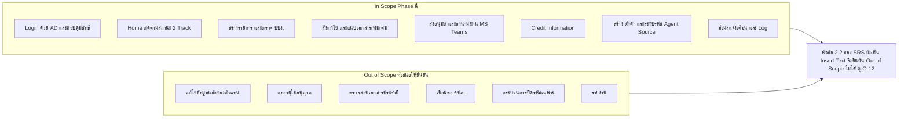

---

## 4. Business Requirements

**[SRS] หัวข้อ 2.1** — ใช้รหัสจริงตาม SRS คือ `BR ID_001` … `BR ID_018` (ทุกข้อ Priority = High)

| BR ID | Business Requirement | Priority | หัวข้อ SRS ที่รองรับ | ข้อสังเกตเชิงวิเคราะห์ |
|---|---|---|---|---|
| BR ID_001 | ระบบ Monitor ติดตามสถานะของชุดสัญญา (ไฟล์) | High | 5.2 หน้าจอ Home — ตารางสถานะไฟล์ 12 รายการ | ครบถ้วน |
| BR ID_002 | ระบบ Monitor ติดตามสถานะของชุดสัญญา (ฉบับจริง) | High | 5.2 หน้าต่างอัพเดตสถานะฉบับจริง — 7 รายการ | ไม่มีสถานะรองรับกรณีไม่ครบถ้วน (O-8) |
| BR ID_003 | ขั้นตอนการเก็บ Log Transaction เพื่อดูเรื่อง SLA | High | 5.2 (ผู้ทำรายการ/วันที่ทำรายการรายสถานะ), NFR 021–023 | ไม่มีรายงาน SLA รองรับ และ retention 90 วันอาจไม่พอ (O-26, O-30) |
| BR ID_004 | เข้าใช้งานได้เฉพาะ AD User ภายใต้บริษัท | High | 5.2 หน้าจอ Login, NFR 004 | ไม่ระบุการ map AD group → role/ฝ่าย/สาขา (O-25) |
| BR ID_005 | ควบคุมสิทธิ์การเข้าถึงหน้าจอของฝ่ายต่าง ๆ | High | 5.2 ทุกหน้าจอ, NFR 008–010 | ไม่มีหน้าจอ Admin บริหารสิทธิ์ (O-33) |
| BR ID_006 | แนบไฟล์เอกสารชุดสัญญาได้ | High | 5.2 หน้าจอสร้างรายการ หมายเลข 3 | เป็นการ **แนบลิงก์ SharePoint** ไม่ใช่ upload ไฟล์ (O-21) |
| BR ID_007 | สาขาแนบไฟล์เอกสารเพิ่มเติมได้เมื่อถูกสั่งแก้ | High | 5.2 หน้าจอแนบเอกสารเพิ่มเติม | ครบถ้วน |
| BR ID_008 | สนญ. เพิ่มไฟล์เอกสารใหม่ได้เมื่อถูกสั่งแก้ | High | 5.2 หน้าจอเพิ่มชุดสัญญาใหม่ | ฝ่ายเบี้ยฯ ก็มีปุ่มนี้ด้วย แต่ BR เขียนถึงเฉพาะ สนญ. |
| BR ID_009 | รองรับการส่งเอกสารลงนามอิเล็กทรอนิกส์ | High | 5.2 หน้าจอส่งอนุมัติ | ไม่มีกลไกรองรับ Reject จาก MS Teams (O-5) |
| BR ID_010 | เลือกรายการเอกสารที่ต้องการแก้ไขได้ | High | 5.2 หน้าต่างสั่งแก้ไขรายการ | ครบถ้วน |
| BR ID_011 | กรอกข้อมูลเพื่อตรวจ ปปง. และสร้างรหัส Agent/Source | High | 5.2 หน้าจอสร้างรายการ หมายเลข 1–2 | ครบถ้วน |
| BR ID_012 | เชื่อมการตรวจสอบ ปปง. ผ่านเว็บเซอร์วิส | High | 5.2 ปุ่ม "ตรวจสอบ" ส่ง API ไป ปปง. | ไม่มี contract/เกณฑ์ match/การเก็บหลักฐาน (O-29) |
| BR ID_013 | เชื่อมต่อการสร้างรหัส Agent/Source ผ่านเว็บเซอร์วิส | High | 5.1 ข้อ 3.3 | ไม่ระบุระบบปลายทาง/contract/retry (O-28) |
| BR ID_014 | สร้างรหัส Agent/Source อัตโนมัติ | High | 5.1 ข้อ 3.3 | ขัดกับ BR ID_015 ที่ให้ IT สร้าง (O-1) |
| BR ID_015 | เปลี่ยน Flow จาก Parallel เป็นผ่านการ Approve จากนิติกรรมก่อน จึงส่งต่อให้ IT สร้าง Agent Source | High | ไม่มีหัวข้อ Functional รองรับ | **ขัดกับ 5.1 ข้อ 3.3 และ BR ID_013/014 — ประเด็นสำคัญที่สุด (O-1)** |
| BR ID_016 | ระงับรหัส Agent/Source อัตโนมัติเมื่อครบกำหนดแก้ไขเอกสาร | High | 5.1 ข้อ 7.2, 5.2 สถานะรหัส | ไม่มีนิยาม "แล้วเสร็จ" และไม่มีการปลดระงับ (O-6, O-7) |
| BR ID_017 | อีเมลแจ้งเตือนทุกฝ่ายที่เกี่ยวข้องเมื่อนิติกรรม Approve/Reject | High | ไม่มีหัวข้อ Functional รองรับรายละเอียด | ไม่ระบุผู้รับ/เนื้อหา/เหตุการณ์อื่น (O-16) |
| BR ID_018 | Logic เลขที่สัญญา เป็นไปตามที่ฝ่ายสำนักนิติกรรมกำหนด | High | 5.2 หน้าจอ Home + หน้าจอสร้างรายการ (อยู่ในรูปภาพที่หายไป) | ยังไม่ทราบรูปแบบ (O-10) |

### 4.1 ข้อสังเกตด้าน Coverage

| ประเด็น | รายละเอียด |
|---|---|
| BR ที่ไม่มี Functional Requirement รองรับ | `BR ID_015` (ไม่มีหน้าจอ/สถานะสำหรับ IT), `BR ID_017` (ไม่มีหัวข้อ notification), `BR ID_003` (มี log แต่ไม่มีรายงาน SLA) |
| Functional ที่ไม่มี BR รองรับ | หน้าจอ Home + ตัวนับ + ค้นหา, ตรวจสอบข้อมูลเลขที่ใบอนุญาต, Credit Information, การตั้งค่ารหัส Agent/Source, Admin Menu ดู Log |
| **[ตีความ]** | ช่องว่างทั้งสองทางไม่ทำให้ requirement ใช้งานไม่ได้ แต่ทำให้ตาราง Traceability ไม่สมมาตร ควรเพิ่ม BR ให้ครอบฟังก์ชันที่ตกหล่น หรือระบุใน SRS ว่าเป็นรายละเอียดหน้าจอที่ไม่ยก BR |

---

## 5. Actor / Role และ Permission Matrix

### 5.1 รายการ Actor

**[SRS] หัวข้อ 5.2 หน้าจอเมนู Home** ระบุผู้ใช้งาน 5 กลุ่ม: สาขาย่อยทั่วประเทศ / ฝ่ายธุรกิจสาขา (สำนักงานใหญ่) / ฝ่ายบริหารจัดการเบี้ยประกันภัย / ฝ่ายสำนักนิติกรรม / ผู้ดูแลระบบ

| รหัส | Actor | บทบาทตาม SRS | ประเภท |
|---|---|---|---|
| ACT-01 | ฝ่ายธุรกิจ (สาขาย่อยทั่วประเทศ) | จัดทำชุดเอกสารสัญญา สแกนทั้งชุดเป็น 1 ไฟล์ วางไฟล์ใน SharePoint ตรวจ ปปง. สร้างรายการ/เลขที่สัญญา ส่งฉบับจริงทางไปรษณีย์ แนบเอกสารเพิ่มเติมเมื่อถูกสั่งแก้ไข อัพเดตสถานะฉบับจริง `BUBA` แจ้งรหัสให้ตัวแทน | ผู้ใช้ระบบ [SRS] |
| ACT-02 | ฝ่ายธุรกิจ (สำนักงานใหญ่) | ตรวจสอบรายการ บันทึกผลตรวจเลขที่ใบอนุญาต จัดทำเอกสารเพิ่มเติม เพิ่มชุดสัญญาใหม่ สั่งแก้ไขถึงสาขา ส่งอนุมัติ รับ/ตรวจฉบับจริง อัพเดต `BUA`/`BUAC` รับรหัสจากฝ่ายเบี้ยฯ | ผู้ใช้ระบบ [SRS] |
| ACT-03 | ฝ่ายบริหารจัดการเบี้ยประกันภัย | ตรวจสอบรายการ กรอก Credit Information เพิ่มชุดสัญญาใหม่ สั่งแก้ไขถึง สนญ. ส่งอนุมัติ รับ/ตรวจฉบับจริง อัพเดต `ACCA`/`ACCC` ตั้งค่ารหัส Agent/Source นำส่งรหัสให้ สนญ. | ผู้ใช้ระบบ [SRS] |
| ACT-04 | ฝ่ายสำนักนิติกรรมประกันภัย | ตรวจสอบรายการ สั่งแก้ไขถึง สนญ. กดอนุมัติปิดรายการ จัดเก็บไฟล์ รับ/ตรวจฉบับจริง ทำบันทึกภายใน เสนอลงนามชุดสัญญา จัดเก็บเอกสารเพื่อตรวจปีละ 1 ครั้ง อัพเดต `LAWA`/`LAWC` | ผู้ใช้ระบบ [SRS] |
| ACT-05 | ผู้ดูแลระบบ | Admin Menu — ดู Access Log / Activities Log | ผู้ใช้ระบบ [SRS] |
| ACT-06 | กรรมการผู้จัดการ (MD) | ลงนามอนุมัติ/ไม่อนุมัติชุดสัญญาผ่านระบบ Approval ใน MS Teams (`BUAMD` → `MDA`/`MDR`) | อยู่ในตารางสถานะและคอลัมน์ View แต่ **ไม่อยู่ในรายการผู้ใช้งานหน้าจอ Home** [SRS] |
| ACT-07 | ผู้ช่วยกรรมการผู้จัดการ / ผู้อำนวยการฝ่าย | ลงนามอนุมัติเอกสารที่ฝ่ายเบี้ยฯ เสนอ (5.1 ข้อ 3.3, 4.1) และลงนามชุดสัญญาฉบับจริงที่นิติกรรมเสนอ (7.1) | ปรากฏในกระบวนการ แต่ไม่มีใน Home และ **ไม่มี status code รองรับการไม่อนุมัติ** (O-5) |
| ACT-08 | ฝ่ายเทคโนโลยี / IT | ตาม `BR ID_015` เป็นผู้สร้าง Agent Source หลังนิติกรรมอนุมัติ | **ไม่มีในรายการผู้ใช้งานระบบเลย** — ต้องยืนยัน (O-1) |
| ACT-09 | เว็บเซอร์วิส ปปง. | ตรวจรายชื่อผู้ถูกกำหนด | ระบบภายนอก [SRS] |
| ACT-10 | เว็บเซอร์วิสสร้างรหัส Agent/Source | สร้างรหัสให้ตัวแทน/นายหน้า | ระบบภายนอก [SRS] |
| ACT-11 | MS Teams Approval | ช่องทางลงนามอิเล็กทรอนิกส์ | ระบบภายนอก [SRS] |
| ACT-12 | SharePoint | ที่เก็บไฟล์ PDF ชุดสัญญา (ระบบอ้างถึงด้วยลิงก์) | ระบบภายนอก [SRS] |
| ACT-13 | Active Directory | ยืนยันตัวตนและเป็นแหล่งรายชื่อผู้อนุมัติ | ระบบภายนอก [SRS] |

### 5.2 Permission Matrix รายหน้าจอ / รายปุ่ม

**[SRS] หัวข้อ 5.2** — `✔` = มีสิทธิ์, `✘` = SRS ระบุชัดว่าไม่มีสิทธิ์, `–` = SRS ไม่ระบุ (ถือเป็นไม่มีสิทธิ์โดยปริยาย [ตีความ])

| หน้าจอ / ปุ่ม | สาขา | BU สนญ. | เบี้ยฯ | นิติกรรม | MD | ผช.กจก./ผอ. | Admin |
|---|---|---|---|---|---|---|---|
| Login ด้วย AD User | ✔ | ✔ | ✔ | ✔ | – | – | ✔ |
| หน้าจอ Home + ตัวนับ + ค้นหา | ✔ | ✔ | ✔ | ✔ | – | – | – |
| เมนู "สร้างรายการ" (ตรวจ ปปง. + สร้างเลขสัญญา) | ✔ | – | – | – | – | – | – |
| หน้าจอรายละเอียดของรายการ | ✔ | ✔ | ✔ | ✔ | – | – | – |
| ปุ่ม "แก้ไขรายการ" (แสดงเมื่อมีรายการสั่งแก้) | ✔ | ✔ | – | – | – | – | – |
| ปุ่ม "แนบเอกสารเพิ่มเติม" | ✔ | ✘ | – | – | – | – | – |
| ปุ่ม "เพิ่มชุดสัญญาใหม่" (สร้าง Transaction ใหม่) | ✘ | ✔ | ✔ | – | – | – | – |
| ปุ่ม "สั่งแก้ไข" | – | ✔ ถึงสาขา | ✔ ถึง สนญ. | ✔ ถึง สนญ. | – | – | – |
| ปุ่ม "ส่งอนุมัติ" | – | ✔ | ✔ | – | – | – | – |
| ปุ่ม "อนุมัติ" (ปิดรายการ) | – | – | – | ✔ | – | – | – |
| ปุ่ม "อัพเดตเอกสาร(ฉบับจริง)" | ✔ `BUBA` | ✔ `BUA`, `BUAC` | ✔ `ACCA`, `ACCC` | ✔ `LAWA`, `LAWC` | – | – | – |
| ตรวจสอบข้อมูลเลขที่ใบอนุญาต (Radio) | – | ✔ | – | – | – | – | – |
| Credit Information (7 ฟิลด์) | – | – | ✔ | – | – | – | – |
| ลงนามอนุมัติผ่าน MS Teams Approval | – | – | – | – | ✔ | ✔ | – |
| Admin Menu — Access Log / Activities Log | – | – | – | – | – | – | ✔ |

> **[SRS]** ขอบเขตการมองเห็นข้อมูล: "จำนวนรายการจะแสดงเพียงงานของสาขาตนเองหรือฝ่ายตนเองเท่านั้น" และคอลัมน์ `View` ในตารางสถานะกำหนดผู้มองเห็นรายสถานะ
> **[ตีความ]** การกรองข้อมูลตามสิทธิ์ต้องทำที่ Backend (Data Access Control) ไม่ใช่ซ่อนที่ UI เท่านั้น — สอดคล้อง NFR 009/010

---

## 6. Use Case ภาพรวม

```mermaid
flowchart TB
    BR(["ฝ่ายธุรกิจ สาขา"])
    HO(["ฝ่ายธุรกิจ สนญ."])
    ACC(["ฝ่ายบริหารจัดการเบี้ยประกันภัย"])
    LAW(["ฝ่ายสำนักนิติกรรม"])
    SIGN(["MD และ ผช.กจก. หรือ ผอ.ฝ่าย"])
    ADM(["ผู้ดูแลระบบ"])

    subgraph SYS["ระบบจัดการตัวแทน นายหน้า AMS"]
        UC01["UC01 เข้าสู่ระบบด้วย AD User"]
        UC02["UC02 ตรวจสอบ ปปง. และสร้างรายการชุดสัญญา"]
        UC03["UC03 ติดตามสถานะรายการบนหน้า Home"]
        UC04["UC04 ตรวจสอบรายการ และบันทึกผลเลขที่ใบอนุญาต"]
        UC05["UC05 สั่งแก้ไขเอกสารรายฉบับ"]
        UC06["UC06 แนบเอกสารเพิ่มเติมใน Transaction เดิม"]
        UC07["UC07 เพิ่มชุดสัญญาใหม่เป็น Transaction ถัดไป"]
        UC08["UC08 ส่งอนุมัติ และลงนามอิเล็กทรอนิกส์"]
        UC09["UC09 กรอก Credit Information"]
        UC10["UC10 สร้างและตั้งค่ารหัส Agent Source"]
        UC11["UC11 อนุมัติปิดรายการ และจัดเก็บไฟล์"]
        UC12["UC12 อัพเดตสถานะเอกสารฉบับจริง"]
        UC13["UC13 ระงับรหัสอัตโนมัติตามกำหนดเวลา"]
        UC14["UC14 แจ้งเตือนทางอีเมล"]
        UC15["UC15 ดู Access Log และ Activities Log"]
    end

    BR --> UC01
    BR --> UC02
    BR --> UC03
    BR --> UC06
    BR --> UC12
    HO --> UC01
    HO --> UC03
    HO --> UC04
    HO --> UC05
    HO --> UC07
    HO --> UC08
    HO --> UC12
    ACC --> UC01
    ACC --> UC03
    ACC --> UC05
    ACC --> UC07
    ACC --> UC08
    ACC --> UC09
    ACC --> UC10
    ACC --> UC12
    LAW --> UC01
    LAW --> UC03
    LAW --> UC05
    LAW --> UC11
    LAW --> UC12
    SIGN --> UC08
    ADM --> UC15
    UC13 --> UC10
    UC11 --> UC14
```

> **[ตีความ]** UC13 และ UC14 เป็น use case ที่ระบบเป็นผู้กระทำ (system-initiated) SRS ไม่ได้เขียนเป็น use case แต่ระบุพฤติกรรมไว้ใน 5.1 ข้อ 7.2 และ `BR ID_017`

---

## 7. กระบวนการหลัก End-to-End

### 7.1 หลักการสำคัญของกระบวนการ (Business Invariants)

| # | หลักการ | ที่มา | ประเภท |
|---|---|---|---|
| 1 | ระบบติดตาม **2 Track ขนานกัน** คือเอกสารไฟล์และเอกสารฉบับจริง โดยเอกสารไฟล์ดำเนินการก่อน | 5.1 ข้อ 5.2, BR ID_001/002 | [SRS] |
| 2 | 1 เลขที่ชุดสัญญา (เลขหลัก) มีได้ **หลาย Transaction ชุดสัญญา** และระบบใช้ลิงก์ใน **Transaction ล่าสุด** เป็นชุดที่นำไปลงนาม | 5.2 หน้าจอรายละเอียด (สนญ./เบี้ยฯ) | [SRS] |
| 3 | สาขา **ไม่มีสิทธิ์สร้าง Transaction ใหม่** จึงแนบเอกสารแก้ไขใน Transaction เดิม | 5.2 หมายเหตุหน้าจอแนบเอกสารเพิ่มเติม | [SRS] |
| 4 | การสั่งแก้ไขของฝ่ายเบี้ยฯ และนิติกรรม **ส่งถึง สนญ. เท่านั้น** ไม่ส่งตรงถึงสาขา | 5.2 หมายเหตุหน้าต่างสั่งแก้ไขรายการ | [SRS] |
| 5 | เมื่อ สนญ. แก้ไขและอนุมัติกลับ งานกลับไปที่ **ฝ่ายที่สั่งแก้** ด้วย code `BUAACC` / `BUAL` ไม่ต้องเริ่มลงนาม MD ใหม่ | ตารางสถานะไฟล์ ข้อ 3–4 (remark "Reject โดย เบี้ย"/"Reject โดย นิติกรรม") | [ตีความ] จาก remark |
| 6 | MD ต้องอนุมัติ **ก่อน** ระบบส่งงานไปฝ่ายเบี้ยฯ (ไม่ใช่ parallel) | 5.1 ข้อ 3.1 + `BUAMD` → `MDA` | [SRS] |
| 7 | รหัส Agent/Source สร้างเมื่อฝ่ายเบี้ยฯ นำส่งเอกสารเสนอลงนามเสร็จสิ้น แต่ **ใช้งานไม่ได้จนกว่าเอกสารฉบับจริงจะมาถึง** และฝ่ายเบี้ยฯ ตั้งค่ารหัส | 5.1 ข้อ 3.3, 6.3 | [SRS] — ขัดกับ BR ID_015 (O-1) |
| 8 | การนับ 30 วัน และ 90 วัน เริ่มจาก **วันที่ฝ่ายธุรกิจ สนญ. ได้รับเอกสารฉบับจริง** (จุดเดียวกันทั้งสองเกณฑ์ ไม่ใช่ 30+90) | 5.1 ข้อ 7.2 + 5.2 สถานะรหัส | [SRS] |
| 9 | สถานะฉบับจริงเป็น checklist เดินหน้าทางเดียว ติ๊ก Checkbox + กดบันทึกทีละสถานะ และแต่ละฝ่ายอัพเดตได้เฉพาะสถานะของฝ่ายตน | 5.2 หน้าต่างอัพเดตสถานะฉบับจริง | [SRS] |
| 10 | ผู้ใช้เห็นเฉพาะรายการของสาขา/ฝ่ายตนเอง และเห็นได้ตามคอลัมน์ `View` ของแต่ละสถานะ | 5.2 หน้าจอ Home | [SRS] |

### 7.2 แผนภาพ End-to-End แบบย่อ 2 Track

> รายละเอียดเต็มของแต่ละช่วง ดูไฟล์ Flow v2.0 ข้อ 1–16 เอกสารนี้แสดงเฉพาะภาพรวมเพื่อผูกกับกฎในหัวข้อ 9

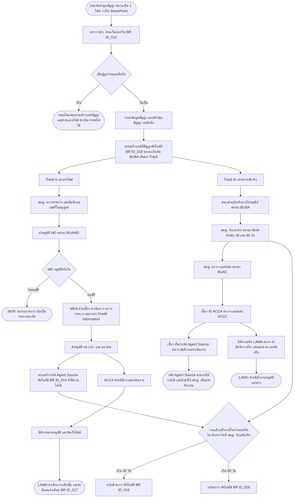

### 7.3 เส้นทางสั่งแก้ไข (Rework) — สรุปกฎปลายทาง

**[SRS] หัวข้อ 5.2 หมายเหตุหน้าต่างสั่งแก้ไขรายการ**

| ฝ่ายผู้สั่งแก้ไข | สถานะที่เกิด | ปลายทาง (TO) | ผู้แก้ไขทำอะไรได้ | เมื่อแก้เสร็จกลับไปที่ |
|---|---|---|---|---|
| ฝ่ายธุรกิจ (สนญ.) | `BUR` ฝ่ายธุรกิจส่งแก้ไข | สาขา | แนบเอกสารเพิ่มเติมใน Transaction เดิม (`BR ID_007`) | สนญ. ตรวจซ้ำ |
| ฝ่ายบริหารจัดการเบี้ยประกันภัย | `ACCR` ฝ่ายเบี้ยส่งแก้ไข | BU สนญ. | เพิ่มชุดสัญญาใหม่ (`BR ID_008`) | ฝ่ายเบี้ยฯ ด้วยสถานะ `BUAACC` |
| ฝ่ายสำนักนิติกรรม | `LAWR` ฝ่ายนิติกรรมส่งแก้ไข | BU สนญ. | เพิ่มชุดสัญญาใหม่ (`BR ID_008`) | นิติกรรม ด้วยสถานะ `BUAL` |

> **[SRS]** การสั่งแก้ไขทำให้เลขชุดสัญญาถูกย้ายไปอยู่ในรายการ "แก้ไขรายการ" และนับรวมในตัวนับ "แก้ไข" บนหน้า Home
> **[SRS]** Dropdown ชื่อเอกสารเป็น **ชุดเดียวกันทุกฝ่าย** (F-CM-005 … F-CM-049, QP-PR-016, อื่นๆ) ต่างกันเฉพาะปลายทางที่ส่งถึง
> **[ตีความ]** เมื่อสาขาถูกสั่งแก้ไข แต่ SRS ระบุว่าสาขาแนบได้เฉพาะใน Transaction เดิม → สนญ. ต้องเป็นผู้ "เพิ่มชุดสัญญาใหม่" เพื่อให้ได้ชุดที่นำไปลงนาม (SRS เขียนไว้ในหมายเหตุหน้าจอแนบเอกสารเพิ่มเติม)

---

## 8. State / Status Model ทั้ง 3 ชุด

### 8.1 ชุดที่ 1 — สถานะเอกสารไฟล์ (12 รายการ)

**[SRS] หัวข้อ 5.2 หน้าจอเมนู Home** — คอลัมน์ No / Role / Action / remark / code / Status / TO / View

| No | Code | Status (ข้อความที่แสดง) | Role ผู้ทำ | Action | Remark | TO | View |
|---|---|---|---|---|---|---|---|
| 1 | `BUBA` | ดำเนินการส่งเอกสารเข้าสำนักงานใหญ่ | ฝ่ายธุรกิจสาขา | approve | – | – | BU สาขา, BU สนญ. |
| 2 | `BUAMD` | อยู่ระหว่าง MD ลงนาม | ฝ่ายธุรกิจ สนญ. | approve | Auto | – | BU สาขา, BU สนญ., MD |
| 3 | `BUAACC` | ฝ่ายเบี้ยดำเนินการเอกสาร | ฝ่ายธุรกิจ สนญ. | approve | Reject โดย เบี้ย | – | BU สาขา, BU สนญ., เบี้ยฯ |
| 4 | `BUAL` | ฝ่ายนิติกรรมดำเนินการเอกสาร | ฝ่ายธุรกิจ สนญ. | approve | Reject โดย นิติกรรม | – | BU สาขา, BU สนญ., เบี้ยฯ, นิติกรรม |
| 5 | `BUR` | ฝ่ายธุรกิจส่งแก้ไข | ฝ่ายธุรกิจ สนญ. | reject | – | สาขา | BU สาขา, BU สนญ. |
| 6 | `BUC` | ปปง. ไม่อนุมัติ | ฝ่ายธุรกิจ สนญ. | cancel | End flows | – | BU สาขา, BU สนญ. |
| 7 | `MDA` | ฝ่ายเบี้ยดำเนินการเอกสาร | MD | approve | – | – | BU สาขา, BU สนญ., MD, เบี้ยฯ |
| 8 | `MDR` | MD ไม่อนุมัติ | MD | reject | End flows | – | BU สาขา, BU สนญ. |
| 9 | `ACCA` | ฝ่ายนิติกรรมดำเนินการเอกสาร | ฝ่ายบริหารจัดการเบี้ยฯ | approve | – | – | BU สาขา, BU สนญ., MD, เบี้ยฯ, นิติกรรม |
| 10 | `ACCR` | ฝ่ายเบี้ยส่งแก้ไข | ฝ่ายบริหารจัดการเบี้ยฯ | reject | – | BU สนญ. | BU สาขา, BU สนญ., MD, เบี้ยฯ |
| 11 | `LAWA` | ดำเนินการเสร็จสิ้น | ฝ่ายสำนักนิติกรรม | approve | – | – | ทุกฝ่าย |
| 12 | `LAWR` | ฝ่ายนิติกรรมส่งแก้ไข | ฝ่ายสำนักนิติกรรม | reject | – | BU สนญ. | ทุกฝ่าย |

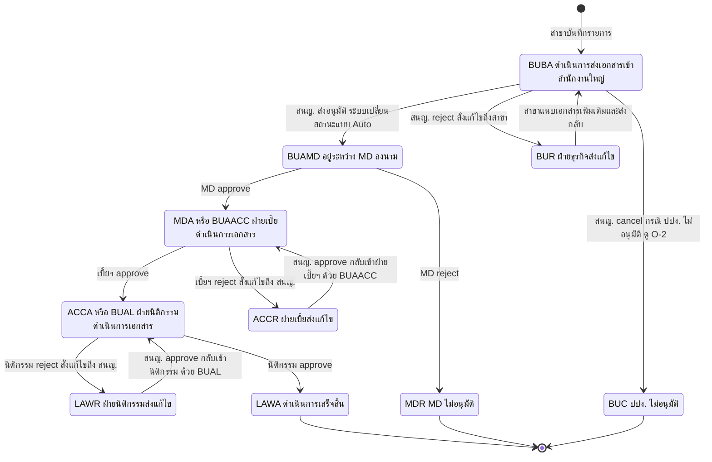

**ช่องว่างของ State Model ชุดที่ 1**

| ช่องว่าง | ผลกระทบ | Open Issue |
|---|---|---|
| ไม่มีสถานะเมื่อ ผช.กจก./ผอ.ฝ่าย ไม่อนุมัติในขั้นฝ่ายเบี้ยฯ ทั้งที่ 5.1 ข้อ 3.3 ระบุว่าตีกลับไปฝ่ายเบี้ยฯ | ระบบไม่มี code ให้บันทึก, ทีมทดสอบไม่มีผลลัพธ์คาดหวัง | O-5 |
| ไม่มีสถานะรองรับกรณีใช้ "ระบุฝ่ายส่งต่อ" ที่ข้ามการลงนาม | ส่งงานได้แต่บันทึกสถานะไม่ได้ | O-24 |
| `BUC` เกิดจาก action `cancel` ของ สนญ. แต่ไม่มีปุ่ม/หน้าจอให้ สนญ. ตรวจ ปปง. ซ้ำ (หน้าจอ สนญ. แสดงผลตรวจของสาขาแบบแก้ไขไม่ได้) | ไม่ทราบว่าสถานะนี้เกิดได้จริงในสถานการณ์ใด | O-2 |
| ไม่มีสถานะ "ฉบับร่าง" ของรายการที่สาขาสร้าง และไม่มีสถานะยกเลิกโดยผู้สร้าง | สาขากรอกผิดแล้วแก้ไม่ได้ | O-22 |

### 8.2 ชุดที่ 2 — สถานะเอกสารฉบับจริง (7 รายการ)

**[SRS] หัวข้อ 5.2 หน้าต่างอัพเดตสถานะของเอกสารฉบับจริง** — ทุกรายการ Action = `Approve`

| No | Code | Status | Role ผู้อัพเดต | เงื่อนไขการแสดง (Remark ตาม SRS) |
|---|---|---|---|---|
| 1 | `BUBA` | ดำเนินการส่งเอกสารเข้าสำนักงานใหญ่ | ฝ่ายธุรกิจสาขา | แสดงขึ้นมาเป็นสถานะแรก |
| 2 | `BUA` | ฝ่ายธุรกิจดำเนินการเอกสาร | ฝ่ายธุรกิจ สนญ. | แสดงเมื่อบันทึกสถานะที่ 1 เสร็จสิ้น |
| 3 | `BUAC` | ฝ่ายธุรกิจส่งเอกสาร | ฝ่ายธุรกิจ สนญ. | แสดงเมื่อบันทึกสถานะที่ 2 เสร็จสิ้น |
| 4 | `ACCA` | ฝ่ายเบี้ยดำเนินการเอกสาร | ฝ่ายบริหารจัดการเบี้ยฯ | แสดงเมื่อบันทึกสถานะที่ 3 เสร็จสิ้น |
| 5 | `ACCC` | ฝ่ายเบี้ยส่งเอกสาร | ฝ่ายบริหารจัดการเบี้ยฯ | แสดงเมื่อบันทึกสถานะที่ 4 เสร็จสิ้น |
| 6 | `LAWA` | ฝ่ายนิติกรรมดำเนินการเอกสาร | ฝ่ายสำนักนิติกรรม | แสดงเมื่อบันทึกสถานะที่ 5 เสร็จสิ้น |
| 7 | `LAWC` | ฝ่ายนิติกรรมอนุมัติเอกสาร | ฝ่ายสำนักนิติกรรม | แสดงเมื่อบันทึกสถานะที่ 6 เสร็จสิ้น |

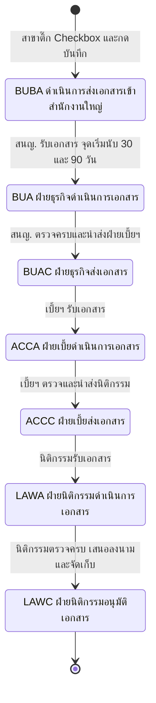

**ช่องว่างของ State Model ชุดที่ 2 (O-8)**

- SRS ข้อ 5.2 และ 7.1 มีกรณี **เอกสารฉบับจริงไม่ครบถ้วน** (สนญ. รอเอกสารแก้ไข / นิติกรรมทำบันทึกภายในฉบับแก้ไขและส่งชุดสัญญากลับ สนญ.) แต่ตารางสถานะมีเฉพาะ action `Approve` 7 สถานะ **ไม่มีสถานะรอแก้ไข ไม่มีการย้อนสถานะ**
- **[ตีความ] ทางเลือกที่เสนอ:** (ก) ไม่เพิ่มสถานะ ใช้การคงสถานะเดิมและบันทึกเหตุการณ์ใน Log แทน (ข) เพิ่มสถานะ "รอเอกสารฉบับจริงที่แก้ไข" 1 สถานะที่ระดับฝ่าย (ค) อนุญาตให้ย้อนสถานะกลับได้พร้อมเหตุผล — ต้องเลือกก่อนออกแบบ เพราะกระทบทั้งหน้าจอ checklist และการนับ SLA

### 8.3 ชุดที่ 3 — สถานะรหัส Agent/Source (4 สถานะ)

**[SRS] หัวข้อ 5.2 หน้าจอรายละเอียดของรายการ**

| สถานะ | เงื่อนไขการแสดงตาม SRS | สีที่กำหนด |
|---|---|---|
| ดำเนินการสร้างรหัส | สถานะเริ่มต้น แสดงเมื่อฝ่ายบริหารจัดการเบี้ยประกันภัยยังไม่สร้างรหัส | ไม่ระบุ |
| สามารถใช้งานได้ | แสดงเมื่อสร้างรหัส Agent/Source เสร็จสิ้น | เขียว |
| ระงับชั่วคราว | ครบ 30 วันหลังฝ่ายธุรกิจ สนญ. ได้รับเอกสารฉบับจริง | เหลือง |
| ระงับถาวร | ครบ 90 วันหลังฝ่ายธุรกิจ สนญ. ได้รับเอกสารฉบับจริง | ไม่ระบุ |

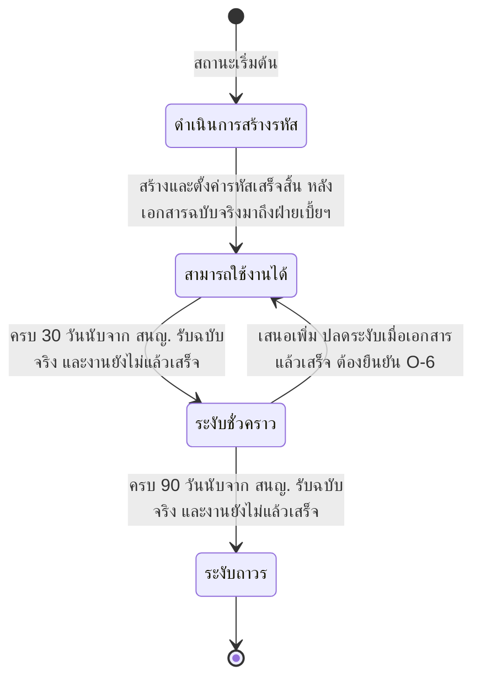

**ข้อสังเกตเชิงวิเคราะห์**

| ประเด็น | รายละเอียด | Open Issue |
|---|---|---|
| ถ้อยคำไม่ตรงกัน | 5.2 บอกว่า "ดำเนินการสร้างรหัส" คือ **ฝ่ายเบี้ยฯ ยังไม่สร้างรหัส** แต่ 5.1 ข้อ 3.3 บอกว่า **ระบบสร้างอัตโนมัติแล้ว** แต่ยังใช้งานไม่ได้ → สถานะเดียวครอบ 2 ความหมาย | O-1 |
| ไม่มีการปลดระงับ | ไม่มีเส้นทาง ระงับชั่วคราว → สามารถใช้งานได้ ทั้งที่เจตนาของกฎคือกดดันให้แก้เอกสารให้เสร็จ | O-6 |
| ไม่มีสถานะปิดรหัส | กรณีเรื่อง "ขอยกเลิกรหัส Agent/Source" ไม่มีสถานะปลายทาง | O-9 |
| ไม่มีนิยาม "แล้วเสร็จ" | ทำให้เงื่อนไขระงับ/ไม่ระงับ ทดสอบไม่ได้ | O-7 |
| ลำดับเวลาไม่สอดคล้องกัน | ถ้าเลือกแนวทางตาม `BR ID_015` (สร้างรหัสหลังนิติกรรมอนุมัติ) เกณฑ์ 30/90 วันซึ่งเริ่มนับตั้งแต่ สนญ. รับฉบับจริง **อาจครบกำหนดก่อนที่รหัสจะถูกสร้าง** ทำให้ไม่มีรหัสให้ระงับ | O-1 |

---

## 9. Business Rules Catalog สำหรับทดสอบ

**หมายเหตุเรื่องรหัส:** SRS ไม่มีรหัส Business Rule รายข้อ (มีเฉพาะ `BR ID_001`–`BR ID_018` ระดับ requirement) เอกสารนี้จึงกำหนดรหัสสำหรับใช้อ้างอิงในการทดสอบเป็น `RUL-<กลุ่ม>-nn` **ซึ่งเป็นรหัสของเอกสารวิเคราะห์ ไม่ใช่รหัสใน SRS** ทุกแถวมีคอลัมน์ `ที่มา` ผูกกลับ `BR ID` และหัวข้อ SRS

**HTTP Status:** SRS ไม่ได้ระบุ API contract ค่าที่ใส่ไว้เป็น **[ตีความ]** ตามแนวปฏิบัติทั่วไป เพื่อให้ทีมทดสอบ API มีเกณฑ์ตั้งต้น — ต้องยืนยันกับ SA ก่อนใช้เป็นเกณฑ์ผ่าน/ไม่ผ่าน

### 9.1 กลุ่ม Authentication และ Authorization (RUL-AUTH)

| รหัส | เงื่อนไข | ผลลัพธ์ / ข้อความ | HTTP | ที่มา | ประเภท |
|---|---|---|---|---|---|
| RUL-AUTH-01 | เข้าใช้งานด้วย user ที่ไม่ใช่ AD User ของบริษัท | เข้าระบบไม่ได้ | 401 | BR ID_004, NFR 004, 5.2 Login | [SRS] |
| RUL-AUTH-02 | กรอก Username หรือ Password ผิด | หน้าต่างแจ้งเตือน "ไม่สามารถเข้าสู่ระบบได้" | 401 | 5.2 Login | [SRS] |
| RUL-AUTH-03 | AD User ถูกต้องแต่ไม่ได้รับสิทธิ์ใช้งานระบบ | หน้าต่างแจ้งเตือน **ข้อความเดียวกัน** คือ "ไม่สามารถเข้าสู่ระบบได้" | 403 | 5.2 Login, BR ID_005 | [SRS] |
| RUL-AUTH-04 | กรอก Password ผิดเกิน 3 ครั้ง | ระงับการใช้งาน User Account และบันทึกเหตุการณ์ | 423 | NFR 006 | [SRS] |
| RUL-AUTH-05 | Login สำเร็จ | ไปหน้า Home แสดงชื่อ-นามสกุล และฝ่ายของผู้ใช้ | 200 | 5.2 Home หมายเลข 1 | [SRS] |
| RUL-AUTH-06 | ไม่มีการใช้งานเกินเวลาที่กำหนด เช่น 15 นาที | ระบบ Logout อัตโนมัติ | 401 | NFR 012 | [SRS] |
| RUL-AUTH-07 | เข้าถึงหน้าจอ/ปุ่มที่ไม่มีสิทธิ์ตาม Permission Matrix | ไม่แสดงปุ่ม และถ้าเรียก API ตรงต้องถูกปฏิเสธ | 403 | BR ID_005, NFR 009, 010 | [ตีความ] SRS ระบุเฉพาะการไม่แสดงปุ่ม |
| RUL-AUTH-08 | กรอก Input ลักษณะ Script/Command/อักขระพิเศษ ครบ 3 ครั้ง | ไม่ประมวลผล Input และ Log off ออกจากระบบทันที | 400 | NFR 013 | [SRS] |
| RUL-AUTH-09 | แสดงข้อมูล Last login (IP, Date/Time) | ต้องแสดงให้ผู้ใช้เห็น | – | NFR 002 | [SRS] — **ไม่มีในหน้าจอที่ SRS ออกแบบ** ต้องยืนยัน (O-33) |

### 9.2 กลุ่มขอบเขตการมองเห็นข้อมูล (RUL-VIS)

| รหัส | เงื่อนไข | ผลลัพธ์ | HTTP | ที่มา | ประเภท |
|---|---|---|---|---|---|
| RUL-VIS-01 | ผู้ใช้เปิดหน้า Home | ตัวนับและตารางรายการแสดง **เฉพาะงานของสาขาตนเองหรือฝ่ายตนเอง** | 200 | 5.2 Home หมายเหตุ | [SRS] |
| RUL-VIS-02 | รายการอยู่ในสถานะที่ฝ่ายนั้นไม่อยู่ในคอลัมน์ `View` | ฝ่ายนั้นต้องมองไม่เห็นรายการ | 403 | ตารางสถานะไฟล์ คอลัมน์ View | [SRS] |
| RUL-VIS-03 | ตัวอย่างการบังคับใช้: สถานะ `BUBA` | เห็นได้เฉพาะ BU สาขา และ BU สนญ. → ฝ่ายเบี้ยฯ และนิติกรรมต้องไม่เห็น | 403 | ตารางสถานะไฟล์ ข้อ 1 | [SRS] |
| RUL-VIS-04 | สาขา A เรียกดูรายการของสาขา B ผ่าน URL/ID ตรง | ต้องถูกปฏิเสธที่ Backend | 403 | NFR 009, 010 | [ตีความ] |

### 9.3 กลุ่มตัวนับและค้นหาหน้า Home (RUL-HOME)

| รหัส | เงื่อนไข | ผลลัพธ์ | ที่มา | ประเภท |
|---|---|---|---|---|
| RUL-HOME-01 | ตัวนับ "ทั้งหมด" | จำนวนรายการที่ได้รับมอบหมายทุกสถานะเอกสาร | 5.2 Home หมายเลข 3 | [SRS] |
| RUL-HOME-02 | ตัวนับ "สำเร็จ" | จำนวนรายการที่สำเร็จ **ทั้งเอกสารอิเล็กทรอนิกส์และเอกสารฉบับจริง** | 5.2 Home หมายเลข 3 | [SRS] — สูตรที่ตีความคือ สถานะไฟล์ = `LAWA` **และ** สถานะฉบับจริง = `LAWC` (O-31) |
| RUL-HOME-03 | ตัวนับ "ดำเนินการ" | จำนวนรายการที่ไฟล์ **หรือ** ฉบับจริงยังไม่แล้วเสร็จ | 5.2 Home หมายเลข 3 | [SRS] |
| RUL-HOME-04 | ตัวนับ "แก้ไข" | จำนวนรายการเอกสารไฟล์ที่อยู่ในสถานะแก้ไข (`BUR`, `ACCR`, `LAWR`) | 5.2 Home หมายเลข 3 | [ตีความ] mapping สถานะ |
| RUL-HOME-05 | ตัวนับ "ยกเลิก" | จำนวนรายการที่ไม่ได้รับการอนุมัติ (`MDR`, `BUC`) | 5.2 Home หมายเลข 3 | [ตีความ] mapping สถานะ |
| RUL-HOME-06 | ค้นหา | ต้องมี 7 ฟิลด์: เลขที่สัญญา, เรื่อง, ชื่อ-นามสกุล, วันที่สร้าง (Calendar), ประเภทสัญญา, สถานะเอกสารไฟล์, สถานะเอกสารฉบับจริง | 5.2 Home หมายเลข 4 | [SRS] |
| RUL-HOME-07 | ตารางรายการ | ต้องมี 10 คอลัมน์: อันดับ, เลขที่สัญญา, เรื่อง, ชื่อ-สกุล, ประเภทสัญญา, ผู้สร้าง, วันที่สร้าง, สถานะเอกสารไฟล์, สถานะเอกสารฉบับจริง, รายละเอียด | 5.2 Home หมายเลข 5 | [SRS] |

### 9.4 กลุ่มสร้างรายการและตรวจ ปปง. (RUL-CRT)

| รหัส | เงื่อนไข | ผลลัพธ์ / ข้อความ | HTTP | ที่มา | ประเภท |
|---|---|---|---|---|---|
| RUL-CRT-01 | ผู้ใช้ที่ไม่ใช่สาขาย่อยเข้าเมนู "สร้างรายการ" | ไม่มีสิทธิ์ | 403 | 5.2 หน้าจอสร้างรายการ | [SRS] |
| RUL-CRT-02 | Radio Box ประเภทผู้สมัคร | เลือกได้เพียงช่องเดียว ระหว่าง บุคคลธรรมดา / นิติบุคคล | 400 | 5.2 หมายเลข 1 | [SRS] |
| RUL-CRT-03 | เลือก **บุคคลธรรมดา** | แสดงฟิลด์: เลขประจำตัวประชาชน, คำนำหน้า (Dropdown), ชื่อ, นามสกุล | – | 5.2 หมายเลข 1 | [SRS] |
| RUL-CRT-04 | เลือก **นิติบุคคล** | แสดงฟิลด์: เลขทะเบียนนิติบุคคล, ชื่อบริษัท, ชื่อผู้ทำสัญญา | – | 5.2 หมายเลข 1 | [SRS] |
| RUL-CRT-05 | ชื่อ / นามสกุล / ชื่อบริษัท / ชื่อผู้ทำสัญญา | กรอกได้ทั้งภาษาไทยและภาษาอังกฤษ | – | 5.2 หมายเลข 1 | [SRS] |
| RUL-CRT-06 | กดปุ่ม "ตรวจสอบ" โดยยังไม่กรอกครบ 1 ช่อง | หน้าต่างแจ้งเตือนระบุชื่อฟิลด์ เช่น "กรุณากรอกชื่อ" | 400 | 5.2 หมายเหตุ หมายเลข 1 | [SRS] |
| RUL-CRT-07 | ไม่กรอก 2 ช่องหรือมากกว่า | หน้าต่างแจ้งเตือนรวมทุกฟิลด์ เช่น "กรุณากรอกชื่อและนามสกุล" | 400 | 5.2 หมายเหตุ หมายเลข 1 | [SRS] |
| RUL-CRT-08 | กดปุ่ม "ตรวจสอบ" เมื่อกรอกครบ | ระบบส่ง API ไปยัง ปปง. เพื่อตรวจรายชื่อผู้ถูกกำหนด | 200 | BR ID_012, 5.2 หมายเลข 1 | [SRS] |
| RUL-CRT-09 | **พบเป็นผู้ถูกกำหนด** | แสดงข้อความ "เป็นผู้ถูกกำหนด" และ **ไม่แสดงส่วนหมายเลข 2 (สร้างเลขสัญญา) และ 3 (แนบไฟล์)** → ดำเนินการต่อไม่ได้ | 200 | 5.2 หมายเลข 1 | [SRS] |
| RUL-CRT-10 | **ไม่พบเป็นผู้ถูกกำหนด** | แสดงส่วนหมายเลข 2 และ 3 และ **ดึงข้อมูลจากหมายเลข 1 มาแสดงในหมายเลข 2** | 200 | 5.2 หมายเลข 1–2 | [SRS] |
| RUL-CRT-11 | ส่วนสร้างเลขสัญญา | ต้องมี Dropdown สาขา, Dropdown ประเภทสัญญา (5 ประเภท), Text Field เรื่อง, Text Field เลขที่ใบอนุญาตนายหน้า | – | 5.2 หมายเลข 2 | [SRS] |
| RUL-CRT-12 | เลขที่ใบอนุญาตนายหน้า | กรอกได้เฉพาะตัวเลข | 400 | 5.2 หมายเลข 2 | [SRS] |
| RUL-CRT-13 | ส่วนสร้างเลขสัญญา กรอกไม่ครบทุกช่อง | ต้องไม่ให้บันทึก (SRS ระบุ "ต้องกรอกข้อมูลครบทุกช่อง" แต่ไม่ระบุข้อความ) | 400 | 5.2 หมายเหตุ หมายเลข 2 | [SRS] เงื่อนไข / [ตีความ] ข้อความ |
| RUL-CRT-14 | ส่วนแนบไฟล์ | Text Field แนบเอกสารชุดสัญญา (สำหรับลงนาม) รับ **ลิงก์** จาก SharePoint + Text Field หมายเหตุ | – | 5.2 หมายเลข 3, BR ID_006 | [SRS] |
| RUL-CRT-15 | กดปุ่ม "บันทึก" | ระบบสร้างเลขที่สัญญาอัตโนมัติตาม Logic ที่นิติกรรมกำหนด | 201 | BR ID_018, 5.2 หมายเลข 3 | [SRS] — ยังไม่ทราบรูปแบบ (O-10) |
| RUL-CRT-16 | หลังบันทึกสำเร็จ | สร้างรายการไปแสดงบนหน้า Home ของ **สาขาที่สร้าง** และ **ฝ่ายธุรกิจ สนญ.** | 201 | 5.2 หมายเลข 3 | [SRS] |
| RUL-CRT-17 | สถานะเริ่มต้นหลังบันทึก | สถานะเอกสารไฟล์ = `BUBA` และสถานะเอกสารฉบับจริง = `BUBA` | – | ตารางสถานะทั้งสองชุด ข้อ 1 | [ตีความ] SRS ไม่ระบุว่าเซ็ตพร้อมกัน |
| RUL-CRT-18 | สร้างรายการซ้ำด้วยเลขประจำตัวประชาชน/เลขทะเบียนนิติบุคคลเดิมที่มีรายการกำลังดำเนินการอยู่ | SRS ไม่ระบุ → เสนอให้แจ้งเตือนหรือบล็อก | 409 | – | [ตีความ] ต้องยืนยัน (O-19) |

### 9.5 กลุ่มตรวจสอบเลขที่ใบอนุญาต (RUL-LIC)

| รหัส | เงื่อนไข | ผลลัพธ์ | HTTP | ที่มา | ประเภท |
|---|---|---|---|---|---|
| RUL-LIC-01 | หน้าจอรายละเอียดของรายการ (สนญ.) | แสดง Radio "ผ่านการตรวจสอบ ปปง. (สาขาตรวจสอบ)" แบบ **แก้ไขไม่ได้** | – | 5.2 หน้าจอรายละเอียด สนญ. หมายเลข 1 | [SRS] |
| RUL-LIC-02 | ตรวจสอบข้อมูลเลขที่ใบอนุญาต | Radio บังคับเลือกข้อใดข้อหนึ่ง: "ผ่าน" หรือ "ไม่พบใบอนุญาต" | 400 | 5.2 หน้าจอรายละเอียด สนญ. หมายเลข 1 | [SRS] |
| RUL-LIC-03 | สนญ. ตรวจสอบวันหมดอายุของเลขที่ใบอนุญาต | SRS ระบุให้ตรวจ แต่ **ไม่มีฟิลด์วันหมดอายุในหน้าจอใด** | – | 5.1 ข้อ 2.2 | [SRS] ขัดกัน → O-32 |
| RUL-LIC-04 | เลือก "ไม่พบใบอนุญาต" หรือใบอนุญาตหมดอายุ | SRS ไม่ระบุผลลัพธ์ → ต้องกำหนดว่าบล็อกส่งอนุมัติ / สั่งแก้ไข / ยกเลิกรายการ | – | – | [ตีความ] O-4 |

### 9.6 กลุ่ม Transaction ชุดสัญญา (RUL-TXN)

| รหัส | เงื่อนไข | ผลลัพธ์ | HTTP | ที่มา | ประเภท |
|---|---|---|---|---|---|
| RUL-TXN-01 | 1 เลขชุดสัญญาหลัก | มีได้หลาย Transaction ชุดสัญญา แสดงลำดับล่าสุดอยู่บนสุด เลื่อน Scroll Bar ดูได้ | – | 5.2 หน้าจอรายละเอียด สนญ. หมายเลข 2 | [SRS] |
| RUL-TXN-02 | การเลือกชุดที่นำไปลงนาม | ระบบดึงลิงก์เอกสารใน **Transaction ล่าสุด** เสมอ | – | 5.2 หน้าจอรายละเอียด สนญ./เบี้ยฯ | [SRS] |
| RUL-TXN-03 | สาขากด "เพิ่มชุดสัญญาใหม่" | ไม่มีสิทธิ์ — ต้องแนบใน Transaction เดิม | 403 | 5.2 หมายเหตุหน้าจอแนบเอกสารเพิ่มเติม | [SRS] |
| RUL-TXN-04 | หน้าจอเพิ่มชุดสัญญาใหม่ | Text Field แนบเอกสารชุดสัญญา (สำหรับลงนาม) = **บังคับกรอก**, หมายเหตุ = ไม่บังคับ | 400 | 5.2 หน้าจอเพิ่มชุดสัญญาใหม่ | [SRS] |
| RUL-TXN-05 | หน้าต่างดูรายละเอียด | ถ้าไม่มีการแนบเอกสารที่ถูกสั่งแก้ไข **ไม่แสดงส่วนหมายเลข 2** | – | 5.2 หน้าต่างดูรายละเอียด หมายเหตุ | [SRS] |

### 9.7 กลุ่มสั่งแก้ไขเอกสาร (RUL-RWK)

| รหัส | เงื่อนไข | ผลลัพธ์ | HTTP | ที่มา | ประเภท |
|---|---|---|---|---|---|
| RUL-RWK-01 | หน้าต่างสั่งแก้ไขรายการ | Dropdown ชื่อเอกสาร (F-CM-005 … F-CM-049, QP-PR-016, อื่นๆ) + Text Field หมายเหตุ + ปุ่ม "เพิ่ม" | – | 5.2 หน้าต่างสั่งแก้ไขรายการ, BR ID_010 | [SRS] |
| RUL-RWK-02 | กดปุ่ม "เพิ่ม" | รายการเข้าไปแสดงในลิสต์หมายเลข 2 และลบรายการรายบรรทัดได้ | – | 5.2 หมายเลข 2 | [SRS] |
| RUL-RWK-03 | กดปุ่ม "บันทึกฉบับร่าง" | เก็บรายการไว้โดยยังไม่ส่ง เปิดหน้าต่างครั้งถัดไปไม่ต้องกรอกซ้ำ | 200 | 5.2 ปุ่มบันทึกฉบับร่าง | [SRS] |
| RUL-RWK-04 | กดปุ่ม "ยืนยัน" โดย **สนญ.** | ส่งรายการแก้ไขให้สาขาอัตโนมัติ สถานะไฟล์ = `BUR` | 200 | 5.2 หมายเหตุ + ตารางสถานะ ข้อ 5 | [SRS] |
| RUL-RWK-05 | กดปุ่ม "ยืนยัน" โดย **ฝ่ายเบี้ยฯ** | ส่งรายการแก้ไขให้ สนญ. อัตโนมัติ สถานะไฟล์ = `ACCR` | 200 | 5.2 หมายเหตุ + ตารางสถานะ ข้อ 10 | [SRS] |
| RUL-RWK-06 | กดปุ่ม "ยืนยัน" โดย **นิติกรรม** | ส่งรายการแก้ไขให้ สนญ. อัตโนมัติ สถานะไฟล์ = `LAWR` | 200 | 5.2 หมายเหตุ + ตารางสถานะ ข้อ 12 | [SRS] |
| RUL-RWK-07 | หลังยืนยัน | เลขชุดสัญญาถูกย้ายไปอยู่ในรายการ "แก้ไขรายการ" | – | 5.2 ปุ่มยืนยัน | [SRS] |
| RUL-RWK-08 | ปุ่ม "แก้ไขรายการ" | แสดงเมื่อ **มีรายการสั่งให้แก้ไข** เท่านั้น และมีสิทธิ์เฉพาะสาขา + สนญ. | – | 5.2 หน้าจอรายละเอียด หมายเลข 2 | [SRS] |
| RUL-RWK-09 | สนญ. เปิดหน้าจอรายการแก้ไข | **ไม่ได้รับสิทธิ์** ใช้ปุ่ม "แนบเอกสารเพิ่มเติม" | 403 | 5.2 หมายเหตุหน้าจอรายการแก้ไข | [SRS] |
| RUL-RWK-10 | สาขาแนบเอกสารเพิ่มเติม | เลือกชื่อเอกสาร + แนบลิงก์ + หมายเหตุ + กด "เพิ่ม" แล้วกด "บันทึก" → ระบบอัพเดต Transaction และ **นำส่ง สนญ. อัตโนมัติ** | 200 | 5.2 หน้าจอแนบเอกสารเพิ่มเติม, BR ID_007 | [SRS] |
| RUL-RWK-11 | ยืนยันสั่งแก้ไขโดยไม่มีรายการเอกสารในลิสต์ | SRS ไม่ระบุ → เสนอให้บล็อกและแจ้งเตือน | 400 | – | [ตีความ] |

### 9.8 กลุ่มส่งอนุมัติและลงนามอิเล็กทรอนิกส์ (RUL-APV)

| รหัส | เงื่อนไข | ผลลัพธ์ | HTTP | ที่มา | ประเภท |
|---|---|---|---|---|---|
| RUL-APV-01 | สิทธิ์กดปุ่ม "ส่งอนุมัติ" | เฉพาะฝ่ายธุรกิจ สนญ. และฝ่ายบริหารจัดการเบี้ยประกันภัย | 403 | 5.2 หมายเหตุหน้าจอส่งอนุมัติ | [SRS] |
| RUL-APV-02 | หน้าจอส่งอนุมัติ หมายเลข 1 | แสดงลิงก์เอกสารชุดสัญญาจาก **Transaction ล่าสุด** + Text Field หมายเหตุถึงผู้ลงนาม/ฝ่ายที่ส่งต่อ | – | 5.2 หมายเลข 1 | [SRS] |
| RUL-APV-03 | Radio Box ระบุผู้ส่งถึง | เลือกได้อย่างใดอย่างหนึ่งเท่านั้น ระหว่าง "ระบุผู้อนุมัติ" และ "ระบุฝ่ายส่งต่อ" | 400 | 5.2 หมายเลข 2 | [SRS] |
| RUL-APV-04 | Dropdown ระบุผู้อนุมัติ | ค้นหาและเลือกได้ **มากกว่า 1 รายชื่อ** โดยดึงรายชื่อจาก AD User ภายใต้บริษัท | – | 5.2 หมายเลข 2, BR ID_004 | [SRS] |
| RUL-APV-05 | Dropdown ระบุฝ่ายส่งต่อ | เลือกได้ **มากกว่า 1 ฝ่าย** มีเฉพาะ ฝ่ายบริหารจัดการเบี้ยประกันภัย และฝ่ายสำนักนิติกรรมประกันภัย | – | 5.2 หมายเลข 2 | [SRS] |
| RUL-APV-06 | เลือก "ระบุผู้อนุมัติ" 1 รายชื่อ | ระบบส่งลิงก์เข้าระบบ Approval ใน MS Teams และจับการกด **Approve** แล้วส่งรายการไปฝ่ายถัดไปอัตโนมัติ | 200 | 5.2 หมายเลข 2, BR ID_009 | [SRS] |
| RUL-APV-07 | เลือก "ระบุผู้อนุมัติ" มากกว่า 1 รายชื่อ | ระบบจับการกด Approve ของ **คนสุดท้ายที่ลงนาม** แล้วส่งรายการไปฝ่ายถัดไปอัตโนมัติ | 200 | 5.2 หมายเลข 2 | [SRS] |
| RUL-APV-08 | สนญ. เป็นผู้ส่งลงนาม | เมื่อลงนามครบ ส่งรายการไป **ฝ่ายบริหารจัดการเบี้ยประกันภัย** อัตโนมัติ | – | 5.2 หมายเลข 2 | [SRS] |
| RUL-APV-09 | ฝ่ายเบี้ยฯ เป็นผู้ส่งลงนาม | เมื่อลงนามครบ ส่งรายการไป **ฝ่ายสำนักนิติกรรมประกันภัย** อัตโนมัติ | – | 5.2 หมายเลข 2 | [SRS] |
| RUL-APV-10 | สนญ. กดส่งอนุมัติ | สถานะไฟล์เปลี่ยนเป็น `BUAMD` แบบ **Auto** | – | ตารางสถานะไฟล์ ข้อ 2 remark = Auto | [SRS] |
| RUL-APV-11 | เลือก "ระบุฝ่ายส่งต่อ" | ส่งรายการไปยังฝ่ายที่เลือกโดยตรง **ไม่ผ่านการลงนาม** | 200 | 5.2 หมายเลข 2 | [SRS] — เป็นช่องข้ามการอนุมัติ ต้องกำหนดเงื่อนไข/สิทธิ์/Log (O-23) |
| RUL-APV-12 | MD กด Approve | สถานะไฟล์ = `MDA` ฝ่ายเบี้ยดำเนินการเอกสาร | – | ตารางสถานะไฟล์ ข้อ 7 | [SRS] |
| RUL-APV-13 | MD กด Reject | สถานะไฟล์ = `MDR` MD ไม่อนุมัติ และ **End flows** นับรวมในตัวนับ "ยกเลิก" | – | ตารางสถานะไฟล์ ข้อ 8 | [SRS] |
| RUL-APV-14 | ผช.กจก./ผอ.ฝ่าย ไม่อนุมัติในขั้นฝ่ายเบี้ยฯ | รายการถูกตีกลับไปฝ่ายบริหารจัดการเบี้ยประกันภัยให้ตรวจสอบเอกสารอีกครั้ง | – | 5.1 ข้อ 3.3 | [SRS] เงื่อนไข / **ไม่มี status code รองรับ** (O-5) |
| RUL-APV-15 | ผู้ลงนามหลายคนแล้วมีคนใดคนหนึ่งกด Reject | SRS ไม่ระบุ | – | – | [ตีความ] O-5 |
| RUL-APV-16 | ผู้ลงนามไม่ดำเนินการภายในเวลาที่กำหนด | SRS ไม่ระบุ timeout / resend | – | – | [ตีความ] O-5, O-27 |
| RUL-APV-17 | นิติกรรมกดปุ่ม "อนุมัติ" | ปิดรายการเลขที่สัญญา สถานะไฟล์ = `LAWA` ดำเนินการเสร็จสิ้น และส่งอีเมลแจ้งเตือน | 200 | 5.2 หน้าจอรายละเอียด นิติกรรม, BR ID_017 | [SRS] |

### 9.9 กลุ่ม Credit Information (RUL-CRD)

| รหัส | เงื่อนไข | ผลลัพธ์ | HTTP | ที่มา | ประเภท |
|---|---|---|---|---|---|
| RUL-CRD-01 | เฉพาะฝ่ายบริหารจัดการเบี้ยประกันภัย | เห็นและกรอกส่วน Credit Information ได้ | 403 | 5.2 หน้าจอรายละเอียด เบี้ยฯ หมายเลข 1 | [SRS] |
| RUL-CRD-02 | ฟิลด์ที่ต้องมี | วงเงินเครดิต, Credit Term, Credit Term Motor, Credit Term Fire, Credit Term Misc, Credit Term Cargo, Credit Term Marine (7 ฟิลด์ Text) | – | 5.2 หมายเลข 1 | [SRS] |
| RUL-CRD-03 | ชนิดข้อมูล/หน่วย/ค่าต่ำสุด–สูงสุด/บังคับกรอกหรือไม่ | SRS ไม่ระบุ | 400 | – | [ตีความ] O-13 |
| RUL-CRD-04 | ผู้อนุมัติวงเงินและการปรับวงเงินภายหลัง | SRS ไม่ระบุ | – | – | [ตีความ] O-13 |

### 9.10 กลุ่มสถานะเอกสารฉบับจริง (RUL-STP)

| รหัส | เงื่อนไข | ผลลัพธ์ | HTTP | ที่มา | ประเภท |
|---|---|---|---|---|---|
| RUL-STP-01 | เปิดหน้าต่างอัพเดตสถานะฉบับจริง | แสดง 2 ส่วน: ลำดับสถานะเอกสารไฟล์ทั้งหมด (อ่านอย่างเดียว) และ checklist สถานะฉบับจริง | – | 5.2 หน้าต่างอัพเดตสถานะ | [SRS] |
| RUL-STP-02 | ลำดับการแสดงสถานะ | สถานะถัดไปแสดงขึ้น **เมื่อบันทึกสถานะก่อนหน้าเสร็จสิ้นแล้วเท่านั้น** | – | 5.2 หมายเลข 2 | [SRS] |
| RUL-STP-03 | ขอบเขตการอัพเดต | แต่ละฝ่ายอัพเดตได้เฉพาะสถานะของฝ่ายตนเอง เช่น ฝ่ายธุรกิจ สนญ. อัพเดตได้ 2 สถานะ คือ `BUA` และ `BUAC` | 403 | 5.2 หมายเลข 2 | [SRS] |
| RUL-STP-04 | เมื่อกดบันทึกแต่ละสถานะ | ระบบบันทึกและแสดง **ผู้ทำรายการ** (Username) และ **วันที่-เวลาทำรายการ** | – | 5.2 หมายเลข 2 | [SRS] |
| RUL-STP-05 | ก่อนกดบันทึก | ต้องไม่แสดงผู้ทำรายการและวันที่ทำรายการของสถานะนั้น | – | 5.2 หมายเลข 2 | [SRS] |
| RUL-STP-06 | ข้ามลำดับสถานะ | ต้องทำไม่ได้ (สถานะถัดไปยังไม่แสดง) | 400 | 5.2 หมายเลข 2 | [ตีความ] จากกลไก checklist |
| RUL-STP-07 | ย้อนสถานะ / ยกเลิกการติ๊ก | SRS ไม่ระบุ | – | – | [ตีความ] O-8 |
| RUL-STP-08 | ฉบับจริงไม่ครบถ้วนที่ สนญ. | สนญ. **รอเอกสารที่แก้ไขจากสาขา** โดยสั่งแก้ไขที่ฝั่งเอกสารไฟล์ก่อน แล้วสาขาส่งฉบับจริงตามมาภายหลัง | – | 5.1 ข้อ 5.2 | [SRS] — ไม่มีสถานะรองรับ (O-8) |
| RUL-STP-09 | ฉบับจริงไม่ครบถ้วนที่นิติกรรม | ทำบันทึกภายในฉบับแก้ไข และนำส่งเอกสารทั้งชุดให้ สนญ. แก้ไข | – | 5.1 ข้อ 7.1 (บรรทัดที่เขียน "กรณีเอกสารครบถ้วน" ซ้ำ) | [SRS] มีข้อผิดพลาดการเขียน (O-3) |

### 9.11 กลุ่มรหัส Agent/Source (RUL-CODE)

| รหัส | เงื่อนไข | ผลลัพธ์ | HTTP | ที่มา | ประเภท |
|---|---|---|---|---|---|
| RUL-CODE-01 | ฝ่ายเบี้ยฯ นำส่งไฟล์เอกสารเสนอ ผช.กจก. และ ผอ.ฝ่าย ลงนามเสร็จสิ้น | ระบบสร้างรหัส Agent/Source **อัตโนมัติ** ผ่านเว็บเซอร์วิส | 201 | 5.1 ข้อ 3.3, BR ID_013, BR ID_014 | [SRS] — ขัด BR ID_015 (O-1) |
| RUL-CODE-02 | หลังสร้างรหัสแต่เอกสารฉบับจริงยังไม่มาถึง | รหัส **ยังใช้งานไม่ได้** สถานะ = ดำเนินการสร้างรหัส | – | 5.1 ข้อ 3.3, 5.2 สถานะรหัส | [SRS] |
| RUL-CODE-03 | เอกสารฉบับจริงมาถึงฝ่ายเบี้ยฯ แล้ว | ฝ่ายเบี้ยฯ ตั้งค่ารหัส Agent/Source ระหว่างที่นิติกรรมดำเนินการเอกสาร | – | 5.1 ข้อ 6.3 | [SRS] |
| RUL-CODE-04 | ตั้งค่ารหัสเสร็จสิ้น | สถานะรหัส = สามารถใช้งานได้ แสดงข้อความ **สีเขียว** | – | 5.2 สถานะรหัส | [SRS] |
| RUL-CODE-05 | หลังตั้งค่าเสร็จ | ฝ่ายเบี้ยฯ นำส่งรหัสให้ฝ่ายธุรกิจ สนญ. และ สนญ. ส่งรหัสให้ตัวแทน/นายหน้าใช้งาน | – | 5.1 ข้อ 6.4 | [SRS] |
| RUL-CODE-06 | หน้าจอตั้งค่ารหัส Agent/Source | **SRS ไม่มีหน้าจอนี้** ทั้งที่กระบวนการต้องมี | – | – | [ตีความ] ช่องว่างของ SRS |
| RUL-CODE-07 | เว็บเซอร์วิสสร้างรหัสล้มเหลว / timeout / สร้างซ้ำ | SRS ไม่ระบุการจัดการ | 502 / 504 | – | [ตีความ] O-28 |
| RUL-CODE-08 | แสดงเลขที่ใบอนุญาตนายหน้า/ตัวแทนในหน้ารายละเอียด | แสดงข้อความ **สีแดง** | – | 5.2 หน้าจอรายละเอียด หมายเลข 1 | [SRS] |

### 9.12 กลุ่ม SLA และการระงับรหัสอัตโนมัติ (RUL-SLA)

| รหัส | เงื่อนไข | ผลลัพธ์ | ที่มา | ประเภท |
|---|---|---|---|---|
| RUL-SLA-01 | ฝ่ายธุรกิจ สนญ. ได้รับเอกสารชุดสัญญาฉบับจริงจากไปรษณีย์ (สถานะฉบับจริง = `BUA`) | ระบบเริ่มจับเวลาการดำเนินการเอกสาร | 5.1 ข้อ 7.2, 5.2 สถานะรหัส | [SRS] |
| RUL-SLA-02 | ดำเนินการเอกสารไม่แล้วเสร็จภายใน **30 วัน** | ระบบระงับรหัส Agent/Source **ชั่วคราว** อัตโนมัติ แสดงสถานะสีเหลือง | 5.1 ข้อ 7.2, BR ID_016 | [SRS] |
| RUL-SLA-03 | ดำเนินการเอกสารไม่แล้วเสร็จภายใน **90 วัน** (นับจากวันเดียวกัน ไม่ใช่ 30+90) | ระบบระงับรหัส Agent/Source **ถาวร** อัตโนมัติ | 5.1 ข้อ 7.2, 5.2 สถานะรหัส | [SRS] |
| RUL-SLA-04 | นิยาม "ดำเนินการเอกสารแล้วเสร็จ" | SRS ไม่นิยาม → เสนอใช้สถานะฉบับจริง = `LAWC` | – | [ตีความ] O-7 |
| RUL-SLA-05 | นับวันทำการหรือวันปฏิทิน | SRS ไม่ระบุ | – | [ตีความ] O-7 |
| RUL-SLA-06 | แจ้งเตือนล่วงหน้าก่อนครบกำหนด | SRS ไม่ระบุ | – | [ตีความ] O-7, O-16 |
| RUL-SLA-07 | การปลดระงับเมื่อเอกสารแล้วเสร็จหลังถูกระงับ | SRS ไม่ระบุ | – | [ตีความ] O-6 |
| RUL-SLA-08 | เก็บ Log Transaction เพื่อดู SLA | ต้องเก็บผู้ทำรายการและวันเวลาในทุกการเปลี่ยนสถานะทั้งสอง Track | BR ID_003, 5.2 | [SRS] — ไม่มีรายงานรองรับ (O-30) |

### 9.13 กลุ่มการแจ้งเตือน (RUL-NTF)

| รหัส | เงื่อนไข | ผลลัพธ์ | ที่มา | ประเภท |
|---|---|---|---|---|
| RUL-NTF-01 | นิติกรรม Approve หรือ Reject | ระบบส่งอีเมลแจ้งเตือนถึง **ทุกฝ่ายที่เกี่ยวข้อง** | BR ID_017 | [SRS] |
| RUL-NTF-02 | ผู้รับอีเมลคือใครบ้าง / เนื้อหาอีเมล / ภาษา | SRS ไม่ระบุ → เสนออ้างอิงคอลัมน์ `View` ของสถานะนั้น | – | [ตีความ] O-16 |
| RUL-NTF-03 | ส่งเอกสารเสนอลงนาม | ระบบส่งลิงก์เอกสารเข้าระบบ Approval ใน MS Teams ถึงผู้อนุมัติที่ระบุ | BR ID_009, 5.2 หน้าจอส่งอนุมัติ | [SRS] |
| RUL-NTF-04 | สั่งแก้ไขเอกสาร | ระบบส่งรายการแก้ไขให้ฝ่ายผู้แก้ไข **อัตโนมัติ** และย้ายเลขชุดสัญญาไปรายการ "แก้ไขรายการ" | 5.2 หน้าต่างสั่งแก้ไขรายการ | [SRS] |
| RUL-NTF-05 | สาขาบันทึกรายการใหม่ | แสดงรายการบนหน้า Home ของสาขาผู้สร้างและ สนญ. | 5.2 หน้าจอสร้างรายการ | [SRS] |
| RUL-NTF-06 | ครบกำหนด 30 / 90 วัน หรือรหัสถูกระงับ | SRS ระบุเฉพาะการเปลี่ยนสถานะ **ไม่ระบุการแจ้งเตือน** | – | [ตีความ] O-16 |
| RUL-NTF-07 | MD หรือ ผช.กจก. ไม่อนุมัติ | SRS ไม่ระบุการแจ้งเตือน (BR ID_017 ครอบเฉพาะนิติกรรม) | – | [ตีความ] O-16 |

---

## 10. Validation Rules

**Severity:** `Error` = บล็อกการทำรายการ · `Warning` = แจ้งเตือนแต่ทำต่อได้ · `Info` = ข้อความประกอบ

### 10.1 หน้าจอสร้างรายการ — ส่วนตรวจ ปปง. (หมายเลข 1)

| Validation ID | Field / Condition | Error Message | Severity | ที่มา | ประเภท |
|---|---|---|---|---|---|
| VAL-01 | ไม่เลือกประเภทผู้สมัคร (บุคคลธรรมดา / นิติบุคคล) | "กรุณาเลือกประเภทผู้สมัคร" | Error | 5.2 หมายเลข 1 | [ตีความ] ข้อความ |
| VAL-02 | เลขประจำตัวประชาชน ว่าง | "กรุณากรอกเลขประจำตัวประชาชน" | Error | 5.2 หมายเหตุ หมายเลข 1 | [SRS] เงื่อนไข |
| VAL-03 | เลขประจำตัวประชาชน ไม่ครบ 13 หลัก / ไม่ผ่าน checksum | "เลขประจำตัวประชาชนไม่ถูกต้อง" | Error | – | [ตีความ] O-20 |
| VAL-04 | คำนำหน้า ไม่เลือก | "กรุณาเลือกคำนำหน้า" | Error | 5.2 หมายเลข 1 | [ตีความ] ข้อความ |
| VAL-05 | ชื่อ ว่าง | "กรุณากรอกชื่อ" | Error | 5.2 หมายเหตุ หมายเลข 1 (ตัวอย่างใน SRS) | [SRS] |
| VAL-06 | นามสกุล ว่าง | "กรุณากรอกนามสกุล" | Error | 5.2 หมายเหตุ หมายเลข 1 | [SRS] เงื่อนไข |
| VAL-07 | ว่างตั้งแต่ 2 ช่องขึ้นไป | รวมชื่อฟิลด์ในข้อความเดียว เช่น "กรุณากรอกชื่อและนามสกุล" | Error | 5.2 หมายเหตุ หมายเลข 1 | [SRS] |
| VAL-08 | เลขทะเบียนนิติบุคคล ว่าง | "กรุณากรอกเลขทะเบียนนิติบุคคล" | Error | 5.2 หมายเลข 1 | [SRS] เงื่อนไข |
| VAL-09 | เลขทะเบียนนิติบุคคล รูปแบบไม่ถูกต้อง (13 หลัก) | "เลขทะเบียนนิติบุคคลไม่ถูกต้อง" | Error | – | [ตีความ] O-20 |
| VAL-10 | ชื่อบริษัท ว่าง | "กรุณากรอกชื่อบริษัท" | Error | 5.2 หมายเลข 1 | [SRS] เงื่อนไข |
| VAL-11 | ชื่อผู้ทำสัญญา ว่าง | "กรุณากรอกชื่อผู้ทำสัญญา" | Error | 5.2 หมายเลข 1 | [SRS] เงื่อนไข |
| VAL-12 | กรอกอักขระที่ไม่ใช่ไทย/อังกฤษ ในฟิลด์ชื่อ | "กรอกได้เฉพาะภาษาไทยและภาษาอังกฤษ" | Error | 5.2 หมายเลข 1 + NFR 013 | [ตีความ] |
| VAL-13 | ความยาวสูงสุดของแต่ละฟิลด์ | SRS ไม่ระบุ ต้องกำหนดร่วมกับ SA | Error | – | [ตีความ] O-20 |

### 10.2 หน้าจอสร้างรายการ — ส่วนสร้างเลขสัญญา (หมายเลข 2) และแนบไฟล์ (หมายเลข 3)

| Validation ID | Field / Condition | Error Message | Severity | ที่มา | ประเภท |
|---|---|---|---|---|---|
| VAL-14 | ไม่เลือกสาขา | "กรุณาเลือกสาขา" | Error | 5.2 หมายเหตุ หมายเลข 2 | [SRS] เงื่อนไข |
| VAL-15 | ไม่เลือกประเภทสัญญา | "กรุณาเลือกประเภทสัญญา" | Error | 5.2 หมายเหตุ หมายเลข 2 | [SRS] เงื่อนไข |
| VAL-16 | ประเภทสัญญาต้องเป็น 1 ใน 5 ค่า | ตัวแทน / นายหน้าบุคคลธรรมดา / นายหน้านิติบุคคล / สำนักงาน–คณะบุคคล / สำหรับตัวแทน-นายหน้า กรมการขนส่งทางบก | Error | 5.2 หมายเลข 2 | [SRS] |
| VAL-17 | เรื่อง ว่าง | "กรุณากรอกเรื่อง" | Error | 5.2 หมายเหตุ หมายเลข 2 | [SRS] เงื่อนไข |
| VAL-18 | เลขที่ใบอนุญาตนายหน้า ว่าง | "กรุณากรอกเลขที่ใบอนุญาตนายหน้า" | Error | 5.2 หมายเหตุ หมายเลข 2 | [SRS] เงื่อนไข |
| VAL-19 | เลขที่ใบอนุญาตนายหน้า มีอักขระที่ไม่ใช่ตัวเลข | "กรอกได้เฉพาะตัวเลข" | Error | 5.2 หมายเลข 2 | [SRS] |
| VAL-20 | จำนวนหลักของเลขที่ใบอนุญาต | SRS ไม่ระบุ | Error | – | [ตีความ] O-20 |
| VAL-21 | ลิงก์เอกสารชุดสัญญา ว่าง | "กรุณาแนบลิงก์เอกสารชุดสัญญา" | Error | 5.2 หมายเลข 3 + หน้าจอเพิ่มชุดสัญญาใหม่ (บังคับใส่ข้อมูล) | [SRS] เงื่อนไข |
| VAL-22 | ลิงก์ไม่ใช่รูปแบบ URL หรือไม่ใช่โดเมน SharePoint ของบริษัท | "รูปแบบลิงก์ไม่ถูกต้อง" | Error | – | [ตีความ] O-21 — สำคัญด้าน security |
| VAL-23 | หมายเหตุ | ไม่บังคับกรอก | Info | 5.2 หมายเลข 3 | [ตีความ] SRS ไม่ระบุว่าบังคับ |
| VAL-24 | สาขาที่เลือก ไม่ตรงกับสาขาที่ผู้ใช้สังกัดใน AD | เสนอให้ล็อกค่าอัตโนมัติหรือแจ้งเตือน | Warning | – | [ตีความ] O-25 |

### 10.3 หน้าจออื่น ๆ

| Validation ID | Field / Condition | Error Message | Severity | ที่มา | ประเภท |
|---|---|---|---|---|---|
| VAL-25 | ไม่เลือกผลตรวจสอบข้อมูลเลขที่ใบอนุญาต แล้วกดส่งอนุมัติ | "กรุณาเลือกผลการตรวจสอบเลขที่ใบอนุญาต" | Error | 5.2 หน้าจอรายละเอียด สนญ. (บังคับเลือกข้อใดข้อหนึ่ง) | [SRS] เงื่อนไข |
| VAL-26 | สั่งแก้ไข: ไม่เลือกชื่อเอกสาร | "กรุณาเลือกเอกสารที่ต้องการแก้ไข" | Error | 5.2 หน้าต่างสั่งแก้ไขรายการ | [ตีความ] |
| VAL-27 | สั่งแก้ไข: ไม่กรอกหมายเหตุ | SRS ไม่ระบุว่าบังคับ แต่หมายเหตุคือสาระของการสั่งแก้ | Warning | – | [ตีความ] |
| VAL-28 | สั่งแก้ไข: ลิสต์รายการว่าง แล้วกดยืนยัน | "กรุณาเพิ่มรายการเอกสารที่ต้องแก้ไขอย่างน้อย 1 รายการ" | Error | – | [ตีความ] |
| VAL-29 | ส่งอนุมัติ: ไม่เลือก Radio ผู้ส่งถึง | "กรุณาเลือกผู้อนุมัติหรือฝ่ายส่งต่อ" | Error | 5.2 หมายเลข 2 | [ตีความ] |
| VAL-30 | ส่งอนุมัติ: เลือก "ระบุผู้อนุมัติ" แต่ไม่ระบุรายชื่อ | "กรุณาระบุผู้อนุมัติอย่างน้อย 1 รายชื่อ" | Error | 5.2 หมายเลข 2 | [ตีความ] |
| VAL-31 | Credit Information: กรอกค่าที่ไม่ใช่ตัวเลข | "กรอกได้เฉพาะตัวเลข" | Error | – | [ตีความ] O-13 |
| VAL-32 | อัพเดตสถานะฉบับจริง: ไม่ติ๊ก Checkbox แล้วกดบันทึก | "กรุณาเลือกสถานะที่ต้องการบันทึก" | Error | 5.2 ปุ่มบันทึก | [ตีความ] |
| VAL-33 | รูปแบบวันที่ที่แสดง/รับเข้า (พ.ศ. หรือ ค.ศ.) และ Timezone | SRS ไม่ระบุ | Error | – | [ตีความ] O-32 |

---

## 11. Integration / Interface Requirements

| รหัส | ระบบ/บริการ | ทิศทาง | จุดที่เรียกใช้ | ที่มา | สิ่งที่ SRS ยังไม่ระบุ |
|---|---|---|---|---|---|
| INT-01 | **เว็บเซอร์วิส ปปง.** | AMS → ปปง. | กดปุ่ม "ตรวจสอบ" ในหน้าจอสร้างรายการ | BR ID_012, 5.2 หมายเลข 1 | endpoint/authentication, รูปแบบ request-response, เกณฑ์การจับคู่ชื่อ (exact/fuzzy), การเก็บหลักฐานผลตรวจ, อายุของผลตรวจ, พฤติกรรมเมื่อบริการล่ม (O-29) |
| INT-02 | **เว็บเซอร์วิสสร้างรหัส Agent/Source** | AMS → ระบบปลายทาง | เมื่อฝ่ายเบี้ยฯ นำส่งเอกสารเสนอลงนามเสร็จสิ้น | BR ID_013, BR ID_014, 5.1 ข้อ 3.3 | ระบบปลายทางคือระบบใด, field ที่ต้องส่ง, การกันสร้างซ้ำ (idempotency), retry, การ rollback เมื่อรายการถูกยกเลิกภายหลัง (O-28) |
| INT-03 | **MS Teams Approval** | AMS → Teams → AMS | หน้าจอส่งอนุมัติ (ระบุผู้อนุมัติ) และรับผลกลับ | BR ID_009, 5.2 หน้าจอส่งอนุมัติ | รูปแบบการเชื่อม (Power Automate / Graph API), การ authen, การจับ Reject, timeout/resend, กรณีผู้อนุมัติไม่มีใน AD หรือลาออก, การเก็บหลักฐานการลงนามเพื่อใช้เป็นหลักฐานทางกฎหมาย (O-5, O-27) |
| INT-04 | **SharePoint** | ผู้ใช้ → SharePoint (ระบบเก็บเฉพาะลิงก์) | วางไฟล์ PDF ชุดสัญญาและแนบลิงก์เข้า AMS | 5.1 ข้อ 1, 5.2 หมายเลข 3 | การควบคุมสิทธิ์เข้าถึงไฟล์ (คนละชุดสิทธิ์กับ AMS), การป้องกันลิงก์เสีย/ถูกลบ/ถูกแก้ไขหลังลงนาม, การกำหนด site/library มาตรฐาน (O-21) |
| INT-05 | **Active Directory** | AMS → AD | Login และ Dropdown ค้นหาผู้อนุมัติ | BR ID_004, NFR 004, 5.2 | การ map AD group → role/ฝ่าย/สาขา, การ sync ข้อมูล, การจัดการผู้ใช้ที่ย้ายฝ่าย (O-25) |
| INT-06 | **ระบบอีเมลองค์กร** | AMS → SMTP/Exchange | แจ้งเตือนเมื่อนิติกรรม Approve/Reject | BR ID_017 | ผู้รับ, template, การ retry เมื่อส่งไม่สำเร็จ (O-16) |

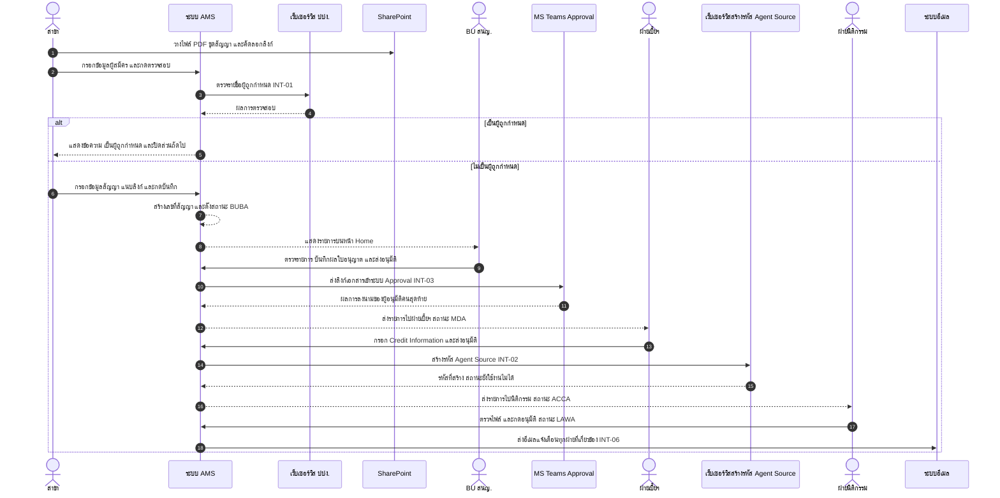

> **[ตีความ]** ลำดับ `WSAG` ในไดอะแกรมวาดตาม SRS 5.1 ข้อ 3.3 หากเลือกแนวทางตาม `BR ID_015` ตำแหน่งการเรียกเว็บเซอร์วิสจะย้ายไปหลังขั้นตอนที่นิติกรรมกดอนุมัติ (`LAWA`) — ดู O-1

---

## 12. SLA และ Time-based Rules

| รหัส | กฎ | ค่า | จุดเริ่มนับ | ผลเมื่อครบกำหนด | ที่มา |
|---|---|---|---|---|---|
| SLA-01 | ระยะเวลาดำเนินการเอกสารก่อนถูกระงับชั่วคราว | 30 วัน | วันที่ฝ่ายธุรกิจ สนญ. ได้รับเอกสารฉบับจริง | รหัส Agent/Source = ระงับชั่วคราว (เหลือง) | [SRS] 5.1 ข้อ 7.2 + 5.2 |
| SLA-02 | ระยะเวลาดำเนินการเอกสารก่อนถูกระงับถาวร | 90 วัน **นับจากวันเดียวกันกับ SLA-01** | วันที่ฝ่ายธุรกิจ สนญ. ได้รับเอกสารฉบับจริง | รหัส Agent/Source = ระงับถาวร | [SRS] 5.1 ข้อ 7.2 + 5.2 |
| SLA-03 | Session timeout | เช่น 15 นาที | ไม่มีการใช้งาน | Logout อัตโนมัติ | [SRS] NFR 012 |
| SLA-04 | ระยะเวลาเก็บ Log | 90 วันตามกฎหมาย | วันที่บันทึก Log | ลบ/จัดเก็บตามนโยบาย | [SRS] NFR 023 |
| SLA-05 | รอบตรวจสอบเอกสารฉบับจริงที่จัดเก็บ | ปีละ 1 ครั้ง | – | SRS ไม่มีฟังก์ชันรองรับ | [SRS] 5.1 ข้อ 7.1 → O-15 |

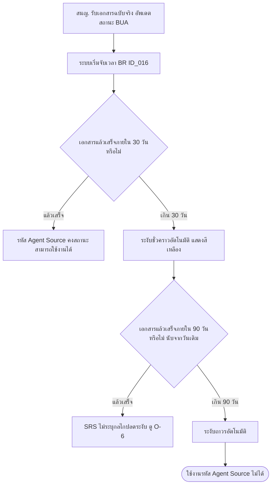

**ประเด็นเชิงออกแบบที่ต้องตัดสิน [ตีความ]**

1. เกณฑ์ "แล้วเสร็จ" ควรใช้สถานะฉบับจริง = `LAWC` เพราะเป็นปลายทางของ Track ที่ถูกจับเวลา (O-7)
2. ถ้าเลือกแนวทาง `BR ID_015` (สร้างรหัสหลังนิติกรรมอนุมัติ) จะเกิดกรณีที่ครบ 30 วันแล้ว **แต่ยังไม่มีรหัสให้ระงับ** ต้องกำหนดพฤติกรรมรองรับ เช่น บล็อกการสร้างรหัสหรือสร้างพร้อมสถานะระงับทันที (O-1)
3. Job ที่ตรวจครบกำหนดต้องกำหนดรอบทำงาน (เช่น รายวันเวลาใด) และการชดเชยเมื่อ Job ล้มเหลว — SRS ไม่ระบุ

---

## 13. Notification Requirements

| รหัส | เหตุการณ์ | ช่องทาง | ผู้รับ | เนื้อหาที่ควรมี | ที่มา / ประเภท |
|---|---|---|---|---|---|
| NTF-01 | นิติกรรม Approve (ปิดรายการ `LAWA`) | อีเมล | ทุกฝ่ายที่เกี่ยวข้อง | เลขที่สัญญา, ชื่อผู้ทำสัญญา, ผลอนุมัติ, ลิงก์รายการ | [SRS] BR ID_017 / ผู้รับและเนื้อหาเป็น [ตีความ] |
| NTF-02 | นิติกรรม Reject (`LAWR`) | อีเมล | ทุกฝ่ายที่เกี่ยวข้อง + สนญ. ผู้ต้องแก้ไข | รายการเอกสารที่ต้องแก้ไข + หมายเหตุ | [SRS] BR ID_017 |
| NTF-03 | ส่งเอกสารเสนอลงนาม | MS Teams Approval | ผู้อนุมัติที่ระบุ (AD User) | ลิงก์เอกสารชุดสัญญาจาก Transaction ล่าสุด + หมายเหตุ | [SRS] BR ID_009 |
| NTF-04 | สั่งแก้ไขเอกสาร | ในระบบ (ย้ายรายการไป "แก้ไขรายการ") | สาขา หรือ สนญ. ตามฝ่ายผู้สั่ง | ชื่อเอกสาร + หมายเหตุรายฉบับ | [SRS] 5.2 |
| NTF-05 | สาขาสร้างรายการใหม่ | ในระบบ (หน้า Home) | สาขาผู้สร้าง + สนญ. | รายการใหม่ในตาราง | [SRS] 5.2 |
| NTF-06 | MD / ผช.กจก. ไม่อนุมัติ | ไม่ระบุ | – | – | [ตีความ] เสนอให้เพิ่ม (O-16) |
| NTF-07 | ใกล้ครบ / ครบกำหนด 30 วัน และ 90 วัน | ไม่ระบุ | – | – | [ตีความ] เสนอให้เพิ่มการแจ้งเตือนล่วงหน้า (O-7, O-16) |
| NTF-08 | รหัส Agent/Source ถูกระงับ | ไม่ระบุ | – | – | [ตีความ] เสนอแจ้งฝ่ายเบี้ยฯ, สนญ., สาขา (O-16) |
| NTF-09 | เว็บเซอร์วิส ปปง. หรือเว็บเซอร์วิสสร้างรหัสล้มเหลว | ไม่ระบุ | – | – | [ตีความ] เสนอแจ้ง IT / ผู้ดูแลระบบ (O-28, O-29) |

---

## 14. Data Model เชิงตรรกะ

> **[ตีความ]ทั้งไดอะแกรม** — SRS ไม่มีหัวข้อ Data Model ผังนี้สรุปจากฟิลด์ที่ปรากฏบนหน้าจอและตารางสถานะ เพื่อใช้เป็นจุดเริ่มคุยกับ SA เท่านั้น

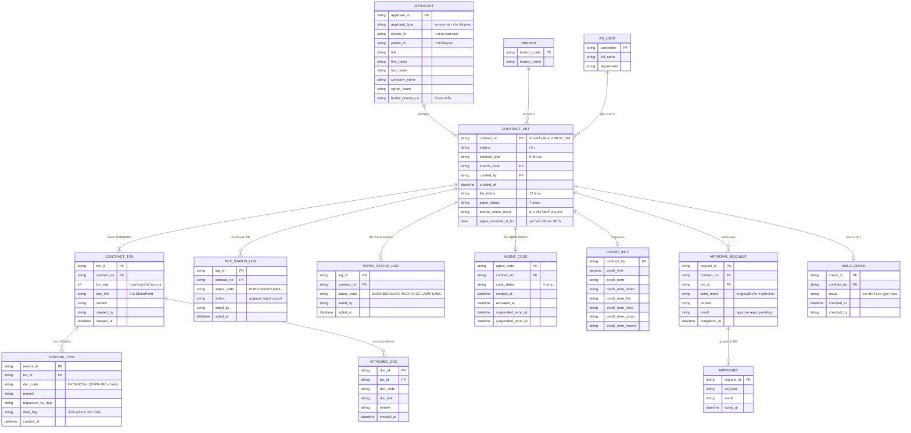

**ข้อสังเกตจากการทำ Data Model**

1. ระบบเก็บ **ลิงก์** ไม่ใช่ไฟล์ ทำให้ความคงอยู่ของหลักฐาน (evidence) ผูกกับ SharePoint (O-21)
2. `paper_received_at_ho` เป็นฟิลด์สำคัญที่สุดต่อการคำนวณ SLA แต่ SRS ไม่ได้ระบุว่าแก้ไขย้อนหลังได้หรือไม่ ถ้าแก้ได้ต้องมี Audit
3. ยังไม่มีที่เก็บ "วันหมดอายุใบอนุญาต" ทั้งที่ SRS ให้ตรวจสอบ (O-32)
4. `AMLO_CHECK` ควรเก็บผลและเวลาไว้เป็นหลักฐาน แต่ SRS ไม่ระบุ (O-29)

---

## 15. Non-Functional Requirements

**[SRS] หัวข้อ 6** — ระบุ NFR 001 … NFR 026 ทั้งหมดค่าเป็น "มี" หรือค่าที่กำหนด ตารางด้านล่างคัดลอกตามต้นฉบับ พร้อมคอลัมน์ผลกระทบต่อการออกแบบ/ทดสอบ

### 15.1 Security Requirement

| NFR ID | Requirement | Description / ค่าที่กำหนด | ผลต่อการออกแบบและทดสอบ |
|---|---|---|---|
| NFR 001 | เข้าถึงหน้าเว็บไม่ได้หากไม่กรอก Username/Password ก่อน | มี | ทดสอบ deep link เข้าหน้าภายในโดยไม่ login → ต้อง redirect |
| NFR 002 | แสดงข้อมูล Last login เช่น IP, Date/Time | มี | **ยังไม่มีในหน้าจอที่ SRS ออกแบบ** (O-33) |
| NFR 003 | ตั้ง Autocomplete = Off สำหรับฟิลด์ Username/Password/ข้อมูลความลับ | มี | ตรวจ HTML attribute |
| NFR 004 | ใช้ User AD ในการเข้าใช้งานระบบ | มี | ผูกกับ BR ID_004, INT-05 |
| NFR 005 | กำหนดมาตรฐานรหัสผ่านตาม Deves Password Standard | มี | นโยบายอยู่ที่ AD |
| NFR 006 | ระงับ User Account หลังกรอก Password ผิดเกิน 3 ครั้ง + บันทึกเหตุการณ์ | มี | RUL-AUTH-04 |
| NFR 007 | ข้อมูลระดับ Confidential ขึ้นไปไม่ถูกเก็บใน Hidden field / Cookie / Session / Source Code / Log / Cache | มี | ตรวจร่วมกับ PDPA: **เลขประจำตัวประชาชนต้องไม่โผล่ใน log/URL** |
| NFR 008 | แบ่งกลุ่มผู้ใช้งานหลายระดับตามสิทธิ์ | มี | Permission Matrix หัวข้อ 5.2 |
| NFR 009 | มีระบบควบคุมตรวจสอบสิทธิ์ เช่น Access control matrix | มี | ต้องมีหน้าจอ/ตารางบริหารสิทธิ์ (O-33) |
| NFR 010 | ผู้ใช้เห็นได้เฉพาะหน้าจอตามสิทธิ์ของตน | มี | RUL-VIS-01..04 |
| NFR 011 | เก็บ Activity Log อย่างปลอดภัย เข้าถึงเฉพาะผู้มีสิทธิ์ | มี | Admin Menu |
| NFR 012 | Logout อัตโนมัติเมื่อไม่ใช้งานตามเวลาที่กำหนด เช่น 15 นาที | มี | SLA-03 |
| NFR 013 | ตรวจ Input ทุกครั้ง กัน Script/Command/อักขระพิเศษ ครบ 3 ครั้ง → Log off ทันที (กัน XSS, SQL Injection) | มี | RUL-AUTH-08 + VAL-12 |
| NFR 014 | ถ้าอัปโหลดไฟล์ได้ ต้องตรวจประเภทและขนาดไฟล์ | มี | **ระบบนี้ไม่อัปโหลดไฟล์ ใช้ลิงก์ SharePoint** → ต้องออกกฎ validate URL แทน (O-21) |
| NFR 015 | ไม่แสดงข้อมูลระบบ เช่น Version, Source code, การตั้งค่า | มี | ตรวจหน้า error page |

### 15.2 Availability / Recovery / Audit / Cosmetic / Performance

| NFR ID | Requirement | ค่าที่กำหนด |
|---|---|---|
| NFR 016 | Service Time | 24 Hours 7 days |
| NFR 017 | Critical Service Time | 08:00 – 17:00 Mon–Fri |
| NFR 018 | Peak Time | 10:00 – 15:00 Mon–Fri |
| NFR 019 | Recovery Point Objective (ความถี่ backup) | 1 Day |
| NFR 020 | Recovery Time Objective | ตาม SLA |
| NFR 021 | Access Log | เก็บ Username / IP Address / Timestamp — ผู้ดูแลระบบดูได้ใน Admin Menu |
| NFR 022 | Activities Log | เก็บ Username / Timestamp / Action in admin function |
| NFR 023 | ระยะเวลาเก็บ Log | 90 วันตามกฎหมาย |
| NFR 024 | การแสดงผลแบบ Responsive | ใช่ |
| NFR 025 | การออกแบบตรงตาม CI ขององค์กร | ใช่ |
| NFR 026 | CCU และ Average Response Time | CCU 1,000 คน ที่ Avg. Response Time 5 วินาทีต่อหน้า |

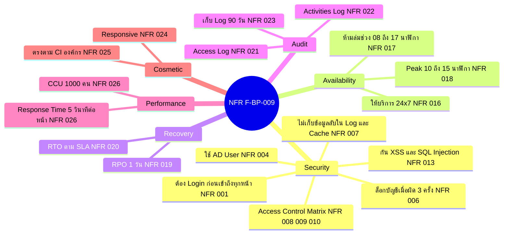

### 15.3 ช่องว่างของ NFR ที่พบจากการวิเคราะห์ [ตีความ]

| ประเด็น | เหตุผล |
|---|---|
| NFR 022 กำหนด Activities Log เฉพาะ **admin function** | แต่ `BR ID_003` ต้องการ Log Transaction เพื่อดู SLA ของงานธุรกิจ → ต้องขยายขอบเขต log ให้ครอบการเปลี่ยนสถานะทุกครั้ง (O-26) |
| NFR 023 เก็บ Log 90 วัน | ขัดกับกระบวนการที่มีอายุงานถึง 90 วันและการตรวจเอกสารปีละ 1 ครั้ง → หลักฐาน SLA อาจถูกลบก่อนใช้ (O-26) |
| ไม่มี NFR ด้าน Integration | ไม่กำหนด timeout, retry, circuit breaker สำหรับ INT-01/02/03 (O-27, O-28, O-29) |
| ไม่มี NFR ด้าน Data Retention ของข้อมูลส่วนบุคคล | PDPA ต้องกำหนดระยะเวลาเก็บและการลบ (O-34) |
| ไม่มี NFR ด้าน Encryption at Rest / In Transit | ระบบเก็บเลขประจำตัวประชาชนและเอกสารสัญญา (O-34) |

---

## 16. PDPA Consideration และการวิเคราะห์ช่องว่าง

### 16.1 สถานะปัจจุบันใน SRS

**[SRS] หัวข้อ 7** — ตาราง "ข้อมูลส่วนบุคคล (Personal Data)" มี 36 รายการ แต่ **ติ๊กเพียงรายการเดียว** คือ

| FIELD NO. | FIELD NAME | PERSONAL DATA | กิจกรรมที่เกี่ยวกับการใช้ข้อมูลส่วนบุคคล |
|---|---|---|---|
| 1 | ชื่อ - นามสกุล | √ | ใช้ในการออกกรมธรรม์ให้ลูกค้า |

ตาราง "ข้อมูลส่วนบุคคลอ่อนไหว (Sensitive data)" 13 รายการ **ไม่ติ๊กเลย** และตารางกิจกรรมการใช้ข้อมูลส่วนบุคคลในภาคผนวก (ลำดับที่ 1) **ว่างทั้งแถว**

> **ข้อสังเกต:** คำอธิบายกิจกรรม "ใช้ในการออกกรมธรรม์ให้ลูกค้า" **ไม่ตรงกับบริบทของระบบนี้** ซึ่งเป็นการรับสมัครตัวแทน/นายหน้า ไม่ใช่การออกกรมธรรม์ให้ลูกค้า → น่าจะคัดลอกมาจากเทมเพลตโครงการอื่น

### 16.2 ข้อมูลส่วนบุคคลที่ระบบเก็บจริง — วิเคราะห์จากหน้าจอและกระบวนการ

`[SRS]` ในคอลัมน์ "ที่ปรากฏใน SRS" = ฟิลด์นี้ปรากฏจริงในหน้าจอตาม SRS · `√ ควรติ๊ก` = ผู้วิเคราะห์เห็นว่าต้องระบุเพิ่มในตาราง PDPA

| # | ข้อมูลส่วนบุคคล | ที่ปรากฏใน SRS | ติ๊กในตาราง PDPA ปัจจุบัน | วัตถุประสงค์การใช้ | หน้าจอ / ไฟล์ที่เกี่ยวข้อง |
|---|---|---|---|---|---|
| 1 | ชื่อ - นามสกุล | [SRS] หน้าจอสร้างรายการ, Home, รายละเอียด | √ (ติ๊กแล้ว แต่คำอธิบายกิจกรรมผิดบริบท) | ระบุตัวผู้สมัครเป็นตัวแทน/นายหน้า, ตรวจ ปปง., จัดทำสัญญา | สร้างรายการ, Home, รายละเอียดของรายการ |
| 2 | **เลขประจำตัวประชาชน** | [SRS] หน้าจอสร้างรายการ + หน้ารายละเอียด | ยังไม่ติ๊ก (ลำดับ 16) | ตรวจสอบรายชื่อผู้ถูกกำหนดกับ ปปง., ยืนยันตัวตนผู้ทำสัญญา | สร้างรายการ, รายละเอียดของรายการ, ส่ง API ไป ปปง. |
| 3 | **ใบอนุญาตนายหน้า / เลขที่ใบอนุญาต** | [SRS] หน้าจอสร้างรายการ + หน้ารายละเอียด (แสดงสีแดง) | ยังไม่ติ๊ก (ลำดับ 29) | ตรวจสอบคุณสมบัติตามกฎหมายว่าเป็นตัวแทน/นายหน้าที่ได้รับใบอนุญาต | สร้างรายการ, รายละเอียดของรายการ |
| 4 | **คำนำหน้า** | [SRS] หน้าจอสร้างรายการ | ไม่มีในตาราง | ประกอบชื่อในสัญญา | สร้างรายการ |
| 5 | **ชื่อผู้ทำสัญญา (กรณีนิติบุคคล)** | [SRS] หน้าจอสร้างรายการ | ยังไม่ติ๊ก (อยู่ใต้ ชื่อ-นามสกุล) | ระบุผู้มีอำนาจลงนามของนิติบุคคล | สร้างรายการ |
| 6 | **ลายมือชื่อ** | [ตีความ] อยู่ในไฟล์ชุดสัญญา PDF ที่แนบลิงก์ และการลงนามอิเล็กทรอนิกส์ | ยังไม่ติ๊ก (ลำดับ 25) | ลงนามสัญญา/หนังสือค้ำประกัน | ไฟล์ใน SharePoint, MS Teams Approval |
| 7 | **สำเนาบัตรประชาชน** | [ตีความ] SRS อ้างถึงในตัวอย่างหมายเหตุสั่งแก้ไข "สำเนาบัตรประชาชนไม่ได้รับการลงนาม" | ยังไม่ติ๊ก (ลำดับ 24) | เอกสารประกอบชุดสัญญา | ไฟล์ใน SharePoint |
| 8 | **ที่อยู่ / โทรศัพท์ / อีเมล / อาชีพ / การศึกษา** | [ตีความ] เป็นฟิลด์ในแบบฟอร์ม F-CM-005/008/011/014 (ใบสมัคร) ที่สแกนแนบมา | ยังไม่ติ๊ก | เอกสารใบสมัครตัวแทน/นายหน้า | ไฟล์ใน SharePoint |
| 9 | **ข้อมูลทางการเงิน / หมายเลขบัญชีธนาคาร / สำเนาบัญชีธนาคาร** | [ตีความ] Credit Information ในระบบ + เอกสารประกอบ | ยังไม่ติ๊ก (ลำดับ 18, 31, 32) | กำหนดวงเงินเครดิตและ Credit Term | หน้ารายละเอียด (ฝ่ายเบี้ยฯ), ไฟล์ใน SharePoint |
| 10 | **ชื่อผู้ใช้งานภายใน (Username) และ IP Address** | [SRS] ทุกหน้าจอ + NFR 021/022 | ไม่มีในตาราง | ระบุผู้ทำรายการเพื่อ audit และ SLA | Log, ประวัติสถานะ, Admin Menu |
| 11 | **ประวัติอาชญากรรม (ถ้ามีใน F-CM-049 เกณฑ์การคัดเลือก)** | [ตีความ] ต้องตรวจแบบฟอร์มจริง | ตาราง Sensitive ยังไม่ติ๊ก | คัดเลือกตัวแทน/นายหน้า | ไฟล์ใน SharePoint |
| 12 | **เลขทะเบียนนิติบุคคล** | [SRS] หน้าจอสร้างรายการ | ไม่มีในตาราง | ไม่ใช่ข้อมูลส่วนบุคคลของบุคคลธรรมดา แต่ควรระบุการควบคุมเทียบเท่าข้อมูลความลับทางธุรกิจ | สร้างรายการ |

### 16.3 ประเด็น PDPA ที่ต้องดำเนินการ (O-18, O-34)

| # | ประเด็น | ข้อเสนอ |
|---|---|---|
| 1 | ตาราง PDPA ใน SRS ยังไม่ครบและคำอธิบายกิจกรรมผิดบริบท | ปรับปรุงตารางให้ครบตามหัวข้อ 16.2 และแก้กิจกรรมเป็น "ใช้ในการรับสมัคร ตรวจสอบคุณสมบัติ และจัดทำสัญญาตัวแทน/นายหน้า" |
| 2 | ตารางกิจกรรมการใช้ข้อมูลส่วนบุคคลในภาคผนวกยังว่าง | ต้องกรอกเจ้าของข้อมูล (คู่ค้า/พันธมิตรทางธุรกิจ = ตัวแทน/นายหน้า), แหล่งที่ได้มา (จากเจ้าของข้อมูลโดยตรง), ฐานการประมวลผล, ผู้รับโอนข้อมูล (ปปง. = หน่วยงานรัฐ), ที่จัดเก็บ (AMS + SharePoint), ระยะเวลาเก็บ |
| 3 | การส่งข้อมูลออกนอกองค์กร | การส่งชื่อ-นามสกุลและเลขประจำตัวประชาชนไปยัง **ปปง.** ผ่านเว็บเซอร์วิส เป็นการเปิดเผยข้อมูลที่ต้องระบุฐานทางกฎหมาย (หน้าที่ตามกฎหมาย AMLA) และต้องบันทึกไว้ใน ROP |
| 4 | Consent | ชุดสัญญามีฟอร์ม PDPA อยู่แล้ว (F-CM-039, F-CM-040, F-CM-047, F-CM-048) → ควรผูกว่ารายการต้องมีเอกสารเหล่านี้แนบครบก่อนอนุมัติ ซึ่ง SRS ไม่มีกฎบังคับ |
| 5 | การควบคุมการเข้าถึงไฟล์ใน SharePoint | ไฟล์ชุดสัญญามีสำเนาบัตรประชาชน/ลายมือชื่อ แต่ระบบเก็บเพียงลิงก์ → ผู้มีลิงก์อาจเข้าถึงได้แม้ไม่มีสิทธิ์ใน AMS ต้องกำหนดสิทธิ์ที่ SharePoint ให้สอดคล้องคอลัมน์ `View` (O-21) |
| 6 | การแสดงข้อมูลบนหน้าจอ | ควรพิจารณา Data Masking เลขประจำตัวประชาชนสำหรับฝ่ายที่ไม่จำเป็นต้องเห็นเต็ม (SRS แสดงเต็มทุกฝ่ายที่เห็นรายการ) |
| 7 | Retention | ไม่มีข้อกำหนดระยะเวลาเก็บข้อมูลผู้สมัครที่ไม่ผ่าน (`MDR`, `BUC`) และผู้ที่ยกเลิกรหัส |
| 8 | ต้องนำเสนอคณะทำงาน DPO | SRS ระบุไว้ท้ายหัวข้อ 7 ว่าโครงการที่มีข้อมูลส่วนบุคคลต้องนำเสนอคณะทำงานบริหารจัดการคุ้มครองข้อมูลส่วนบุคคล — ยังไม่มีลายเซ็น DPO ในหน้า Document Sign Off |

---

## 17. Risk Management Plan

| No. | Risk Description | Impact | Mitigation |
|---|---|---|---|
| R-01 | **ข้อขัดแย้งจุดสร้างรหัส Agent/Source (O-1)** ไม่ถูกปิดก่อนพัฒนา | สูง — กระทบ flow หลัก, สถานะรหัส, การนับ SLA, การมีอยู่ของ role IT อาจต้องรื้อ design | จัด workshop ตัดสินใจกับ Business Owner ฝ่ายนิติกรรม ฝ่ายเบี้ยฯ และ IT ก่อนเริ่ม design พร้อมบันทึกมติเป็นภาคผนวก SRS |
| R-02 | ตัวแทน/นายหน้าขายผลิตภัณฑ์ได้ระหว่างเอกสารยังไม่ครบ (ปัญหาที่เป็นเหตุตั้งโครงการ) | สูง — ความเสี่ยงทุจริตยังคงอยู่ถ้ากลไกระงับรหัสทำงานไม่ครบ | ทดสอบ RUL-SLA-01..03 อย่างเข้มงวด รวมกรณี job ล้มเหลว และกำหนดรายงานรายการที่ใกล้ครบกำหนด |
| R-03 | ระบบเก็บเพียงลิงก์ SharePoint (O-21) ไฟล์อาจถูกลบ ย้าย หรือแก้ไขหลังลงนาม | สูง — หลักฐานสัญญาสูญหาย/ถูกเปลี่ยนโดยไม่มีร่องรอย | กำหนด library เฉพาะ, ปิดสิทธิ์แก้ไขหลังส่งลงนาม, เก็บ hash หรือ snapshot, ตรวจสอบลิงก์เสียเป็นรอบ |
| R-04 | ไม่มี status code รองรับการไม่อนุมัติของ ผช.กจก./ผอ.ฝ่าย และการ Reject จาก MS Teams (O-5) | สูง — งานค้างในสถานะที่ไม่สะท้อนความจริง ติดตามไม่ได้ | ยืนยันสถานะที่ต้องเพิ่มก่อนพัฒนา และออกแบบให้ Approval callback รองรับทั้ง Approve และ Reject |
| R-05 | Log retention 90 วัน ไม่พอต่อการตรวจ SLA และการตรวจเอกสารปีละครั้ง (O-26) | กลาง — ตรวจสอบย้อนหลังไม่ได้ | แยก Business Transaction Log (เก็บยาว) ออกจาก Technical Access Log (90 วัน) |
| R-06 | ตาราง PDPA ไม่ครบ และยังไม่ผ่าน DPO (O-18, O-34) | สูง — ความเสี่ยงด้านกฎหมาย และอาจต้องแก้ระบบภายหลัง | ปรับตาราง PDPA ตามหัวข้อ 16.2 และเสนอคณะทำงาน DPO ก่อน go-live |
| R-07 | ไม่ทราบ Logic เลขที่สัญญา (O-10) | กลาง — พัฒนาไม่ได้/ต้องแก้ภายหลัง อาจกระทบเลขที่ออกไปแล้ว | ขอรูปแบบเลขสัญญาเป็นลายลักษณ์อักษรจากฝ่ายสำนักนิติกรรม พร้อมกฎ running number และการ reset ต่อปี/ต่อสาขา |
| R-08 | หัวข้อ 2.2 Out of Scope ยังว่าง (O-12) | กลาง — เสี่ยง scope creep ระหว่างพัฒนาและตอน UAT | ยืนยันรายการใน 3.2 ของเอกสารนี้ให้เป็น Out of Scope อย่างเป็นทางการ |
| R-09 | ไม่มีข้อกำหนดรายงาน (O-11, O-30) | กลาง — BR ID_003 ไม่มี output ให้ใช้งาน | กำหนดรายงานขั้นต่ำ: รายการค้างตามอายุงาน, SLA เกินกำหนด, รหัสที่ถูกระงับ, ประวัติการสั่งแก้ไข |
| R-10 | เว็บเซอร์วิส ปปง. หรือเว็บเซอร์วิสสร้างรหัสไม่พร้อม/ไม่มี contract (O-28, O-29) | สูง — บล็อกการเริ่มต้นและปิดกระบวนการ | ขอ API spec + sandbox ล่วงหน้า และออกแบบ fallback เช่น บันทึกผลตรวจแบบ manual พร้อมหลักฐาน |
| R-11 | ไม่มีหน้าจอบริหารสิทธิ์/ผู้ใช้/master data (สาขา, ประเภทสัญญา, รายการเอกสาร) (O-33) | กลาง — ต้องแก้ config ที่โค้ดทุกครั้งที่ธุรกิจเปลี่ยน | เพิ่ม Admin function ขั้นต่ำสำหรับ mapping AD group → role และ master data ที่เปลี่ยนบ่อย |
| R-12 | ฝ่ายผู้ใช้ต้องทำงาน 2 ระบบคู่กัน (AMS + SharePoint) และมีขั้นตอน manual ส่งรหัสต่อกันเป็นทอด | กลาง — ข้อมูลไม่สอดคล้อง/ตกหล่น | ทำ user training + checklist และพิจารณาเพิ่มการแจ้งเตือนในระบบแทนการบอกต่อ |
| R-13 | ช่องทาง "ระบุฝ่ายส่งต่อ" ข้ามการลงนามได้ (O-23) | สูง — control gap ด้านการอนุมัติ | จำกัดสิทธิ์การใช้, บังคับกรอกเหตุผล, บันทึก Audit Log และรายงานรายการที่ข้ามการลงนาม |

---

## 18. Open Issues

### 18.1 ประเด็นที่สืบทอดจากไฟล์ Flow v2.0 (O-1 … O-18) — คงรหัสเดิมเพื่อ trace

| No. | ประเด็น | จุดกระทบ | ผู้เกี่ยวข้องที่ต้องยืนยัน | ความสำคัญ |
|---|---|---|---|---|
| **O-1** | **ข้อขัดแย้งจุดสร้างรหัส Agent/Source** — SRS 5.1 ข้อ 3.3 ให้ระบบสร้างรหัสอัตโนมัติเมื่อฝ่ายเบี้ยฯ นำส่งเอกสารเสนอลงนาม (ก่อนนิติกรรมอนุมัติ) แต่ `BR ID_015` ระบุให้ผ่าน Approve จากนิติกรรมก่อนจึงส่งต่อให้ IT สร้าง Agent Source และไม่มี role IT ในระบบ | Flow 4, 9, 12 · RUL-CODE-01 · SLA-01/02 · State ชุดที่ 3 | Business Owner, ฝ่ายสำนักนิติกรรม, ฝ่ายบริหารจัดการเบี้ยฯ, ฝ่ายเทคโนโลยี/IT | **สูงสุด** |
| **O-2** | **สถานะ `BUC` ปปง. ไม่อนุมัติ** เกิดจาก action `cancel` ของ สนญ. แต่การตรวจ ปปง. เกิดที่สาขาก่อนสร้างรายการ และหน้าจอ สนญ. แสดงผลตรวจแบบแก้ไขไม่ได้ | Flow 1, 10 · RUL-CRT-09 · State ชุดที่ 1 | ฝ่ายธุรกิจ สนญ., Compliance/AMLO | สูง |
| **O-3** | SRS 5.1 ข้อ 7.1 เขียน "กรณีเอกสารครบถ้วน" **ซ้ำ 2 บรรทัด** บรรทัดที่สองตามบริบทควรเป็น "ไม่ครบถ้วน" | Flow 5 · RUL-STP-09 | ผู้จัดทำ SRS, ฝ่ายสำนักนิติกรรม | สูง (แก้เอกสาร) |
| **O-4** | **ผลของการตรวจใบอนุญาต** — เมื่อเลือก "ไม่พบใบอนุญาต" หรือใบอนุญาตหมดอายุ SRS ไม่ระบุว่าระบบต้องบล็อกส่งอนุมัติ / สั่งแก้ไข / ยกเลิกรายการ | Flow 4 · RUL-LIC-04 | ฝ่ายธุรกิจ สนญ., ฝ่ายสำนักนิติกรรม | สูง |
| **O-5** | **การ Reject ในขั้นลงนาม** — (ก) กลไกเมื่อผู้ลงนามกด Reject ใน MS Teams (ข) กรณีผู้ลงนามหลายคนแล้วมีคนหนึ่ง Reject (ค) **ไม่มี status code เมื่อ ผช.กจก./ผอ.ฝ่าย ไม่อนุมัติในขั้นฝ่ายเบี้ยฯ** (ง) กรณี timeout | Flow 4, 7 · RUL-APV-14..16 · State ชุดที่ 1 | Business Owner, ฝ่ายบริหารจัดการเบี้ยฯ, IT | **สูงสุด** |
| **O-6** | **การปลดระงับรหัส Agent/Source** — ไม่มีเส้นทางจาก "ระงับชั่วคราว" กลับ "สามารถใช้งานได้" และไม่มีการปลด "ระงับถาวร" | Flow 8, 12 · RUL-SLA-07 | ฝ่ายบริหารจัดการเบี้ยฯ, ฝ่ายสำนักนิติกรรม | สูง |
| **O-7** | **รายละเอียดการนับ 30 / 90 วัน** — (ก) นิยาม "ดำเนินการเอกสารแล้วเสร็จ" ใช้สถานะใด (ข) วันทำการหรือวันปฏิทิน (ค) แจ้งเตือนล่วงหน้าหรือไม่ กี่วัน ถึงใคร | Flow 8, 13 · RUL-SLA-04..06 | ฝ่ายสำนักนิติกรรม, ฝ่ายบริหารจัดการเบี้ยฯ | สูง |
| **O-8** | **สถานะเอกสารฉบับจริงกรณีไม่ครบถ้วน** — ตารางมีเฉพาะ action Approve 7 สถานะ ไม่มีสถานะรอแก้ไขหรือย้อนสถานะ | Flow 5, 11 · RUL-STP-07..09 | ฝ่ายธุรกิจ สนญ., ฝ่ายสำนักนิติกรรม | สูง |
| **O-9** | **รายการประเภท "ขอยกเลิกรหัส Agent/Source"** — พบเฉพาะตัวอย่างในฟิลด์ "เรื่อง" และฟอร์ม F-CM-035 ไม่มีกระบวนการและไม่มีสถานะ "ปิดรหัส" | Flow 16 · State ชุดที่ 3 | ฝ่ายธุรกิจ สนญ., ฝ่ายบริหารจัดการเบี้ยฯ | กลาง |
| **O-10** | **Logic เลขที่สัญญา (`BR ID_018`)** — เนื้อหาอยู่ในรูปภาพที่หายไป | Flow 1 · RUL-CRT-15 | ฝ่ายสำนักนิติกรรม | สูง |
| **O-11** | **หัวข้อ 5.3 Report และ `Table 4 โครงสร้างรายงาน`** ไม่มีเนื้อหา | ทั้งเอกสาร | Business Owner ทุกฝ่าย | สูง |
| **O-12** | **หัวข้อ 2.2 ขอบเขตงานที่ยังไม่รวม** เป็น placeholder `Insert Text` | ทั้งเอกสาร | Business Owner | สูง |
| **O-13** | **Credit Information** — ไม่ระบุเกณฑ์วงเงิน ผู้อนุมัติวงเงิน validation และการปรับวงเงินภายหลัง | Flow 4, 9 · RUL-CRD-03/04 | ฝ่ายบริหารจัดการเบี้ยฯ | กลาง |
| **O-14** | **ผลหลัง End flows (`MDR`, `BUC`)** — ไม่ระบุว่าเลขที่สัญญาเดิมถูกยกเลิกอย่างไร และเปิดรายการใหม่ด้วยผู้สมัครรายเดิมได้หรือไม่ | Flow 4, 10 | ฝ่ายธุรกิจ สนญ., ฝ่ายสำนักนิติกรรม | กลาง |
| **O-15** | **การตรวจสอบเอกสารปีละ 1 ครั้ง** — ไม่มีหน้าจอ สถานะ หรือการแจ้งเตือนรองรับ | ยังไม่มี Flow | ฝ่ายสำนักนิติกรรม | กลาง |
| **O-16** | **รายละเอียดอีเมลแจ้งเตือน (`BR ID_017`)** — ไม่ระบุผู้รับ เนื้อหา และเหตุการณ์อื่นที่ควรแจ้ง | Flow 13 · RUL-NTF-02/06/07 | Business Owner ทุกฝ่าย | สูง |
| **O-17** | **กระบวนการหลังเปิดรหัส** — แก้ไขข้อมูล master ของตัวแทน และต่ออายุใบอนุญาต ไม่ปรากฏใน SRS | ยังไม่มี Flow | Business Owner | กลาง |
| **O-18** | **ตาราง PDPA (หัวข้อ 7)** — ติ๊กเฉพาะชื่อ-นามสกุล และตารางกิจกรรมยังว่าง | เอกสาร SRS | DPO, Business Owner | สูง |

### 18.2 ประเด็นใหม่จากการวิเคราะห์เชิงลึกรอบนี้ (O-19 ขึ้นไป)

| No. | ประเด็น | จุดกระทบ | ผู้เกี่ยวข้องที่ต้องยืนยัน | ความสำคัญ |
|---|---|---|---|---|
| **O-19** | **การกันรายการซ้ำ** — ไม่มีกฎว่าผู้สมัครรายเดิม (เลขประจำตัวประชาชน/เลขทะเบียนนิติบุคคลเดียวกัน) สร้างรายการซ้อนขณะที่ยังมีรายการดำเนินการอยู่ได้หรือไม่ และกรณีที่มีรหัส Agent/Source อยู่แล้วต้องทำอย่างไร | RUL-CRT-18 | ฝ่ายธุรกิจ สนญ., ฝ่ายบริหารจัดการเบี้ยฯ | สูง |
| **O-20** | **Validation รูปแบบข้อมูล** — ไม่ระบุจำนวนหลัก/checksum ของเลขประจำตัวประชาชน, รูปแบบเลขทะเบียนนิติบุคคล, จำนวนหลักของเลขที่ใบอนุญาต, ความยาวสูงสุดของทุกฟิลด์, master คำนำหน้า | VAL-03, VAL-09, VAL-13, VAL-20 | BA + SA + ฝ่ายสำนักนิติกรรม | สูง |
| **O-21** | **การแนบเป็นลิงก์ SharePoint ไม่ใช่การอัปโหลดไฟล์** — ทำให้ NFR 014 (ตรวจประเภท/ขนาดไฟล์) ใช้ไม่ได้ และเกิดคำถามเรื่องสิทธิ์เข้าถึงไฟล์, ลิงก์เสีย, การแก้ไขไฟล์หลังลงนาม, การเก็บหลักฐาน | RUL-CRT-14, VAL-22, INT-04, R-03 | IT, ฝ่ายเทคโนโลยี, DPO | **สูงสุด** |
| **O-22** | **ไม่มีสถานะฉบับร่างและไม่มีการยกเลิก/แก้ไขหัวรายการ** — สาขากดบันทึกคือส่งเข้ากระบวนการทันที ถ้ากรอกประเภทสัญญา/เรื่อง/เลขใบอนุญาตผิด ไม่มีทางแก้ในระบบ | State ชุดที่ 1, RUL-CRT-15 | ฝ่ายธุรกิจสาขา, ฝ่ายธุรกิจ สนญ. | สูง |
| **O-23** | **"ระบุฝ่ายส่งต่อ" ข้ามการลงนามได้** — เป็นช่องทางส่งงานตรงถึงฝ่ายเบี้ยฯ หรือนิติกรรมโดยไม่ผ่าน MD/ผช.กจก. ต้องกำหนดว่าใช้ในกรณีใด ใครใช้ได้ ต้องระบุเหตุผลหรือไม่ | RUL-APV-11, R-13 | Business Owner, Internal Audit | **สูงสุด** |
| **O-24** | **status code เมื่อใช้ "ระบุฝ่ายส่งต่อ"** และกรณีเลือกส่งต่อ **มากกว่า 1 ฝ่ายพร้อมกัน** จะเกิดสถานะซ้อนกัน 2 ฝ่ายอย่างไร (ตารางสถานะรองรับได้เพียงสถานะเดียวต่อรายการ) | State ชุดที่ 1, RUL-APV-05/11 | BA + SA + Business Owner | สูง |
| **O-25** | **การ map AD → role / ฝ่าย / สาขา** — ไม่ระบุว่าใช้ AD group หรือตารางภายใน และ Dropdown "สาขา" ในหน้าจอสร้างรายการให้ผู้ใช้เลือกเอง เสี่ยงเลือกสาขาผิดทำให้ขอบเขตการมองเห็นผิด | RUL-VIS-01, VAL-24, INT-05 | IT, ฝ่ายเทคโนโลยี | สูง |
| **O-26** | **Log retention ไม่สอดคล้องความต้องการ SLA** — NFR 023 เก็บ 90 วัน และ NFR 022 ครอบเฉพาะ admin function ขณะที่ `BR ID_003` ต้องการดู SLA ของงานที่มีอายุถึง 90 วันและมีการตรวจปีละครั้ง | NFR 022/023, RUL-SLA-08 | IT, Internal Audit, DPO | สูง |
| **O-27** | **รูปแบบการเชื่อม MS Teams Approval** — ไม่ระบุเทคโนโลยี (Power Automate / Graph API), การ authen, การจับผล Reject, timeout, resend, กรณีผู้อนุมัติลาออก/ไม่มีใน AD, การเก็บหลักฐานการลงนามให้ใช้อ้างอิงทางกฎหมายได้ | INT-03, RUL-APV-06/07/16 | IT, ฝ่ายเทคโนโลยี, ฝ่ายสำนักนิติกรรม | **สูงสุด** |
| **O-28** | **Contract ของเว็บเซอร์วิสสร้างรหัส Agent/Source** — ระบบปลายทางคือระบบใด, field ที่ส่ง, การกันสร้างซ้ำ, retry, การยกเลิกรหัสเมื่อรายการถูก reject ภายหลัง | INT-02, RUL-CODE-07 | IT, ฝ่ายเทคโนโลยี, ฝ่ายบริหารจัดการเบี้ยฯ | **สูงสุด** |
| **O-29** | **Contract ของเว็บเซอร์วิส ปปง.** — ผู้ให้บริการ, รูปแบบ request/response, เกณฑ์จับคู่ชื่อ (exact/fuzzy/คำนำหน้า), การเก็บหลักฐานผลตรวจ, อายุของผลตรวจ (ต้องตรวจซ้ำก่อนอนุมัติหรือไม่), พฤติกรรมเมื่อบริการล่ม | INT-01, RUL-CRT-08/09 | Compliance/AMLO, IT | **สูงสุด** |
| **O-30** | **รายงานขั้นต่ำที่ต้องมี** — ต่อยอดจาก O-11 เสนอรายการ: งานค้างตามอายุ, SLA เกินกำหนด, รหัสที่ถูกระงับ, ประวัติการสั่งแก้ไขรายฝ่าย, สรุปตามสาขา/ประเภทสัญญา | R-09 | Business Owner ทุกฝ่าย | สูง |
| **O-31** | **สูตรของตัวนับหน้า Home** — "สำเร็จ" และ "ดำเนินการ" ครอบ 2 Track ต้องนิยามชัดว่าเงื่อนไขสถานะใดถือว่าสำเร็จ และรายการหนึ่งนับซ้ำในหลายตัวนับได้หรือไม่ | RUL-HOME-02..05 | Business Owner | กลาง |
| **O-32** | **วันหมดอายุใบอนุญาต และรูปแบบวันที่** — SRS ให้ สนญ. ตรวจวันหมดอายุ แต่ไม่มีฟิลด์เก็บวันหมดอายุในหน้าจอใด และไม่ระบุรูปแบบวันที่ (พ.ศ./ค.ศ.) กับ Timezone | RUL-LIC-03, VAL-33 | ฝ่ายธุรกิจ สนญ., BA + SA | สูง |
| **O-33** | **ฟังก์ชันผู้ดูแลระบบยังไม่ครบ** — SRS มีเพียงการดู Access/Activities Log ไม่มีหน้าจอบริหารสิทธิ์ ผู้ใช้ และ master data (สาขา, ประเภทสัญญา, รายการเอกสาร F-CM) ทั้งที่ NFR 008/009 ต้องมี Access control matrix และ NFR 002 ต้องแสดง Last login | RUL-AUTH-09, R-11 | IT, ผู้ดูแลระบบ | สูง |
| **O-34** | **PDPA เชิงลึก** — ต่อยอดจาก O-18: ฐานการประมวลผลสำหรับการส่งข้อมูลไป ปปง., การผูก consent form (F-CM-039/040/047/048) เป็นเงื่อนไขอนุมัติ, Data Masking เลขประจำตัวประชาชน, ระยะเวลาเก็บและการลบข้อมูลผู้สมัครที่ไม่ผ่าน, Encryption at rest/in transit | หัวข้อ 16, R-06 | DPO, Compliance, IT | **สูงสุด** |
| **O-35** | **รหัสโครงการและข้อมูลหัวเอกสาร** — SRS ยังไม่ระบุ Request ID / Project Code (`P2026-xxx`) หัวเอกสารยังเป็น `[Request ID -Request Name]` และหน้า Document Sign Off ยังไม่มีรายชื่อ/ลายเซ็น รวมถึง Contact Person ว่างทั้งตาราง | หัวเอกสาร SRS | PMO, Business Owner, DPO | กลาง |

---

## 19. ชุดคำถามยืนยันกับ Business Owner

ชุดคำถามแบบเลือกตอบ เพื่อให้ปิดประเด็นสำคัญได้เร็ว **ข้อ Q1–Q3 เป็น blocker ของการออกแบบ** ควรตอบก่อนเริ่ม design

### Q1. จุดสร้างรหัส Agent/Source (ปิด O-1) — **blocker**

| ตัวเลือก | รายละเอียด | ผลที่ตามมา |
|---|---|---|
| **A** | ทำตาม SRS 5.1 ข้อ 3.3 — ระบบสร้างรหัสอัตโนมัติเมื่อฝ่ายเบี้ยฯ นำส่งเอกสารเสนอลงนาม (ก่อนนิติกรรมอนุมัติ) โดยรหัสยังใช้งานไม่ได้ | ต้องแก้ถ้อยคำ `BR ID_015` ใน SRS · ไม่ต้องมี role IT · กลไกระงับ 30/90 วันทำงานได้ตามที่ออกแบบ |
| **B** | ทำตาม `BR ID_015` — สร้างรหัสหลังนิติกรรมอนุมัติ (`LAWA`) และให้ IT เป็นผู้สร้าง | ต้องเพิ่ม role IT + หน้าจอ/คิวงานของ IT · ต้องเพิ่มสถานะรหัส "รอสร้าง" · **ต้องทบทวนกลไก 30/90 วัน เพราะอาจครบกำหนดก่อนมีรหัส** · ขัดกับ `BR ID_014` เรื่องอัตโนมัติ |
| **C** | Hybrid — ระบบสร้างรหัสอัตโนมัติเมื่อฝ่ายเบี้ยฯ ส่งลงนาม (จอง/reserve) แต่ **เปิดใช้งานได้** เมื่อนิติกรรมอนุมัติ **และ** เอกสารฉบับจริงถึงฝ่ายเบี้ยฯ แล้ว | ตรงเจตนา `BR ID_015` (ป้องกันใช้รหัสก่อนอนุมัติ) โดยยังคงอัตโนมัติตาม `BR ID_013/014` · ต้องปรับนิยามสถานะ "ดำเนินการสร้างรหัส" ให้ครอบ 2 ความหมาย |

> ข้อเสนอของผู้วิเคราะห์: **ตัวเลือก C** เพราะรักษาเจตนาการควบคุมความเสี่ยงทุจริต และไม่ต้องเพิ่มงาน manual ให้ IT — แต่ต้องได้รับการยืนยัน

### Q2. การไม่อนุมัติของ ผช.กจก./ผอ.ฝ่าย และการ Reject จาก MS Teams (ปิด O-5) — **blocker**

| คำถาม | ตัวเลือก |
|---|---|
| Q2.1 เมื่อ ผช.กจก./ผอ.ฝ่าย ไม่อนุมัติ ระบบควรบันทึกสถานะแบบใด | (A) คงสถานะฝ่ายเบี้ยดำเนินการเอกสารเดิม และบันทึกเหตุการณ์ใน Log · (B) **เพิ่ม status code ใหม่** เช่น "ผู้บริหารไม่อนุมัติ — ตีกลับฝ่ายเบี้ยฯ" · (C) ใช้ `ACCR` ที่มีอยู่ |
| Q2.2 ผู้ลงนามหลายคน แล้วมีคนหนึ่งกด Reject | (A) จบทันทีเมื่อมีคนแรก Reject · (B) รอครบทุกคนแล้วสรุปผล · (C) ต้อง Approve ครบทุกคนจึงผ่าน และ Reject 1 คน = ตีกลับ |
| Q2.3 ผู้ลงนามไม่ดำเนินการ | (A) ไม่มี timeout · (B) เตือนซ้ำทุก N วัน · (C) หมดอายุคำขอและต้องส่งใหม่ |
| Q2.4 กรณี MD ไม่อนุมัติ (`MDR` = End flows) | (A) จบถาวร ต้องสร้างรายการใหม่ · (B) เปิดให้แก้ไขและส่งลงนามซ้ำภายใต้เลขสัญญาเดิม |

### Q3. สถานะ `BUC` ปปง. ไม่อนุมัติ (ปิด O-2) — **blocker**

| ตัวเลือก | รายละเอียด |
|---|---|
| **A** | สนญ. ตรวจ ปปง. ซ้ำเองในระบบ → ต้องเพิ่มปุ่ม "ตรวจสอบ ปปง." ในหน้าจอ สนญ. |
| **B** | ผลตรวจของสาขาไม่บล็อกการสร้างรายการ (เป็นเพียงคำเตือน) และ สนญ. เป็นผู้ตัดสินยกเลิก → ขัดกับ SRS 5.2 ที่ระบุว่าไม่แสดงส่วนถัดไป |
| **C** | ระบบตรวจซ้ำแบบ batch กับรายชื่อผู้ถูกกำหนดที่อัปเดตใหม่ แล้วให้ สนญ. ยกเลิกรายการที่ติดเงื่อนไข |
| **D** | สถานะ `BUC` ไว้รองรับกรณี manual เท่านั้น (สนญ. ได้รับแจ้งจากช่องทางอื่น) |

### Q4. สถานะเอกสารฉบับจริงกรณีไม่ครบถ้วน (ปิด O-8)

| ตัวเลือก | รายละเอียด |
|---|---|
| **A** | ไม่เพิ่มสถานะ — คงสถานะเดิมและบันทึกเหตุการณ์ใน Log (ตรงกับตาราง SRS ปัจจุบัน) |
| **B** | เพิ่ม 1 สถานะกลาง เช่น "รอเอกสารฉบับจริงที่แก้ไข" ใช้ได้ทุกฝ่าย |
| **C** | เพิ่มสถานะรอแก้ไขแยกตามฝ่าย (สนญ. / เบี้ยฯ / นิติกรรม) |
| **D** | อนุญาตให้ย้อนสถานะกลับได้พร้อมเหตุผล และบันทึกประวัติ |

### Q5. การนับ 30 / 90 วัน (ปิด O-7)

| คำถาม | ตัวเลือก |
|---|---|
| Q5.1 "ดำเนินการเอกสารแล้วเสร็จ" หมายถึง | (A) สถานะฉบับจริง = `LAWC` · (B) สถานะไฟล์ = `LAWA` · (C) ทั้งสองอย่างครบ |
| Q5.2 การนับวัน | (A) วันปฏิทิน · (B) วันทำการ |
| Q5.3 แจ้งเตือนล่วงหน้า | (A) ไม่ต้องแจ้ง · (B) แจ้งก่อนครบ 7 วัน · (C) แจ้งก่อนครบ 7 และ 3 วัน · (D) กำหนดเองในระบบ |
| Q5.4 การปลดระงับเมื่อทำเอกสารเสร็จหลังถูกระงับ (O-6) | (A) ปลดอัตโนมัติเมื่อสถานะถึงเกณฑ์แล้วเสร็จ · (B) ผู้มีอำนาจกดปลดในระบบ · (C) ทำ manual นอกระบบ |

### Q6. ผลการตรวจใบอนุญาต (ปิด O-4, O-32)

| คำถาม | ตัวเลือก |
|---|---|
| Q6.1 เมื่อเลือก "ไม่พบใบอนุญาต" | (A) บล็อกปุ่มส่งอนุมัติ · (B) สั่งแก้ไขกลับสาขา · (C) ยกเลิกรายการ · (D) บันทึกไว้แล้วส่งอนุมัติต่อได้ |
| Q6.2 วันหมดอายุใบอนุญาต | (A) เพิ่มฟิลด์วันหมดอายุในหน้าจอสร้างรายการ · (B) ให้ สนญ. กรอกในหน้าตรวจสอบ · (C) ไม่เก็บในระบบ ตรวจด้วยตาเท่านั้น |
| Q6.3 รูปแบบวันที่ที่แสดงในระบบ | (A) พ.ศ. (dd/MM/yyyy) · (B) ค.ศ. (dd/MM/yyyy) · (C) ตาม CI ที่มีอยู่เดิม |

### Q7. การควบคุมช่องทาง "ระบุฝ่ายส่งต่อ" (ปิด O-23, O-24)

| คำถาม | ตัวเลือก |
|---|---|
| Q7.1 อนุญาตให้ส่งต่อโดยไม่ผ่านการลงนามหรือไม่ | (A) อนุญาตทุกกรณี · (B) อนุญาตเฉพาะกรณีที่กำหนด เช่น รายการที่กลับมาจากการสั่งแก้ไข · (C) ไม่อนุญาต ต้องผ่านการลงนามทุกครั้ง |
| Q7.2 ต้องบังคับกรอกเหตุผลหรือไม่ | (A) บังคับ · (B) ไม่บังคับ |
| Q7.3 เลือกส่งต่อมากกว่า 1 ฝ่ายพร้อมกัน | (A) อนุญาตและกำหนดว่าใช้สถานะของฝ่ายลำดับแรก · (B) อนุญาตแบบขนานและต้องเพิ่มโครงสร้างสถานะรายฝ่าย · (C) จำกัดให้เลือกได้ 1 ฝ่าย |

### Q8. ขอบเขตและเอกสารประกอบ (ปิด O-12, O-11, O-19, O-21)

| คำถาม | ตัวเลือก |
|---|---|
| Q8.1 ยืนยันรายการ Out of Scope ตามหัวข้อ 3.2 ของเอกสารนี้ | (A) ยืนยันทั้งหมด · (B) ยืนยันบางข้อ (ระบุ) · (C) ขอเพิ่มรายการอื่น |
| Q8.2 รายงานที่ต้องมีใน Phase นี้ | (A) ไม่มีรายงาน · (B) มีรายงานงานค้าง/SLA เท่านั้น · (C) ตามรายการที่เสนอใน O-30 · (D) รอ Table 4 จาก SRS ฉบับสมบูรณ์ |
| Q8.3 การสร้างรายการซ้ำของผู้สมัครรายเดิม | (A) บล็อกถ้ามีรายการที่ยังดำเนินการอยู่ · (B) แจ้งเตือนแต่สร้างได้ · (C) สร้างได้เสมอ |
| Q8.4 การเก็บไฟล์ชุดสัญญา | (A) คงรูปแบบแนบลิงก์ SharePoint ตาม SRS · (B) เปลี่ยนเป็นอัปโหลดไฟล์เข้าระบบ (ตรงกับ NFR 014 และควบคุมหลักฐานได้ดีกว่า) · (C) แนบลิงก์ แต่ระบบสำเนาไฟล์เก็บไว้เป็นหลักฐานเมื่ออนุมัติ |

---

## 20. แนวทางการทดสอบ Test Strategy และ Scenarios

### 20.1 Traceability: BR ID → พื้นที่ทดสอบ

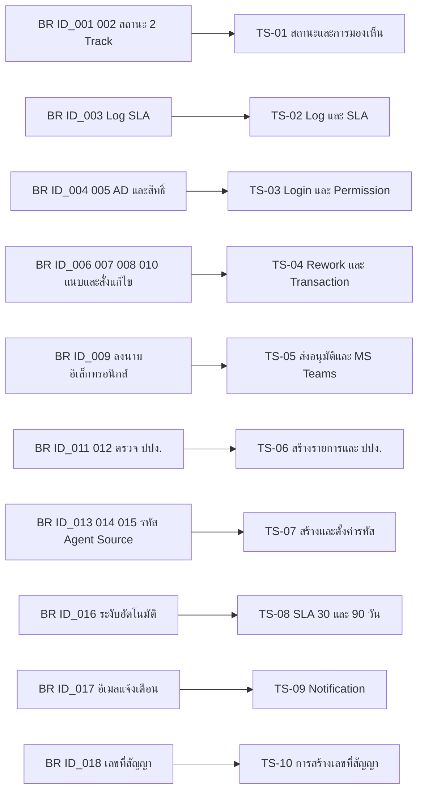

### 20.2 กลุ่มทดสอบและ Scenario หลัก

**TS-01 สถานะและการมองเห็น (BR ID_001, BR ID_002, RUL-VIS, RUL-STP)**

| # | Scenario | ประเภท |
|---|---|---|
| 1 | เดินสถานะไฟล์ครบเส้นทางปกติ `BUBA` → `BUAMD` → `MDA` → `ACCA` → `LAWA` และตรวจข้อความสถานะที่แสดงตรงตารางทุกขั้น | Happy Path |
| 2 | เดินสถานะฉบับจริงครบ 7 สถานะตามลำดับ และตรวจว่า checkbox ถัดไปแสดงเฉพาะหลังบันทึกสถานะก่อนหน้า | Happy Path |
| 3 | ฝ่ายเบี้ยฯ พยายามอัพเดตสถานะของฝ่ายธุรกิจ → ต้องทำไม่ได้ | Negative |
| 4 | ข้ามลำดับสถานะฉบับจริง (ติ๊กสถานะที่ 4 โดยยังไม่บันทึกที่ 3) → ต้องทำไม่ได้ | Negative |
| 5 | ตรวจการมองเห็นรายสถานะตามคอลัมน์ `View` ทั้ง 12 สถานะ (เช่น `BUBA` ฝ่ายเบี้ยฯ ต้องมองไม่เห็น) | Boundary |
| 6 | สาขา A เรียกดูรายการของสาขา B ผ่าน ID ตรง → ต้องถูกปฏิเสธที่ Backend | Negative |

**TS-02 Log และ SLA (BR ID_003)**

| # | Scenario | ประเภท |
|---|---|---|
| 7 | ทุกการเปลี่ยนสถานะทั้งสอง Track ต้องบันทึกผู้ทำรายการและวันเวลา และแสดงในหน้าต่างอัพเดตสถานะ | Happy Path |
| 8 | ตรวจ Access Log (Username/IP/Timestamp) และ Activities Log ใน Admin Menu | Happy Path |
| 9 | ผู้ใช้ที่ไม่ใช่ผู้ดูแลระบบเข้า Admin Menu → ต้องถูกปฏิเสธ | Negative |

**TS-03 Login และ Permission (BR ID_004, BR ID_005, NFR 004/006/010/012)**

| # | Scenario | ประเภท |
|---|---|---|
| 10 | Login ด้วย AD User ที่มีสิทธิ์ → เข้าหน้า Home แสดงชื่อ-นามสกุลและฝ่าย | Happy Path |
| 11 | Login ด้วย user ที่ไม่ใช่ AD ของบริษัท → "ไม่สามารถเข้าสู่ระบบได้" | Negative |
| 12 | AD User ถูกต้องแต่ไม่ได้รับสิทธิ์ → ข้อความเดียวกัน "ไม่สามารถเข้าสู่ระบบได้" | Negative |
| 13 | กรอก Password ผิด 3 ครั้ง → ระงับบัญชี + บันทึกเหตุการณ์ | Boundary |
| 14 | ทิ้งหน้าจอไว้เกินเวลาที่กำหนด → Logout อัตโนมัติ | Boundary |
| 15 | ตรวจ Permission Matrix ทุกช่องในหัวข้อ 5.2 ทั้งการซ่อนปุ่มและการเรียก API ตรง | Negative |

**TS-04 Rework และ Transaction (BR ID_006, 007, 008, 010)**

| # | Scenario | ประเภท |
|---|---|---|
| 16 | สนญ. สั่งแก้ไขหลายเอกสารในครั้งเดียว → สาขาเห็นรายการครบพร้อมหมายเหตุรายฉบับ สถานะ `BUR` | Happy Path |
| 17 | กด "บันทึกฉบับร่าง" ปิดหน้าต่าง แล้วเปิดใหม่ → รายการเดิมยังอยู่ ไม่ต้องกรอกซ้ำ | Happy Path |
| 18 | สาขาแนบเอกสารเพิ่มเติมใน Transaction เดิม → ระบบนำส่ง สนญ. อัตโนมัติ | Happy Path |
| 19 | สาขาพยายามกด "เพิ่มชุดสัญญาใหม่" → ต้องไม่มีสิทธิ์ | Negative |
| 20 | สนญ. เปิดหน้าจอรายการแก้ไข → ปุ่ม "แนบเอกสารเพิ่มเติม" ต้องใช้ไม่ได้ | Negative |
| 21 | เพิ่มชุดสัญญาใหม่ 2 ครั้ง → ระบบต้องใช้ลิงก์ใน Transaction ล่าสุดไปลงนาม และแสดงลำดับล่าสุดบนสุด | Boundary |
| 22 | ฝ่ายเบี้ยฯ สั่งแก้ไข → สถานะ `ACCR` ปลายทาง สนญ. และเมื่อ สนญ. อนุมัติกลับ → สถานะ `BUAACC` กลับเข้าฝ่ายเบี้ยฯ ไม่ต้องลงนาม MD ใหม่ | Happy Path |
| 23 | นิติกรรมสั่งแก้ไข → `LAWR` → `BUAL` กลับเข้านิติกรรม | Happy Path |
| 24 | ยืนยันสั่งแก้ไขโดยลิสต์ว่าง → ต้องบล็อก | Negative |
| 25 | ไม่มีเอกสารแนบเพิ่มเติม → หน้าต่างดูรายละเอียดต้องไม่แสดงส่วนรายการเอกสารแนบ | Boundary |

**TS-05 ส่งอนุมัติและ MS Teams (BR ID_009)**

| # | Scenario | ประเภท |
|---|---|---|
| 26 | ส่งอนุมัติแบบระบุผู้อนุมัติ 1 คน → MD กด Approve → สถานะ `MDA` และส่งงานไปฝ่ายเบี้ยฯ อัตโนมัติ | Happy Path |
| 27 | ระบุผู้อนุมัติ 3 คน → ระบบจับ Approve ของคนสุดท้ายจึงส่งต่อ | Boundary |
| 28 | MD กด Reject → สถานะ `MDR` และรายการนับรวมในตัวนับ "ยกเลิก" | Negative |
| 29 | ผู้ลงนามหลายคนแล้วมีคนหนึ่ง Reject → **ผลลัพธ์รอการยืนยัน (O-5/Q2.2)** | Negative — blocked |
| 30 | ผช.กจก./ผอ.ฝ่าย ไม่อนุมัติ → **ผลลัพธ์รอการยืนยัน (O-5/Q2.1)** | Negative — blocked |
| 31 | เลือก "ระบุฝ่ายส่งต่อ" → งานไปถึงฝ่ายที่เลือกโดยไม่ผ่านการลงนาม และตรวจสถานะที่บันทึก | Negative / control test |
| 32 | เลือกทั้ง "ระบุผู้อนุมัติ" และ "ระบุฝ่ายส่งต่อ" พร้อมกัน → Radio ต้องเลือกได้อย่างเดียว | Negative |
| 33 | สาขาหรือนิติกรรมพยายามกด "ส่งอนุมัติ" → ต้องไม่มีสิทธิ์ | Negative |

**TS-06 สร้างรายการและตรวจ ปปง. (BR ID_011, BR ID_012)**

| # | Scenario | ประเภท |
|---|---|---|
| 34 | บุคคลธรรมดา กรอกครบ → ไม่พบเป็นผู้ถูกกำหนด → แสดงส่วนสร้างเลขสัญญาและแนบไฟล์ พร้อมดึงข้อมูลมาแสดง | Happy Path |
| 35 | นิติบุคคล กรอกครบ → ไม่พบ → หน้ารายละเอียดแสดงเลขทะเบียนนิติบุคคล ชื่อบริษัท ชื่อผู้ทำสัญญา แทนชุดบุคคลธรรมดา | Happy Path |
| 36 | พบเป็นผู้ถูกกำหนด → แสดง "เป็นผู้ถูกกำหนด" และซ่อนส่วนหมายเลข 2 และ 3 | Negative |
| 37 | ไม่กรอก 1 ช่อง → ข้อความระบุฟิลด์นั้น เช่น "กรุณากรอกชื่อ" | Negative |
| 38 | ไม่กรอก 2 ช่องขึ้นไป → ข้อความรวม เช่น "กรุณากรอกชื่อและนามสกุล" | Negative |
| 39 | กรอกเลขที่ใบอนุญาตเป็นตัวอักษร → ต้องไม่ยอมรับ | Negative |
| 40 | เลขประจำตัวประชาชนไม่ครบ 13 หลัก → **เกณฑ์รอการยืนยัน (O-20)** | Boundary — blocked |
| 41 | ลิงก์ที่ไม่ใช่ URL หรือไม่ใช่โดเมน SharePoint → **เกณฑ์รอการยืนยัน (O-21)** | Negative — blocked |
| 42 | เว็บเซอร์วิส ปปง. ไม่ตอบสนอง / timeout → **พฤติกรรมรอการยืนยัน (O-29)** | Negative — blocked |
| 43 | สร้างรายการซ้ำด้วยเลขประจำตัวประชาชนเดิมที่ยังมีงานค้าง → **เกณฑ์รอการยืนยัน (O-19)** | Negative — blocked |

**TS-07 สร้างและตั้งค่ารหัส Agent/Source (BR ID_013, 014, 015)**

| # | Scenario | ประเภท |
|---|---|---|
| 44 | ฝ่ายเบี้ยฯ กรอก Credit Information ครบ 7 ฟิลด์ และส่งอนุมัติ → ระบบสร้างรหัสอัตโนมัติ สถานะ "ดำเนินการสร้างรหัส" | Happy Path (ขึ้นกับผลของ Q1) |
| 45 | เอกสารฉบับจริงถึงฝ่ายเบี้ยฯ → ตั้งค่ารหัส → สถานะ "สามารถใช้งานได้" แสดงสีเขียว | Happy Path |
| 46 | ตั้งค่ารหัสก่อนเอกสารฉบับจริงมาถึง → ต้องทำไม่ได้ | Negative |
| 47 | เว็บเซอร์วิสสร้างรหัสล้มเหลว/สร้างซ้ำ → **พฤติกรรมรอการยืนยัน (O-28)** | Negative — blocked |
| 48 | ตรวจว่าเลขที่ใบอนุญาตในหน้ารายละเอียดแสดงเป็นสีแดง และสถานะรหัสแสดงสีตามที่กำหนด | Cosmetic |

**TS-08 SLA 30 / 90 วัน (BR ID_016)**

| # | Scenario | ประเภท |
|---|---|---|
| 49 | สนญ. อัพเดต `BUA` แล้วงานเสร็จภายใน 30 วัน → รหัสคงสถานะใช้งานได้ | Happy Path |
| 50 | ครบ 30 วันพอดี และเกิน 30 วัน → ระงับชั่วคราว แสดงสีเหลือง | Boundary |
| 51 | ครบ 90 วันพอดี และเกิน 90 วัน → ระงับถาวร | Boundary |
| 52 | งานเสร็จหลังถูกระงับชั่วคราว → **พฤติกรรมรอการยืนยัน (O-6/Q5.4)** | Boundary — blocked |
| 53 | Job ตรวจครบกำหนดไม่ทำงาน 1 วัน แล้วกลับมาทำงาน → ต้องระงับย้อนหลังให้ถูกต้อง | Negative |
| 54 | กรณีเลือกแนวทาง Q1-B แล้วครบ 30 วันก่อนที่รหัสจะถูกสร้าง → **พฤติกรรมรอการยืนยัน (O-1)** | Negative — blocked |

**TS-09 Notification (BR ID_017)**

| # | Scenario | ประเภท |
|---|---|---|
| 55 | นิติกรรม Approve → อีเมลถึงทุกฝ่ายที่เกี่ยวข้อง | Happy Path |
| 56 | นิติกรรม Reject → อีเมลถึงทุกฝ่ายที่เกี่ยวข้อง พร้อมรายการเอกสารที่ต้องแก้ | Happy Path |
| 57 | รายชื่อผู้รับและเนื้อหาอีเมล → **รอการยืนยัน (O-16)** | blocked |
| 58 | ส่งอีเมลไม่สำเร็จ → ต้องมี retry หรือแจ้งผู้ดูแลระบบ | Negative |

**TS-10 การสร้างเลขที่สัญญา (BR ID_018)**

| # | Scenario | ประเภท |
|---|---|---|
| 59 | บันทึกรายการ → ได้เลขที่สัญญาตาม Logic ที่นิติกรรมกำหนด → **รูปแบบรอการยืนยัน (O-10)** | blocked |
| 60 | สร้างรายการพร้อมกันจากหลายสาขา → เลขที่สัญญาต้องไม่ซ้ำ (concurrency) | Boundary |

**TS-11 Non-Functional (ตรวจแยก)**

| # | Scenario | ประเภท |
|---|---|---|
| 61 | Autocomplete = Off ในฟิลด์ Username/Password (NFR 003) | Security |
| 62 | ทดสอบ XSS และ SQL Injection ในทุกฟิลด์ + ครบ 3 ครั้งต้อง Log off (NFR 013) | Security |
| 63 | หน้า error ต้องไม่แสดง version/source/config (NFR 015) | Security |
| 64 | Responsive บนขนาดหน้าจอที่กำหนด (NFR 024) และตรงตาม CI (NFR 025) | Cosmetic |
| 65 | โหลดทดสอบ CCU 1,000 ที่ Avg Response Time ไม่เกิน 5 วินาทีต่อหน้า (NFR 026) | Performance |
| 66 | เลขประจำตัวประชาชนต้องไม่ปรากฏใน URL, Log, Cache (NFR 007 + PDPA) | Security / PDPA |

### 20.3 ข้อจำกัดของการเตรียม Test Case ในขณะนี้

Scenario ที่ทำเครื่องหมาย **blocked** (ข้อ 29, 30, 40, 41, 42, 43, 47, 52, 54, 57, 59) **ยังเขียน Test Case ที่มีผลลัพธ์คาดหวังไม่ได้** จนกว่าจะได้คำตอบตามหัวข้อ 19 — คิดเป็น 11 จาก 66 scenario ควรแจ้ง Project Manager ให้กันเวลาสำหรับรอบยืนยันก่อนเข้าสู่การเขียน Test Case เต็มรูปแบบ

---

## 21. Appendix

### 21.1 Appendix A — Message / Error Catalog

`[SRS]` = ข้อความที่ SRS ระบุตรงตัว · `[ตีความ]` = ข้อความที่ผู้วิเคราะห์เสนอ ต้องยืนยันถ้อยคำกับ Business Owner

| รหัส | ข้อความ | จุดที่แสดง | ประเภท |
|---|---|---|---|
| MSG-001 | "ไม่สามารถเข้าสู่ระบบได้" | Login — ทั้งกรณีกรอกผิดและไม่มีสิทธิ์ | [SRS] |
| MSG-002 | "เป็นผู้ถูกกำหนด" | หน้าจอสร้างรายการ หลังตรวจ ปปง. | [SRS] |
| MSG-003 | "กรุณากรอกชื่อ" | หน้าจอสร้างรายการ กรณีขาด 1 ฟิลด์ | [SRS] ตัวอย่าง |
| MSG-004 | "กรุณากรอกชื่อและนามสกุล" | หน้าจอสร้างรายการ กรณีขาด 2 ฟิลด์ขึ้นไป | [SRS] ตัวอย่าง |
| MSG-005 | "กรุณากรอกข้อมูลให้ครบทุกช่อง" | ส่วนสร้างเลขสัญญา | [ตีความ] |
| MSG-006 | "กรอกได้เฉพาะตัวเลข" | เลขที่ใบอนุญาตนายหน้า, Credit Information | [ตีความ] |
| MSG-007 | "กรุณาเลือกผลการตรวจสอบเลขที่ใบอนุญาต" | หน้าจอรายละเอียด (สนญ.) | [ตีความ] |
| MSG-008 | "กรุณาเพิ่มรายการเอกสารที่ต้องแก้ไขอย่างน้อย 1 รายการ" | หน้าต่างสั่งแก้ไขรายการ | [ตีความ] |
| MSG-009 | "กรุณาระบุผู้อนุมัติอย่างน้อย 1 รายชื่อ" | หน้าจอส่งอนุมัติ | [ตีความ] |
| MSG-010 | "กรุณาแนบลิงก์เอกสารชุดสัญญา" | หน้าจอเพิ่มชุดสัญญาใหม่ (บังคับใส่ข้อมูล) | [ตีความ] ถ้อยคำ / [SRS] เงื่อนไข |
| MSG-011 | "รูปแบบลิงก์ไม่ถูกต้อง" | ฟิลด์แนบลิงก์ทุกจุด | [ตีความ] |
| MSG-012 | "ไม่สามารถตรวจสอบ ปปง. ได้ในขณะนี้ กรุณาลองใหม่อีกครั้ง" | เมื่อเว็บเซอร์วิส ปปง. ล้มเหลว | [ตีความ] O-29 |
| MSG-013 | "ไม่สามารถสร้างรหัส Agent/Source ได้ ระบบจะดำเนินการซ้ำอัตโนมัติ" | เมื่อเว็บเซอร์วิสสร้างรหัสล้มเหลว | [ตีความ] O-28 |

### 21.2 Appendix B — รายการเอกสารประกอบใน Dropdown

**[SRS] หัวข้อ 5.2** — ใช้ชุดเดียวกันทั้งหน้าต่างสั่งแก้ไขรายการและหน้าจอแนบเอกสารเพิ่มเติม

| กลุ่ม | รายการ |
|---|---|
| ตัวแทน (ไทย) | F-CM-005 ใบสมัครตัวแทน · F-CM-006 สัญญาตัวแทน · F-CM-007 หนังสือสัญญาค้ำประกันตัวแทน |
| นายหน้าบุคคลธรรมดา | F-CM-008 ใบสมัคร · F-CM-009 สัญญา · F-CM-010 หนังสือสัญญาค้ำประกัน |
| นายหน้านิติบุคคล | F-CM-011 ใบสมัคร · F-CM-012 สัญญา · F-CM-013 หนังสือสัญญาค้ำประกัน |
| สำนักงาน–คณะบุคคล | F-CM-014 ใบสมัคร · F-CM-015 สัญญา · F-CM-016 หนังสือสัญญาค้ำประกัน |
| บันทึกตรวจสอบ | F-CM-018 บันทึกขอตรวจสอบเอกสารในการสมัครเป็นตัวแทน/นายหน้า |
| ตัวแทน (อังกฤษ) | F-CM-019 Casualty Insurance Agent Application · F-CM-020 Agent Contract · F-CM-021 Letter Of Guarantee [Agent] |
| นายหน้าบุคคลธรรมดา (อังกฤษ) | F-CM-023 · F-CM-024 · F-CM-025 |
| นายหน้านิติบุคคล (อังกฤษ) | F-CM-027 · F-CM-028 · F-CM-029 |
| คณะบุคคล (อังกฤษ) | F-CM-030 · F-CM-031 · F-CM-032 |
| ขนส่ง | F-CM-033 สัญญาตัวแทน [สำหรับขนส่ง] · F-CM-034 สัญญานายหน้า [สำหรับขนส่ง] |
| รหัส Agent/Source | **F-CM-035 แบบฟอร์มขอเปิด - ปิด รหัส Agent/Source** |
| PDPA | F-CM-039 · F-CM-040 · F-CM-047 · F-CM-048 (สัญญาการประมวลผล/ข้อมูลส่วนบุคคล) |
| เกณฑ์คัดเลือก | F-CM-049 แบบฟอร์มเกณฑ์การคัดเลือกตัวแทน/นายหน้า |
| ระเบียบปฏิบัติ | QP-PR-016 การติดตามเบี้ยประกันภัยค้างชำระผ่านตัวแทน/นายหน้า |
| อื่น ๆ | อื่นๆ |

> **[ตีความ]** รายการนี้ควรเป็น **master data ที่แก้ไขได้ผ่าน Admin** ไม่ hardcode เพราะแบบฟอร์มมีการ revise (O-33) และควรกรอง Dropdown ตามประเภทสัญญาที่เลือก เพื่อลดโอกาสเลือกฟอร์มผิดกลุ่ม — SRS ไม่ได้ระบุการกรอง

### 21.3 Appendix C — Field Layout หน้าจอสร้างรายการ

| ส่วน | Field | ชนิด | บังคับ | เงื่อนไข | ที่มา |
|---|---|---|---|---|---|
| 1 ตรวจ ปปง. | ประเภทผู้สมัคร | Radio | ✔ | บุคคลธรรมดา / นิติบุคคล เลือกได้ 1 | [SRS] |
| 1 | เลขประจำตัวประชาชน | Text | ✔ | แสดงเมื่อเลือกบุคคลธรรมดา | [SRS] |
| 1 | คำนำหน้า | Dropdown | ✔ | แสดงเมื่อเลือกบุคคลธรรมดา | [SRS] |
| 1 | ชื่อ | Text | ✔ | ไทย/อังกฤษ | [SRS] |
| 1 | นามสกุล | Text | ✔ | ไทย/อังกฤษ | [SRS] |
| 1 | เลขทะเบียนนิติบุคคล | Text | ✔ | แสดงเมื่อเลือกนิติบุคคล | [SRS] |
| 1 | ชื่อบริษัท | Text | ✔ | ไทย/อังกฤษ | [SRS] |
| 1 | ชื่อผู้ทำสัญญา | Text | ✔ | ไทย/อังกฤษ | [SRS] |
| 1 | ปุ่ม "ตรวจสอบ" | Button | – | กดได้เมื่อกรอกครบ ส่ง API ไป ปปง. | [SRS] |
| 2 สร้างเลขสัญญา | สาขา | Dropdown | ✔ | – | [SRS] |
| 2 | ประเภทสัญญา | Dropdown | ✔ | 5 ประเภท | [SRS] |
| 2 | เรื่อง | Text | ✔ | เช่น สมัครเป็นนายหน้าบุคคลธรรมดา, ขอยกเลิกรหัส Agent/Source | [SRS] |
| 2 | เลขที่ใบอนุญาตนายหน้า | Text | ✔ | ตัวเลขเท่านั้น | [SRS] |
| 3 แนบไฟล์ | แนบเอกสารชุดสัญญา (สำหรับลงนาม) | Text (ลิงก์) | ✔ | ลิงก์ไฟล์ PDF ใน SharePoint | [SRS] |
| 3 | หมายเหตุ | Text | ✘ | ข้อความถึงเจ้าหน้าที่สำนักงานใหญ่ | [SRS] |
| 3 | ปุ่ม "บันทึก" | Button | – | สร้างเลขที่สัญญาอัตโนมัติ + สร้างรายการบนหน้า Home | [SRS] |

### 21.4 Appendix D — Log / Audit ที่ต้องมี

| ตาราง/รายการ Log | เนื้อหา | ผู้เข้าถึง | ที่มา |
|---|---|---|---|
| Access Log | Username / IP Address / Timestamp | ผู้ดูแลระบบ (Admin Menu) | [SRS] NFR 021 |
| Activities Log | Username / Timestamp / Action in admin function | ผู้ดูแลระบบ | [SRS] NFR 022 |
| ประวัติสถานะเอกสารไฟล์ | ลำดับ / สถานะ / ผู้ทำรายการ / วันเวลา | ทุกฝ่ายตามคอลัมน์ View | [SRS] 5.2 |
| ประวัติสถานะเอกสารฉบับจริง | ลำดับ / สถานะ / ผู้ทำรายการ / วันเวลา | ทุกฝ่ายตามสิทธิ์ | [SRS] 5.2 |
| ประวัติการสั่งแก้ไข | เอกสาร / หมายเหตุ / ฝ่ายผู้สั่ง / วันเวลา | สาขา, สนญ. และฝ่ายที่เกี่ยวข้อง | [SRS] 5.2 |
| ประวัติเอกสารแนบเพิ่มเติม | เอกสาร / ลิงก์ / หมายเหตุ / วันเวลา | ตามสิทธิ์ | [SRS] 5.2 |
| Log การเรียก Integration (ปปง., สร้างรหัส, Teams, อีเมล) | request/response/ผลลัพธ์/เวลา | IT | [ตีความ] เสนอเพิ่ม (O-26/O-28/O-29) |
| Log การเปลี่ยนสถานะรหัส Agent/Source | สถานะก่อน–หลัง / เหตุผล / ผู้กระทำหรือระบบ / เวลา | ฝ่ายเบี้ยฯ, IT | [ตีความ] เสนอเพิ่ม เพื่อรองรับการตรวจสอบการระงับ |

### 21.5 Appendix E — สรุปสิ่งที่ต้องขอเพิ่มจากผู้จัดทำ SRS

| # | สิ่งที่ต้องขอ | เหตุผล | Open Issue |
|---|---|---|---|
| 1 | Business Process Diagram AS-IS และ TO-BE (ไฟล์ภาพหรือ source) | ตรวจความสอดคล้องของ flow และ swimlane | – |
| 2 | ภาพหน้าจอทุกหน้า (Figure 3, Figure 6) | ยืนยัน layout, ปุ่ม, ตำแหน่งฟิลด์ที่ยังไม่ปรากฏในข้อความ | – |
| 3 | Logic เลขที่สัญญา | พัฒนาไม่ได้ถ้าไม่มี | O-10 |
| 4 | หัวข้อ 5.3 Report และ Table 4 | ไม่ทราบความต้องการรายงาน | O-11, O-30 |
| 5 | หัวข้อ 2.2 ขอบเขตงานที่ยังไม่รวม | ป้องกัน scope creep | O-12 |
| 6 | ตาราง PDPA ที่กรอกครบ + ลายเซ็น DPO | ข้อกำหนดตามนโยบายบริษัทและกฎหมาย | O-18, O-34 |
| 7 | Request ID / Project Code, Contact Person, Document Sign Off | หัวเอกสารยังเป็น placeholder | O-35 |
| 8 | API spec ของ ปปง. และเว็บเซอร์วิสสร้างรหัส Agent/Source | เป็น blocker ของการออกแบบ interface | O-28, O-29 |

---

## สรุปผู้บริหาร

ระบบ F-BP-009 คือ workflow ควบคุมเอกสารชุดสัญญาตัวแทน/นายหน้าแบบ **2 Track ขนานกัน** (ไฟล์อิเล็กทรอนิกส์ และฉบับจริงกระดาษ) ที่ผูกกับการเปิด–ระงับรหัส Agent/Source โดยหัวใจของคุณค่าทางธุรกิจอยู่ที่ 3 เรื่อง คือ (1) การติดตามสถานะได้ทั้งสอง Track (2) การลงนามอิเล็กทรอนิกส์ผ่าน MS Teams แทนการเวียนกระดาษ และ (3) กลไกระงับรหัสอัตโนมัติเมื่อเอกสารล่าช้า ซึ่งเป็นมาตรการลดความเสี่ยงทุจริตที่เป็นเหตุผลตั้งต้นของโครงการ

SRS ให้รายละเอียดระดับหน้าจอไว้ค่อนข้างครบ (12 + 7 + 4 สถานะ, สิทธิ์รายปุ่ม, ฟิลด์รายหน้าจอ) แต่มี **ข้อขัดแย้งเชิงกระบวนการ 3 จุดที่เป็น blocker** คือ จุดสร้างรหัส Agent/Source (`BR ID_015` ขัดกับ 5.1 ข้อ 3.3), การไม่อนุมัติของ ผช.กจก./ผอ.ฝ่าย ที่ไม่มี status code รองรับ และสถานะ `BUC` ปปง. ไม่อนุมัติ ที่ไม่มีหน้าจอรองรับ นอกจากนี้ยังมีช่องว่างเชิงเทคนิคที่ต้องปิดก่อนออกแบบ ได้แก่ contract ของ 3 interface หลัก การควบคุมไฟล์ที่เก็บเป็นลิงก์ SharePoint และตาราง PDPA ที่ยังไม่ครบ

**สิ่งที่ควรทำต่อ:** ตอบชุดคำถาม Q1–Q3 (blocker) → ปรับ SRS ตาม O-3, O-12, O-18, O-35 → ขอ API spec ตาม O-28/O-29 → จึงเข้าสู่ Technical Design และเขียน Test Case เต็มรูปแบบ (ปัจจุบันมี 11 จาก 66 scenario ที่ยังเขียนผลลัพธ์คาดหวังไม่ได้)
