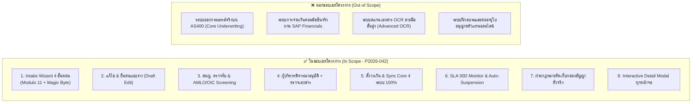
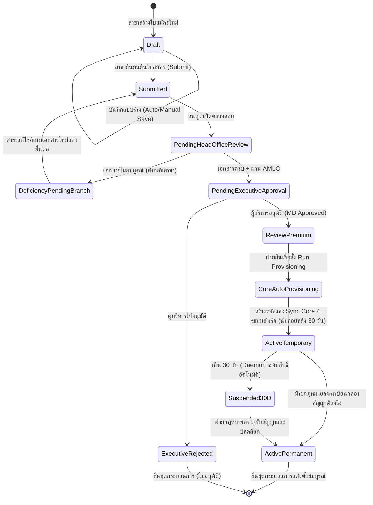
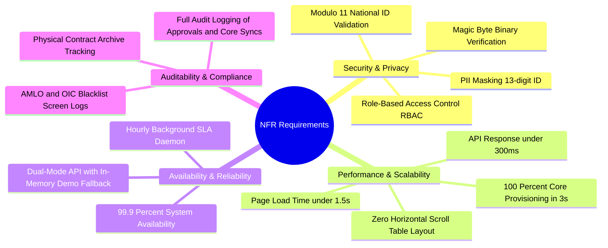

# เอกสารวิเคราะห์ระบบบริหารจัดการตัวแทนและนายหน้าประกันภัย — P2026-042

> สรุปและวิเคราะห์จาก **Software Requirement Specification: F-BP-004_P2026-042**  
> โครงการพัฒนาระบบบริหารจัดการตัวแทนและนายหน้าประกันภัยแบบเบ็ดเสร็จ (Managed Agent & Broker Portal)  
> บริษัท เทเวศประกันภัย จำกัด (มหาชน) — Deves Insurance PCL.  
>  
> เอกสารนี้จัดทำขึ้นเพื่อใช้ **อธิบายภาพรวมระบบ / ใช้ในการพัฒนา (Design Gate & Construction) / และใช้เป็นฐานในการวิเคราะห์และออกแบบการทดสอบ (SIT/UAT Test Scenarios)**  
> เวอร์ชันเอกสารอ้างอิง: 1.0.0 (30 สิงหาคม 2569)  
> จัดทำโดย: ทีมวิเคราะห์ระบบ (Business Analyst) ร่วมกับทีมสถาปัตยกรรมระบบ (System Architecture)

---

## สารบัญ

1. [ภาพรวมและวัตถุประสงค์](#1-ภาพรวมและวัตถุประสงค์)
2. [ขอบเขตงาน (Scope of Work)](#2-ขอบเขตงาน-scope-of-work)
3. [บทบาทผู้ใช้และสิทธิ์การเข้าถึง (Roles & Permissions)](#3-บทบาทผู้ใช้และสิทธิ์การเข้าถึง-roles--permissions)
4. [Use Case ภาพรวม และกระบวนการหลัก End-to-End](#4-use-case-ภาพรวม-และกระบวนการหลัก-end-to-end)
5. [สถานะเอกสารและการเปลี่ยนสถานะ (State Machines)](#5-สถานะเอกสารและการเปลี่ยนสถานะ-state-machines)
6. [รายละเอียดข้อกำหนดฟังก์ชันรายหน้าจอ (Functional Specifications)](#6-รายละเอียดข้อกำหนดฟังก์ชันรายหน้าจอ-functional-specifications)
7. [กฎการตรวจสอบความถูกต้องของข้อมูล (Validation Rules)](#7-กฎการตรวจสอบความถูกต้องของข้อมูล-validation-rules)
8. [แบบจำลองข้อมูล (Data Model / ER Diagram)](#8-แบบจำลองข้อมูล-data-model--er-diagram)
9. [Business Rules Catalog (สำหรับทดสอบ SIT / UAT)](#9-business-rules-catalog-สำหรับทดสอบ-sit--uat)
10. [Non-Functional Requirements (NFR)](#10-non-functional-requirements-nfr)
11. [ข้อกำหนดด้านการคุ้มครองข้อมูลส่วนบุคคล (PDPA Consideration)](#11-ข้อกำหนดด้านการคุ้มครองข้อมูลส่วนบุคคล-pdpa-consideration)
12. [แผนบริหารจัดการความเสี่ยง (Risk Management Plan)](#12-แผนบริหารจัดการความเสี่ยง-risk-management-plan)
13. [ประเด็นคงค้างและข้อกำหนดที่ต้องยืนยัน (Open Issues)](#13-ประเด็นคงค้างและข้อกำหนดที่ต้องยืนยัน-open-issues)
14. [แนวทางการทดสอบและเมทริกซ์ความครอบคลุม (Test Strategy & Traceability)](#14-แนวทางการทดสอบและเมทริกซ์ความครอบคลุม-test-strategy--traceability)

---

## 1. ภาพรวมและวัตถุประสงค์

### 1.1 ที่มาและปัญหาของกระบวนการเดิม (As-Is Problem Statement)
ในปัจจุบัน กระบวนการแต่งตั้งตัวแทนและนายหน้าประกันภัยของบริษัท เทเวศประกันภัย จำกัด (มหาชน) ยังพึ่งพากระบวนการแบบกระดาษและการส่งเอกสารอนุมัติผ่านระบบ EAS เดิม ซึ่งพบปัญหาสำคัญดังนี้:
1. **กระบวนการล่าช้าและคีย์ข้อมูลซ้ำซ้อน (High Manual Overhead):** สาขาต้องจัดเตรียมเอกสารกระดาษและส่งทางไปรษณีย์เข้ามายังสำนักงานใหญ่ เมื่อได้รับอนุมัติ เจ้าหน้าที่สินเชื่อต้องทำการบันทึกข้อมูลซ้ำซ้อนลงในระบบ Core System ถึง 4 ระบบ ได้แก่ AS400, APAR, SAP และ PCSDIS
2. **ความเสี่ยงด้าน Compliance & Sanctions:** การตรวจสอบรายชื่อผู้ถูกกำหนดตามกฎหมายป้องกันและปราบปรามการฟอกเงิน (AMLO) และรายชื่อเพิกถอนใบอนุญาตของสำนักงาน คปภ. (OIC Blacklist) ยังทำแบบ Manual ขาดการบันทึก Audit Trail ที่แม่นยำ
3. **การละเลยการส่งเอกสารสัญญาฉบับจริง (Physical Contract SLA Breach):** ตัวแทนเริ่มออกกรมธรรม์ได้ทันทีหลังได้รับรหัสชั่วคราว แต่สาขามักไม่จัดส่งสัญญาฉบับจริงพร้อมเอกสารค้ำประกันเข้าจัดเก็บที่ฝ่ายกฎหมายภายใน 30 วัน ทำให้บริษัทแบกรับความเสี่ยงทางกฎหมาย
4. **ความไม่ปลอดภัยของไฟล์เอกสาร (Magic Byte Security Vulnerability):** การแนบไฟล์รูปถ่ายและ PDF ในระบบเดิมตรวจสอบเพียงนามสกุลไฟล์ (`.pdf`, `.jpg`) แต่ไม่ได้ตรวจสอบลายเซ็นไบนารี (Magic Byte) ทำให้เสี่ยงต่อการถูกแทรกแซงหรือแนบไฟล์ไม่ปลอดภัย

### 1.2 วัตถุประสงค์ของระบบใหม่ (To-Be Objectives)

| # | วัตถุประสงค์ | ความหมายเชิงระบบและการวัดผล |
|---|-------------|---------------------------|
| 1 | **Digital Application Intake Wizard** | พัฒนาระบบกรอกใบสมัคร 4 ขั้นตอน ตรวจสอบความถูกต้องของเลขบัตร ปชช. ด้วยอัลกอริทึม Modulo 11 ทันที และตรวจสอบความถูกต้องของไฟล์แนบด้วย Magic Byte (Header Signatures) |
| 2 | **Automated Compliance Screening** | ตรวจคัดกรอง Sanctions (AMLO/OIC) และตรวจสอบเงื่อนไขความเสี่ยง PEP (บุคคลที่มีสถานะทางการเมือง) อัตโนมัติก่อนส่งต่อผู้บริหาร |
| 3 | **All-in-One Executive Approval (E-Approval)** | รวมศูนย์การพิจารณาอนุมัติของผู้บริหาร (MD) บนหน้าจอเดียว แสดงข้อมูลประวัติ เงื่อนไขสินเชื่อ ผล AMLO และเอกสารประกอบการอนุมัติครบถ้วนพร้อมปุ่มเปิดดูเอกสารแบบ 1-Click |
| 4 | **100% Core Auto-Provisioning** | สร้าง Agent Code และ Source Code ผ่าน Deves Master และเชื่อมต่อส่งข้อมูล (Data Sync) ไปยัง AS400, APAR, SAP, PCSDIS อัตโนมัติ 100% ทันทีที่ฝ่ายสินเชื่อกดยืนยัน |
| 5 | **SLA 30-Day Auto-Suspension Mechanism** | ระบบนับถอยหลัง SLA 30 วันสำหรับสถานะ Active Temporary และมี Background Daemon ตรวจสอบระงับสิทธิ์ชั่วคราว (Suspended 30D) อัตโนมัติหากยังไม่จัดเก็บสัญญาฉบับจริง |
| 6 | **Legal Physical Contract Archiving** | ฝ่ายกฎหมายตรวจรับสัญญาตัวจริงและบันทึกหมายเลขกล่องจัดเก็บ (Archive Box) เพื่อปลดล็อกสถานะเป็น Active Permanent อย่างสมบูรณ์ |
| 7 | **Universal Design & Single-Screen Responsive Layout** | ออกแบบ UI/UX ตาม Deves Corporate Theme (สีกรมท่า `#012169` และสีเหลืองทอง `#FFCD00`) ตารางกระชับพอดีหน้าจอ ไร้ Scrollbar แนวนอน |

---

## 2. ขอบเขตงาน (Scope of Work)

### 2.1 รายการ Business Requirements (BR)

| BR ID | หัวข้อความต้องการ | รายละเอียดทางธุรกิจ | Priority |
|---|---|---|---|
| **BR-001** | **Application Intake & Validation** | สาขาสามารถสร้าง บันทึกแบบร่าง (Draft) และยื่นใบสมัครตัวแทน/โบรกเกอร์ (บุคคล/นิติบุคคล) พร้อมระบบตรวจสอบ Modulo 11 และ Magic Byte | High |
| **BR-002** | **Resume & Edit Draft Application** | ผู้ใช้สาขาสามารถเลือกใบสมัครสถานะ "แบบร่าง (Draft)" หรือ "ส่งกลับแก้ไข (Deficiency)" กลับมาแก้ไขข้อมูลเดิมและยื่นต่อได้ | High |
| **BR-003** | **HO Document Verification & AMLO Screening** | สำนักงานใหญ่ตรวจรับเอกสาร รันการคัดกรอง AMLO / OIC Sanctions และส่งกลับสาขาเพื่อแก้ไขข้อบกพร่อง (Deficiency Return) | High |
| **BR-004** | **Executive Decision & Document Inspection** | ผู้บริหาร (MD) สามารถตรวจสอบข้อมูลผู้สมัคร เงื่อนไขสินเชื่อ และเอกสารแนบทุกฉบับใน Modal เดียว ก่อนกดอนุมัติหรือปฏิเสธ | High |
| **BR-005** | **Credit Limit & Core Auto-Provisioning** | ฝ่ายสินเชื่อกำหนดวงเงินอนุมัติจริง อัตราคอมมิชชั่น และสั่งสร้าง Agent Code / Source Code พร้อมยิง Sync ข้อมูลไปยัง AS400, APAR, SAP, PCSDIS อัตโนมัติ | High |
| **BR-006** | **30-Day SLA Countdown & Active Temporary** | เมื่อสร้างรหัสสำเร็จ ระบบเปิดสิทธิ์ชั่วคราว (Active Temporary) พร้อมเริ่มนับถอยหลัง 30 วันสำหรับจัดส่งสัญญาตัวจริง | High |
| **BR-007** | **Background Auto-Suspension Daemon** | ระบบ Background Service ตรวจสอบทุกชั่วโมง หากเกิน 30 วันและยังไม่มีการจัดเก็บสัญญา จะปรับสถานะเป็น Suspended 30D อัตโนมัติ | High |
| **BR-008** | **Legal Physical Contract Archiving** | ฝ่ายกฎหมายตรวจรับเอกสารตัวจริง บันทึกหมายเลขกล่องจัดเก็บ และปลดล็อกสถานะเป็น Active Permanent ยกเลิกการระงับสิทธิ์ | High |
| **BR-009** | **Interactive Application Detail Modal** | ผู้ใช้ทุกบทบาทสามารถคลิกที่แถวรายการบนตารางเพื่อเปิดดูข้อมูลฉบับเต็มและตัวอย่างเอกสารแนบ (Quick Preview) ได้ทันที | High |
| **BR-010** | **Deves Corporate UI & Single-Screen Layout** | ตารางและหน้าจอทั้งหมดต้องแสดงผลพอดีหน้าจอ ไร้ Scrollbar แนวนอน ใช้ฟอนต์ Sarabun และโทนสีตามอัตลักษณ์ Deves | High |

### 2.2 In Scope vs Out of Scope

---

## 3. บทบาทผู้ใช้และสิทธิ์การเข้าถึง (Roles & Permissions)

### 3.1 ตารางกำหนดบทบาทผู้ใช้งาน (User Roles Definition)

| รหัสบทบาท | ชื่อบทบาท (ภาษาไทย) | ชื่อบทบาท (ภาษาอังกฤษ) | ขอบเขตข้อมูล (Data Scope) | หน้าที่และความรับผิดชอบหลัก |
|---|---|---|---|---|
| **ROLE-BR** | เจ้าหน้าที่สาขา | Branch Officer | เฉพาะสาขาตนเอง | กรอกใบสมัคร, อัปโหลดเอกสาร, บันทึกแบบร่าง, ติดตามสถานะ, แก้ไขข้อบกพร่องตามที่ สนญ. ส่งกลับ |
| **ROLE-HO** | เจ้าหน้าที่ตรวจรับ สนญ. | HO Compliance Reviewer | ทั้งบริษัท | ตรวจสอบเอกสารแนบ, รันการคัดกรอง AMLO/OIC, ส่งกลับสาขาแก้ไข (Deficiency), ส่งต่อผู้บริหาร |
| **ROLE-EX** | ผู้บริหาร / กรรมการผู้จัดการ | Executive / MD | ทั้งบริษัท | ตรวจสอบเอกสารประกอบการอนุมัติ, ตรวจสอบ PEP Flag, ลงนามอนุมัติหรือปฏิเสธใบสมัคร |
| **ROLE-CR** | เจ้าหน้าที่สินเชื่อ | Credit & Finance Officer | ทั้งบริษัท | กำหนดวงเงินสินเชื่อที่อนุมัติจริง, กำหนดอัตราคอมมิชชั่น, รัน 100% Core Auto-Provisioning |
| **ROLE-LG** | เจ้าหน้าที่ฝ่ายกฎหมาย | Legal & Archive Officer | ทั้งบริษัท | ตรวจรับเอกสารสัญญาและหนังสือค้ำประกันฉบับจริง, ลงทะเบียนหมายเลขกล่องจัดเก็บ, ปลดล็อกสิทธิ์ถาวร |
| **ROLE-AD** | ผู้ดูแลระบบ | System Administrator | ทั้งบริษัท | ดูแล SLA Monitoring Dashboard, ตรวจสอบสถานะ Background Daemon, จัดการสิทธิ์ผู้ใช้งาน |

### 3.2 เมทริกซ์สิทธิ์การใช้งานตามบทบาท (Role-Permission Matrix)

| หน้าจอ / ฟังก์ชันการทำงาน | Branch | HO Reviewer | Executive (MD) | Credit | Legal | Admin |
|---|:---:|:---:|:---:|:---:|:---:|:---:|
| **Dashboard ภาพรวมระบบ (`/`)** | View (สาขา) | View (ทั้งหมด) | View (ทั้งหมด) | View (ทั้งหมด) | View (ทั้งหมด) | View (ทั้งหมด) |
| **สร้าง / แก้ไขแบบร่าง (`/intake/new`)** | **Full** | View Only | View Only | View Only | View Only | View Only |
| **สนญ. ตรวจรับ & AMLO (`/review`)** | - | **Full** | View Only | View Only | View Only | View Only |
| **ผู้บริหารพิจารณาอนุมัติ (`/approval`)** | - | - | **Full** | View Only | View Only | View Only |
| **ตั้งวงเงิน & ยิง Core (`/provisioning`)** | - | - | - | **Full** | View Only | View Only |
| **จัดเก็บเอกสารสัญญาตัวจริง (`/archive`)** | - | - | - | - | **Full** | View Only |
| **SLA Monitoring Dashboard (`/sla-dashboard`)** | View Only | View Only | View Only | View Only | View Only | **Full** |
| **คลิกดูรายละเอียดฉบับเต็ม (Detail Modal)** | ✅ ทุกบทบาท | ✅ ทุกบทบาท | ✅ ทุกบทบาท | ✅ ทุกบทบาท | ✅ ทุกบทบาท | ✅ ทุกบทบาท |

---

## 4. Use Case ภาพรวม และกระบวนการหลัก End-to-End

### 4.1 แผนภาพลำดับขั้นตอนการทำงาน (End-to-End Sequence Diagram)

```mermaid
sequenceDiagram
    autonumber
    actor Branch as เจ้าหน้าที่สาขา (Branch)
    actor HO as ตรวจรับ สนญ. (HO Reviewer)
    actor MD as ผู้บริหาร (Managing Director)
    actor Credit as เจ้าหน้าที่สินเชื่อ (Credit)
    actor Legal as เจ้าหน้าที่กฎหมาย (Legal)
    participant Portal as Agent Broker Portal
    participant Daemon as SLA Background Daemon
    participant Core as Deves Core Systems (AS400/APAR/SAP/PCSDIS)

    Note over Branch, Portal: ขั้นตอนที่ 1: การยื่นใบสมัคร (Application Intake)
    Branch->>Portal: กรอกข้อมูลผู้สมัคร + ผู้ค้ำ + หลักทรัพย์ + แนบไฟล์ (Magic Byte)
    alt ต้องการบันทึกไว้ก่อน
        Branch->>Portal: บันทึกแบบร่าง (Draft) -> กลับมาแก้ไขและยื่นต่อได้
    else พร้อมยื่นใบสมัคร
        Branch->>Portal: ยื่นใบสมัคร (Submit) -> สถานะเปลี่ยนเป็น Submitted
    end

    Note over HO, Portal: ขั้นตอนที่ 2: ตรวจรับเอกสาร & คัดกรอง Sanctions (HO Review)
    HO->>Portal: ตรวจสอบความถูกต้องเอกสาร + รัน AMLO/OIC Screening
    alt เอกสารไม่ครบถ้วน
        HO->>Portal: ส่งกลับสาขาแก้ไข (Deficiency) -> แจ้งเตือนสาขาเพื่อแนบเอกสารใหม่
    else เอกสารครบถ้วน & ผ่าน Sanctions
        HO->>Portal: ส่งต่อผู้บริหาร (Forward to MD) -> สถานะ PendingExecutiveApproval
    end

    Note over MD, Portal: ขั้นตอนที่ 3: ผู้บริหารพิจารณาอนุมัติ (Executive Approval)
    MD->>Portal: เปิดดูข้อมูลผู้สมัคร + เอกสารแนบ (1-Click Preview) + ระบุความเห็น
    alt ไม่อนุมัติ
        MD->>Portal: ปฏิเสธใบสมัคร (Reject) -> สถานะ ExecutiveRejected
    else อนุมัติ
        MD->>Portal: อนุมัติใบสมัคร (Approve) -> สถานะ ReviewPremium
    end

    Note over Credit, Core: ขั้นตอนที่ 4: กำหนดวงเงิน & Core Auto-Provisioning
    Credit->>Portal: กำหนดวงเงินอนุมัติจริง + % คอมมิชชั่น + สั่ง Provisioning
    Portal->>Core: สร้าง Agent Code/Source Code และ Sync ข้อมูลไปยัง AS400, APAR, SAP, PCSDIS
    Core-->>Portal: ยืนยัน Sync สำเร็จ 100%
    Portal->>Portal: ปรับสถานะเป็น ActiveTemporary (เริ่มนับถอยหลัง 30 วัน SLA)

    Note over Daemon, Legal: ขั้นตอนที่ 5: การติดตาม SLA & จัดเก็บสัญญาตัวจริง
    alt เกิน 30 วันยังไม่ส่งสัญญาตัวจริง
        Daemon->>Portal: ตรวจพบ SLA Breach -> ปรับสถานะเป็น Suspended30D อัตโนมัติ
    else สาขาส่งสัญญาฉบับจริงถึงสำนักงานใหญ่
        Legal->>Portal: ตรวจรับสัญญาตัวจริง + บันทึกหมายเลขกล่อง (Archive Box Number)
        Portal->>Portal: ปรับสถานะเป็น ActivePermanent (ปลดล็อก SLA ถาวร)
    end
```

---

## 5. สถานะเอกสารและการเปลี่ยนสถานะ (State Machines)

### 5.1 รายการสถานะเอกสารมาตรฐานในระบบ (11 Application Statuses)

| รหัสสถานะ (Status Enum) | ป้ายสถานะภาษาไทย | คำอธิบายความหมายเชิงธุรกิจ |
|---|---|---|
| `Draft` | **แบบร่าง** | ใบสมัครที่สาขากำลังกรอก ยังไม่ได้ส่งตรวจ สามารถแก้ไขและยื่นต่อได้ตลอดเวลา |
| `Submitted` | **ยื่นแล้ว** | สาขายื่นใบสมัครเรียบร้อยแล้ว อยู่ในคิวรอสำนักงานใหญ่ตรวจรับ |
| `PendingHeadOfficeReview` | **รอ สนญ. ตรวจ** | เจ้าหน้าที่ สนญ. กำลังตรวจสอบเอกสารและผล AMLO Sanctions |
| `DeficiencyPendingBranch` | **ส่งกลับแก้ไข** | เอกสารไม่ครบถ้วน สนญ. ส่งกลับให้สาขาแนบเอกสารเพิ่มเติม |
| `PendingExecutiveApproval` | **รอ MD อนุมัติ** | เอกสารผ่าน สนญ. แล้ว รอผู้บริหาร (MD) พิจารณาลงนามอนุมัติ |
| `ExecutiveRejected` | **ไม่อนุมัติ** | ผู้บริหารพิจารณาไม่อนุมัติการแต่งตั้งตัวแทน |
| `ReviewPremium` | **รอตั้งวงเงิน** | ผู้บริหารอนุมัติแล้ว รอฝ่ายสินเชื่อกำหนดวงเงินและรัน Provisioning |
| `CoreAutoProvisioning` | **กำลัง Sync Core** | ระบบกำลังสร้างรหัสและส่งข้อมูลไปยัง AS400, APAR, SAP, PCSDIS |
| `ActiveTemporary` | **Active ชั่วคราว (30D)** | สร้างรหัสสำเร็จ เริ่มออกกรมธรรม์ได้ พร้อมนับถอยหลัง 30 วันเพื่อส่งสัญญาตัวจริง |
| `Suspended30D` | **ระงับสิทธิ์ (SLA)** | พ้นกำหนด 30 วันแล้วยังไม่ได้รับสัญญาตัวจริง ระบบระงับสิทธิ์ออกงานอัตโนมัติ |
| `ActivePermanent` | **Active ถาวร** | ฝ่ายกฎหมายจัดเก็บสัญญาฉบับจริงเรียบร้อย ได้รับสิทธิ์ตัวแทนถาวร |

### 5.2 แผนภาพสถานะของใบสมัคร (Application State Transition Diagram)

---

## 6. รายละเอียดข้อกำหนดฟังก์ชันรายหน้าจอ (Functional Specifications)

### 6.1 หน้าจอเข้าสู่ระบบ & สลับบทบาททดสอบ (`/login`)
- **วัตถุประสงค์:** แสดงหน้า Login ตามอัตลักษณ์ Deves Corporate พร้อมระบบ 1-Click Quick Persona Switcher สำหรับการทดสอบ (UAT/Demo Mode)
- **องค์ประกอบหลัก:**
  - โลโก้และตราสัญลักษณ์บริษัท เทเวศประกันภัย จำกัด (มหาชน) สีกรมท่า-เหลืองทอง
  - การ์ดเลือกบทบาท 6 บทบาท (Branch, HO Reviewer, MD, Credit, Legal, Admin) พร้อมไอคอน Lucide ชัดเจน
  - จัดเก็บ Session ใน `localStorage` และสลับสิทธิ์การมองเห็นเมนูและข้อมูลทันที

### 6.2 หน้าจอ Dashboard ภาพรวมระบบ (`/`)
- **วัตถุประสงค์:** หน้าแรกของผู้ใช้งาน สรุปตัวชี้วัดสำคัญ คอนโซลตามสิทธิ์ และตารางรายการใบสมัครล่าสุด
- **องค์ประกอบหลัก:**
  - **4 SummaryCards สไตล์ Deves:** มีแถบสีซ้ายหนา 4px แสดงจำนวนใบสมัครทั้งหมด, Active Temporary, ใกล้ครบกำหนด (≤ 7 วัน), และ Active Permanent
  - **Role Consoles Grid:** การ์ดทางลัดเข้าสู่หน้าทำงานตามสิทธิ์ของผู้ใช้ที่เข้าสู่ระบบ
  - **ตารางรายการใบสมัครล่าสุด (Streamlined 5 Columns):**
    1. `เลขที่ใบสมัคร + วันที่ยื่น`
    2. `ชื่อผู้สมัคร / สาขาต้นสังกัด` (แสดง 2 บรรทัดในเซลล์เดียว)
    3. `รหัส Agent / Source Code` (หรือ SLA Countdown)
    4. `สถานะ` (ป้ายสถานะแบบย่อ กะทัดรัด)
    5. `การดำเนินการ` (ปุ่ม "แก้ไข / ยื่นต่อ" สำหรับแบบร่าง หรือปุ่ม "ดูข้อมูล")
  - **Universal Row Click:** คลิกแถวใดก็ได้เพื่อเปิด `ApplicationDetailModal` ดูรายละเอียดฉบับเต็มทันที

### 6.3 หน้าจอยื่นใบสมัครตัวแทนใหม่ (`/intake/new` และ `/intake/new?id=...`)
- **วัตถุประสงค์:** กรอกข้อมูลใบสมัคร 4 ขั้นตอน พร้อมความสามารถในการโหลดข้อมูลแบบร่างเดิมขึ้นมาแก้ไขและยื่นต่อ
- **ขั้นตอนการกรอก (4-Step Symmetrical Wizard):**
  - **Step 1: ข้อมูลผู้สมัคร (Applicant Profile):** เลือกประเภทบุคคล/นิติบุคคล, ตรวจสอบเลขบัตร ปชช. ด้วย Modulo 11 แบบ Real-time, ข้อมูลติดต่อ, บัญชีธนาคาร
  - **Step 2: ผู้ค้ำประกัน & วงเงิน (Guarantor, Collateral & Credit Terms):** ข้อมูลผู้ค้ำประกัน, ประเภทหลักทรัพย์ค้ำประกัน, วงเงินสินเชื่อที่ขอ, เทอมชำระเบี้ย Motor (15/30/31 วัน) และ Non-Motor (30/45/60 วัน)
  - **Step 3: อัปโหลดเอกสาร (Document Upload with Magic Byte):** Dropzone แนบเอกสาร ตรวจสอบลายเซ็นไบนารี (`%PDF-`, PNG, JPEG) ป้องกันไฟล์ปลอมแปลง
  - **Step 4: ตรวจสอบและยื่นใบสมัคร (Review & Submit):** สรุปข้อมูลทั้งหมด พร้อมปุ่ม "บันทึกแบบร่าง (Draft)" และปุ่ม "ยืนยันและยื่นใบสมัคร (Submit)"

### 6.4 หน้าจอสำนักงานใหญ่ตรวจรับ & AMLO (`/review`)
- **วัตถุประสงค์:** สำนักงานใหญ่ตรวจสอบความถูกต้องของเอกสารและรันคัดกรอง Sanctions
- **ฟังก์ชันสำคัญ:**
  - ปุ่มรัน **AMLO & OIC Screening** เพื่อตรวจเช็กรายชื่อผู้ถูกกำหนดและประวัติเพิกถอนใบอนุญาต
  - ปุ่ม **"ส่งกลับสาขาแก้ไข (Deficiency)"** พร้อมกล่องระบุหมายเหตุ เพื่อแจ้งเตือนให้สาขาแนบเอกสารใหม่
  - ปุ่ม **"ส่งต่อผู้บริหารอนุมัติ (Forward to MD)"** เมื่อเอกสารครบถ้วนและผ่านเกณฑ์

### 6.5 หน้าจอผู้บริหารพิจารณาอนุมัติ (`/approval`)
- **วัตถุประสงค์:** ผู้บริหาร (MD) ตรวจสอบข้อมูลและเอกสารแนบทุกฉบับก่อนลงนามอนุมัติหรือปฏิเสธ
- **ฟังก์ชันสำคัญ:**
  - ตาราง 5 คอลัมน์กว้างพอดีหน้าจอ พร้อมป้าย `PEP / ระดับ MD` แสดงข้างชื่อผู้สมัครอย่างชัดเจน
  - ปุ่มเดี่ยว **"พิจารณาอนุมัติ"** เปิดหน้าต่าง **All-in-One Decision & Inspection Modal**:
    - แสดงข้อมูลประวัติผู้สมัคร และวงเงินสินเชื่อที่ขออนุมัติ
    - แสดงผลคัดกรอง Sanctions (AMLO / OIC / PEP)
    - แสดง **รายการเอกสารแนบประกอบการพิจารณา** พร้อมปุ่ม **"เปิดดูเอกสาร (Quick Preview)"** เพื่อเปิดดูตัวอย่างเอกสารจริงได้ทันที
    - ช่องระบุความเห็นของผู้บริหาร (Executive Remarks)
    - ปุ่มกดตัดสินใจ: **"ไม่อนุมัติ (Reject)"** และ **"อนุมัติใบสมัคร (Approve)"**

### 6.6 หน้าจอกำหนดวงเงินและ Core Auto-Provisioning (`/provisioning`)
- **วัตถุประสงค์:** ฝ่ายสินเชื่อกำหนดวงเงินอนุมัติจริง และสั่งสร้างรหัสยิง Core 100%
- **ฟังก์ชันสำคัญ:**
  - กำหนดวงเงินสินเชื่อที่อนุมัติจริง (Approved Limit THB) และอัตราค่าคอมมิชชั่น (%)
  - รัน **100% Core Auto-Provisioning**: สร้าง Agent Code/Source Code และ Sync ข้อมูลไปยัง AS400, APAR, SAP, PCSDIS อัตโนมัติ พร้อมแสดงผลสถานะการเชื่อมต่อ

### 6.7 หน้าจอฝ่ายกฎหมายจัดเก็บเอกสารสัญญาตัวจริง (`/archive`)
- **วัตถุประสงค์:** ฝ่ายกฎหมายตรวจรับสัญญาฉบับจริงและหนังสือค้ำประกันเข้าคลัง
- **ฟังก์ชันสำคัญ:**
  - บันทึกหมายเลขกล่องจัดเก็บเอกสาร (Archive Box Number) เช่น `BOX-2026-HQ-001`
  - บันทึกผลการตรวจรับของเจ้าหน้าที่กฎหมาย (Auditor Notes)
  - อัปเกรดสถานะเป็น **Active Permanent** ปลดล็อกการนับถอยหลัง 30 วัน SLA ทันที

### 6.8 หน้าจอ SLA Dashboard & Monitoring (`/sla-dashboard`)
- **วัตถุประสงค์:** ติดตามสถานะ SLA 30 วัน และตรวจสอบการทำงานของ Background Suspension Daemon
- **ฟังก์ชันสำคัญ:**
  - แสดงป้ายสถานะการทำงานของ `SlaSuspensionDaemon: Active (Hourly)`
  - สรุปตัวเลขกลุ่ม Active Temporary, ใกล้ครบกำหนด 7 วัน, และกลุ่มที่ถูกระงับสิทธิ์ (Suspended 30D)
  - ตารางแสดง SLA Countdown และ Deadlines รายสัญญา

---

## 7. กฎการตรวจสอบความถูกต้องของข้อมูล (Validation Rules)

| Validation ID | ฟิลด์ / ข้อมูลที่ตรวจสอบ | กฎและเงื่อนไขการตรวจสอบ (Condition) | ข้อความแจ้งเตือน (Error Message) | ความรุนแรง |
|---|---|---|---|:---:|
| **VAL-001** | เลขประจำตัวประชาชน 13 หลัก | ตรวจสอบรูปแบบ 13 หลัก และคำนวณ Checksum ด้วยอัลกอริทึม **Modulo 11** | `เลขประจำตัวประชาชนไม่ถูกต้องตามรูปแบบกรมการปกครอง (Modulo 11 Failed)` | Critical (Error) |
| **VAL-002** | เลขประจำตัวผู้เสียภาษี (นิติบุคคล) | ตัวเลข 13 หลักขึ้นต้นด้วย 0 และความยาวครบ 13 หลัก | `เลขทะเบียนนิติบุคคลต้องเป็นตัวเลข 13 หลัก` | Critical (Error) |
| **VAL-003** | ลายเซ็นไบนารีของไฟล์ (Magic Byte) | ไบนารี 4-8 ไบต์แรกของไฟล์ต้องตรงกับ Header Signature: - PDF: `%PDF-` (`0x25 0x50 0x44 0x46`) - PNG: `0x89 0x50 0x4E 0x47` - JPEG: `0xFF 0xD8 0xFF` | `ไฟล์ไม่อยู่ในรูปแบบที่ปลอดภัยหรือลายเซ็นไบนารีไม่ถูกต้อง (Magic Byte Mismatch)` | Critical (Block Upload) |
| **VAL-004** | ขนาดไฟล์เอกสารแนบ | ขนาดไฟล์แต่ละฉบับต้องไม่เกิน **10 MB** | `ขนาดไฟล์เกินขีดจำกัดสูงสุด 10 MB ต่อฉบับ` | Warning (Error) |
| **VAL-005** | เอกสารบังคับตามประเภท | - บุคคลธรรมดา: สำเนาบัตร ปชช., หน้าสมุดบัญชี - มีผู้ค้ำประกัน: หนังสือสัญญาค้ำประกัน - มีหลักทรัพย์: เอกสารสิทธิ์หลักทรัพย์ | `กรุณาแนบเอกสารบังคับให้ครบถ้วนก่อนยื่นใบสมัคร` | Critical (Error) |
| **VAL-006** | วงเงินสินเชื่อที่ขออนุมัติ | ตัวเลขจำนวนเต็มบวก ขั้นต่ำ 50,000 บาท สูงสุด 50,000,000 บาท | `วงเงินสินเชื่อต้องอยู่ระหว่าง 50,000 ถึง 50,000,000 บาท` | Warning |
| **VAL-007** | เกณฑ์บังคับระดับผู้บริหาร (PEP Flag) | หากวงเงิน > 1,000,000 บาท หรือผลตรวจ AMLO พบสถานะ PEP | `เคสนี้ต้องได้รับการพิจารณาอนุมัติโดยกรรมการผู้จัดการ (MD) เท่านั้น` | Informational |
| **VAL-008** | ความสูง Form Input & Dropdown | ช่อง `<input>`, `<select>`, `<textarea>` ทุกช่องต้องมีความสูงมาตรฐาน **42px** | Enforced by CSS `.deves-input` | UI Standard |

---

## 8. แบบจำลองข้อมูล (Data Model / ER Diagram)

```mermaid
erDiagram
    AGENT_APPLICATION ||--|| AGENT_PROFILE : "has profile"
    AGENT_APPLICATION ||--o| GUARANTOR : "has guarantor"
    AGENT_APPLICATION ||--o| COLLATERAL : "has collateral"
    AGENT_APPLICATION ||--o{ ATTACHMENT : "contains files"
    AGENT_APPLICATION ||--o| COMPLIANCE_RECORD : "screened by"
    AGENT_APPLICATION ||--o{ CORE_SYNC_TRANSACTION : "synced to core"
    AGENT_APPLICATION ||--o| PHYSICAL_CONTRACT_RECORD : "archived by legal"

    AGENT_APPLICATION {
        string id PK
        string application_number UK "APP-YYYYMMDD-XXXX"
        string agent_type "Individual | Corporate"
        string branch_code "001..004"
        string branch_name
        string status "Draft | Submitted | PendingMD | ActiveTemp | ActivePerm..."
        decimal requested_credit_limit
        decimal approved_credit_limit
        decimal commission_percentage
        int payment_term_motor_days "15 | 30 | 31"
        int payment_term_non_motor_days "30 | 45 | 60"
        string agent_code "AG2026XXXXX"
        string source_code "SRC-BXXX-XXXX"
        datetime sla_30day_deadline
        datetime created_at
        datetime updated_at
    }

    AGENT_PROFILE {
        string id PK
        string application_id FK
        string title_th
        string first_name_th
        string last_name_th
        string national_id_or_tax_id "13 digits (PII Masked)"
        string phone_number
        string email
        string bank_name
        string bank_account_number
        string license_number
    }

    GUARANTOR {
        string id PK
        string application_id FK
        string title_th
        string first_name_th
        string last_name_th
        string national_id "13 digits"
        string relationship
        string phone_number
    }

    COLLATERAL {
        string id PK
        string application_id FK
        string type "BankGuarantee | LandTitle | CashDeposit"
        string document_ref_number
        decimal appraised_value
    }

    ATTACHMENT {
        string id PK
        string application_id FK
        string file_name
        string content_type "application/pdf | image/jpeg"
        string document_type
        bigint file_size_bytes
        boolean magic_byte_verified
        datetime uploaded_at
    }

    COMPLIANCE_RECORD {
        string id PK
        string application_id FK
        string amlo_status "Clear | PepOrange | DesignatedSanction"
        string oic_blacklist_status "Clear | Found"
        boolean requires_director_approval
        datetime screened_at
        string screened_by
    }

    CORE_SYNC_TRANSACTION {
        string id PK
        string application_id FK
        string target_system "AS400 | APAR | SAP | PCSDIS"
        string status "Pending | Success | Failed"
        string system_record_id
        datetime completed_at
    }

    PHYSICAL_CONTRACT_RECORD {
        string id PK
        string application_id FK
        string status "Pending | Archived"
        string archive_box_number "BOX-YYYY-HQ-XXX"
        string legal_auditor_notes
        datetime received_at_legal_at
    }
```

---

## 9. Business Rules Catalog (สำหรับทดสอบ SIT / UAT)

| Rule ID | เงื่อนไขทางธุรกิจ (Business Condition) | ผลลัพธ์ที่ระบบต้องประมวลผล (System Action & Output) | HTTP Status / UI Effect |
|---|---|---|---|
| **BR-RULE-001** | บันทึกแบบร่าง (Draft) โดยยังกรอกข้อมูลไม่ครบถ้วน | อนุญาตให้บันทึกได้ โดยเก็บค่าลง Database/Local State เพื่อกลับมาแก้ไขต่อได้ | `200 OK` (Toast: บันทึกแบบร่างสำเร็จ) |
| **BR-RULE-002** | ยื่นใบสมัคร (Submit) โดยไม่ผ่าน Modulo 11 หรือขาดเอกสารบังคับ | บล็อกการยื่น แสดงข้อความเตือนสีแดงในฟิลด์ที่ผิดพลาด และไม่อนุญาตให้ไป Step 4 | `400 Bad Request` (Block Form) |
| **BR-RULE-003** | อัปโหลดไฟล์ที่มี Header ไม่ตรงตาม MIME Type จริง (เช่น Rename `.exe` เป็น `.pdf`) | ปฏิเสธไฟล์ทันที แสดงป้ายเตือน Magic Byte Invalid และไม่บันทึกลง Storage | `415 Unsupported Media Type` |
| **BR-RULE-004** | รัน Compliance Screening แล้วพบผล PEP Match หรือวงเงินเกิน 1,000,000 บาท | กำหนด Flag `requiresDirectorApproval = true` และติดป้าย `PEP / ระดับ MD` | `200 OK` (Badge แสดงในคิวอนุมัติ) |
| **BR-RULE-005** | ผู้บริหาร (MD) กดยืนยัน "อนุมัติใบสมัคร" | ปรับสถานะเป็น `ReviewPremium` และส่ง Notification เข้าคิวฝ่ายสินเชื่อ | `200 OK` (Status: ReviewPremium) |
| **BR-RULE-006** | ฝ่ายสินเชื่อกดยืนยัน "ตั้งวงเงิน & ยิง Core" | สร้างรหัส Agent/Source และ Trigger การ Sync ไปยัง AS400, APAR, SAP, PCSDIS พร้อมปรับสถานะเป็น `ActiveTemporary` | `200 OK` (Status: ActiveTemporary) |
| **BR-RULE-007** | ใบสมัครอยู่ในสถานะ `ActiveTemporary` ครบ 30 วันโดยยังไม่มีบันทึกจัดเก็บสัญญา | SLA Suspension Daemon ตรวจพบและปรับสถานะเป็น `Suspended30D` อัตโนมัติ | Internal Daemon Background Event |
| **BR-RULE-008** | ฝ่ายกฎหมายบันทึกหมายเลขกล่องจัดเก็บเอกสารสัญญาตัวจริง | ปรับสถานะเป็น `ActivePermanent` ปลดล็อก SLA และยกเลิกการระงับสิทธิ์ชั่วคราว | `200 OK` (Status: ActivePermanent) |
| **BR-RULE-009** | ผู้ใช้คลิกที่แถวรายการในตารางของหน้าจอใดก็ตาม | เปิด Modal แสดงข้อมูลประวัติ เงื่อนไข ผลตรวจ และเอกสารแนบทุกฉบับทันที | UI Modal Popup Event |
| **BR-RULE-010** | สลับบทบาท (Persona Switching) ในหน้า `/login` | อัปเดตสิทธิ์การมองเห็นเมนู กรองข้อมูลตามสาขา/ฝ่าย และเปลี่ยน User Profile ใน Header ทันที | Client Auth State Update |

---

## 10. Non-Functional Requirements (NFR)

| NFR ID | มิติคุณภาพ | ข้อกำหนดเชิงเทคนิคและเกณฑ์มาตรฐาน |
|---|---|---|
| **NFR-SEC-01** | **Data Protection & PII Masking** | เลขบัตรประชาชน 13 หลัก และเลขบัญชีธนาคาร ต้องถูก Masking เป็น `X-XXXX-XXXXX-XX-X` บนหน้าจอปกติ โดยมีปุ่มรูปดวงตาสำหรับกดแสดงผลเฉพาะผู้มีสิทธิ์ |
| **NFR-SEC-02** | **File Upload Security** | ตรวจสอบ Magic Byte Signatures ที่ระดับ Server/Client ทุกไฟล์ เพื่อป้องกันการอัปโหลด Malicious Executable |
| **NFR-PERF-01** | **Rendering Performance** | หน้าจอ Dashboard และ Form Intake ต้องโหลดเสร็จสิ้นภายใน **1.5 วินาที** (First Contentful Paint < 1.0s) |
| **NFR-PERF-02** | **Core Provisioning Latency** | การสร้างรหัสและเชื่อมต่อ Sync ไปยัง 4 ระบบหลักต้องเสร็จสิ้นภายใน **3.0 วินาที** |
| **NFR-UI-01** | **Single-Screen Responsiveness** | ตารางทุกหน้าจอต้องจัดสัดส่วนความกว้าง Width 100% พอดีหน้าจอมาตรฐาน (1280px ขึ้นไป) โดยไม่มี Scrollbar แนวนอน |
| **NFR-REL-01** | **Dual-Mode Fallback Resilience** | ระบบต้องมี In-Memory Engine Fallback หากไม่สามารถเชื่อมต่อ Backend API ภายนอกได้ เพื่อให้การทำงานไม่หยุดชะงัก |

---

## 11. ข้อกำหนดด้านการคุ้มครองข้อมูลส่วนบุคคล (PDPA Consideration)

| ข้อมูลส่วนบุคคล (PII Field) | หน้าจอ / ตารางที่เกี่ยวข้อง | วัตถุประสงค์ในการจัดเก็บและใช้งาน | มาตรการควบคุมความปลอดภัย (Security Measure) |
|---|---|---|---|
| **เลขประจำตัวประชาชน 13 หลัก** | `/intake/new`, `/review`, `/approval` | ยืนยันตัวตนผู้สมัคร ตรวจสอบ AMLO Sanctions และทำสัญญาแต่งตั้ง | แสดงผลแบบ Masking `1-1004-XXXXX-XX-3` ซ่อนในตารางรายการ แสดงเฉพาะเมื่อเปิดดูรายละเอียด |
| **ข้อมูลผู้ค้ำประกัน (ชื่อ, บัตร ปชช., เบอร์โทร)** | Step 2 Wizard, Detail Modal | จัดทำสัญญาค้ำประกันความรับผิดชอบตามกฎหมาย | เข้ารหัสในฐานข้อมูล แสดงผลเฉพาะเจ้าหน้าที่สินเชื่อและผู้บริหาร |
| **เลขที่บัญชีธนาคารและหน้าสมุดบัญชี** | Step 1 Wizard, Detail Modal | โอนเงินผลประโยชน์และค่าคอมมิชชั่นตามสัญญา | ตรวจสอบสิทธิ์การเข้าถึง และซ่อนเลขบัญชีบางส่วนในหน้าทั่วไป |
| **บันทึกผลการคัดกรอง Sanctions (AMLO)** | `/review`, `/approval` | ปฏิบัติตาม พ.ร.บ. ป้องกันและปราบปรามการฟอกเงิน | จัดเก็บ Audit Log ว่าใครเป็นผู้รันและตรวจรับ พร้อมเวลาแบบ ISO 8601 |

---

## 12. แผนบริหารจัดการความเสี่ยง (Risk Management Plan)

| ลำดับ | รายการความเสี่ยง (Risk Description) | ผลกระทบ (Impact) | แผนการจัดการและบรรเทาความเสี่ยง (Mitigation Plan) |
|:---:|---|:---:|---|
| 1 | **Core System ใดระบบหนึ่ง Down ขณะ Provisioning** | High | ใช้ Transactional Sync พร้อมบันทึก Retry Queue หาก AS400 หรือ SAP ไม่ตอบสนอง สามารถกด Retry เฉพาะระบบที่ตกหล่นได้ |
| 2 | **สาขาไม่ส่งสัญญาฉบับจริงภายใน 30 วัน** | High | ระบบแจ้งเตือนล่วงหน้าเมื่อเหลือ ≤ 7 วัน และมี Background Daemon ทำการระงับสิทธิ์ชั่วคราวอัตโนมัติเมื่อครบ 30 วัน |
| 3 | **การแนบไฟล์ปลอมแปลงหรือมีไวรัสแฝง** | High | บังคับตรวจ Magic Byte Header Binary ทุกไฟล์ และจำกัดขนาดไม่เกิน 10 MB |
| 4 | **ข้อมูลรั่วไหลสู่ภายนอก (PII Data Breach)** | High | บังคับใช้ PII Masking บนหน้าจอรายการ และมีระบบ Audit Log บันทึกทุกครั้งที่มีการกดดูข้อมูลฉบับเต็ม |

---

## 13. ประเด็นคงค้างและข้อกำหนดที่ต้องยืนยัน (Open Issues)

| ลำดับ | ประเด็นที่ต้องยืนยัน (Open Issue) | ผู้เกี่ยวข้องที่ต้องยืนยัน | สถานะ | ข้อเสนอแนะเบื้องต้น |
|:---:|---|---|:---:|---|
| 1 | **รูปแบบการเชื่อมต่อ Core System AS400 ใน Production** | ทีม Core AS400 / Infra | In Progress | เบื้องต้นผ่าน REST/MQ Wrapper Gateway และมี Mock Engine รองรับช่วงทดสอบ SIT |
| 2 | **นโยบายการขยายเวลา SLA ผ่อนผันเกิน 30 วัน (SLA Extension)** | ฝ่ายกฎหมาย / ผู้บริหาร | Open | ควรมีสิทธิ์เฉพาะระดับ MD ในการกดขยายเวลาผ่อนผันเพิ่มอีก 15 วันในกรณีจำเป็น |
| 3 | **การเชื่อมต่อ API รายชื่อผู้ถูกกำหนด AMLO แบบ Online จริง** | ฝ่าย Compliance / AMLO | Open | ปัจจุบันใช้ In-Memory Sanction Engine จำลองผลตรวจ สามารถสลับใช้ API Gateway จริงได้ทันที |

---

## 14. แนวทางการทดสอบและเมทริกซ์ความครอบคลุม (Test Strategy & Traceability)

| BR ID | ขอบเขตการทดสอบ (Test Area) | กรณีทดสอบปกติ (Happy Path) | กรณีทดสอบผิดพลาด / ขอบเขต (Negative & Boundary) |
|---|---|---|---|
| **BR-001** | Application Intake Wizard | กรอกข้อมูลครบถ้วน, เลขบัตร ปชช. ถูกต้องตาม Modulo 11, แนบไฟล์ PDF แท้ -> ยื่นใบสมัครสำเร็จ | กรอกเลขบัตรผิด Checksum, แนบไฟล์ `.exe` เปลี่ยนนามสกุล -> ระบบต้องบล็อกทันที |
| **BR-002** | Resume Draft Application | กดเลือกรายการแบบร่างจากหน้าแรก -> ข้อมูลเดิมโหลดครบถ้วน สามารถแก้ไขและยื่นต่อได้ | เปิดแก้ไขแบบร่างที่ถูกส่งต่อไปแล้ว -> ระบบต้องไม่อนุญาตให้แก้ไขทับ |
| **BR-003** | HO Review & AMLO Screening | สนญ. กดรัน AMLO Screening ผ่านเกณฑ์ -> ส่งต่อผู้บริหารสำเร็จ | พบรายชื่อติด Sanctions -> ระบบต้องแจ้งเตือนสีแดง และระบุในรายงาน |
| **BR-004** | Executive MD Approval | ผู้บริหารกดพิจารณาอนุมัติ -> ตรวจดูเอกสารแนบ (Preview) ได้ครบ และกดอนุมัติสำเร็จ | ผู้บริหารกดปฏิเสธพร้อมระบุเหตุผล -> สถานะต้องเปลี่ยนเป็น `ExecutiveRejected` |
| **BR-005** | Core Provisioning 100% | ฝ่ายสินเชื่อตั้งวงเงินและกดยืนยัน -> สร้าง Agent/Source Code และ Sync 4 ระบบสำเร็จ | การเชื่อมต่อ SAP ล้มเหลว -> ระบบต้องแสดงสถานะ Failed เฉพาะ SAP และเปิดให้กด Retry |
| **BR-006** | 30-Day SLA Countdown | ใบสมัครที่ Provisioned แล้วต้องแสดงป้ายนับถอยหลัง 30 วันในตารางและ Dashboard | สัญญาที่เหลือ ≤ 7 วันต้องเปลี่ยนเป็นป้ายสีส้มเตือนเร่งรัด |
| **BR-007** | Auto-Suspension Daemon | สัญญาที่ครบ 30 วันแล้วยังไม่จัดเก็บ -> Daemon ต้องปรับสถานะเป็น `Suspended30D` | สัญญาที่จัดเก็บแล้วต้องไม่ถูกระงับสิทธิ์ |
| **BR-008** | Physical Contract Archiving | ฝ่ายกฎหมายระบุเลขกล่อง `BOX-2026-HQ-001` -> อัปเกรดเป็น `ActivePermanent` สำเร็จ | ไม่ระบุหมายเลขกล่อง -> ปุ่มกดยืนยันต้องถูก Disable |
| **BR-009** | Interactive Detail Modal | คลิกที่แถวรายการใดก็ได้ในตาราง -> หน้าต่างรายละเอียดฉบับเต็มและตัวอย่างเอกสารต้องเปิดขึ้นมา | ข้อมูลเลข 13 หลักต้องแสดงแบบ Masking และมีปุ่มเปิดดูได้ |
| **BR-010** | Single-Screen Responsive Layout | เปิดดูตารางทุกหน้าจอในขนาดหน้าจอ 1280px ขึ้นไป -> ต้องไม่มี Horizontal Scrollbar | ทดสอบบนทุกขนาดหน้าจอ ตารางต้องไม่ล้นขอบและตัวอักษรไม่ตกขอบซ้าย |

---

*เอกสารฉบับนี้ได้รับการจัดทำและทบทวนตามมาตรฐานการวิเคราะห์ระบบ F-BP-004 ของบริษัท เทเวศประกันภัย จำกัด (มหาชน)*
