# F-BP-009 ระบบจัดการตัวแทน/นายหน้า (Agent Management System) — Flow / Diagram

เอกสารชุดนี้เป็น Flow เพื่อสื่อสารกระบวนการดำเนินการชุดสัญญาตัวแทน/นายหน้า และการเปิดรหัส Agent/Source
ตั้งแต่สาขาสร้างรายการ จนถึงฝ่ายสำนักนิติกรรมอนุมัติและจัดเก็บเอกสาร รวมเส้นทางสั่งแก้ไข ไม่อนุมัติ
และการระงับรหัส Agent/Source อัตโนมัติตามกำหนดเวลา

**เวอร์ชันเอกสาร:** 2.0 — ปรับปรุงจากรอบแรกโดยอ้างอิง SRS ฉบับ Version 1.0.0 (Created 17 Oct 2025 / Last Updated 22 Oct 2025)

## ที่มาของข้อมูล

| แหล่ง | สถานะการอ่าน | การใช้งานในเอกสารนี้ |
|---|---|---|
| `SRS/F-BP-009 Agent Management System.docx` → `.kiro/tmp/F-BP-009_SRS.txt` | **อ่านได้แล้ว** (แปลงด้วย `textutil -convert txt`) | **แหล่งอ้างอิงหลัก** ของทุก Flow ในเอกสารนี้ |
| `detail/ระบบจัดการตัวแทนนายหน้า.drawio` | อ่านได้ครบ | ใช้ประกอบ/ตรวจสอบความสอดคล้อง (เป็นแหล่งหลักของเอกสารรอบก่อน) |
| `detail/F-BP-009 Agent Management System.doc`, `detail/*.pdf`, `detail/*.xlsx` | อ่านไม่ได้ (binary) | ไม่ได้ใช้ |

### ข้อจำกัดที่ยังเหลือของไฟล์ SRS ที่แปลงแล้ว

- **รูปภาพหายทั้งหมด** — `Figure 1 Business Process Diagram` (AS-IS), TO-BE Business Process Diagram และภาพหน้าจอทุกหน้า ไม่ปรากฏในไฟล์ข้อความ
- **Logic การสร้างเลขที่สัญญา** (SRS หัวข้อ 5.2 หน้าจอสร้างรายการ + BR ID_018) อยู่ในรูปภาพ/ตารางที่หายไป จึงยังไม่ทราบรูปแบบเลขสัญญา
- **หัวข้อ 5.3 Report / `Table 4 โครงสร้างรายงาน`** มีอยู่ในสารบัญ แต่ **ไม่มีเนื้อหาปรากฏ** ในไฟล์ข้อความ
- **หัวข้อ 2.2 ขอบเขตงานที่ยังไม่รวม** ใน SRS ยังเป็น placeholder `Insert Text` (ยังไม่ได้กรอก)
- ตารางถูกแปลงเป็นบรรทัดต่อเนื่อง จึงมีความเสี่ยงเรื่องการจับคู่คอลัมน์ — ตารางสถานะในเอกสารนี้ตีความจากลำดับบรรทัด และควรตรวจทานกับ SRS ตัวจริงอีกครั้ง

### การแยกข้อเท็จจริงกับข้อสมมติ

ทุกไดอะแกรมมีหมายเหตุกำกับใต้ภาพ โดยใช้เครื่องหมายดังนี้

- **[SRS]** = ข้อเท็จจริงที่ SRS ระบุไว้ตรง ๆ พร้อมอ้างหัวข้อ
- **[ตีความ]** = การตีความ/ข้อสมมติของผู้จัดทำ Flow เพื่อให้ไดอะแกรมเดินได้ครบเส้นทาง — **ต้องยืนยันก่อนใช้อ้างอิง**

---

## Business Requirements (ตาม SRS หัวข้อ 2.1)

SRS ใช้รูปแบบรหัสว่า `BR ID_001` … `BR ID_018` (ไม่ใช่ `BR-xx`) เอกสารนี้อ้างอิงตามรหัสจริง

| BR ID | Business Requirement | Priority | ใช้กำกับใน Flow ข้อ |
|---|---|---|---|
| BR ID_001 | ระบบ Monitor ติดตามสถานะของชุดสัญญา (ไฟล์) ตัวแทน/นายหน้า | High | 2, 4, 10 |
| BR ID_002 | ระบบ Monitor ติดตามสถานะของชุดสัญญา (ฉบับจริง) ตัวแทน/นายหน้า | High | 2, 5, 11 |
| BR ID_003 | ขั้นตอนการเก็บ Log Transaction เพื่อดูเรื่อง SLA | High | 8 (หมายเหตุ) |
| BR ID_004 | การเข้าใช้งานระบบสามารถใช้ได้เพียง AD User ภายใต้บริษัท | High | 3 |
| BR ID_005 | สามารถควบคุมสิทธิ์การเข้าถึงหน้าจอของฝ่ายต่าง ๆ ได้ | High | 3, ตารางสิทธิ์ |
| BR ID_006 | ระบบสามารถแนบไฟล์เอกสารชุดสัญญาได้ | High | 1 |
| BR ID_007 | เมื่อสั่งแก้เอกสาร ระบบรองรับให้ฝ่ายธุรกิจ (สาขา) แนบไฟล์เอกสารเพิ่มเติมได้ | High | 6 |
| BR ID_008 | เมื่อสั่งแก้เอกสาร ระบบรองรับให้ฝ่ายธุรกิจ (สนญ.) เพิ่มไฟล์เอกสารใหม่ได้ | High | 6 |
| BR ID_009 | รองรับการส่งเอกสารลงนามอิเล็กทรอนิกส์ | High | 7 |
| BR ID_010 | ระบบสามารถเลือกรายการเอกสารที่ต้องการแก้ไขได้ | High | 6 |
| BR ID_011 | รองรับการกรอกข้อมูลเพื่อตรวจสอบ ปปง. และสร้างรหัส Agent/Source | High | 1 |
| BR ID_012 | รองรับการเชื่อมการตรวจสอบ ปปง. ผ่านเว็บเซอร์วิส | High | 1 |
| BR ID_013 | รองรับการเชื่อมต่อการสร้างรหัส Agent/Source ผ่านเว็บเซอร์วิส | High | 4, 9 |
| BR ID_014 | ระบบสามารถสร้างรหัส Agent/Source ได้อัตโนมัติ | High | 4, 9, 12 |
| BR ID_015 | เปลี่ยน Flow จากการทำ Parallel เป็นผ่านการ Approve จากนิติกรรมก่อน จึงส่งต่อให้ IT ทำการสร้าง Agent Source | High | 9 (มีข้อขัดแย้ง — ดู Open Issue O-1) |
| BR ID_016 | เมื่อครบกำหนดระยะเวลาในการแก้ไขเอกสาร ให้ระบบระงับรหัส Agent/Source ได้อัตโนมัติ | High | 8, 12 |
| BR ID_017 | มีเมลแจ้งเตือนถึงทุกฝ่ายที่เกี่ยวข้องเมื่อฝ่ายนิติกรรมทำการ Approve หรือ Reject | High | 13 |
| BR ID_018 | Logic เลขที่สัญญา เป็นไปตามที่ฝ่ายสำนักนิติกรรมกำหนด | High | 1 |

> **การ map จากรอบก่อน:** รหัสชั่วคราว `BR-01`…`BR-12` ถูกยกเลิกทั้งหมดแล้ว
> `BR-01` → BR ID_011/012 (ตรวจ ปปง.) · `BR-02/04/06` → BR ID_010 (สั่งแก้ไข) · `BR-03` → ไม่มี BR รองรับโดยตรง (เป็นรายละเอียดหน้าจอ สนญ.)
> `BR-05` → BR ID_013/014 · `BR-08` → ไม่มี BR รองรับ (SRS 5.1 ข้อ 6.3 ตั้งค่ารหัส) · `BR-10` → SRS 5.1 ข้อ 3.3 · `BR-11/12` → BR ID_016

---

## Actor / Role (ตาม SRS หัวข้อ 5.2 หน้าจอเมนู Home)

SRS ระบุผู้ใช้งานหน้าจอ Home ไว้ 5 กลุ่ม คือ สาขาย่อยทั่วประเทศ / ฝ่ายธุรกิจ สนญ. / ฝ่ายบริหารจัดการเบี้ยประกันภัย / ฝ่ายสำนักนิติกรรม / ผู้ดูแลระบบ
ตารางด้านล่างเพิ่ม 2 actor ที่ปรากฏในกระบวนการตามหัวข้อ 5.1 แต่ **ไม่ได้อยู่ในรายการผู้ใช้งานหน้าจอ Home** คือ MD และ ผช.กจก./ผอ.ฝ่าย (ลงนามผ่านระบบ Approval ใน MS Teams)

| Actor | บทบาทตาม SRS |
|---|---|
| สาขาย่อยทั่วประเทศ (BU สาขา) | จัดทำชุดเอกสารสัญญา สแกนทั้งชุดเป็น 1 ไฟล์ ตรวจ ปปง. สร้างเลขที่ชุดสัญญา แนบลิงก์เอกสาร ส่งฉบับจริงทางไปรษณีย์ แนบเอกสารเพิ่มเติมเมื่อถูกสั่งแก้ไข |
| ฝ่ายธุรกิจ (สำนักงานใหญ่ / BU สนญ.) | ตรวจสอบรายการ ตรวจสอบเลขที่ใบอนุญาตและวันหมดอายุ จัดทำเอกสารเพิ่มเติม เพิ่มชุดสัญญาใหม่ สั่งแก้ไขไปสาขา ส่งอนุมัติ รับ/ตรวจฉบับจริง แจ้งรหัส Agent/Source ให้ตัวแทน |
| MD (กรรมการผู้จัดการ) | ลงนามอนุมัติ/ไม่อนุมัติเอกสารชุดสัญญาผ่านระบบ Approval |
| ฝ่ายบริหารจัดการเบี้ยประกันภัย (เบี้ย) | ตรวจสอบรายการ กรอก Credit Information เพิ่มชุดสัญญาใหม่ สั่งแก้ไขไป สนญ. ส่งอนุมัติ รับ/ตรวจฉบับจริง ตั้งค่ารหัส Agent/Source นำส่งรหัสให้ สนญ. |
| ฝ่ายสำนักนิติกรรมประกันภัย (นิติกรรม) | ตรวจสอบรายการ สั่งแก้ไขไป สนญ. อนุมัติเสร็จสิ้นรายการ จัดเก็บไฟล์ ทำบันทึกภายใน จัดเก็บฉบับจริงเพื่อตรวจสอบปีละ 1 ครั้ง |
| ผู้ช่วยกรรมการผู้จัดการ / ผู้อำนวยการฝ่าย | ลงนามอนุมัติเอกสารที่ฝ่ายเบี้ยเสนอ และลงนามชุดสัญญาฉบับจริงที่นิติกรรมเสนอ |
| ผู้ดูแลระบบ | ใช้งาน Admin Menu — ดู Access Log / Activities Log (NFR 021, NFR 022) |

> **หมายเหตุ [SRS]:** SRS หัวข้อ 1 PROJECT OBJECTIVE กล่าวถึง "ฝ่ายเทคโนโลยี" และ BR ID_015 กล่าวถึง "ส่งต่อให้ IT ทำการสร้าง Agent Source"
> แต่ในรายการผู้ใช้งานหน้าจอ Home **ไม่มี role ฝ่ายเทคโนโลยี/IT** → ดู Open Issue O-1

## สิทธิ์การใช้งานตามหน้าจอ (ตาม SRS หัวข้อ 5.2)

| หน้าจอ / ปุ่ม | สาขา | BU สนญ. | เบี้ย | นิติกรรม |
|---|---|---|---|---|
| หน้าจอสร้างรายการ (ตรวจ ปปง. + สร้างเลขสัญญา) | ✔ | – | – | – |
| ปุ่ม "แก้ไขรายการ" | ✔ | ✔ | – | – |
| ปุ่ม "แนบเอกสารเพิ่มเติม" ในหน้าจอรายการแก้ไข | ✔ | ✘ (SRS ระบุว่าไม่ได้รับสิทธิ์) | – | – |
| ปุ่ม "เพิ่มชุดสัญญาใหม่" (สร้าง Transaction ใหม่) | ✘ (SRS ระบุว่าไม่มีสิทธิ์) | ✔ | ✔ | – |
| ปุ่ม "สั่งแก้ไข" | – | ✔ ส่งถึงสาขา | ✔ ส่งถึง สนญ. | ✔ ส่งถึง สนญ. |
| ปุ่ม "ส่งอนุมัติ" | – | ✔ | ✔ | – |
| ปุ่ม "อนุมัติ" (ปิดรายการ) | – | – | – | ✔ |
| ปุ่ม "อัพเดตเอกสาร(ฉบับจริง)" | ✔ (BUBA) | ✔ (BUA, BUAC) | ✔ (ACCA, ACCC) | ✔ (LAWA, LAWC) |
| ตรวจสอบข้อมูลเลขที่ใบอนุญาต | – | ✔ | – | – |
| Credit Information | – | – | ✔ | – |

> **[SRS]** หัวข้อ 5.2 — หน้าจอรายละเอียดของรายการของแต่ละฝ่าย, หน้าต่างสั่งแก้ไขรายการ, หน้าจอส่งอนุมัติ, หน้าต่างอัพเดตสถานะเอกสารฉบับจริง
> **[SRS]** ขอบเขตการมองเห็นข้อมูล: "จำนวนรายการจะแสดงเพียงงานของสาขาตนเองหรือฝ่ายตนเองเท่านั้น" และคอลัมน์ `View` ในตารางสถานะกำหนดว่าแต่ละสถานะฝ่ายใดมองเห็นได้

---

## 1. Flow การสร้างรายการและตรวจสอบ ปปง. (สาขา)

จุดเริ่มของกระบวนการทั้งหมด ครอบคลุม validation การกรอกข้อมูล และเส้นทาง "เป็นผู้ถูกกำหนด" ที่ทำให้ไม่สามารถดำเนินการต่อได้

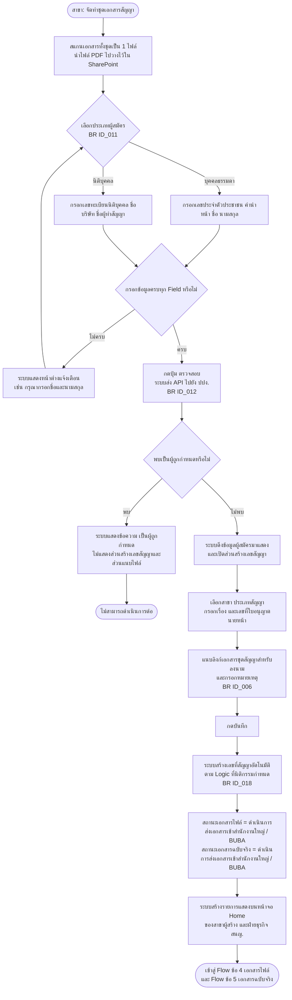

> **[SRS]** หัวข้อ 5.1 ข้อ 1 ขั้นตอนการทำงานฝ่ายธุรกิจ (สาขา) และหัวข้อ 5.2 หน้าจอสร้างรายการ (หมายเลข 1–3)
> **[SRS]** ประเภทสัญญามี 5 ประเภท: ตัวแทน / นายหน้าบุคคลธรรมดา / นายหน้านิติบุคคล / สำนักงาน–คณะบุคคล / สำหรับตัวแทน-นายหน้า กรมการขนส่งทางบก
> **[SRS]** เลขที่ใบอนุญาตนายหน้ากรอกเป็นตัวเลขเท่านั้น และต้องกรอกข้อมูลครบทุกช่อง
> **[ตีความ]** การกำหนดสถานะเริ่มต้นทั้งฝั่งไฟล์และฝั่งฉบับจริงเป็น `BUBA` พร้อมกัน — SRS ระบุว่า `BUBA` เป็นสถานะแรกของทั้งสองฝั่ง แต่ไม่ได้ระบุชัดว่าเซ็ตพร้อมกันตอนบันทึกรายการหรือไม่

---

## 2. ภาพรวม End-to-End (2 Track)

SRS แยกการติดตามสถานะเป็น 2 ชุดคือ **เอกสารไฟล์ (อิเล็กทรอนิกส์)** ตาม BR ID_001 และ **เอกสารฉบับจริง (กระดาษ)** ตาม BR ID_002
โดยเอกสารไฟล์เดินหน้าก่อน และรหัส Agent/Source จะ **ใช้งานได้จริงหลังเอกสารฉบับจริงมาถึงและฝ่ายเบี้ยตั้งค่ารหัสแล้ว**

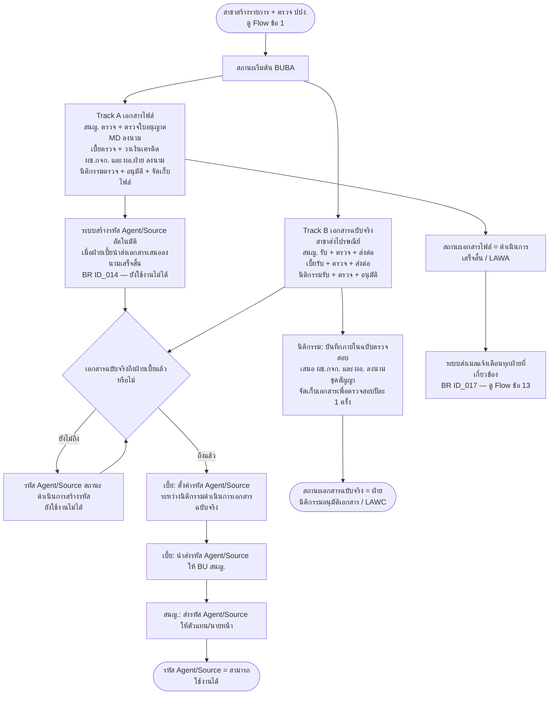

> **[SRS]** หัวข้อ 5.1 ข้อ 1–7 และหัวข้อ 5.2 หน้าจอรายละเอียดของรายการ (สถานะรหัส Agent/Source)
> **[SRS]** ข้อ 3.3: "เมื่อนำส่งเอกสารเสร็จสิ้นระบบสร้างรหัส Agent/Source อัตโนมัติแต่ยังไม่สามารถใช้งานได้จนกว่าเอกสาร(ฉบับจริง)จะมาถึง จึงดำเนินการตั้งค่ารหัส Agent/Source ได้"
> **[SRS]** ข้อ 6.3–6.4: ฝ่ายเบี้ยตั้งค่ารหัสระหว่างที่นิติกรรมดำเนินการเอกสารฉบับจริง แล้วนำส่งรหัสให้ สนญ. ส่งต่อตัวแทน
> **[ตีความ]** จุด join `Z4` (รอฉบับจริง) เป็นการวาดให้เห็นการบรรจบของสอง Track — SRS ไม่มีสถานะเฉพาะสำหรับ "รอเอกสารฉบับจริง" ในตารางสถานะ

---

## 3. Flow การเข้าสู่ระบบและควบคุมสิทธิ์

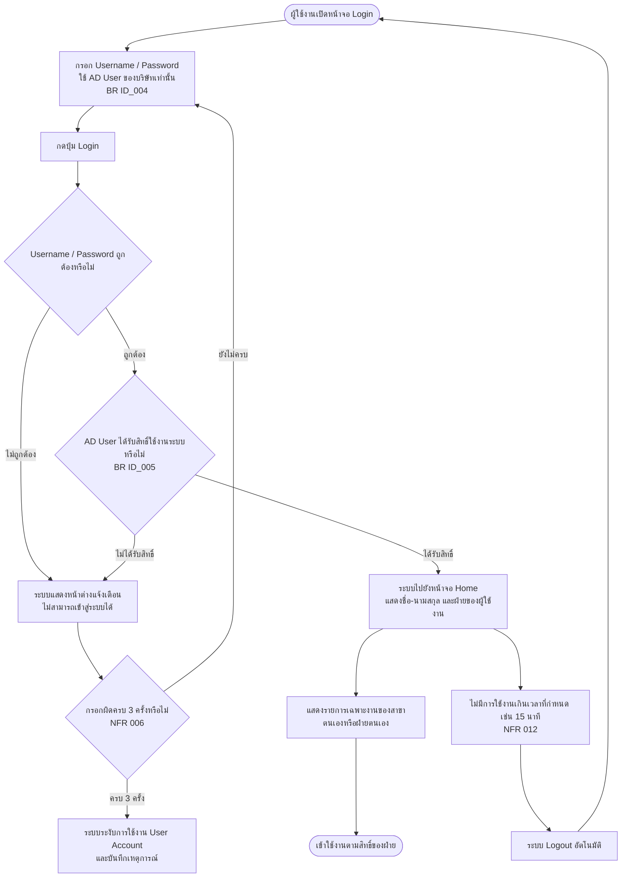

> **[SRS]** หัวข้อ 5.2 หน้าจอ Login และหน้าจอเมนู Home; NFR 004, NFR 006, NFR 010, NFR 012
> **[SRS]** ข้อความแจ้งเตือนเป็นข้อความเดียวกันทั้งกรณีไม่มีสิทธิ์และกรณีกรอก Username/Password ผิด คือ "ไม่สามารถเข้าสู่ระบบได้"

---

## 4. Track A — เอกสารไฟล์ (อิเล็กทรอนิกส์) พร้อมเส้นทางสั่งแก้ไขและไม่อนุมัติ

ครอบคลุมการตรวจ 3 จุด (สนญ. → เบี้ย → นิติกรรม), การลงนาม 2 ชั้น (MD และ ผช.กจก./ผอ.ฝ่าย)
และการตีกลับ (reject) ที่ **กลับเข้าฝ่ายเดิมที่สั่งแก้** ตามรหัสสถานะ BUAACC / BUAL

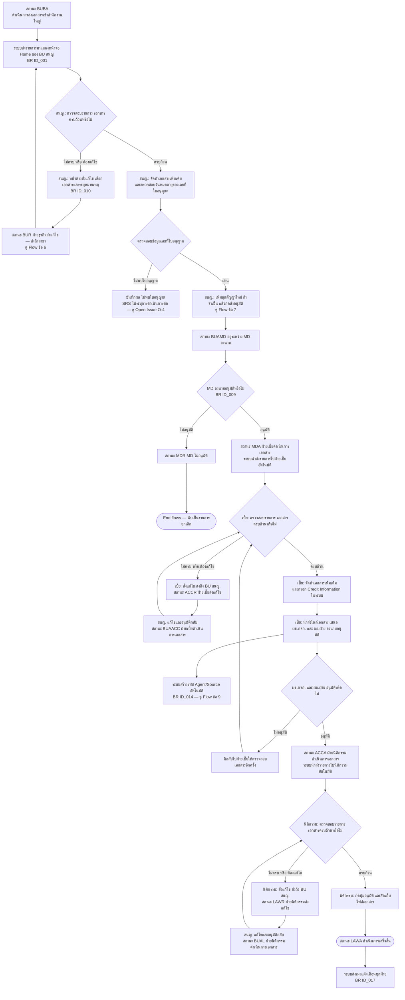

> **[SRS]** หัวข้อ 5.1 ข้อ 2 (สนญ.), ข้อ 3 (เบี้ย), ข้อ 4 (นิติกรรม) และตารางสถานะเอกสารไฟล์ในหัวข้อ 5.2 หน้าจอ Home
> **[SRS]** รหัสสถานะ `BUAACC` มี remark "Reject โดย เบี้ย" และ `BUAL` มี remark "Reject โดย นิติกรรม" → เมื่อ สนญ. แก้ไขแล้วอนุมัติกลับ งานจะกลับไปที่ **ฝ่ายที่สั่งแก้** ไม่ต้องเริ่มลงนาม MD ใหม่
> **[SRS]** `BUAMD` มี remark "Auto" → ระบบเปลี่ยนสถานะเป็น "อยู่ระหว่าง MD ลงนาม" อัตโนมัติเมื่อ สนญ. ส่งอนุมัติ
> **[SRS]** ข้อ 3.3 กรณีไม่อนุมัติ "รายการจะถูกตีกลับไปยังฝ่ายบริหารจัดการเบี้ยประกันภัย ให้ตรวจสอบเอกสารอีกครั้ง"
> **[ตีความ]** ลูป `A16 → A14` และ `A25 → A23` (กลับเข้าฝ่ายเดิม) อนุมานจากความหมายของ remark ในตารางสถานะ — SRS ไม่ได้เขียนเป็นประโยคบรรยาย

---

## 5. Track B — เอกสารฉบับจริง (กระดาษ)

สถานะฝั่งฉบับจริงเป็น **checklist แบบเรียงลำดับ** ผู้ใช้ติ๊ก Checkbox และกดบันทึกทีละสถานะ
สถานะถัดไปจะแสดงขึ้นเมื่อบันทึกสถานะก่อนหน้าเสร็จสิ้น และแต่ละฝ่ายอัพเดตได้เฉพาะสถานะของฝ่ายตนเอง

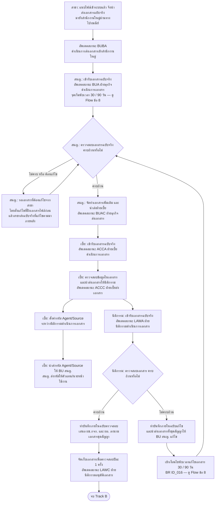

> **[SRS]** หัวข้อ 5.1 ข้อ 5 (สาขา + สนญ.), ข้อ 6 (เบี้ย), ข้อ 7 (นิติกรรม) และหัวข้อ 5.2 หน้าต่างอัพเดตสถานะของเอกสารฉบับจริง (ตาราง 7 สถานะ)
> **[SRS]** ข้อ 5.2: กรณีฉบับจริงไม่ครบ "จะเป็นการสั่งแก้ไขตั้งแต่การดำเนินการเอกสาร(ไฟล์) และนำส่งเอกสารที่แก้ไข(ฉบับจริง)ตามมาในภายหลัง"
> **⚠ ข้อสังเกตจาก SRS:** หัวข้อ 5.1 ข้อ 7.1 เขียนว่า "กรณีเอกสารครบถ้วน" **ซ้ำกัน 2 บรรทัด** โดยบรรทัดที่สองเป็นการทำบันทึกภายในฉบับแก้ไข ซึ่งตามบริบทควรเป็น "กรณีเอกสารไม่ครบถ้วน" → ดู Open Issue O-3
> **[ตีความ]** การผูก `H9` (ตั้งค่ารหัส) ไว้หลัง `ACCC` เพราะ SRS ข้อ 6.3 ระบุว่าทำ "ระหว่างฝ่ายสำนักนิติกรรมดำเนินการเอกสาร"

---

## 6. Flow การสั่งแก้ไขเอกสาร (Rework)

SRS ไม่ได้ใช้คำว่า "Reject Checklist" แต่ใช้ **หน้าต่างสั่งแก้ไขรายการ** ที่ให้เลือกชื่อเอกสารจาก Dropdown
(รายการฟอร์ม F-CM-005 … F-CM-049, QP-PR-016 และ "อื่นๆ") พร้อมกรอกหมายเหตุรายเอกสาร

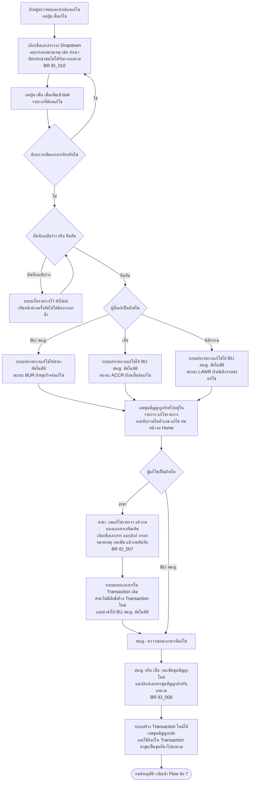

> **[SRS]** หัวข้อ 5.2 หน้าต่างสั่งแก้ไขรายการ, หน้าจอรายการแก้ไข (สำหรับสาขาทั่วประเทศ), หน้าจอแนบเอกสารเพิ่มเติม, หน้าจอเพิ่มชุดสัญญาใหม่
> **[SRS]** "ในกรณีของฝ่ายธุรกิจ(สาขา) ไม่มีสิทธิ์ในการเพิ่ม Transaction ใหม่ได้ จึงต้องแนบเอกสารใน Transaction เดิม" และ "หน้าจอรายการแก้ไข(สำหรับสำนักงานใหญ่) ไม่ได้รับสิทธิ์ในการใช้งานปุ่ม แนบเอกสารเพิ่มเติม"
> **[SRS]** ระบบดึง "ลิงก์เอกสารชุดสัญญาใน Transaction ล่าสุด" เป็นชุดสัญญาที่นำไปลงนามอนุมัติ

---

## 7. Sequence — การส่งอนุมัติและลงนามอิเล็กทรอนิกส์

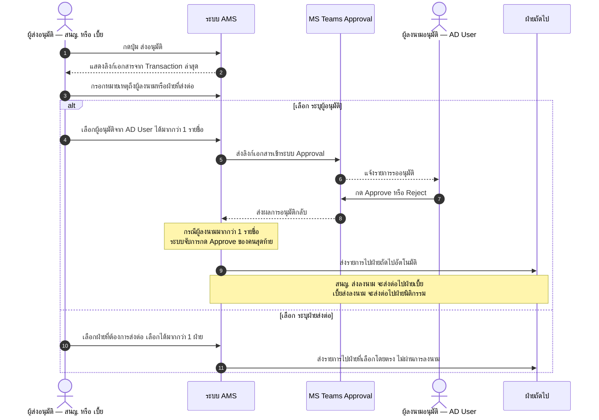

> **[SRS]** หัวข้อ 5.2 หน้าจอส่งอนุมัติ (หมายเลข 1–2) และ BR ID_009
> **[SRS]** Radio Box เลือกได้เพียงอย่างเดียวระหว่าง "ระบุผู้อนุมัติ" กับ "ระบุฝ่ายส่งต่อ"; Dropdown ระบุฝ่ายส่งต่อมีเฉพาะ ฝ่ายบริหารจัดการเบี้ยประกันภัย และฝ่ายสำนักนิติกรรมประกันภัย
> **[SRS]** ฝ่ายที่ได้รับสิทธิ์ส่งอนุมัติ ได้แก่ ฝ่ายธุรกิจ (สนญ.) และฝ่ายบริหารจัดการเบี้ยประกันภัย
> **[ตีความ]** เส้นทาง `Reject` จาก MS Teams Approval — SRS ระบุเฉพาะการจับปุ่ม Approve ไม่ได้อธิบายกลไกเมื่อผู้ลงนามกด Reject (ทราบเพียงว่ามีสถานะ MDR) → ดู Open Issue O-5

---

## 8. Flow การนับเวลาแก้ไขเอกสาร และการระงับรหัส Agent/Source อัตโนมัติ

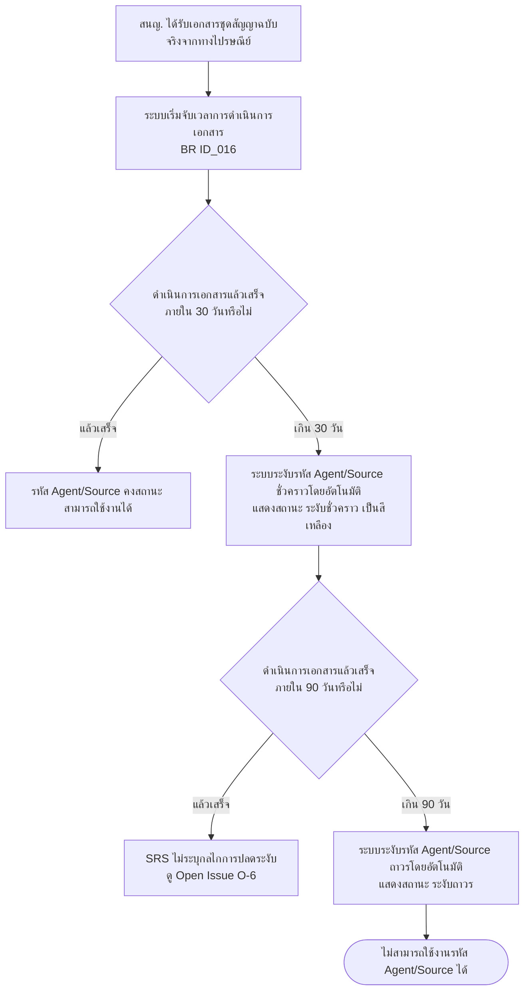

> **[SRS]** หัวข้อ 5.1 ข้อ 7.2: "ระหว่างที่ฝ่ายธุรกิจได้รับเอกสารชุดสัญญาจากทางไปรษณีย์ ระบบจะจับเวลาการดำเนินการเอกสารให้แล้วเสร็จภายใน 30 วัน หากเกินกำหนดระบบจะระงับรหัส Agent/Source ชั่วคราวโดยอัตโนมัติ หากยังไม่แล้วเสร็จภายใน 90 วัน ระบบจะระงับรหัส Agent/Source ถาวรโดยอัตโนมัติ"
> **[SRS]** หัวข้อ 5.2 หน้าจอรายละเอียดของรายการ: "ระงับชั่วคราว : แสดงเมื่อครบระยะเวลา 30 วันหลังจากฝ่ายธุรกิจ(สำนักงานใหญ่) ได้รับเอกสารฉบับจริง" และ "ระงับถาวร : แสดงเมื่อครบระยะเวลา 90 วันหลังจากฝ่ายธุรกิจ(สำนักงานใหญ่) ได้รับเอกสารฉบับจริง"
> → **จุดเริ่มนับเวลาชัดเจนแล้ว**: วันที่ฝ่ายธุรกิจ (สนญ.) ได้รับเอกสารฉบับจริง และ 90 วันนับจากวันเดียวกัน (ไม่ใช่ 30+90)
> **[SRS]** BR ID_003 กำหนดให้เก็บ Log Transaction เพื่อดูเรื่อง SLA
> **[ตีความ]** นิยามของ "ดำเนินการเอกสารแล้วเสร็จ" — ผู้จัดทำเข้าใจว่าคือสถานะฉบับจริงถึง `LAWC` ฝ่ายนิติกรรมอนุมัติเอกสาร แต่ SRS ไม่ได้นิยามไว้ → ดู Open Issue O-7

---

## 9. Flow การสร้างและตั้งค่ารหัส Agent/Source

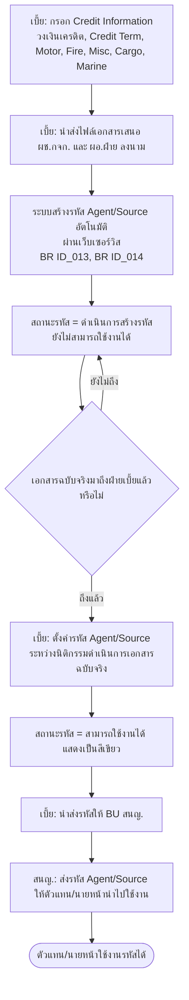

> **[SRS]** หัวข้อ 5.1 ข้อ 3.2–3.3, ข้อ 6.3–6.4; หัวข้อ 5.2 หน้าจอรายละเอียดของรายการ (สถานะรหัส Agent/Source 4 สถานะ) และ Credit Information 7 ฟิลด์
> **⚠ ข้อขัดแย้งใน SRS:** ข้อ 3.3 ระบุให้ระบบสร้างรหัส **ก่อน** นิติกรรมอนุมัติ ขณะที่ BR ID_015 ระบุว่า "เปลี่ยน Flow จากการทำ Parallel เป็น ผ่านการ Approve จากนิติกรรมก่อน จึงส่งต่อให้ IT ทำการสร้าง Agent Source" → ไดอะแกรมนี้วาดตามข้อ 3.2–3.3 (เนื้อหา Functional Requirement) ต้องยืนยันก่อนพัฒนา — ดู Open Issue O-1

---

## 10. State Diagram — สถานะเอกสารไฟล์ (ใช้ชื่อสถานะและ code จริงตาม SRS)

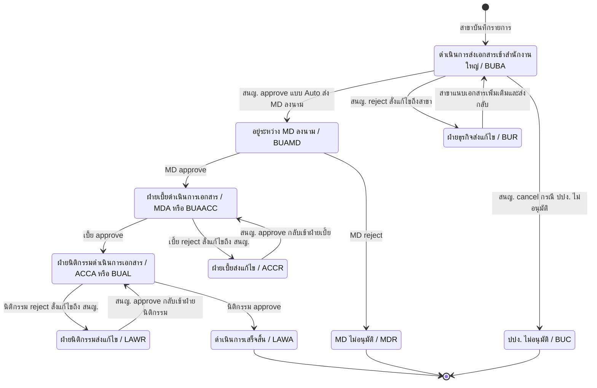

| สถานะที่แสดง | Code | Role ที่ทำให้เกิด | Action | Remark ตาม SRS | ผู้มองเห็น (View) |
|---|---|---|---|---|---|
| ดำเนินการส่งเอกสารเข้าสำนักงานใหญ่ | BUBA | ฝ่ายธุรกิจสาขา | approve | – | BU สาขา, BU สนญ. |
| อยู่ระหว่าง MD ลงนาม | BUAMD | ฝ่ายธุรกิจ สนญ. | approve | Auto | BU สาขา, BU สนญ., MD |
| ฝ่ายเบี้ยดำเนินการเอกสาร | BUAACC | ฝ่ายธุรกิจ สนญ. | approve | Reject โดย เบี้ย | BU สาขา, BU สนญ., เบี้ย |
| ฝ่ายนิติกรรมดำเนินการเอกสาร | BUAL | ฝ่ายธุรกิจ สนญ. | approve | Reject โดย นิติกรรม | BU สาขา, BU สนญ., เบี้ย, นิติกรรม |
| ฝ่ายธุรกิจส่งแก้ไข | BUR | ฝ่ายธุรกิจ สนญ. | reject | ส่งถึงสาขา | BU สาขา, BU สนญ. |
| ปปง. ไม่อนุมัติ | BUC | ฝ่ายธุรกิจ สนญ. | cancel | End flows | BU สาขา, BU สนญ. |
| ฝ่ายเบี้ยดำเนินการเอกสาร | MDA | MD | approve | – | BU สาขา, BU สนญ., MD, เบี้ย |
| MD ไม่อนุมัติ | MDR | MD | reject | End flows | BU สาขา, BU สนญ. |
| ฝ่ายนิติกรรมดำเนินการเอกสาร | ACCA | เบี้ย | approve | – | BU สาขา, BU สนญ., MD, เบี้ย, นิติกรรม |
| ฝ่ายเบี้ยส่งแก้ไข | ACCR | เบี้ย | reject | ส่งถึง BU สนญ. | BU สาขา, BU สนญ., MD, เบี้ย |
| ดำเนินการเสร็จสิ้น | LAWA | นิติกรรม | approve | – | ทุกฝ่าย |
| ฝ่ายนิติกรรมส่งแก้ไข | LAWR | นิติกรรม | reject | ส่งถึง BU สนญ. | ทุกฝ่าย |

> **[SRS]** ตารางสถานะเอกสารไฟล์ในหัวข้อ 5.2 หน้าจอเมนู Home (คอลัมน์ No / Role / Action / remark / code / Status / TO / View)
> **⚠ ข้อสังเกต:** สถานะ `BUC` "ปปง. ไม่อนุมัติ" เกิดจาก action `cancel` ของฝ่ายธุรกิจ (สนญ.) แต่การตรวจ ปปง. ตาม Flow ข้อ 1 เกิดที่สาขา **ก่อนสร้างรายการ** ถ้าเป็นผู้ถูกกำหนดจะสร้างรายการไม่ได้เลย → ยังไม่ชัดว่า `BUC` เกิดขึ้นในสถานการณ์ใด ดู Open Issue O-2

---

## 11. State Diagram — สถานะเอกสารฉบับจริง

สถานะฝั่งฉบับจริงเดินหน้าทางเดียวแบบ checklist ไม่มีสถานะ reject ในตาราง

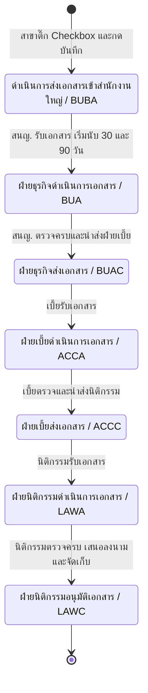

> **[SRS]** หัวข้อ 5.2 หน้าต่างอัพเดตสถานะของเอกสารฉบับจริง — "สถานะถัดไปของเอกสารจะแสดงขึ้นเมื่อเลือก Checkbox และกดบันทึกสถานะก่อนหน้าเสร็จสิ้น และแต่ละฝ่ายสามารถเลือกอัพเดตสถานะในฝ่ายตนเองเท่านั้น"
> **[ตีความ]** กรณีฉบับจริงไม่ครบถ้วน (SRS ข้อ 5.2 และ 7.1) **ไม่มีสถานะรองรับในตาราง** — ไดอะแกรม ข้อ 5 จึงวาดเป็นการวนรอที่ขั้นตอนเดิม ไม่ใช่การเปลี่ยนสถานะ ต้องยืนยัน — ดู Open Issue O-8

---

## 12. State Diagram — สถานะรหัส Agent/Source

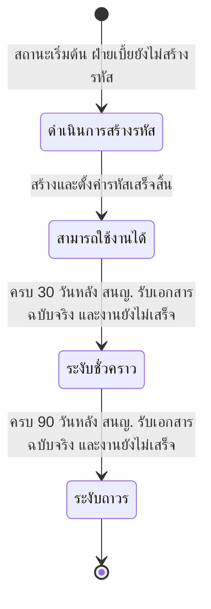

> **[SRS]** หัวข้อ 5.2 หน้าจอรายละเอียดของรายการ (สำหรับสาขาทั่วประเทศ) — 4 สถานะ พร้อมสีแสดงผล: สามารถใช้งานได้ = เขียว, ระงับชั่วคราว = เหลือง
> **[SRS]** BR ID_016 — ระบบระงับรหัสอัตโนมัติเมื่อครบกำหนดระยะเวลาแก้ไขเอกสาร
> **⚠ ข้อสังเกต:** SRS ใช้ถ้อยคำ 2 แบบ — หน้าจอบอกว่า "ดำเนินการสร้างรหัส คือสถานะเริ่มต้น แสดงเมื่อฝ่ายเบี้ยยังไม่สร้างรหัส" แต่ข้อ 3.3 บอกว่าระบบสร้างรหัสอัตโนมัติแล้วแต่ยังใช้งานไม่ได้ → เข้าใจได้ว่าสถานะนี้ครอบทั้ง "ยังไม่สร้าง" และ "สร้างแล้วแต่ยังไม่ตั้งค่า" ต้องยืนยัน
> **[ตีความ]** ไม่มีเส้นทางปลดระงับ (C3 → C2 หรือ C4 → C2) เพราะ SRS ไม่ระบุ — ดู Open Issue O-6

---

## 13. Flow การแจ้งเตือน (Notification)

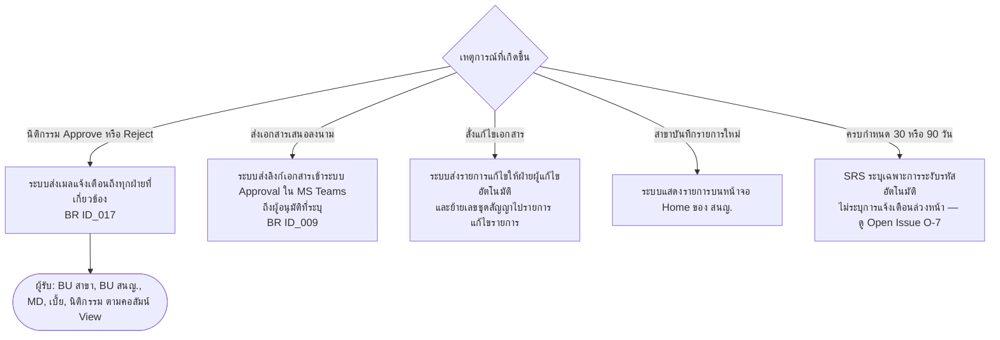

> **[SRS]** BR ID_017 (เมลแจ้งเตือนเมื่อนิติกรรม Approve/Reject), BR ID_009 และหน้าจอส่งอนุมัติ (MS Teams Approval), หน้าต่างสั่งแก้ไขรายการ (ส่งรายการแก้ไขอัตโนมัติ)
> **[ตีความ]** ผู้รับเมลตาม "ทุกฝ่ายที่เกี่ยวข้อง" ถูกตีความจากคอลัมน์ `View` ของตารางสถานะ — SRS ไม่ได้ระบุรายชื่อผู้รับหรือรูปแบบเนื้อหาเมล
> **[ตีความ]** การแจ้งเตือนภายในระบบ (in-app) นอกเหนือจากการแสดงรายการบนหน้า Home — SRS ไม่ได้ระบุว่ามีหรือไม่

---

## 14. Swimlane ตามหน่วยงาน (จุด hand-off)

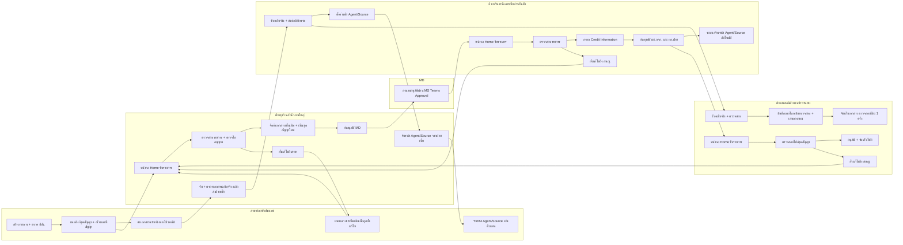

> **[SRS]** หัวข้อ 5.1 ข้อ 1–7 (ผู้รับผิดชอบแต่ละขั้น) และหัวข้อ 5.2 (สิทธิ์ปุ่มของแต่ละฝ่าย)
> ไดอะแกรมนี้แสดงเฉพาะจุดส่งต่องาน เส้นทางไม่อนุมัติและ SLA อยู่ใน Flow ข้อ 4 และ ข้อ 8

---

## 15. Sequence — Happy Path ทั้งกระบวนการ

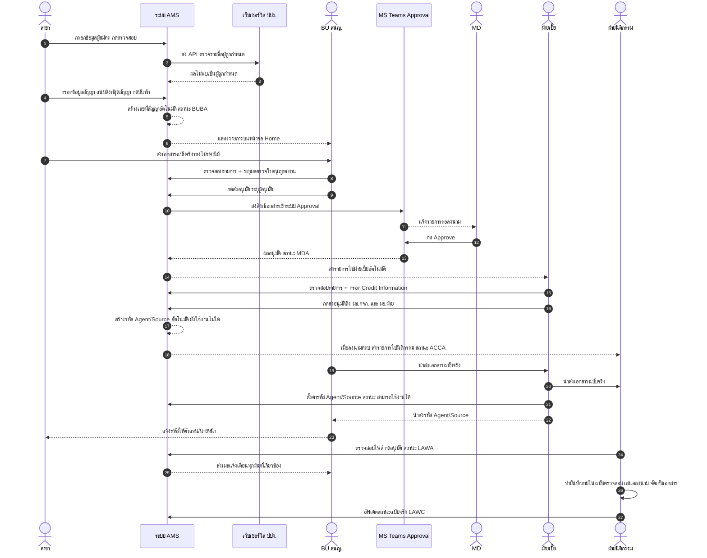

> **[SRS]** หัวข้อ 5.1 ข้อ 1–7 และหัวข้อ 5.2 หน้าจอส่งอนุมัติ / หน้าต่างอัพเดตสถานะเอกสารฉบับจริง
> **[ตีความ]** ลำดับเวลาระหว่างการมาถึงของเอกสารฉบับจริงกับการลงนาม เป็นการจัดลำดับให้อ่านง่าย SRS ไม่ได้กำหนดว่าฉบับจริงต้องถึงก่อนหรือหลังการลงนาม ทราบเพียงว่าฉบับจริงต้องถึงก่อนจึงตั้งค่ารหัสได้

---

## 16. Flow กรณีขอยกเลิก/ปิดรหัส Agent/Source

> ⚠ **ไดอะแกรมนี้เป็น [ตีความ] เป็นหลัก** — SRS **ไม่มีหัวข้อกระบวนการยกเลิก/ปิดรหัสโดยเฉพาะ**
> แต่มีร่องรอย 2 จุดที่บ่งชี้ว่าระบบรองรับ: (1) ตัวอย่างข้อความในฟิลด์ "เรื่อง" ของหน้าจอสร้างรายการระบุว่า `ขอยกเลิกรหัส Agent/Source`
> (2) Dropdown ชื่อเอกสารประกอบมี `F-CM-035 แบบฟอร์มขอเปิด - ปิด รหัส Agent/Source`

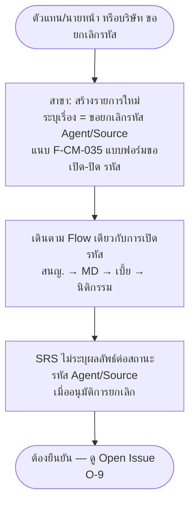

> **[SRS]** หัวข้อ 5.2 หน้าจอสร้างรายการ (ตัวอย่างฟิลด์ เรื่อง) และรายการเอกสารใน Dropdown ของหน้าจอแนบเอกสารเพิ่มเติม/หน้าต่างสั่งแก้ไข
> **[ตีความ]** ทุกกล่องที่เหลือในไดอะแกรมนี้เป็นข้อสมมติ ยังไม่ควรนำไปพัฒนาโดยไม่ยืนยันกับ Business Owner

### กระบวนการที่ SRS ไม่ครอบคลุม — ไม่ได้เขียน Flow

ตามหลัก "ทำเฉพาะที่ SRS ระบุจริง" จึง **ไม่เขียน** Flow ต่อไปนี้ เพราะไม่พบเนื้อหารองรับใน SRS เลย

- **แก้ไขข้อมูลตัวแทนหลังเปิดรหัส** (เปลี่ยนชื่อ ที่อยู่ บัญชีธนาคาร) — SRS มีเฉพาะการแก้ไข "เอกสารในชุดสัญญา" ระหว่างกระบวนการอนุมัติ ไม่มีการแก้ข้อมูล master ของตัวแทน
- **ต่ออายุใบอนุญาต** — SRS มีเฉพาะการ "ตรวจสอบวันหมดอายุของเลขที่ใบอนุญาต" ตอนที่ สนญ. ตรวจรายการ ไม่มีกระบวนการต่ออายุ
- **การตรวจสอบเอกสารปีละ 1 ครั้ง** — SRS ระบุเพียงว่านิติกรรม "จัดเก็บเอกสารเพื่อตรวจสอบปีละ 1 ครั้ง" ไม่มี Functional Requirement รองรับ (ไม่มีหน้าจอ ไม่มีสถานะ ไม่มีการแจ้งเตือน) จึงยังสรุปไม่ได้ว่าอยู่ในขอบเขตระบบหรือเป็นงาน manual
- **รายงาน (หัวข้อ 5.3 Report)** — มีในสารบัญ แต่เนื้อหาไม่ปรากฏในไฟล์ที่แปลงแล้ว

---

## Open Issues — ประเด็นที่ SRS ยังไม่ตอบ

| รหัส | ประเด็น | จุดกระทบ |
|---|---|---|
| **O-1** | **ข้อขัดแย้งเรื่องจุดสร้างรหัส Agent/Source** — SRS หัวข้อ 5.1 ข้อ 3.3 ระบุให้ระบบสร้างรหัสอัตโนมัติเมื่อฝ่ายเบี้ยนำส่งเอกสารเสนอลงนาม (ก่อนนิติกรรมอนุมัติ) แต่ BR ID_015 ระบุว่า "เปลี่ยน Flow จากการทำ Parallel เป็น ผ่านการ Approve จากนิติกรรมก่อน จึงส่งต่อให้ IT ทำการสร้าง Agent Source" นอกจากนี้ **ไม่มี role ฝ่ายเทคโนโลยี/IT** ในรายการผู้ใช้งานหน้าจอ Home | Flow ข้อ 4, 9, 12 |
| **O-2** | **สถานะ `BUC` ปปง. ไม่อนุมัติ** เกิดจาก action `cancel` ของฝ่ายธุรกิจ (สนญ.) แต่การตรวจ ปปง. เกิดที่สาขาก่อนสร้างรายการ ถ้าเป็นผู้ถูกกำหนดจะสร้างรายการไม่ได้เลย → ต้องอธิบายว่า `BUC` เกิดในสถานการณ์ใด (สนญ. ตรวจ ปปง. ซ้ำเองหรือไม่ / ตรวจพบภายหลัง) | Flow ข้อ 1, 10 |
| **O-3** | **SRS หัวข้อ 5.1 ข้อ 7.1 เขียน "กรณีเอกสารครบถ้วน" ซ้ำกัน 2 บรรทัด** โดยบรรทัดที่สองควรเป็น "กรณีเอกสารไม่ครบถ้วน" ต้องแก้ไข SRS ให้ชัด | Flow ข้อ 5 |
| **O-4** | **ผลของการตรวจใบอนุญาต** — SRS ให้ สนญ. เลือก Radio "ผ่าน" หรือ "ไม่พบใบอนุญาต" และให้ตรวจวันหมดอายุ แต่ไม่ระบุว่าเมื่อเลือก "ไม่พบใบอนุญาต" หรือใบอนุญาตหมดอายุ ระบบต้องบล็อกการส่งอนุมัติ / สั่งแก้ไข / ยกเลิกรายการ | Flow ข้อ 4 |
| **O-5** | **การ Reject ในขั้นลงนาม** — SRS ระบุเฉพาะการจับปุ่ม Approve ใน MS Teams ยังไม่ระบุ (ก) กลไกเมื่อผู้ลงนามกด Reject (ข) กรณีผู้ลงนามหลายคนแล้วมีคนใดคนหนึ่ง Reject (ค) **สถานะเมื่อ ผช.กจก./ผอ.ฝ่าย ไม่อนุมัติในขั้นฝ่ายเบี้ย ยังไม่มี status code รองรับในตาราง** (ง) กรณีไม่มีใครดำเนินการ (timeout) | Flow ข้อ 4, 7 |
| **O-6** | **การปลดระงับรหัส Agent/Source** — ไม่มีสถานะและไม่มีขั้นตอนกลับจาก "ระงับชั่วคราว" → "สามารถใช้งานได้" หรือการปลด "ระงับถาวร" ต้องยืนยันว่าเป็นการทำ manual นอกระบบ หรือมีผู้มีอำนาจอนุมัติในระบบ | Flow ข้อ 8, 12 |
| **O-7** | **รายละเอียดการนับเวลา 30 / 90 วัน** — ทราบจุดเริ่มนับแล้ว (วันที่ สนญ. รับฉบับจริง) แต่ยังไม่ระบุ (ก) นิยาม "ดำเนินการเอกสารแล้วเสร็จ" ใช้สถานะใดเป็นเกณฑ์ (ข) นับวันทำการหรือวันปฏิทิน (ค) มีการแจ้งเตือนล่วงหน้าก่อนครบกำหนดหรือไม่ กี่วัน ส่งถึงใคร | Flow ข้อ 8, 13 |
| **O-8** | **สถานะเอกสารฉบับจริงกรณีไม่ครบถ้วน** — ตารางสถานะฉบับจริงมีเฉพาะ action `Approve` 7 สถานะ ไม่มีสถานะสำหรับ "รอฉบับจริงที่แก้ไข" หรือการย้อนสถานะกลับ ทั้งที่ SRS ข้อ 5.2 และ 7.1 มีกรณีเอกสารฉบับจริงไม่ครบ | Flow ข้อ 5, 11 |
| **O-9** | **รายการประเภท "ขอยกเลิกรหัส Agent/Source"** — พบเฉพาะเป็นตัวอย่างในฟิลด์ "เรื่อง" และฟอร์ม F-CM-035 แต่ไม่มีกระบวนการ ไม่มีผลต่อสถานะรหัส และไม่มีสถานะ "ปิดรหัส" ในระบบ | Flow ข้อ 16 |
| **O-10** | **Logic เลขที่สัญญา (BR ID_018)** — SRS อ้างว่ามีรูปแบบตามที่นิติกรรมกำหนด แต่เนื้อหาอยู่ในรูปภาพ/ตารางที่หายไปจากไฟล์ที่แปลง ต้องขอรูปแบบเลขสัญญาเพิ่ม | Flow ข้อ 1 |
| **O-11** | **หัวข้อ 5.3 Report และ `Table 4 โครงสร้างรายงาน`** — มีในสารบัญแต่ไม่มีเนื้อหา จึงยังไม่ทราบว่าระบบต้องมีรายงานอะไร ใครใช้ ออกด้วยเงื่อนไขใด | ยังไม่ได้เขียน Flow |
| **O-12** | **หัวข้อ 2.2 ขอบเขตงานที่ยังไม่รวม** ยังเป็น placeholder `Insert Text` ทำให้ไม่ทราบขอบเขตที่ตัดออกจาก Phase นี้อย่างชัดเจน | ทั้งเอกสาร |
| **O-13** | **Credit Information** — SRS ให้ 7 ฟิลด์ (วงเงินเครดิต, Credit Term, Motor, Fire, Misc, Cargo, Marine) แต่ไม่ระบุเกณฑ์การกำหนดวงเงิน ผู้อนุมัติวงเงิน validation ของค่าที่กรอก และการปรับวงเงินภายหลัง | Flow ข้อ 4, 9 |
| **O-14** | **ผลหลังจาก End flows (`MDR` MD ไม่อนุมัติ และ `BUC` ปปง. ไม่อนุมัติ)** — SRS ระบุเพียงว่าจบ flow และนับรวมในตัวเลข "ยกเลิก" บนหน้า Home ยังไม่ระบุว่าเลขที่สัญญาเดิมถูกยกเลิกอย่างไร และเปิดรายการใหม่ด้วยผู้สมัครรายเดิมได้หรือไม่ | Flow ข้อ 4, 10 |
| **O-15** | **การตรวจสอบเอกสารปีละ 1 ครั้ง** — SRS ระบุเพียงว่านิติกรรมจัดเก็บเอกสาร "เพื่อตรวจสอบปีละ 1 ครั้ง" ไม่มีหน้าจอ สถานะ หรือการแจ้งเตือนรองรับ ต้องยืนยันว่าอยู่ในขอบเขตระบบหรือเป็นงาน manual | ยังไม่ได้เขียน Flow |
| **O-16** | **รายละเอียดเมลแจ้งเตือน (BR ID_017)** — ทราบว่ามีเมลเมื่อนิติกรรม Approve/Reject แต่ไม่ระบุรายชื่อ/กลุ่มผู้รับ เนื้อหาเมล และไม่ระบุว่าเหตุการณ์อื่น (สั่งแก้ไข, ครบกำหนด SLA, รหัสถูกระงับ) มีเมลด้วยหรือไม่ | Flow ข้อ 13 |
| **O-17** | **กระบวนการหลังเปิดรหัส** — การแก้ไขข้อมูล master ของตัวแทน และการต่ออายุใบอนุญาต ไม่ปรากฏใน SRS เลย ต้องยืนยันว่าเป็น out of scope ของ Phase นี้ (ซึ่งหัวข้อ 2.2 ยังไม่ได้กรอก จึงยืนยันไม่ได้) | ยังไม่ได้เขียน Flow |
| **O-18** | **ตาราง PDPA (หัวข้อ 7)** — ติ๊กเฉพาะ "ชื่อ-นามสกุล" ทั้งที่ระบบเก็บเลขประจำตัวประชาชน เลขทะเบียนนิติบุคคล เลขที่ใบอนุญาต และเอกสารแนบชุดสัญญา ตารางกิจกรรมการใช้ข้อมูลส่วนบุคคลยังว่าง | เอกสาร SRS |

## ประเด็นที่ปิดไปแล้วในรอบนี้ (SRS ตอบชัดเจน)

| ประเด็นเดิม (รอบก่อน) | SRS ระบุว่าอะไร |
|---|---|
| ยังไม่ได้อ่าน SRS | อ่านได้แล้วผ่านไฟล์ที่แปลงเป็น `.txt` — Flow ทั้งหมดในเอกสารนี้อ้างอิง SRS เป็นหลัก |
| เลข BR ชั่วคราว BR-01…BR-12 | แทนด้วยรหัสจริง `BR ID_001` … `BR ID_018` (หัวข้อ 2.1) ครบทุกจุดที่ map ได้ |
| ชื่อสถานะเป็นการตีความ | SRS มีตารางสถานะ 3 ชุด: เอกสารไฟล์ 12 รายการพร้อม code, เอกสารฉบับจริง 7 รายการพร้อม code, และสถานะรหัส Agent/Source 4 สถานะ |
| Reject Checklist ยังเป็น placeholder | SRS มีหน้าต่าง "สั่งแก้ไขรายการ": Dropdown ชื่อเอกสาร (F-CM-005 … F-CM-049, QP-PR-016, อื่นๆ) + หมายเหตุรายเอกสาร + ปุ่มบันทึกฉบับร่าง/ยืนยัน และ **checklist ใช้ชุดเดียวกันทุกฝ่าย** ต่างกันเฉพาะปลายทางที่ส่งถึง |
| ลำดับ MD กับการส่งฝ่ายเบี้ย เป็น parallel หรือไม่ | **ไม่ parallel** — SRS ข้อ 3.1 "เมื่อกรรมการผู้จัดการอนุมัติเอกสาร ระบบจะนำส่งรายการไปยังฝ่ายบริหารจัดการเบี้ยประกันภัย" สอดคล้องกับ status `BUAMD` → `MDA` |
| กรณี MD ไม่อนุมัติ | สถานะ `MDR` MD ไม่อนุมัติ remark = End flows และนับรวมในตัวเลข "ยกเลิก" บนหน้า Home (รายละเอียดที่เหลืออยู่ใน O-14) |
| ใครลงนามในขั้นฝ่ายเบี้ย | **ผู้ช่วยกรรมการผู้จัดการ และผู้อำนวยการฝ่าย** (SRS ข้อ 3.3 และ 4.1) |
| จุดสร้างรหัส Agent/Source | SRS ข้อ 3.3 — สร้างอัตโนมัติเมื่อฝ่ายเบี้ยนำส่งเอกสารเสนอลงนามเสร็จสิ้น "แต่ยังไม่สามารถใช้งานได้จนกว่าเอกสาร(ฉบับจริง)จะมาถึง" (ข้อขัดแย้งกับ BR ID_015 ยังค้างที่ O-1) |
| การนับ SLA เริ่มจากวันใด | **นับจากวันที่ฝ่ายธุรกิจ (สนญ.) ได้รับเอกสารฉบับจริง** ทั้ง 30 วันและ 90 วัน (ไม่ใช่ 30+90) — SRS ข้อ 7.2 + หน้าจอรายละเอียดของรายการ |
| เกณฑ์ "ตรวจสอบผู้มีความเสี่ยง" | คือการตรวจกับ **ปปง.** ผ่าน API เพื่อหารายชื่อ "ผู้ถูกกำหนด" (BR ID_011, BR ID_012) ถ้าพบ ระบบจะไม่แสดงส่วนสร้างเลขสัญญาและส่วนแนบไฟล์ → ดำเนินการต่อไม่ได้ |
| การตรวจสอบใบอนุญาต | สนญ. ตรวจเองแล้วบันทึกผลเป็น Radio "ผ่าน" / "ไม่พบใบอนุญาต" พร้อมตรวจวันหมดอายุ — **ไม่มีการเชื่อมต่อ คปภ.** ใน Phase นี้ (ผลลัพธ์เมื่อไม่พบยังค้างที่ O-4) |
| ขอบเขต Dashboard / หน้า Home | ตัวนับ 5 กลุ่ม (ทั้งหมด / สำเร็จ / ดำเนินการ / แก้ไข / ยกเลิก), ฟิลด์ค้นหา 7 ฟิลด์, ตารางรายการ 10 คอลัมน์ และ **เห็นเฉพาะงานของสาขาตนเองหรือฝ่ายตนเอง** + คอลัมน์ `View` กำหนดผู้มองเห็นรายสถานะ |
| Permission matrix | SRS ระบุสิทธิ์รายหน้าจอ/รายปุ่มของแต่ละฝ่าย → สรุปเป็นตาราง "สิทธิ์การใช้งานตามหน้าจอ" ในเอกสารนี้ |
| ช่องทางการแจ้ง "แจ้ง" ระหว่างฝ่าย | เมลแจ้งเตือน (BR ID_017) + ระบบ Approval ใน MS Teams สำหรับการลงนาม + การส่งรายการภายในระบบอัตโนมัติ (รายละเอียดที่เหลืออยู่ใน O-16) |

---

## สรุปการเปลี่ยนแปลงจากเอกสารรอบก่อน (v1 → v2)

1. เปลี่ยนแหล่งอ้างอิงหลักจาก `drawio` เป็น **SRS** และระบุข้อจำกัดที่เหลือของไฟล์ที่แปลงแล้ว (รูปภาพ, Logic เลขสัญญา, หัวข้อ Report)
2. แทนรหัส `BR-01`…`BR-12` ด้วย **`BR ID_001` … `BR ID_018`** ทั้งเอกสาร พร้อมตาราง map ย้อนกลับ
3. เพิ่ม Flow ใหม่ 6 ชุด: สร้างรายการ + ตรวจ ปปง. (ข้อ 1), Login/สิทธิ์ (ข้อ 3), สั่งแก้ไข/Rework (ข้อ 6), ส่งอนุมัติ + e-signature (ข้อ 7), สร้าง/ตั้งค่ารหัส Agent/Source (ข้อ 9), Notification (ข้อ 13)
4. แก้ Flow เดิมให้ตรง SRS: MD ต้องอนุมัติ **ก่อน** ส่งฝ่ายเบี้ย (ไม่ใช่ parallel), reject กลับเข้าฝ่ายเดิมด้วยรหัส `BUAACC`/`BUAL`, ผู้ลงนามในขั้นฝ่ายเบี้ยคือ ผช.กจก. + ผอ.ฝ่าย, ปลายทางการสั่งแก้ไขต่างกันตามฝ่าย
5. เปลี่ยน State Diagram มาใช้ **ชื่อสถานะและ code จริง** ทั้ง 3 ชุด พร้อมตารางประกอบ
6. แก้จุดเริ่มนับ SLA เป็น **วันที่ สนญ. รับเอกสารฉบับจริง** และ 90 วันนับจากวันเดียวกัน
7. เพิ่มตาราง Actor/Role และตารางสิทธิ์รายหน้าจอ
8. Open Issues จาก 20 ข้อ เหลือ **18 ข้อที่ SRS ยังไม่ตอบจริง** (O-1…O-18) พร้อมตารางสรุปประเด็นที่ปิดไปแล้วและเหตุผล
