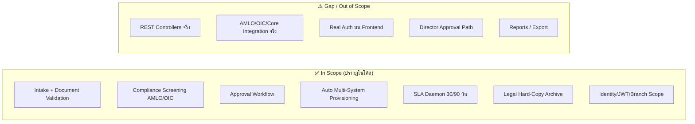
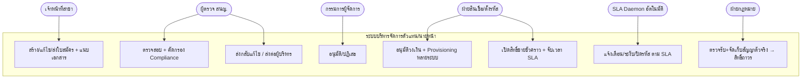
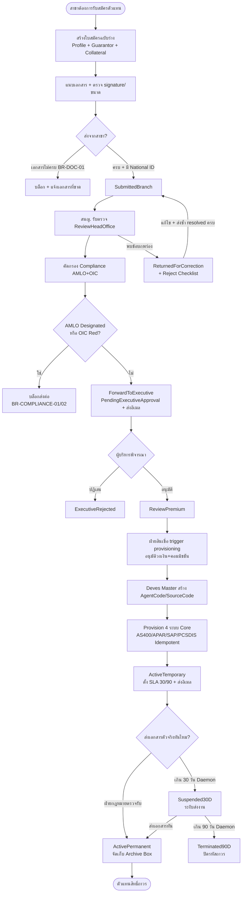
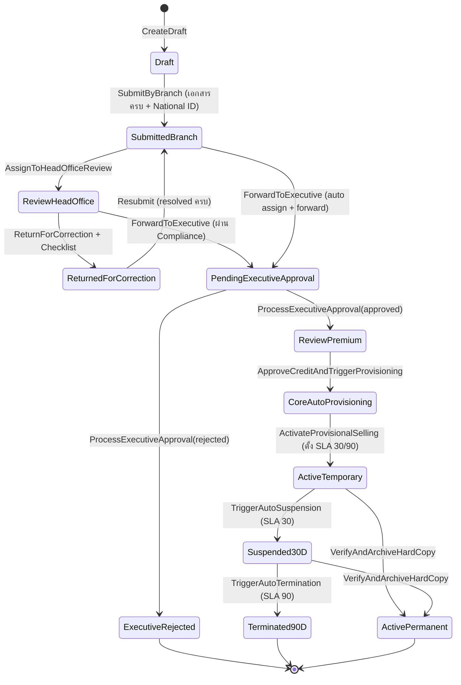
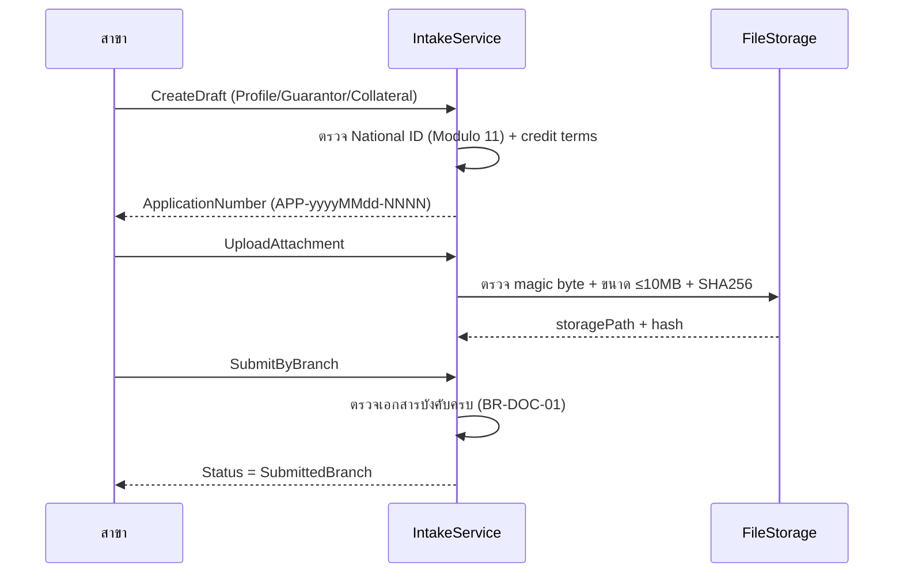
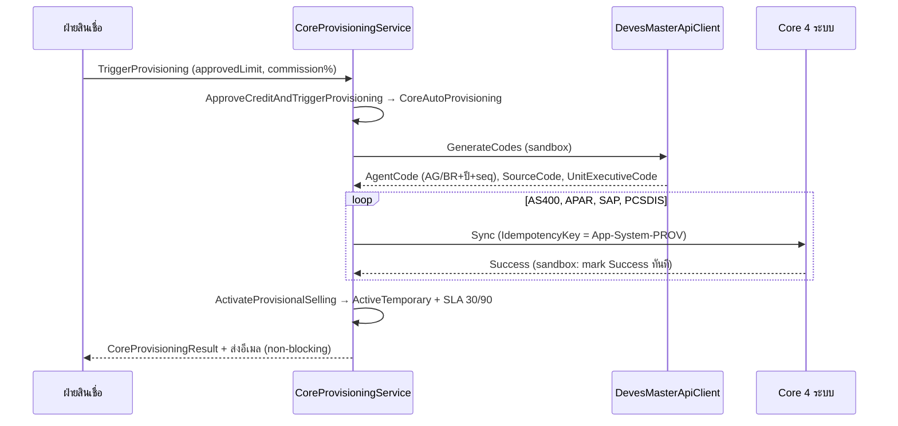
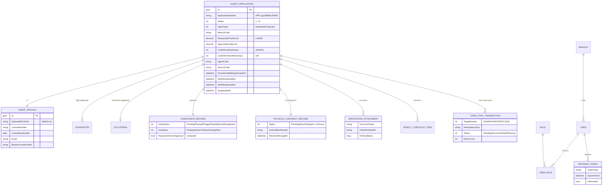
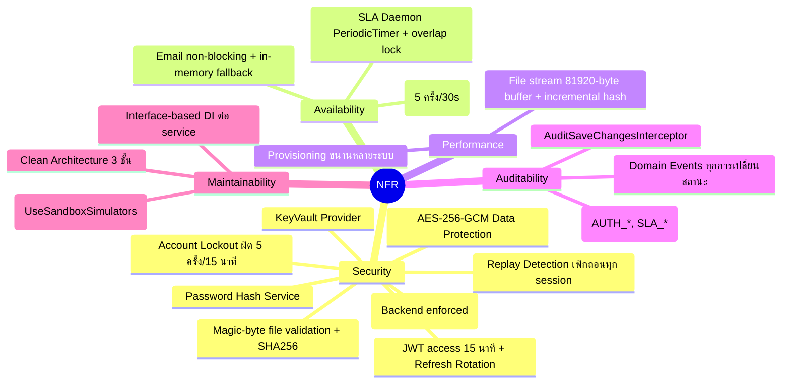
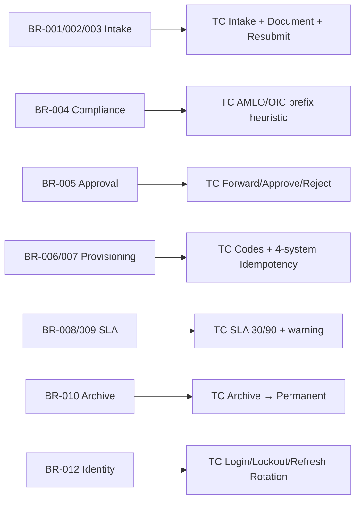

# เอกสารวิเคราะห์ระบบบริหารจัดการตัวแทน/นายหน้า (Agent & Broker Management System) — F-BP-009

> วิเคราะห์จากซอร์สโค้ดจริงของโปรเจกต์ **DVS_ManagedAgentBroker**
> (.NET 8 Clean Architecture + Next.js App Router) อ้างอิงเอกสาร **F-BP-009 Agent Management System**
> บริษัท เทเวศประกันภัย จำกัด (มหาชน) — Deves

---

## Header

| หัวข้อ | รายละเอียด |
|--------|-----------|
| Document Type | Software Requirement Analysis (SRS Analysis) |
| Project | P2026-XXX — Managed Agent & Broker Onboarding *(ยืนยันรหัสโครงการจริง — ดู Open Issues)* |
| System | ระบบบริหารจัดการตัวแทน/นายหน้า (Agent & Broker Management) |
| แบบฟอร์มอ้างอิง | F-BP-009 |
| Module / Unit | Unit 2 Identity, Unit 3 Intake, Unit 4 Compliance & Approval, Unit 5 Provisioning & SLA |
| Source | `src/backend` (.NET Clean Architecture), `src/frontend` (Next.js 14 + TS + Tailwind) |
| Version | 0.1 (Draft — reverse engineered จากโค้ด) |
| Prepared by | BA (Deves) |
| Status | Draft for review |

---

## สารบัญ

1. [ภาพรวมและวัตถุประสงค์](#1-ภาพรวมและวัตถุประสงค์)
2. [ขอบเขตงาน (Scope of Work)](#2-ขอบเขตงาน-scope-of-work)
3. [Business Requirements](#3-business-requirements)
4. [บทบาทผู้ใช้และสิทธิ์ (Roles & Permissions)](#4-บทบาทผู้ใช้และสิทธิ์-roles--permissions)
5. [Use Case ภาพรวม](#5-use-case-ภาพรวม)
6. [กระบวนการหลัก End-to-End](#6-กระบวนการหลัก-end-to-end)
7. [สถานะใบสมัคร (State Machine)](#7-สถานะใบสมัคร-state-machine)
8. [รายละเอียดกระบวนการรายขั้น](#8-รายละเอียดกระบวนการรายขั้น)
9. [Data Model (ER Diagram)](#9-data-model-er-diagram)
10. [Business Rules Catalog (สำหรับทดสอบ)](#10-business-rules-catalog-สำหรับทดสอบ)
11. [Validation Rules](#11-validation-rules)
12. [Non-Functional Requirements](#12-non-functional-requirements)
13. [PDPA Consideration](#13-pdpa-consideration)
14. [Risk Management Plan](#14-risk-management-plan)
15. [Open Issues / ประเด็นที่ต้องยืนยัน](#15-open-issues--ประเด็นที่ต้องยืนยัน)
16. [แนวทางการทดสอบ (Test Strategy & Scenarios)](#16-แนวทางการทดสอบ-test-strategy--scenarios)
17. [Appendix](#17-appendix)

---

## 1. ภาพรวมและวัตถุประสงค์

ระบบนี้บริหาร **วงจรการรับสมัครและอนุมัติตัวแทน/นายหน้าประกันภัย** ตั้งแต่รับใบสมัครที่สาขา จนถึงเปิดรหัสขายในระบบ Core และจัดเก็บสัญญาฉบับจริง โดยมีหัวใจอยู่ที่การ **เปิดสิทธิ์ขายชั่วคราว (Provisional Selling)** ให้ตัวแทนเริ่มทำงานได้ทันทีหลังอนุมัติวงเงิน แล้วบังคับส่งเอกสารสัญญาตัวจริงภายใน SLA ที่กำหนด มิฉะนั้นระบบจะระงับ/ปิดรหัสอัตโนมัติ

| # | วัตถุประสงค์ | ความหมายเชิงระบบ |
|---|-------------|-------------------|
| 1 | ลดเวลารับสมัคร → เปิดขาย | สาขาคีย์ใบสมัคร → สนญ.ตรวจ → ผู้บริหารอนุมัติ → ระบบเปิดรหัสขายชั่วคราวอัตโนมัติ (ActiveTemporary) |
| 2 | ควบคุมความเสี่ยง Compliance | คัดกรอง AMLO (ฟอกเงิน) และ OIC (ใบอนุญาต/บัญชีดำ) ก่อนส่งอนุมัติ |
| 3 | Provisioning อัตโนมัติหลายระบบ | สร้างรหัสในระบบ Core 4 ระบบ (AS400, APAR, SAP, PCSDIS) แบบ Idempotent |
| 4 | บังคับส่งเอกสารตัวจริงด้วย SLA | SLA 30 วัน (ส่งเอกสาร) → ระงับ / SLA 90 วัน → ปิดรหัสถาวร โดย Daemon อัตโนมัติ |
| 5 | จัดเก็บสัญญาถูกต้องตามกฎหมาย | ฝ่ายกฎหมายตรวจรับเอกสารตัวจริง → เปิดสิทธิ์ถาวร (ActivePermanent) |
| 6 | ตรวจสอบย้อนกลับได้ (Auditability) | Domain Events + Audit Interceptor บันทึกทุกการเปลี่ยนสถานะ |

**ข้อสังเกตเชิงสถาปัตยกรรม (จากโค้ดจริง):**
- Backend เป็น Clean Architecture 3 ชั้น: `Domain` (Aggregate `AgentApplication` + Domain Events), `Infrastructure` (Services + EF Core + SQL Server), `API` (ASP.NET Core)
- ปัจจุบัน API layer มีเพียง `Program.cs` (`MapControllers()` + `/healthz`) แต่ **ยังไม่มีไฟล์ Controller** — endpoint ที่ frontend เรียก (`/api/applications`, `/api/compliance/...`, ฯลฯ) ยังไม่ถูก implement (ดู Open Issues OI-01)
- Frontend ใช้ **Hybrid Dual-Mode API Client**: พยายามเรียก backend ก่อน ถ้าไม่สำเร็จภายใน timeout จะ fallback ไปที่ `MockDataEngine` ในหน่วยความจำ
- การเชื่อมต่อ AMLO / OIC / Deves Master / Core 4 ระบบ ปัจจุบันเป็น **Sandbox Simulator** ทั้งหมด (`UseSandboxSimulators = true`)

---

## 2. ขอบเขตงาน (Scope of Work)

### 2.1 In Scope (ที่ปรากฏในโค้ด)

- การรับสมัครตัวแทน (Individual) และนิติบุคคล/นายหน้า (Corporate) พร้อมผู้ค้ำประกันและหลักประกัน
- อัปโหลด/ตรวจสอบเอกสารแนบ (magic-byte signature + SHA-256 + จำกัดขนาด 10 MB)
- การคัดกรอง Compliance (AMLO / OIC)
- Workflow อนุมัติ: สาขา → สนญ. → ผู้บริหาร → ฝ่ายสินเชื่อ/ตั้งรหัส
- Provisioning อัตโนมัติหลายระบบ + สร้าง Agent Code / Source Code
- เปิดสิทธิ์ขายชั่วคราว + จับเวลา SLA 30/90 วัน
- Daemon เฝ้าติดตาม SLA (ระงับ/ปิดรหัส/แจ้งเตือนล่วงหน้า)
- จัดเก็บสัญญาฉบับจริง (Legal Archive) → เปิดสิทธิ์ถาวร
- Identity & Access: JWT + Refresh Token Rotation, Branch Data Scope, Account Lockout

### 2.2 Out of Scope / ยังไม่สมบูรณ์ในโค้ด

- REST Controllers จริงของ backend (endpoint ยังไม่ถูกสร้าง)
- การเชื่อมต่อ AMLO / OIC / Deves Master / Core 4 ระบบแบบ Production (เป็น simulator)
- การพิสูจน์ตัวตนจริงบน frontend (ปัจจุบันใช้ Preset Personas + localStorage)
- การคำนวณค่าคอมมิชชัน / การออกกรมธรรม์ / การชำระเงิน
- เส้นทางอนุมัติกรรมการ (Director Approval) กรณี PEP/OIC Orange — มีการ "ตั้งค่า flag" แต่ยังไม่มี state gating
- รายงานเชิงวิเคราะห์และการ export

---

## 3. Business Requirements

| BR ID | Business Requirement | Priority |
|-------|----------------------|----------|
| BR-001 | รับสมัครตัวแทน Individual/Corporate: สร้าง/แก้ไขฉบับร่าง แนบเอกสาร ตรวจ Thai National ID checksum | High |
| BR-002 | บังคับเอกสารแนบครบตามประเภทก่อนส่ง (Individual 3 ชนิด / Corporate 4 ชนิด) | High |
| BR-003 | ส่งใบสมัครจากสาขา → ตรวจ สนญ. → ส่งกลับแก้ไข (Reject Checklist) → ส่งซ้ำ | High |
| BR-004 | คัดกรอง Compliance AMLO + OIC และบล็อกกรณี AMLO Designated / OIC Red | High |
| BR-005 | อนุมัติโดยผู้บริหาร (อนุมัติ/ปฏิเสธ) พร้อมแจ้งเตือนอีเมล | High |
| BR-006 | อนุมัติวงเงิน + คอมมิชชัน โดยฝ่ายสินเชื่อ → trigger provisioning อัตโนมัติ | High |
| BR-007 | สร้างรหัสในระบบ Core 4 ระบบ (AS400/APAR/SAP/PCSDIS) แบบ Idempotent + สร้าง Agent/Source Code | High |
| BR-008 | เปิดสิทธิ์ขายชั่วคราว (ActiveTemporary) + จับเวลา SLA 30/90 วัน | High |
| BR-009 | เฝ้าติดตาม SLA อัตโนมัติ: แจ้งเตือน (7/3/1 วัน) → ระงับ 30 วัน → ปิดรหัส 90 วัน | High |
| BR-010 | ฝ่ายกฎหมายตรวจรับสัญญาฉบับจริง → จัดเก็บ (Archive Box) → เปิดสิทธิ์ถาวร | High |
| BR-011 | ควบคุมเงื่อนไขเครดิต: Motor 15/30/31 วัน, Non-Motor ≤ 45 วัน, วงเงินขั้นต่ำ 10,000 บาท | Medium |
| BR-012 | Identity & Access: JWT + Refresh Token Rotation, ล็อกบัญชีหลังผิด 5 ครั้ง, Branch Data Scope | High |
| BR-013 | ตรวจสอบเอกสารแนบด้วย magic-byte signature + SHA-256 + จำกัดขนาด 10 MB | Medium |

---

## 4. บทบาทผู้ใช้และสิทธิ์ (Roles & Permissions)

### 4.1 บทบาท (จาก `AuthContext.tsx` frontend และ `BranchScopeEvaluator` backend)

| Role (Frontend) | Role Code (Backend) | ชื่อไทย | Data Scope | หน้าที่หลัก |
|-----------------|---------------------|--------|------------|-------------|
| `branch_officer` | `ROLE_BRANCH_BU` | เจ้าหน้าที่สาขา | เฉพาะสาขาตน | สร้าง/แก้ไขใบสมัคร แนบเอกสาร ส่งอนุมัติ |
| `ho_reviewer` | `ROLE_HO_BU` | เจ้าหน้าที่ตรวจรับ สนญ. | ทั้งองค์กร | ตรวจสอบ คัดกรอง Compliance ส่งต่อผู้บริหาร ส่งกลับแก้ไข |
| `approver_md` | `ROLE_APPROVER_MD` | กรรมการผู้จัดการ | ทั้งองค์กร | อนุมัติ/ปฏิเสธใบสมัคร |
| `premium_reviewer` | `ROLE_PREMIUM_DEPT` | ฝ่ายสินเชื่อ & ตั้งรหัส | ทั้งองค์กร | อนุมัติวงเงิน/คอมมิชชัน + trigger provisioning |
| `auditor_legal` | `ROLE_LEGAL_DEPT` | ฝ่ายกฎหมาย & สัญญา | ทั้งองค์กร | ตรวจรับ/จัดเก็บสัญญาตัวจริง เปิดสิทธิ์ถาวร |
| `admin` | `ROLE_IT_ADMIN` | ผู้ดูแลระบบ | ทั้งองค์กร | ทำได้ทุกขั้น (superuser ใน frontend) |

> ⚠️ **หมายเหตุ mapping:** ชื่อ role code ระหว่าง frontend (`branch_officer`) และ backend (`ROLE_BRANCH_BU`) ยังไม่ถูก map อย่างเป็นทางการ ต้องยืนยัน (OI-05)

### 4.2 Permission Matrix (จาก AuthContext + BranchScopeEvaluator)

| ความสามารถ | branch_officer | ho_reviewer | approver_md | premium_reviewer | auditor_legal | admin |
|------------|:---:|:---:|:---:|:---:|:---:|:---:|
| สร้าง/ส่งใบสมัคร | ✅ | ❌ | ❌ | ❌ | ❌ | ✅ |
| ตรวจ/คัดกรอง Compliance | ❌ | ✅ | ❌ | ❌ | ❌ | ✅ |
| อนุมัติ (Executive) | ❌ | ❌ | ✅ | ❌ | ❌ | ✅ |
| Trigger Provisioning | ❌ | ❌ | ❌ | ✅ | ❌ | ✅ |
| จัดเก็บสัญญา/เปิดสิทธิ์ถาวร | ❌ | ❌ | ❌ | ❌ | ✅ | ✅ |
| Data Scope (`BranchScopeEvaluator`) | สาขาตน | Global | Global | Global | Global | Global |

> **Data Scope:** `BranchScopeEvaluator.ApplyBranchFilter` กรองที่ Backend — role ใน `GlobalScopeRoles` (HO_BU, PREMIUM_DEPT, LEGAL_DEPT, APPROVER_MD, IT_ADMIN) เห็นทั้งองค์กร; role อื่นเห็นเฉพาะ `BranchCode` ของตน; หากไม่มี branch code → ปฏิเสธทั้งหมด

---

## 5. Use Case ภาพรวม

---

## 6. กระบวนการหลัก End-to-End

### 6.1 Business Invariants (จากโค้ด Aggregate `AgentApplication`)

1. ใบสมัครเดินหน้าตาม state machine เชิงเส้นเป็นหลัก — การข้ามสถานะจะโยน `InvalidStateTransitionException`
2. การส่งจากสาขาต้องมี `NationalIdOrTaxId` และเอกสารแนบครบตามประเภท
3. ห้ามส่งต่อผู้บริหาร หาก AMLO = `RejectedDesignated` หรือ OIC = `Red`
4. เปิดสิทธิ์ขายชั่วคราวต้องมี `AgentCode` + `SourceCode` ที่ Deves Master สร้างแล้ว
5. เมื่อ `ActivateProvisionalSelling` → ตั้ง `Sla30DayDeadline = today+30` และ `Sla90DayDeadline = today+90` (อิง UTC date)
6. ทุกการเปลี่ยนสถานะ raise `ApplicationStatusChangedEvent` (ใช้เพื่อ audit)

### 6.2 แผนภาพกระบวนการ End-to-End

---

## 7. สถานะใบสมัคร (State Machine)

### 7.1 ตารางสถานะ (`ApplicationStatus`)

| # | สถานะ (enum) | ความหมาย | ผู้ทำให้เปลี่ยน |
|---|--------------|----------|----------------|
| 1 | `Draft` | ฉบับร่าง แก้ไข/แนบเอกสารได้ | สาขา |
| 2 | `SubmittedBranch` | สาขาส่งแล้ว | สาขา |
| 3 | `ReviewHeadOffice` | สนญ. รับตรวจ | สนญ. |
| 4 | `PendingExecutiveApproval` | รอผู้บริหารอนุมัติ | สนญ. |
| 5 | `ReviewPremium` | อนุมัติแล้ว รอตั้งรหัส/วงเงิน | ผู้บริหาร |
| 6 | `CoreAutoProvisioning` | กำลังสร้างรหัสในระบบ Core | ฝ่ายสินเชื่อ (ระบบ) |
| 7 | `ActiveTemporary` | **เปิดขายชั่วคราว** + จับเวลา SLA | ระบบ (Provisioner) |
| 8 | `ReviewLegalOriginal` | *(นิยามไว้แต่ยังไม่มี transition ใช้ — ดู OI-06)* | - |
| 9 | `ActivePermanent` | **เปิดขายถาวร** | ฝ่ายกฎหมาย |
| 10 | `Suspended30D` | ระงับส่งงาน (เกิน SLA 30 วัน) | SLA Daemon |
| 11 | `Terminated90D` | ปิดรหัสถาวร (เกิน SLA 90 วัน) | SLA Daemon |
| 12 | `ReturnedForCorrection` | ส่งกลับแก้ไขตาม Reject Checklist | สนญ. |
| 13 | `ExecutiveRejected` | ผู้บริหารปฏิเสธ | ผู้บริหาร |
| 14 | `ComplianceRejected` | *(นิยามไว้แต่ยังไม่มี transition ใช้ — ดู OI-06)* | - |

### 7.2 State Diagram

> ⚠️ **ข้อสังเกต transition:** `ForwardToExecutiveAsync` ในโค้ดยอมรับทั้ง `SubmittedBranch` และ `ReviewHeadOffice` เป็น input — ถ้าเป็น `SubmittedBranch` จะเรียก `AssignToHeadOfficeReview` ให้ก่อนแล้วค่อย forward ในคำสั่งเดียว จึงข้าม `ReviewHeadOffice` ได้ (ต้องยืนยันว่าตั้งใจ — OI-06)

---

## 8. รายละเอียดกระบวนการรายขั้น

### 8.1 Intake (Unit 3) — `ApplicationIntakeService`

- **สร้างฉบับร่าง** (`CreateDraftAsync`): สร้างเลขที่ใบสมัคร `APP-yyyyMMdd-NNNN`, ตรวจ Thai National ID (Modulo-11) ทั้งผู้สมัครและผู้ค้ำ, ตั้งเงื่อนไขเครดิต
- **แนบเอกสาร** (`UploadAttachmentAsync`): ทำได้เฉพาะสถานะ `Draft`/`ReturnedForCorrection`; ตรวจ magic byte + hash + ขนาด ≤ 10 MB
- **ส่งจากสาขา** (`SubmitByBranchAsync`): ตรวจเอกสารบังคับครบตามประเภท

| ประเภท | เอกสารบังคับ (Mandatory) |
|--------|--------------------------|
| Individual | `ID_CARD`, `BOOK_BANK`, `BROKER_LICENSE` |
| Corporate | `COMPANY_REGISTRATION`, `BOOK_BANK`, `SHAREHOLDER_LIST`, `DIRECTOR_ID_CARD` |

### 8.2 Compliance Screening (Unit 4) — `ComplianceScreeningService`

การประเมินปัจจุบันเป็น **Deterministic Sandbox Heuristic** อิง prefix ของ National ID/Tax ID:

| Prefix | AMLO | OIC | ผล |
|--------|------|-----|-----|
| `999...` | RejectedDesignated | Red | บล็อกส่งต่อ (critical) |
| `888...` | FlaggedPep | Green | ต้อง Director Approval |
| `777...` | Passed | Orange | ใบอนุญาตใกล้หมดอายุ / ต้อง Director Approval |
| อื่น ๆ | Passed | Green | ผ่านปกติ |

- `RequiresDirectorApproval = (AMLO = FlaggedPep) OR (OIC = Orange)` — ปัจจุบันใช้เพียงระบุใน flag/อีเมล ยังไม่มี state gating (OI-04)
- `IsEligibleForApproval = (AMLO ≠ RejectedDesignated) AND (OIC ≠ Red)`

### 8.3 Approval (Unit 4) — `ApprovalWorkflowService`

- `ForwardToExecutiveAsync`: รัน compliance ถ้ายังไม่เคยคัดกรอง → ตรวจ eligibility → ส่งอีเมลถึงผู้บริหาร
- `ProcessDecisionAsync`: อนุมัติ → `ReviewPremium` + อีเมลถึงสาขา; ปฏิเสธ → `ExecutiveRejected` + อีเมล
- เป็น **single-level approval** — ไม่มีการตรวจเพดานวงเงิน (DOA) ต่อบทบาท (OI-03)

### 8.4 Provisioning (Unit 5) — `CoreProvisioningService` + `DevesMasterApiClient`

- **Idempotency:** ใช้ key `{ApplicationNumber}-{system}-PROV` ป้องกันสร้างซ้ำเมื่อ retry
- Sandbox: ทุกระบบถูก mark `SyncStatus.Success` ทันที — enum `Failed`/`Retrying` ยังไม่ถูกใช้จริง (OI-02)
- Agent Code: `AG{ปี}{seq}` (Individual) / `BR{ปี}{seq}` (Corporate) — seq derive จาก SHA256 ของ National ID (deterministic)

### 8.5 SLA Monitoring (Unit 5) — `SlaMonitoringService` + Background Daemon

- Daemon รันด้วย `PeriodicTimer` ทุก `SlaDaemonIntervalMinutes` (default 60 นาที), มี lock กัน overlap
- **รอบ 30 วัน (สแกน `ActiveTemporary`):** ถ้า `now ≥ Sla30DayDeadline` และยังไม่ Archived → `TriggerAutoSuspension` → `Suspended30D`; ถ้าเหลือ 7/3/1 วัน → ส่งอีเมลแจ้งเตือน
- **รอบ 90 วัน (สแกน `Suspended30D`):** ถ้า `now ≥ Sla90DayDeadline` และยังไม่ Archived → `TriggerAutoTermination` → `Terminated90D`
- ใบสมัครที่ `PhysicalContractRecord.Status = Archived` จะถูกข้าม (ไม่ระงับ/ปิด)

### 8.6 Legal Archive (Unit 5) — `HardCopyArchiveService`

- `ArchivePhysicalContractAsync`: บังคับมี `ArchiveBoxNumber` (BR-ARCH-02) → `VerifyAndArchiveHardCopy` → `ActivePermanent`, ล้าง `SuspendedAt`/`SuspensionReason`, ส่งอีเมลยืนยัน
- ยอมรับ input status ได้ทั้ง `ActiveTemporary` และ `Suspended30D` (คือปลดระงับได้ด้วย)

### 8.7 Identity (Unit 2) — `IdentityService` + `JwtTokenService`

- Login: ตรวจ user active, lockout, verify password hash; ผิด 5 ครั้ง → ล็อก 15 นาที
- Access token อายุ 900 วินาที (15 นาที) + Refresh Token แบบ hash เก็บใน DB
- Refresh Token **Rotation** + **Replay Detection**: ถ้าใช้ token ที่ถูก revoke แล้ว → เพิกถอนทุก session ของ user นั้น

---

## 9. Data Model (ER Diagram)

---

## 10. Business Rules Catalog (สำหรับทดสอบ)

> HTTP status เป็น **ข้อเสนอแนะ** เนื่องจาก controller ยังไม่ถูกสร้าง (OI-01) — ทีม Test ใช้เป็น baseline

### 10.1 Intake & Draft (BR-APP / BR-CREDIT)

| รหัส | เงื่อนไข | ผลลัพธ์/ข้อความ | HTTP |
|------|---------|-----------------|------|
| BR-APP-01 | ApplicationNumber ว่าง | "Application number cannot be empty." | 400 |
| BR-APP-02 | ส่งจากสาขาโดยไม่มี National ID/Tax ID | "Applicant National ID / Tax ID is required before submission." | 400 |
| BR-APP-03 | Thai National ID ผู้สมัคร checksum ผิด | "Invalid Thai National ID checksum for applicant." | 400 |
| BR-APP-04 | Thai National ID ผู้ค้ำ checksum ผิด | "Invalid Thai National ID checksum for guarantor." | 400 |
| BR-APP-05 | ส่งซ้ำขณะยังมีข้อบกพร่องค้าง | "Cannot resubmit application: N deficiency items remain unresolved." | 409 |
| BR-CREDIT-01 | วงเงินขอ < 10,000 / วงเงินอนุมัติ ≤ 0 | "Requested credit limit must be at least 10,000 THB." | 400 |
| BR-CREDIT-02 | Motor ไม่ใช่ 15/30/31 หรือ Non-Motor > 45 | "Motor credit term must be strictly 15, 30, or 31 days." / "Non-Motor credit term must not exceed 45 days." | 400 |

### 10.2 เอกสารแนบ (BR-DOC)

| รหัส | เงื่อนไข | ผลลัพธ์/ข้อความ | HTTP |
|------|---------|-----------------|------|
| BR-DOC-01 | ส่งจากสาขาโดยเอกสารบังคับไม่ครบ | "Missing mandatory attachments for submission: {list}" | 422 |
| BR-DOC-02 | ไฟล์ signature ไม่ตรงกับ contentType/extension | "Invalid file signature for content type '...'." | 400 |
| BR-DOC-03 | ไฟล์เกิน 10 MB | "Uploaded file exceeds the maximum allowed size of ... (10 MB)." | 413 |
| BR-DOC-04 | แนบ/ลบเอกสารในสถานะที่ไม่ใช่ Draft/ReturnedForCorrection | "Cannot attach documents to application in status '...'." | 409 |

### 10.3 Compliance (BR-COMPLIANCE)

| รหัส | เงื่อนไข | ผลลัพธ์/ข้อความ | HTTP |
|------|---------|-----------------|------|
| BR-COMPLIANCE-01 | AMLO = RejectedDesignated ขณะส่งต่อผู้บริหาร | บล็อก "Cannot forward ... AMLO designated sanction match." | 409 |
| BR-COMPLIANCE-02 | OIC = Red ขณะส่งต่อผู้บริหาร | บล็อก "Cannot forward ... OIC Blacklist RED rating." | 409 |
| BR-COMPLIANCE-03 | AMLO = FlaggedPep หรือ OIC = Orange | ตั้ง `RequiresDirectorApproval = true` (ยังไม่ gating) | - |

### 10.4 Approval / Provisioning / Archive

| รหัส | เงื่อนไข | ผลลัพธ์/ข้อความ | HTTP |
|------|---------|-----------------|------|
| BR-APR-01 | ProcessDecision ในสถานะ ≠ PendingExecutiveApproval | "Cannot process approval decision ... Expected 'PendingExecutiveApproval'." | 409 |
| BR-CORE-01 | Activate โดยไม่มี AgentCode/SourceCode | "AgentCode and SourceCode must be generated before activating..." | 409 |
| BR-STATE-01 | เรียก transition จากสถานะไม่ถูกต้อง | `InvalidStateTransitionException` | 409 |
| BR-ARCH-02 | Archive โดยไม่ระบุ Archive Box Number | "Archive Box Number is mandatory for legal physical document archiving." | 400 |

### 10.5 SLA (BR-SLA)

| รหัส | เงื่อนไข | ผลลัพธ์ |
|------|---------|---------|
| BR-SLA-01 | ActiveTemporary + now ≥ Sla30DayDeadline + ยังไม่ Archived | Auto → Suspended30D + อีเมล |
| BR-SLA-02 | Suspended30D + now ≥ Sla90DayDeadline + ยังไม่ Archived | Auto → Terminated90D + อีเมล |
| BR-SLA-03 | เหลือ 7/3/1 วันก่อน SLA 30 | ส่งอีเมลแจ้งเตือนล่วงหน้า |
| BR-SLA-04 | PhysicalContract = Archived | ข้ามการระงับ/ปิดรหัส |

### 10.6 Identity (BR-AUTH)

| รหัส | เงื่อนไข | ผลลัพธ์/ข้อความ | HTTP |
|------|---------|-----------------|------|
| BR-AUTH-01 | ไม่พบ user / password ผิด | "Invalid username or password." | 401 |
| BR-AUTH-02 | user inactive | "Account is disabled..." | 403 |
| BR-AUTH-03 | ผิด ≥ 5 ครั้ง | ล็อก 15 นาที "Account locked for 15 minutes..." | 423/401 |
| BR-AUTH-04 | ใช้ refresh token ที่ถูก revoke (replay) | เพิกถอนทุก session "Security violation detected..." | 401 |
| BR-AUTH-05 | refresh token หมดอายุ | "Refresh token has expired. Please login again." | 401 |

---

## 11. Validation Rules

| Validation ID | Condition | Error Message | Severity |
|---------------|-----------|---------------|----------|
| VAL-01 | National ID ไม่ครบ 13 หลัก / checksum ผิด | Invalid Thai National ID checksum | Error |
| VAL-02 | RequestedCreditLimit < 10,000 | ต้องไม่ต่ำกว่า 10,000 บาท | Error |
| VAL-03 | CreditTermMotorDays ∉ {15,30,31} | ต้องเป็น 15/30/31 วันเท่านั้น | Error |
| VAL-04 | CreditTermNonMotorDays ≤ 0 หรือ > 45 | ต้องไม่เกิน 45 วัน | Error |
| VAL-05 | เอกสารบังคับไม่ครบ | ระบุรายการเอกสารที่ขาด | Error |
| VAL-06 | ไฟล์ไม่ผ่าน magic-byte (PDF/JPEG/PNG) | ประเภทไฟล์ไม่ถูกต้อง | Error |
| VAL-07 | ไฟล์ > 10 MB | เกินขนาดสูงสุด | Error |
| VAL-08 | Archive Box Number ว่าง | ต้องระบุเลขกล่องจัดเก็บ | Error |
| VAL-09 | DecisionNotes/Reject Checklist ว่างเมื่อส่งกลับ/ปฏิเสธ | *(แนะนำเพิ่ม — โค้ดยังไม่บังคับ)* | Warning |

---

## 12. Non-Functional Requirements

| NFR ID | Requirement | Description |
|--------|-------------|-------------|
| NFR-SEC-01 | Authentication | JWT access token 15 นาที + refresh token rotation |
| NFR-SEC-02 | Replay Protection | ตรวจจับ token ที่ถูก revoke แล้วเพิกถอนทุก session |
| NFR-SEC-03 | Account Lockout | ล็อก 15 นาที หลังผิด 5 ครั้ง |
| NFR-SEC-04 | Data Protection | AES-256-GCM + KeyVault Provider |
| NFR-SEC-05 | File Integrity | magic-byte signature + SHA-256 + จำกัด 10 MB |
| NFR-SEC-06 | Access Control | Branch Data Scope กรองที่ Backend |
| NFR-AVL-01 | Resilience | EF Core retry-on-failure (5 ครั้ง, delay 30 วิ) |
| NFR-AVL-02 | Background Job | SLA Daemon ทุก 60 นาที (config), กัน overlap |
| NFR-PERF-01 | Provisioning | สร้างรหัสหลายระบบในรอบเดียว + idempotent |
| NFR-AUD-01 | Audit Trail | Domain Events + Interceptor บันทึกทุกการเปลี่ยนสถานะ |
| NFR-MNT-01 | Config Toggle | สลับ sandbox/production ผ่าน settings |

---

## 13. PDPA Consideration

| ข้อมูลส่วนบุคคล (PII) | Entity / หน้าจอที่เกี่ยวข้อง | วัตถุประสงค์การใช้ |
|------------------------|------------------------------|---------------------|
| ชื่อ-นามสกุล (TH), ที่อยู่, เบอร์โทร, อีเมล | `AgentProfile` / หน้า Intake, Review | ระบุตัวตนตัวแทน + ติดต่อ |
| เลขบัตรประชาชน / เลขผู้เสียภาษี | `AgentProfile.NationalIdOrTaxId` / Intake, Compliance | คัดกรอง AMLO/OIC + สร้างรหัส |
| เลขบัญชีธนาคาร | `AgentProfile.Bank*` / Intake | จ่ายค่าคอมมิชชัน |
| ข้อมูลผู้ค้ำประกัน (ชื่อ, เลขบัตร, เงินเดือน, นายจ้าง) | `Guarantor` / Intake | ประเมินหลักประกัน |
| หลักประกัน (เลขเอกสาร, มูลค่า) | `Collateral` / Intake | ประเมินความเสี่ยงเครดิต |
| เอกสารแนบ (สำเนาบัตร, book bank, ใบอนุญาต) | `ApplicationAttachment` / Intake | หลักฐานประกอบ |

**ข้อควรระวัง:**
- เลขบัตรประชาชน + เลขบัญชี เป็นข้อมูลอ่อนไหว → ควร **Data Masking** เมื่อแสดงผล และเข้ารหัส at-rest (มี `Aes256GcmDataProtectionProvider` แต่ต้องยืนยันว่าใช้กับ field เหล่านี้ — OI-07)
- เอกสารแนบเก็บบนดิสก์ (`LocalDiskFileStorageService`) — production ควรย้ายไป object storage ที่เข้ารหัส + ควบคุมสิทธิ์เข้าถึง
- อีเมลแจ้งเตือนมีชื่อ-รหัสตัวแทน → จำกัดผู้รับ และหลีกเลี่ยงใส่ PII อ่อนไหวใน body
- โครงการที่มี PII ต้องผ่านความเห็นชอบคณะทำงาน DPO ก่อน go-live

---

## 14. Risk Management Plan

| No. | Risk Description | Impact | Mitigation |
|-----|------------------|--------|------------|
| R-01 | API Controllers ยังไม่ถูกสร้าง — ระบบพึ่ง frontend mock | High | สร้าง controllers ตาม API contract ใน `apiClient.ts` ก่อน integration test |
| R-02 | Integration AMLO/OIC/Core/Deves Master เป็น simulator | High | ทำ integration adapter จริง + test harness แยกก่อน go-live |
| R-03 | Sandbox mark ทุก core system Success — ไม่มี failure/retry จริง | High | implement error handling ให้ใช้ `SyncStatus.Failed/Retrying` + retry policy |
| R-04 | Director Approval (PEP/Orange) ไม่มี state gating | Medium | เพิ่มสถานะ/เส้นทางอนุมัติกรรมการก่อนเปิดใช้จริง |
| R-05 | SLA คิดเป็นวันปฏิทิน (UTC) ไม่ใช่วันทำการ + timezone | Medium | ยืนยันนิยาม 30/90 วัน (calendar/business day) + timezone ไทย |
| R-06 | เอกสารแนบเก็บบน local disk | Medium | ย้ายไป encrypted object storage + access control |
| R-07 | Frontend auth เป็น preset personas (localStorage) | High | เชื่อม JWT จริง + route guard ก่อน production |
| R-08 | สถานะ orphan (ReviewLegalOriginal, ComplianceRejected) ไม่มี transition | Low | ลบออกหรือ implement เส้นทางให้ครบ |
| R-09 | ไม่มีการตรวจเพดานวงเงินอนุมัติ (DOA) ต่อบทบาท | Medium | ยืนยันว่าต้องมี DOA หรือไม่ แล้วเพิ่ม validation |

---

## 15. Open Issues / ประเด็นที่ต้องยืนยัน

| No. | ประเด็น | ผู้เกี่ยวข้อง |
|-----|---------|--------------|
| OI-01 | API Controllers ยังไม่มี — ต้องยืนยัน API contract จริง (path/verb/status) ให้ตรงกับ `apiClient.ts` | Dev Lead, BA |
| OI-02 | Provisioning core 4 ระบบ mark Success ทันที — จริงต้องมี failure/retry/compensation หรือไม่ | Dev Lead, Core System Owner |
| OI-03 | มี DOA/เพดานวงเงินอนุมัติต่อบทบาทหรือไม่ (ปัจจุบัน single-level ไม่ตรวจวงเงิน) | Business Owner |
| OI-04 | เส้นทาง Director Approval กรณี PEP/OIC Orange ต้องเป็นสถานะแยก + ผู้อนุมัติเฉพาะหรือไม่ | Compliance, BA |
| OI-05 | Mapping role frontend (`branch_officer`) ↔ backend (`ROLE_BRANCH_BU`) และแหล่ง user (AD/LDAP?) | IT Admin, Dev Lead |
| OI-06 | สถานะ `ReviewLegalOriginal`/`ComplianceRejected` ไม่มี transition; และ Forward ที่ข้าม ReviewHeadOffice — ตั้งใจหรือไม่ | BA, Dev Lead |
| OI-07 | เข้ารหัส at-rest ใช้กับ field PII ใดบ้าง (เลขบัตร/บัญชี) และ Data Masking ที่ UI | DPO, Security |
| OI-08 | นิยาม SLA 30/90 วัน: calendar day หรือ business day + timezone (UTC vs +07) + จุดเริ่มนับ | Business Owner |
| OI-09 | field Mandatory จริงของ Profile/Guarantor/Collateral (โค้ดบังคับเฉพาะ National ID + เอกสาร) | BA, Business Owner |
| OI-10 | รูปแบบวันที่ที่แสดงผล (พ.ศ./ค.ศ.) — อีเมลใช้ `dd/MM/yyyy` (ค.ศ.) | BA |
| OI-11 | รหัสโครงการจริง (P2026-XXX) และเวอร์ชัน SRS อ้างอิง | PM |

---

## 16. แนวทางการทดสอบ (Test Strategy & Scenarios)

### 16.1 Traceability: BR → พื้นที่ทดสอบ

### 16.2 Test Scenarios

**A. Happy Path (End-to-End)**
1. Login (branch) → Create Draft (Individual) → แนบ ID_CARD/BOOK_BANK/BROKER_LICENSE → Submit → HO Review → Compliance (prefix ปกติ = Green/Passed) → Forward → MD Approve → Premium Trigger Provisioning → ActiveTemporary → Legal Archive → ActivePermanent

**B. Intake Negative / Boundary**
2. National ID checksum ผิด → BR-APP-03
3. ส่งโดยเอกสารไม่ครบ → BR-DOC-01 (Individual/Corporate ต่างกัน)
4. แนบไฟล์ contentType ไม่ตรง signature → BR-DOC-02; ไฟล์ > 10 MB → BR-DOC-03
5. Credit term Motor = 20 → BR-CREDIT-02; วงเงิน 5,000 → BR-CREDIT-01
6. Resubmit ขณะยังมี checklist ค้าง → BR-APP-05

**C. Compliance**
7. National ID prefix `999` → AMLO Designated + OIC Red → Forward ถูกบล็อก (BR-COMPLIANCE-01/02)
8. prefix `888` → PEP; prefix `777` → OIC Orange → `RequiresDirectorApproval = true`

**D. Approval**
9. ProcessDecision ขณะสถานะไม่ใช่ PendingExecutiveApproval → BR-APR-01
10. อนุมัติ → ReviewPremium + ตรวจอีเมล; ปฏิเสธ → ExecutiveRejected

**E. Provisioning & Idempotency**
11. Trigger provisioning → ตรวจ AgentCode (`AG{ปี}{seq}`), 4 sync transactions, SLA 30/90 ถูกตั้ง
12. Trigger ซ้ำด้วย idempotency key เดิม → ไม่สร้าง transaction ซ้ำ
13. Activate โดยไม่มี code → BR-CORE-01

**F. SLA Daemon**
14. ActiveTemporary + เลย 30 วัน → Suspended30D + อีเมล (BR-SLA-01)
15. Suspended30D + เลย 90 วัน → Terminated90D (BR-SLA-02)
16. เหลือ 7/3/1 วัน → อีเมลแจ้งเตือน (BR-SLA-03)
17. Archived แล้ว → Daemon ข้าม (BR-SLA-04)

**G. Archive**
18. Archive ไม่ระบุ Box Number → BR-ARCH-02
19. Archive จาก Suspended30D → ปลดระงับ → ActivePermanent

**H. Identity / Security**
20. ผิดรหัส 5 ครั้ง → lockout 15 นาที (BR-AUTH-03)
21. ใช้ refresh token ที่ถูก revoke → เพิกถอนทุก session (BR-AUTH-04)
22. Branch Data Scope: branch_officer เห็นเฉพาะสาขาตน; global roles เห็นทั้งหมด

---

## 17. Appendix

### 17.1 Enum Reference

| Enum | ค่า |
|------|-----|
| `AgentType` | Individual(1), Corporate(2) |
| `CollateralType` | CashDeposit(1), BankGuarantee(2), LandTitleDeed(3), GuarantorOnly(4) |
| `AmloStatus` | Pending(0), Passed(1), FlaggedPep(2), RejectedDesignated(3) |
| `OicStatus` | Pending(0), Green(1), Yellow(2), Orange(3), Red(4) |
| `TargetSystem` | AS400(1), APAR(2), SAP(3), PCSDIS(4) |
| `SyncStatus` | Pending(1), Success(2), Failed(3), Retrying(4) |
| `PhysicalContractStatus` | PendingBranchDispatch(1), InTransit(2), ReceivedLegal(3), DefectNotified(4), Archived(5) |

### 17.2 API Contract (คาดหวังจาก `apiClient.ts` — สำหรับสร้าง Controllers)

| Method | Path | หน้าที่ |
|--------|------|---------|
| GET | `/api/applications` | รายการใบสมัคร (ตาม role/branch) |
| GET | `/api/applications/{id}` | รายละเอียดใบสมัคร |
| POST | `/api/applications/draft` | บันทึกฉบับร่าง |
| POST | `/api/applications/{id}/submit` | ส่งจากสาขา |
| POST | `/api/compliance/screen/{id}` | คัดกรอง Compliance |
| POST | `/api/approval/{id}/forward` | ส่งต่อผู้บริหาร |
| POST | `/api/approval/{id}/decision` | อนุมัติ/ปฏิเสธ |
| POST | `/api/provisioning/{id}/trigger` | trigger provisioning |
| POST | `/api/archive/{id}` | จัดเก็บสัญญาตัวจริง |
| GET | `/api/sla/metrics` | dashboard SLA |

### 17.3 Configuration Defaults

| Setting | Default | ที่มา |
|---------|---------|-------|
| `UseSandboxSimulators` | `true` | `ProvisioningSettings` |
| `SlaDaemonIntervalMinutes` | `60` | `ProvisioningSettings` |
| `EmailSettings.UseInMemoryFallback` | `true` | `EmailSettings` |
| Access token lifetime | 900 วินาที | `IdentityService` |
| Account lockout | 5 ครั้ง / 15 นาที | `User` entity |
| Max file size | 10 MB | `LocalDiskFileStorageService` |
| SLA deadlines | today+30 / today+90 (UTC) | `AgentApplication.ActivateProvisionalSelling` |

---

> **สรุป:** ระบบนี้คือ workflow onboarding ตัวแทน/นายหน้าแบบ state-machine ที่หัวใจอยู่ที่ (1) การเปิดสิทธิ์ขายชั่วคราวอัตโนมัติหลังอนุมัติวงเงิน, (2) Provisioning หลายระบบ Core แบบ idempotent, และ (3) การบังคับส่งเอกสารตัวจริงด้วย SLA Daemon 30/90 วัน จุดที่ควรทดสอบเข้มที่สุดคือ **state transition guards, compliance gating, idempotency ของ provisioning และ SLA auto-suspend/terminate** ขณะเดียวกันมี **gap สำคัญ** ที่ต้องปิดก่อน go-live ได้แก่ REST Controllers จริง, integration ระบบภายนอกจริง, real auth และ Director Approval path (ดู Open Issues + Risk Plan)
