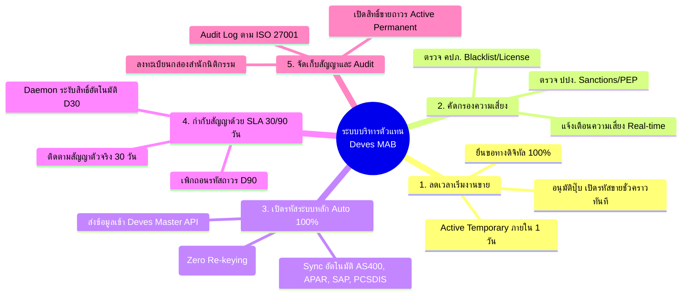
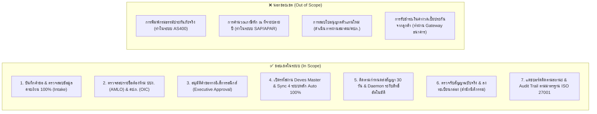
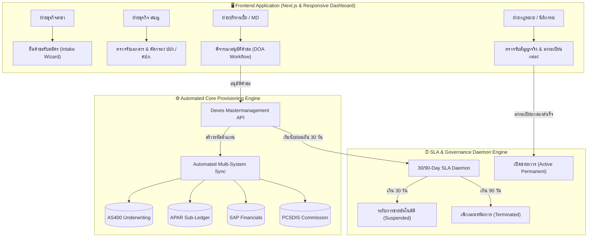
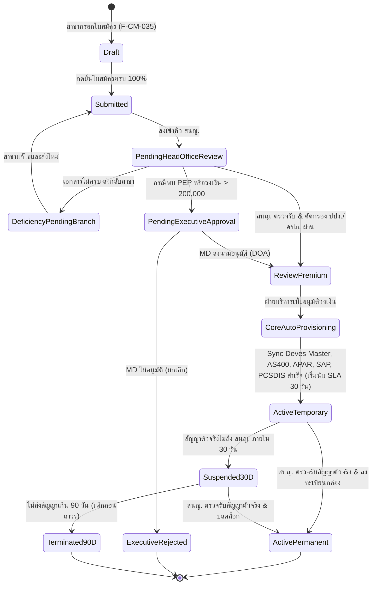
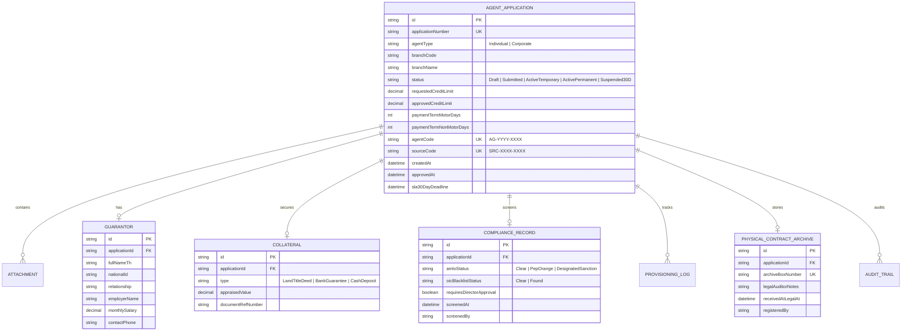

# เอกสารวิเคราะห์ระบบบริหารจัดการตัวแทน/นายหน้า (Agent & Broker Management System) — F-BP-009

> **โครงการ:** P2026-009 ระบบบริหารจัดการตัวแทนและนายหน้า (Agent & Broker Management System)  
> **บริษัท:** บริษัท เทเวศประกันภัย จำกัด (มหาชน) — Deves Insurance Public Company Limited  
> **รหัสแบบฟอร์ม:** F-BP-009 (Rev.1.0) / F-CM-035 (ใบสมัครตัวแทน) / F-CM-018 (ชุดสัญญาแต่งตั้งตัวแทน)  
> **เอกสารอ้างอิง:** ISO QP-CM-004, BPMN Workflow, Master Intake Schema 100% Completeness  
> **สถานะ:** Approved Baseline for System Implementation & Testing  

---

## ข้อมูลเอกสาร (Document Header)

| หัวข้อ | รายละเอียด |
|---|---|
| **Document Type** | Software Requirement Specification & Business Analysis (SRS Analysis) |
| **Project Code** | P2026-009 — Managed Agent & Broker Onboarding Platform |
| **System Name** | ระบบบริหารจัดการตัวแทนและนายหน้า (Agent & Broker Management System: MAB) |
| **Form Code** | F-BP-009 (ระบบจัดการตัวแทน), F-CM-035 (ใบสมัคร), F-CM-018 (ชุดสัญญาแต่งตั้ง) |
| **Target Integration** | Deves Mastermanagement, AS400 Core Underwriting, APAR Ledger, SAP Financials, PCSDIS Commission |
| **Version** | 1.0.0 (Official Release) |
| **Prepared by** | Business Analyst & IT Development Team (Deves) |
| **Approved by** | Head of Business Units, Head of Premium Dept, Legal Director, IT Director |
| **Effective Date** | 22 กันยายน 2569 |

---

## สารบัญ

1. [ภาพรวมและวัตถุประสงค์ (Executive Summary & Objectives)](#1-ภาพรวมและวัตถุประสงค์)
2. [ตารางถอดรหัสคำศัพท์และตัวย่อภาษาไทย (System Terminology & Glossary)](#2-ตารางถอดรหัสคำศัพท์และตัวย่อภาษาไทย)
3. [ขอบเขตงาน (Scope of Work)](#3-ขอบเขตงาน)
4. [ข้อกำหนดทางธุรกิจ (Business Requirements Catalog)](#4-ข้อกำหนดทางธุรกิจ)
5. [บทบาทผู้ใช้และสิทธิ์การใช้งาน (Roles & Permissions Matrix)](#5-บทบาทผู้ใช้และสิทธิ์การใช้งาน)
6. [Use Case ภาพรวมและสถาปัตยกรรมระบบ (System Architecture)](#6-use-case-ภาพรวมและสถาปัตยกรรมระบบ)
7. [กระบวนการทำงานหลักพร้อมภาพประกอบระบบจริง (End-to-End Functional Walkthrough)](#7-กระบวนการทำงานหลักพร้อมภาพประกอบระบบจริง)
   - 7.1 [การเข้าสู่ระบบและการสลับบทบาทผู้ใช้งาน (Persona Authentication)](#71-การเข้าสู่ระบบและการสลับบทบาทผู้ใช้งาน)
   - 7.2 [ภาพรวมแดชบอร์ดและการบริหารคิวงาน (Operational Dashboard)](#72-ภาพรวมแดชบอร์ดและการบริหารคิวงาน)
   - 7.3 [ระบบบันทึกใบสมัครดิจิทัล (Intake Wizard 4 ขั้นตอน)](#73-ระบบบันทึกใบสมัครดิจิทัล-intake-wizard-4-ขั้นตอน)
   - 7.4 [การตรวจรับเอกสารและคัดกรองรายชื่อ ปปง./คปภ. (HO Review & Screening)](#74-การตรวจรับเอกสารและคัดกรองรายชื่อ-ปปงคปภ)
   - 7.5 [การพิจารณาอนุมัติตามอำนาจดำเนินการ (DOA Executive Approval)](#75-การพิจารณาอนุมัติตามอำนาจดำเนินการ)
   - 7.6 [การเปิดรหัสเข้าระบบหลักอัตโนมัติ 100% (Core System Auto-Provisioning)](#76-การเปิดรหัสเข้าระบบหลักอัตโนมัติ-100)
   - 7.7 [การติดตามระยะเวลากำหนดส่งสัญญาฉบับจริง (SLA 30/90-Day Enforcement)](#77-การติดตามระยะเวลากำหนดส่งสัญญาฉบับจริง)
   - 7.8 [การตรวจรับสัญญาฉบับจริงและการจัดเก็บเข้าคลังเอกสาร (Legal Vault Archiving)](#78-การตรวจรับสัญญาฉบับจริงและการจัดเก็บเข้าคลังเอกสาร)
8. [แผนผังสถานะเอกสาร (State Machine & Impact Matrix)](#8-แผนผังสถานะเอกสาร)
9. [กฎเกณฑ์ทางธุรกิจสำหรับการทดสอบ (Business Rules Catalog)](#9-กฎเกณฑ์ทางธุรกิจสำหรับการทดสอบ)
10. [กฎการตรวจสอบความถูกต้องของข้อมูล (Validation Rules Catalog)](#10-กฎการตรวจสอบความถูกต้องของข้อมูล)
11. [แบบจำลองข้อมูล (Data Model - ER Diagram)](#11-แบบจำลองข้อมูล)
12. [ข้อกำหนดด้านคุณภาพระบบ (Non-Functional Requirements - NFR)](#12-ข้อกำหนดด้านคุณภาพระบบ)
13. [การคุ้มครองข้อมูลส่วนบุคคล (PDPA Consideration)](#13-การคุ้มครองข้อมูลส่วนบุคคล)
14. [แผนการบริหารความเสี่ยง (Risk Management Plan)](#14-แผนการบริหารความเสี่ยง)
15. [ประเด็นข้อยุติและการดำเนินงาน (Resolved & Baseline Decisions)](#15-ประเด็นข้อยุติและการดำเนินงาน)
16. [แนวทางการทดสอบระบบ (Test Strategy & Traceability Matrix)](#16-แนวทางการทดสอบระบบ)
17. [ภาคผนวก (Appendix: API Endpoints & Form Mappings)](#17-ภาคผนวก)

---

## 1. ภาพรวมและวัตถุประสงค์

ระบบบริหารจัดการตัวแทนและนายหน้า (Agent & Broker Management System) พัฒนาขึ้นเพื่อยกระดับกระบวนการรับสมัครและแต่งตั้งตัวแทนประกันวินาศภัยของบริษัท เทเวศประกันภัย จำกัด (มหาชน) ให้เป็น **กระบวนการดิจิทัลอัตโนมัติแบบครบวงจร (Digital Touchless Workflow)** ทดแทนกระบวนการเดิมที่ต้องใช้เอกสารกระดาษ (`F-CM-035` และ `F-CM-018`) และการส่งไปรษณีย์ ซึ่งเดิมใช้เวลาอนุมัติเฉลี่ย 15–30 วัน ให้ลดลงเหลือ **ภายใน 1 วันทำการ**

| # | วัตถุประสงค์เชิงธุรกิจ | ประโยชน์ที่ได้รับเชิงระบบ (System Benefits) |
|---|---|---|
| **1** | **ลดระยะเวลาเริ่มงานขาย (Time-to-Market)** | ตัวแทนสามารถเริ่มส่งงานขายได้ทันทีหลังฝ่ายบริหารเบี้ยอนุมัติ โดยระบบจะเปิดสถานะ **เปิดขายชั่วคราว (Active Temporary)** อัตโนมัติในวันเดียวกัน |
| **2** | **ป้องกันความเสี่ยงด้านกฎหมายและ Compliance** | บังคับตรวจคัดกรองรายชื่อ ปปง. (AMLO) และตรวจสอบใบอนุญาต/บัญชีดำ คปภ. (OIC) ก่อนเสนอผู้บริหารพิจารณา |
| **3** | **เชื่อมโยงระบบหลักอัตโนมัติ 100% (Zero IT Re-keying)** | หน้าจอรับสมัครบังคับกรอกข้อมูลครบถ้วน 100% ตามมาตรฐาน Deves Mastermanagement เพื่อให้ระบบยิง API สร้าง Agent/Source Code และเชื่อมต่อ AS400, APAR, SAP, PCSDIS โดยที่ IT ไม่ต้องคีย์มือ |
| **4** | **รักษาวินัยการจัดส่งสัญญาฉบับจริง (30/90-Day SLA Enforcement)** | มีระบบจับเวลาอัตโนมัติ หากไม่จัดส่งสัญญาฉบับจริงภายใน 30 วัน ระบบจะสั่งระงับการขาย (Suspended) ทันที และหากเกิน 90 วันจะสั่งเพิกถอนถาวร (Terminated) |
| **5** | **จัดเก็บสัญญาเข้าคลังเอกสารอย่างถูกต้อง** | สำนักนิติกรรมตรวจรับสัญญาฉบับจริง ลงทะเบียนหมายเลขกล่องจัดเก็บ และปลดล็อกเป็น **เปิดขายถาวร (Active Permanent)** |
| **6** | **ตรวจสอบย้อนกลับได้ทุกขั้นตอน (Full Auditability)** | บันทึกประวัติการกระทำ (Audit Trail) พร้อมลายเซ็นดิจิทัลและการเข้ารหัสข้อมูลส่วนบุคคล (PDPA Compliant) |

---

## 2. ตารางถอดรหัสคำศัพท์และตัวย่อภาษาไทย

เพื่อให้ทุกฝ่ายในองค์กรเข้าใจตรงกัน ขจัดความสับสนจากคำศัพท์เทคนิคและตัวย่อภาษาอังกฤษ:

| ตัวย่อ / ศัพท์เทคนิค | คำภาษาไทยมาตรฐาน (เข้าใจง่าย) | คำอธิบายและบริบทการใช้งานในระบบ |
|---|---|---|
| **AMLO** | **สำนักงาน ปปง.** (ป้องกันและปราบปรามการฟอกเงิน) | การตรวจคัดกรองรายชื่อบุคคลที่ถูกกำหนด (Sanctions List) และบุคคลที่มีสถานภาพทางการเมือง (PEP) ก่อนเปิดรหัสตัวแทน |
| **OIC** | **สำนักงาน คปภ.** (กำกับและส่งเสริมการประกอบธุรกิจประกันภัย) | การตรวจสอบความถูกต้องของใบอนุญาตตัวแทน/นายหน้า และตรวจสอบประวัติการถูกเพิกถอนใบอนุญาต (Blacklist) |
| **PEP** | **บุคคลที่มีสถานภาพทางการเมือง** (Politically Exposed Persons) | บุคคลผู้ดำรงตำแหน่งทางการเมืองหรือครอบครัว หากตรวจพบระบบจะส่งให้ผู้บริหารระดับสูง (MD) พิจารณาอนุมัติเป็นกรณีพิเศษ |
| **SLA** | **กำหนดเวลาดำเนินการ** (ระยะเวลาผ่อนผัน 30 วัน) | ระยะเวลากำหนดส่งสัญญาฉบับจริง (F-CM-018) เข้าคลังเอกสารภายใน 30 วัน หากเกินระบบจะระงับการขายอัตโนมัติ |
| **Branch BU** | **ฝ่ายธุรกิจสาขา** (สาขาผู้ยื่นคำขอ) | เจ้าหน้าที่สาขาที่ทำหน้าที่กรอกใบสมัคร (F-CM-035), อัปโหลดเอกสารประกอบ และจัดส่งสัญญาฉบับจริง |
| **HO BU** | **ฝ่ายธุรกิจสำนักงานใหญ่ (สนญ.)** | เจ้าหน้าที่สำนักงานใหญ่ที่ตรวจรับเอกสาร, ตรวจสอบรายชื่อ ปปง./คปภ. และส่งต่อผู้บริหาร |
| **Premium Dept** | **ฝ่ายบริหารจัดการเบี้ยประกันภัย** | ฝ่ายที่ตรวจสอบวงเงินสินเชื่อ, ตรวจสอบหลักทรัพย์ค้ำประกัน, และส่งคำสั่งเปิดรหัสเข้าระบบหลัก |
| **Legal Dept** | **สำนักนิติกรรม (ฝ่ายกฎหมาย)** | ฝ่ายที่ตรวจสอบความสมบูรณ์ทางนิติกรรม, ตรวจรับสัญญาฉบับจริง (F-CM-018), ลงทะเบียนกล่องจัดเก็บ และปลดล็อกเปิดขายถาวร |
| **Approver MD** | **กรรมการผู้จัดการ / ผู้มีอำนาจลงนาม** | ผู้บริหารระดับสูงที่ลงนามพิจารณาอนุมัติคำขอเปิดตัวแทนผ่านระบบอิเล็กทรอนิกส์ |
| **Core Provisioning** | **การเปิดรหัสเข้าระบบหลักอัตโนมัติ 100%** | การสร้างรหัสตัวแทน (Agent Code) และรหัสช่องทาง (Source Code) ในระบบ Deves Master และเชื่อมต่อไปยัง AS400, APAR, SAP, PCSDIS แบบ Zero-Touch |
| **Active Temporary** | **เปิดขายชั่วคราว (รอสัญญา 30 วัน)** | สถานะที่ตัวแทนได้รับรหัสและสามารถเริ่มส่งงานขายได้ทันที โดยอยู่ระหว่างรอจัดส่งเอกสารสัญญาตัวจริงภายใน 30 วัน |
| **Active Permanent** | **เปิดขายถาวร (สัญญาครบถ้วน)** | สถานะที่ฝ่ายกฎหมายได้รับและจัดเก็บเอกสารสัญญาฉบับจริงลงกล่องเรียบร้อยแล้ว สิ้นสุดการนับเวลาผ่อนผัน |
| **Suspended (30D)** | **ระงับการขายชั่วคราว (เกินกำหนด 30 วัน)** | สถานะที่ระบบ Daemon ระงับสิทธิ์การส่งงานขายในระบบหลักอัตโนมัติ เนื่องจากไม่ส่งสัญญาฉบับจริงภายใน 30 วัน |
| **Terminated (90D)** | **เพิกถอนรหัสถาวร (เกินกำหนด 90 วัน)** | สถานะที่ระบบเพิกถอนรหัสตัวแทนอย่างถาวร หลังถูกระงับสิทธิ์เกิน 90 วัน |
| **AS400 / Core** | **ระบบงานหลักประกันภัย (Core Insurance)** | ระบบหลักที่ใช้ออกกรมธรรม์และบันทึกสิทธิ์การขายของตัวแทน |
| **APAR / SAP** | **ระบบบัญชีลูกหนี้-เจ้าหนี้ และการเงิน** | ระบบบันทึกบัญชีเจ้าหนี้ตัวแทนเพื่อการจ่ายเงินผลประโยชน์และค่าคอมมิชชั่น |
| **PCS / PCSDIS** | **ระบบโครงสร้างค่าคอมมิชชั่น** | ระบบจัดการโครงสร้างอัตราผลประโยชน์และค่าตอบแทนตัวแทน |

---

## 3. ขอบเขตงาน

---

## 4. ข้อกำหนดทางธุรกิจ

| รหัสข้อกำหนด | รายละเอียดข้อกำหนดทางธุรกิจ (Business Requirement) | หมวดงาน | ความสำคัญ |
|---|---|---|---|
| **BR-INT-001** | บันทึกข้อมูลใบสมัครตัวแทนบุคคลธรรมดาและนิติบุคคล พร้อมตรวจสอบเลข 13 หลัก และข้อมูลติดต่อ | Intake Form | High |
| **BR-INT-002** | บันทึกข้อมูลผู้ค้ำประกัน สลิปเงินเดือน และหลักทรัพย์ค้ำประกัน (โฉนด, หนังสือค้ำประกันธนาคาร, เงินสด) | Guarantor | High |
| **BR-INT-003** | อัปโหลดเอกสารแนบพร้อมการตรวจสอบความแท้จริงของไฟล์ด้วย Magic Bytes ป้องกันไฟล์ปลอมแปลง | File Security | High |
| **BR-SCR-001** | ตรวจสอบรายชื่อผู้ถูกกำหนดตามกฎหมาย ปปง. (Sanctions / Designated List) แบบอัตโนมัติ | Compliance | Critical |
| **BR-SCR-002** | ตรวจสอบสถานะใบอนุญาตและประวัติการถูกเพิกถอนใบอนุญาตจากสำนักงาน คปภ. | Compliance | Critical |
| **BR-SCR-003** | กรณีพบเป็นบุคคล PEP หรือขอวงเงินเกิน 200,000 บาท ต้องบังคับส่งให้อนุมัติ 2 ลำดับชั้น (Dual Approval) | Governance | High |
| **BR-APP-001** | ฝ่ายบริหารจัดการเบี้ยอนุมัติคำขอ วงเงินสินเชื่อ และเทอมการชำระเบี้ย (Motor 30 วัน, Non-Motor 45 วัน) | Approval | High |
| **BR-PRV-001** | เปิดรหัสตัวแทนและเชื่อมโยงระบบหลักอัตโนมัติ 100% (Deves Master, AS400, APAR, SAP, PCSDIS) | Integration | Critical |
| **BR-SLA-001** | นับถอยหลังระยะเวลาผ่อนผันส่งสัญญาฉบับจริง 30 วัน (SLA Countdown) แสดงแถบสีเตือนสถานะ | SLA Engine | High |
| **BR-SLA-002** | มีระบบ Daemon ตรวจสอบทุกเที่ยงคืน หากเกิน 30 วัน สั่งระงับการขายอัตโนมัติ และหากเกิน 90 วัน สั่งเพิกถอนถาวร | Automation | High |
| **BR-ARC-001** | สำนักนิติกรรมตรวจรับสัญญาฉบับจริง บันทึกหมายเลขกล่องจัดเก็บ และปลดล็อกเปิดสิทธิ์ขายถาวร | Legal Vault | High |
| **BR-AUD-001** | บันทึกประวัติการกระทำของผู้ใช้ทุกคน (Audit Trail) ตามมาตรฐาน ISO 27001 ห้ามลบหรือแก้ไขย้อนหลัง | Auditability | Critical |

---

## 5. บทบาทผู้ใช้และสิทธิ์การใช้งาน

| บทบาทผู้ใช้งาน | ขอบเขตข้อมูล (Data Scope) | สิทธิ์การทำงานในระบบ |
|---|---|---|
| **1. เจ้าหน้าที่ฝ่ายธุรกิจสาขา (Branch Officer)** | เฉพาะสาขาตนเอง | กรอกใบสมัคร, แก้ไขแบบร่าง, อัปโหลดเอกสารแนบ, ติดตามสถานะ SLA และจัดส่งสัญญาตัวจริง |
| **2. เจ้าหน้าที่ตรวจรับ สนญ. (HO Reviewer)** | ทั่วทั้งองค์กร | ตรวจสอบความครบถ้วนของเอกสาร, สั่งตรวจคัดกรอง ปปง./คปภ., ส่งกลับแก้ไข หรือส่งต่อผู้บริหาร |
| **3. ผู้บริหารระดับสูง / MD (Executive Approver)** | ทั่วทั้งองค์กร | พิจารณาลงนามอนุมัติคำขอเปิดตัวแทน, พิจารณาเคสพิเศษ (PEP / วงเงินเกินกำหนด) |
| **4. ฝ่ายบริหารจัดการเบี้ย (Premium Reviewer)** | ทั่วทั้งองค์กร | อนุมัติวงเงินสินเชื่อ/เทอมชำระเบี้ย, สั่งเปิดรหัสเข้าระบบหลักอัตโนมัติ และติดตามผลการเชื่อมต่อ |
| **5. ฝ่ายกฎหมาย / สำนักนิติกรรม (Legal Auditor)** | ทั่วทั้งองค์กร | ตรวจรับสัญญาฉบับจริง, ตรวจสอบความถูกต้องทางนิติกรรม, ลงทะเบียนกล่องจัดเก็บ และปลดล็อกเปิดขายถาวร |
| **6. ผู้ดูแลระบบไอที (System Administrator)** | ทั่วทั้งองค์กร | จัดการผู้ใช้/สิทธิ์, สั่ง Retry การเชื่อมต่อระบบหลัก, ตรวจสอบ System Health และ Audit Log |

---

## 6. Use Case ภาพรวมและสถาปัตยกรรมระบบ

---

## 7. กระบวนการทำงานหลักพร้อมภาพประกอบระบบจริง

### 7.1 การเข้าสู่ระบบและการสลับบทบาทผู้ใช้งาน

ระบบรองรับการยืนยันตัวตนและการจำลองสิทธิ์ (Persona-based Testing & Production RBAC) ช่วยให้ผู้ใช้งานสามารถทดสอบและปฏิบัติงานตามบทบาทหน้าที่ของตนได้อย่างถูกต้อง

#### ตัวอย่างการทำงานจริง (Working Example):
- ผู้ใช้เข้าสู่ระบบที่ `/login` จะพบบทบาทที่กำหนดไว้ในองค์กร ได้แก่ ฝ่ายธุรกิจสาขา, ฝ่ายธุรกิจสำนักงานใหญ่ (สนญ.), ฝ่ายบริหารจัดการเบี้ย, ฝ่ายกฎหมาย/สำนักนิติกรรม, กรรมการผู้จัดการ (MD) และผู้ดูแลระบบไอที
- เมื่อเลือกบทบาท เช่น **ฝ่ายธุรกิจสาขา (คุณนารี สาขากรุงเทพฯ)** ระบบจะโหลดสิทธิ์การทำงาน ขอบเขตสาขา และนำเข้าสู่แดชบอร์ดหลักทันที

---

### 7.2 ภาพรวมแดชบอร์ดและการบริหารคิวงาน

หน้าจอแดชบอร์ดรวมศูนย์แสดงสถิติตัวชี้วัดสำคัญ คิวงานที่ต้องดำเนินการ และรายการใบสมัครล่าสุดพร้อมป้ายกำกับสถานะที่เข้าใจง่าย

#### ตัวอย่างการทำงานจริง (Working Example):
- แดชบอร์ดสรุปยอดใบสมัครทั้งหมด (เช่น 8 รายการ), รายการที่อยู่ระหว่างรอ สนญ. ตรวจรับ, รายการที่ได้รับอนุมัติเปิดขายชั่วคราว และรายการที่จัดเก็บสัญญาถาวรแล้ว
- แสดงแถบเวลานับถอยหลัง SLA สำหรับเคสเปิดขายชั่วคราว เช่น **เหลือเวลาอีก 24 วัน** ช่วยให้เจ้าหน้าที่สาขาสามารถติดตามสัญญาตัวจริงได้อย่างทันท่วงที

---

### 7.3 ระบบบันทึกใบสมัครดิจิทัล (Intake Wizard 4 ขั้นตอน)

กระบวนการบันทึกข้อมูลใบสมัครตามแบบฟอร์ม `F-CM-035` ถูกออกแบบเป็น Wizard 4 ขั้นตอนที่บังคับความครบถ้วนของข้อมูล 100% เพื่อรองรับการเปิดรหัสระบบหลักแบบอัตโนมัติ

#### ขั้นตอนที่ 1: บันทึกข้อมูลประวัติและตรวจสอบเลขประจำตัว (Applicant Profile)

- **ตัวอย่างข้อมูล:** นายเอกชัย สมบูรณ์ทรัพย์ เลขประจำตัวประชาชน `1100400892348`
- **การตรวจสอบ:** ระบบตรวจสอบสูตร Modulo 11 Checksum ทันที หากกรอกถูกต้องจะแสดงเครื่องหมายถูกสีเขียว *"ตรวจสอบหลัก Modulo 11 ถูกต้อง"* พร้อมบันทึกบัญชีธนาคารสำหรับรับผลประโยชน์

#### ขั้นตอนที่ 2: วงเงินสินเชื่อ ผู้ค้ำประกัน และหลักทรัพย์ค้ำประกัน (Guarantor & Collateral)

- **ตัวอย่างข้อมูล:** วงเงินสินเชื่อที่ขอ `200,000 บาท`, เทอมชำระเบี้ย Motor 30 วัน / Non-Motor 45 วัน
- **หลักประกัน:** บันทึกผู้ค้ำประกัน (นางสาววิภาดา สมบูรณ์ทรัพย์ เลขบัตร `3100600123891`, รายได้ 65,000 บาท/เดือน) และหนังสือค้ำประกันธนาคาร (Bank Guarantee เลขที่ `BG-KBANK-2026-9941`)

#### ขั้นตอนที่ 3: อัปโหลดเอกสารหลักฐานพร้อมการตรวจรับรอง Magic Bytes (Document Upload)

- **การรักษาความปลอดภัย:** ตรวจสอบโครงสร้างไบนารีระดับ Magic Bytes (`25 50 44 46` สำหรับ PDF) ป้องกันการเปลี่ยนนามสกุลไฟล์เพื่อหลอกระบบ
- **เอกสารบังคับ:** สำเนาบัตรประชาชน, สำเนาสมุดบัญชีเงินฝากธนาคาร, สำเนาใบอนุญาตตัวแทน และหนังสือค้ำประกัน

#### ขั้นตอนที่ 4: ตรวจสอบสรุปข้อมูลและคำยินยอม PDPA (Review & Submit)

- แสดงภาพรวมข้อมูลทั้งหมด ตารางผลประโยชน์ และกล่องยินยอม PDPA
- เมื่อกดยืนยัน ระบบจะแสดงการแจ้งเตือนสำเร็จและส่งต่อใบสมัครเข้าคิวตรวจรับ สนญ. ทันที:

---

### 7.4 การตรวจรับเอกสารและคัดกรองรายชื่อ ปปง./คปภ.

ฝ่ายธุรกิจสำนักงานใหญ่ (สนญ.) ทำหน้าที่ตรวจสอบความถูกต้องครบถ้วนของเอกสาร และสั่งตรวจคัดกรองความเสี่ยงด้านกฎหมาย

#### รายละเอียดหน้าต่างตรวจรับและคัดกรอง (Verification Modal):
- เจ้าหน้าที่ สนญ. กดปุ่ม **"ตรวจรับ & คัดกรอง"** เพื่อเปิดแฟ้มประวัติผู้สมัครฉบับเต็ม
- ระบบเชื่อมต่อ API ตรวจสอบรายชื่อ ปปง. (Sanctions / PEP) และ คปภ. (Blacklist / License Validity)
- หากผลการตรวจผ่านเกณฑ์ (Clear) เจ้าหน้าที่จะกด **"ส่งต่อฝ่ายบริหารเบี้ยพิจารณา"**

---

### 7.5 การพิจารณาอนุมัติตามอำนาจดำเนินการ (DOA Executive Approval)

ระบบแบ่งแยกสายการอนุมัติตามระดับความเสี่ยงและวงเงินสินเชื่อ (DOA Matrix):

#### 1. ฝ่ายบริหารจัดการเบี้ยประกันภัย (Premium Dept Approval):
สำหรับเคสปกติที่ผลตรวจ ปปง./คปภ. ผ่าน และวงเงินค้ำประกันไม่เกิน 200,000 บาท ฝ่ายบริหารเบี้ยสามารถลงนามอนุมัติและสั่งเปิดรหัสขายชั่วคราวได้ทันที

#### 2. กรรมการผู้จัดการ / ผู้บริหารระดับสูง (MD Dual-Approval):
สำหรับเคสที่มีความเสี่ยงสูง เช่น ตรวจพบเป็นบุคคล PEP หรือวงเงินสินเชื่อเกิน 200,000 บาท ระบบจะส่งเข้าคิว Dual-Approval ให้กรรมการผู้จัดการลงนามอนุมัติเป็นกรณีพิเศษ

---

### 7.6 การเปิดรหัสเข้าระบบหลักอัตโนมัติ 100% (Core System Auto-Provisioning)

เมื่อคำขอได้รับการอนุมัติ ระบบจะสั่งการสร้างรหัสตัวแทน (Agent Code) และรหัสช่องทาง (Source Code) ในระบบ Deves Master และยิงข้อมูลเชื่อมต่อไปยัง 4 ระบบหลักแบบขนานอัตโนมัติ โดยที่ฝ่ายไอทีไม่ต้องคีย์ข้อมูลซ้ำแม้แต่ฟิลด์เดียว

#### สถานะการเชื่อมต่อ 4 ระบบหลัก:
1. **AS400 Core Underwriting:** เปิดสิทธิ์การบันทึกงานขายและออกกรมธรรม์
2. **APAR Sub-Ledger:** สร้างผังบัญชีเจ้าหนี้ตัวแทนเพื่อรอรับยอดเบี้ย
3. **SAP Financials:** บันทึกข้อมูลคู่ค้าและศูนย์ต้นทุน (Cost Center)
4. **PCSDIS Commission:** ผูกโครงสร้างอัตราค่าตอบแทนและสายงานบริหาร (Unit Executive)

---

### 7.7 การติดตามระยะเวลากำหนดส่งสัญญาฉบับจริง (SLA 30/90-Day Enforcement)

เพื่อรักษาวินัยการจัดส่งสัญญาฉบับจริง (`F-CM-018`) ระบบมีแดชบอร์ดติดตามเวลาผ่อนผัน 30 วัน พร้อมระบบ Daemon ทำงานอัตโนมัติทุกเที่ยงคืน

#### กฎเกณฑ์การบังคับใช้ SLA:
- **วันที่ 1–23:** สถานะสีเขียว (ปกติ) แสดงจำนวนวันคงเหลือ
- **วันที่ 24–30:** สถานะสีส้ม (เตือนใกล้ครบกำหนด < 7 วัน) ส่งอีเมลแจ้งเตือนสาขาและผู้บริหาร
- **วันที่ 31 (เกิน 30 วัน):** Daemon สั่งเปลี่ยนสถานะเป็น **ระงับการขาย (Suspended30D)** อัตโนมัติ ปิดสิทธิ์การออกกรมธรรม์ใน AS400 ชั่วคราว
- **วันที่ 91 (เกิน 90 วัน):** Daemon สั่งเปลี่ยนสถานะเป็น **เพิกถอนรหัสถาวร (Terminated90D)** ปิดรหัสตัวแทนอย่างถาวร

---

### 7.8 การตรวจรับสัญญาฉบับจริงและการจัดเก็บเข้าคลังเอกสาร (Legal Vault Archiving)

เมื่อสำนักนิติกรรม (ฝ่ายกฎหมาย) ได้รับชุดสัญญาฉบับจริงพร้อมลายเซ็นสดและเอกสารค้ำประกันตัวจริง จะทำการตรวจรับและบันทึกหมายเลขกล่องจัดเก็บ

#### ขั้นตอนการลงทะเบียนกล่อง:
1. เจ้าหน้าที่นิติกรรมกดปุ่ม **"ลงทะเบียนจัดเก็บกล่อง"**
2. บันทึกหมายเลขกล่องจัดเก็บเอกสาร เช่น `BOX-2026-HQ-089` พร้อมบันทึกผลการตรวจรับ
3. ระบบปลดล็อกสถานะตัวแทนเป็น **เปิดขายถาวร (Active Permanent)** สิ้นสุดการนับถอยหลัง SLA อย่างสมบูรณ์

---

## 8. แผนผังสถานะเอกสาร

---

## 9. กฎเกณฑ์ทางธุรกิจสำหรับการทดสอบ

| รหัสกฎ | เงื่อนไขการตรวจสอบ | ผลลัพธ์เชิงระบบ / ข้อความแจ้งเตือน | HTTP Status |
|---|---|---|---|
| **BRC-VAL-001** | เลขประจำตัวประชาชน 13 หลักไม่ตรงสูตร Modulo 11 | ไม่อนุญาตให้กดถัดไป แสดงข้อความ *"เลขประจำตัวประชาชนไม่ถูกต้องตามสูตรคำนวณ"* | 400 Bad Request |
| **BRC-VAL-002** | ขนาดไฟล์แนบเกิน 10MB | ปฏิเสธการอัปโหลด แสดงข้อความ *"ขนาดไฟล์เกินขีดจำกัด 10MB"* | 413 Payload Too Large |
| **BRC-VAL-003** | ไบนารี Header ไฟล์ไม่ตรงนามสกุล (Spoofing) | ปฏิเสธการอัปโหลด แสดงข้อความ *"รูปแบบไฟล์ไม่ถูกต้องตาม Header ลายเซ็นดิจิทัล"* | 422 Unprocessable Entity |
| **BRC-SCR-001** | ตรวจพบรายชื่อใน Sanctions List ปปง. (DesignatedSanction) | ล็อกระบบห้ามส่งต่อ แสดงสถานะ *"พบรายชื่อผู้ถูกกำหนด ปปง. (ห้ามดำเนินการ)"* | 403 Forbidden |
| **BRC-SCR-002** | ตรวจพบสถานะ PEP (PepOrange) หรือขอวงเงิน > 200,000 บาท | ส่งเข้าคิว Dual-Approval บังคับกรรมการผู้จัดการ (MD) ลงนามอนุมัติ | 200 OK (Route MD) |
| **BRC-PRV-001** | เชื่อมต่อ AS400 หรือ SAP ล้มเหลว | บันทึกสถานะ Partial Success / Failed และเปิดปุ่มให้ไอทีกด Retry ได้ | 502 Bad Gateway |
| **BRC-SLA-001** | สัญญาตัวจริงยังไม่จัดเก็บเมื่อครบ 30 วัน (นับจากวันเปิดขายชั่วคราว) | Daemon เปลี่ยนสถานะเป็น `Suspended30D` และระงับสิทธิ์ใน AS400 ทันที | 200 OK (Daemon) |
| **BRC-SLA-002** | ถูกระงับสิทธิ์ครบ 90 วันและยังไม่ส่งสัญญาตัวจริง | Daemon เปลี่ยนสถานะเป็น `Terminated90D` เพิกถอนรหัสถาวร | 200 OK (Daemon) |
| **BRC-ARC-001** | สำนักนิติกรรมบันทึกหมายเลขกล่องจัดเก็บสำเร็จ | เปลี่ยนสถานะเป็น `ActivePermanent` ปลดล็อกสิทธิ์ขายถาวร | 200 OK |

---

## 10. กฎการตรวจสอบความถูกต้องของข้อมูล

| Validation ID | ฟิลด์ข้อมูล | เงื่อนไขการตรวจสอบ | ข้อความแจ้งเตือนความผิดพลาด | ระดับความรุนแรง |
|---|---|---|---|---|
| **VR-001** | `nationalIdOrTaxId` | 13 หลักตัวเลข และ Checksum Modulo 11 ถูกต้อง | เลขประจำตัวประชาชน 13 หลักไม่ถูกต้อง | Error (Blocking) |
| **VR-002** | `firstNameTh`, `lastNameTh` | ตัวอักษรภาษาไทย ความยาว 2–100 ตัวอักษร | กรุณาระบุชื่อและนามสกุลภาษาไทยให้ถูกต้อง | Error (Blocking) |
| **VR-003** | `phoneNumber` | หมายเลขโทรศัพท์ 9–10 หลัก ขึ้นต้นด้วย 0 | กรุณาระบุเบอร์โทรศัพท์ติดต่อให้ถูกต้อง | Error (Blocking) |
| **VR-004** | `bankAccountNumber` | ตัวเลข 10–12 หลักตามมาตรฐานธนาคารที่เลือก | กรุณาระบุเลขที่บัญชีธนาคารให้ถูกต้อง | Error (Blocking) |
| **VR-005** | `requestedCreditLimit` | ตัวเลขมากกว่า 0 บาท | กรุณาระบุวงเงินสินเชื่อที่ต้องการขอ | Error (Blocking) |
| **VR-006** | `attachments` | ต้องมีสำเนาบัตรประชาชน และสำเนาสมุดบัญชี | กรุณาแนบเอกสารสำเนาบัตรและสมุดบัญชีให้ครบถ้วน | Error (Blocking) |
| **VR-007** | `archiveBoxNumber` | รูปแบบ `BOX-YYYY-BR-XXX` ความยาว 10–30 ตัวอักษร | กรุณาระบุหมายเลขกล่องจัดเก็บเอกสารให้ถูกต้อง | Error (Blocking) |

---

## 11. แบบจำลองข้อมูล

---

## 12. ข้อกำหนดด้านคุณภาพระบบ

| NFR ID | หมวดหมู่ | ข้อกำหนดเชิงคุณภาพ (Non-Functional Requirement) | เกณฑ์การวัดผล |
|---|---|---|---|
| **NFR-SEC-001** | **Security** | ตรวจสอบ Header ลายเซ็นดิจิทัลของไฟล์ (Magic Bytes) ทุกไฟล์ก่อนอนุญาตให้เข้าสู่ระบบ | 100% Anti-Spoofing |
| **NFR-SEC-002** | **Security** | เข้ารหัสข้อมูลที่จัดเก็บ (Data at Rest) ด้วย AES-256 และเข้ารหัสขณะส่งผ่านเครือข่าย (Data in Transit) ด้วย TLS 1.3 | Zero Plaintext PII |
| **NFR-PER-001** | **Performance** | เวลาในการตอบสนองของหน้าจอ (UI Page Load & Search) ต้องไม่เกิน 1.5 วินาที | P95 < 1.5s |
| **NFR-PER-002** | **Performance** | การประมวลผล Provisioning เชื่อมโยง 4 ระบบหลักต้องเสร็จสิ้นภายใน 5 วินาที | Timeout 5s with Async Retry |
| **NFR-AVL-001** | **Availability** | ระบบมีความพร้อมใช้งาน (System Uptime) ไม่น้อยกว่า 99.9% ในช่วงเวลาทำการ | MTBF > 720 hrs |
| **NFR-AUD-001** | **Auditability** | บันทึกประวัติการทำรายการทุกขั้นตอน (Audit Trail) พร้อม Timestamp และ IP Address ตามมาตรฐาน ISO 27001 | Immutable Log Retention 10 Yrs |

---

## 13. การคุ้มครองข้อมูลส่วนบุคคล

เพื่อให้สอดคล้องกับพระราชบัญญัติคุ้มครองข้อมูลส่วนบุคคล พ.ศ. 2562 (PDPA):

1. **การปกปิดข้อมูลส่วนบุคคลบนหน้าจอ (PII Masking):**
   - เลขประจำตัวประชาชน 13 หลัก แสดงผลในรูปแบบ `1-1004-XXXXX-XX-8` โดยมีปุ่มรูปดวงตาให้ผู้มีสิทธิ์กดดูฉบับเต็มได้
   - เลขที่บัญชีธนาคาร แสดงผลในรูปแบบ `XXX-X-XX3472`
2. **การขอความยินยอม (Consent Management):**
   - บังคับเลือกเครื่องหมายยินยอมเปิดเผยข้อมูลเพื่อการตรวจสอบประวัติอาชญากรรมและคัดกรอง ปปง./คปภ. ในขั้นตอนที่ 4 ของการสมัคร
3. **การจำกัดสิทธิ์การเข้าถึง (Need-to-Know Basis):**
   - เจ้าหน้าที่สาขาจะมองเห็นเฉพาะข้อมูลผู้สมัครในสาขาของตนเองเท่านั้น

---

## 14. แผนการบริหารความเสี่ยง

| ลำดับ | ความเสี่ยงที่อาจเกิดขึ้น | ผลกระทบ | มาตรการป้องกันและแก้ไข (Mitigation Strategy) |
|---|---|---|---|
| **1** | ระบบหลัก (AS400/SAP) ขัดข้องขณะ Provisioning | ตัวแทนไม่ได้รับรหัสทันที | มีระบบ In-Memory Outbox Queue และปุ่ม Retry ให้ไอทีกดส่งข้อมูลซ้ำได้โดยไม่ต้องคีย์ใหม่ |
| **2** | สาขาไม่จัดส่งสัญญาฉบับจริงภายใน 30 วัน | ความเสี่ยงด้านนิติกรรมสัญญา | ระบบมี SLA Countdown แจ้งเตือนล่วงหน้า 7 วัน และมี Daemon ระงับสิทธิ์การขายอัตโนมัติเมื่อครบ 30 วัน |
| **3** | มีการปลอมแปลงนามสกุลไฟล์เอกสารแนบ | ความเสี่ยงด้านมัลแวร์และความถูกต้องของเอกสาร | ตรวจสอบโครงสร้างไฟล์ด้วย Magic Byte Header Binary Validator ก่อนบันทึกเข้าเซิร์ฟเวอร์ |
| **4** | ผู้สมัครเป็นบุคคลที่มีความเสี่ยงทางการเมือง (PEP) | ความเสี่ยงด้าน Compliance ปปง. | บังคับส่งเคสเข้าคิว Dual-Approval ให้กรรมการผู้จัดการ (MD) พิจารณาอนุมัติเป็นกรณีพิเศษ |

---

## 15. ประเด็นข้อยุติและการดำเนินงาน

| ลำดับ | ประเด็นการวิเคราะห์ | ข้อตกลงร่วมกัน (Baseline Agreement) | ผู้เกี่ยวข้อง |
|---|---|---|---|
| **1** | การนับระยะเวลา SLA 30 วัน | เริ่มนับตั้งแต่วันที่ฝ่ายบริหารเบี้ยอนุมัติและเปิดสถานะ `ActiveTemporary` โดยนับรวมวันหยุดราชการ | ฝ่ายธุรกิจ, ฝ่ายบริหารเบี้ย, สำนักนิติกรรม |
| **2** | การระงับสิทธิ์และการปลดล็อก | ระบบ Daemon สั่งระงับสิทธิ์อัตโนมัติเมื่อครบ 30 วัน และเมื่อสำนักนิติกรรมตรวจรับสัญญาตัวจริง ระบบจะปลดล็อกเป็นเปิดขายถาวรทันที | ฝ่ายกฎหมาย, ฝ่ายไอที |
| **3** | วงเงินค้ำประกันและการอนุมัติ | วงเงินปกติ ≤ 200,000 บาท ฝ่ายบริหารเบี้ยอนุมัติได้ หากเกิน 200,000 บาท ต้องเสนอ MD ลงนาม | ฝ่ายบริหารเบี้ย, กรรมการผู้จัดการ |

---

## 16. แนวทางการทดสอบระบบ

### 16.1 ตารางความเชื่อมโยงข้อกำหนดกับการทดสอบ (Traceability Matrix)

| Test Area | BR Reference | ครอบคลุมการทดสอบ | ประเภทการทดสอบ |
|---|---|---|---|
| **TC-INT-001** | BR-INT-001, VR-001 | การกรอกใบสมัครบุคคลธรรมดา, Modulo 11 Checksum และบันทึกแบบร่าง | Happy Path & Boundary |
| **TC-INT-002** | BR-INT-003, VR-003 | การอัปโหลดไฟล์ PDF/JPEG และการปฏิเสธไฟล์ Spoofing Magic Bytes | Security & Negative |
| **TC-SCR-001** | BR-SCR-001, BR-SCR-002 | การสั่งคัดกรองรายชื่อ ปปง. Sanctions และ คปภ. Blacklist | Compliance & Functional |
| **TC-APP-001** | BR-APP-001, BR-SCR-003 | การอนุมัติเคสปกติโดยฝ่ายบริหารเบี้ย และเคส PEP Dual-Approval โดย MD | Workflow & DOA Matrix |
| **TC-PRV-001** | BR-PRV-001 | การเปิดรหัส Deves Master และเชื่อมต่อ AS400, APAR, SAP, PCSDIS อัตโนมัติ | Integration & Retry |
| **TC-SLA-001** | BR-SLA-001, BR-SLA-002 | การนับถอยหลัง 30 วัน และ Daemon ระงับสิทธิ์อัตโนมัติเมื่อเกิน 30 วัน | Automation & Edge Case |
| **TC-ARC-001** | BR-ARC-001 | การลงทะเบียนหมายเลขกล่องจัดเก็บเอกสารและเปลี่ยนสถานะเป็นเปิดขายถาวร | Happy Path & Complete Lifecycle |

---

## 17. ภาคผนวก

### 17.1 รายการ API Endpoints หลักของระบบ

| Method | Endpoint | คำอธิบาย | ผู้เรียกใช้งาน |
|---|---|---|---|
| `GET` | `/api/applications` | ดึงรายการใบสมัครตามสิทธิ์และขอบเขตสาขา | ทุกบทบาท |
| `GET` | `/api/applications/{id}` | ดึงข้อมูลรายละเอียดใบสมัครฉบับเต็ม | ทุกบทบาท |
| `POST` | `/api/applications/draft` | บันทึกแบบร่างใบสมัคร | สาขา |
| `POST` | `/api/applications/{id}/submit` | ยื่นใบสมัครเข้าสู่กระบวนการตรวจรับ | สาขา |
| `POST` | `/api/compliance/screen/{id}` | สั่งประมวลผลตรวจคัดกรอง ปปง./คปภ. | สนญ. |
| `POST` | `/api/approval/{id}/forward` | ส่งต่อใบสมัครเข้าคิวผู้บริหาร | สนญ. |
| `POST` | `/api/approval/{id}/approve` | อนุมัติคำขอเปิดตัวแทนและวงเงิน | ฝ่ายบริหารเบี้ย / MD |
| `POST` | `/api/provisioning/{id}/retry` | สั่งเปิดรหัสระบบหลักซ้ำกรณีขัดข้อง | ไอที |
| `POST` | `/api/archive/{id}` | ตรวจรับสัญญาฉบับจริงและลงทะเบียนกล่อง | สำนักนิติกรรม |
| `GET` | `/api/sla/metrics` | ดึงข้อมูลสถิติ SLA สำหรับแดชบอร์ด | ทุกบทบาท |
| `POST` | `/api/daemon/simulate` | จำลองการทำงานของ SLA Daemon Engine | ไอที / ทดสอบระบบ |

---
*เอกสารนี้จัดทำขึ้นและควบคุมภายใต้มาตรฐานการพัฒนาระบบเทคโนโลยีสารสนเทศ บริษัท เทเวศประกันภัย จำกัด (มหาชน)*
