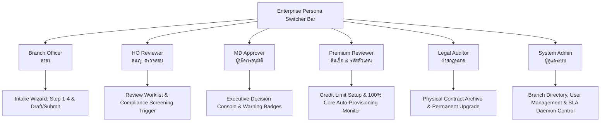

# Business Logic Model & User Journeys — Unit 6: Next.js Enterprise Web Portal

## Overview
This document specifies the end-to-end user journeys, interactive UI state machines, client-side validation logic, and operational interactions across all 6 roles.

---

## 1. Multi-Persona Workspace Architecture

---

## 2. Interactive Application Intake Journey (Branch Officer)

### Step 1: Applicant Profile
1. **Agent Type Selection**:
   - `Individual`: Prompts for Title, First Name, Last Name, 13-digit Thai National ID.
   - `Corporate`: Prompts for Company Name, 13-digit Tax ID, Authorized Director.
2. **Live Modulo 11 Validation**:
   - As the user types the 13-digit ID, a real-time validator evaluates checksum ($11 - (\sum d_i \times w_i \pmod{11}) \pmod{10}$).
   - Renders a green verified checkmark or red error indicator with exact feedback.
3. **Contact & Banking**:
   - Address, Phone, Email, Bank Account Number, Bank Name.

### Step 2: Guarantor & Collateral
1. **Guarantor Form**:
   - Enabled dynamically if requested credit limit $> 500,000$ THB or user checks "Has Guarantor".
   - Collects Guarantor Name, National ID (with Modulo 11 check), Monthly Salary, Contact Phone.
2. **Collateral Form**:
   - Land Title Deed / Bank Guarantee selection, Reference Number, Appraised Value.
3. **Credit Terms**:
   - Motor credit term: 15 / 30 / 31 days selector.
   - Non-Motor credit term: Max 45 days.

### Step 3: Document Upload with Magic Byte Anti-Spoofing
1. **Drag-and-Drop Dropzone**:
   - Supports ID Card, House Registration, Bank Book Copy, License, Affidavit, Land Deed.
2. **Client-Side Magic Byte Verification**:
   - Reads the first 4-8 bytes via `FileReader`:
     - `%PDF` (`25 50 44 46`) $\rightarrow$ Valid PDF.
     - `FF D8 FF` $\rightarrow$ Valid JPEG.
     - `89 50 4E 47` $\rightarrow$ Valid PNG.
   - If an executable or renamed `.exe` is dropped as `.pdf`, it immediately flags "Invalid File Signature (Security Violation)" before network transmission.

### Step 4: Review & Submit
1. **Summary Cards**:
   - Clean tabular display of all entered profile data, guarantor, collateral, and verified attachments.
2. **Action Buttons**:
   - `Save as Draft`: Persists state to backend as `Draft`.
   - `Submit Application`: Validates completeness, executes `SubmitByBranch`, transitions status to `Submitted`.

---

## 3. Head Office Reviewer Journey

1. **Queue Dashboard**:
   - Lists applications in `Submitted` or `PendingHeadOfficeReview`.
   - Search by Application Number, Applicant Name, or Branch.
2. **Compliance Screening Trigger**:
   - 1-Click button: "Run AMLO / OIC Sanctions Screen".
   - Executes deterministic screening and displays visual badge:
     - 🟢 **CLEAR**: No AMLO / OIC matches.
     - 🟠 **PEP / ORANGE FLAG**: Politically Exposed Person (Triggers mandatory Director-level signoff).
     - 🔴 **SANCTIONED / BLACKLISTED**: Designated entity (Blocks progression).
3. **Review Actions**:
   - `Forward to Executive Approval`: Transitions to `PendingExecutiveApproval`.
   - `Return for Deficiency`: Opens checklist modal (e.g., "Blurry ID copy", "Missing guarantor salary slip"), transitions to `DeficiencyPendingBranch`.

---

## 4. MD Executive Approver Journey

1. **Executive Decision Queue**:
   - Highlights high-priority applications awaiting signature.
   - Displays clear warning banner if `RequiresDirectorApproval == true` (PEP/Orange Flag).
2. **One-Click Decision Console**:
   - Modal with application summary, credit request, and compliance summary.
   - `Approve`: Inputs approval remarks, executes approval, transitions to `ReviewPremium`, sends confirmation email.
   - `Reject`: Inputs rejection remarks, transitions to `ExecutiveRejected`, sends rejection notification.

---

## 5. Premium Reviewer & Automated Core Provisioning Journey

1. **Credit & Commission Setup**:
   - Sets `ApprovedCreditLimit` (THB) and `CommissionPercentage` (%).
2. **1-Click Provisioning Trigger**:
   - Clicking "Generate Codes & Provision Core Systems":
     - Calls Deves Master API client $\rightarrow$ generates `AgentCode` (`AG2026...`) and `SourceCode` (`SRC-B...`).
     - Triggers automated async provisioning across **AS400**, **APAR**, **SAP**, and **PCSDIS**.
     - Live UI status cards update from `Pending` $\rightarrow$ `Success` (100% IT Automation).
     - Transitions application to `ActiveTemporary` and starts 30-day and 90-day SLA timers.

---

## 6. Legal Auditor & SLA Dashboard Journey

1. **SLA Monitoring Dashboard**:
   - Live metric tiles: Active Temporary count, Near Deadline (D-7/D-3), Suspended (30D), Terminated (90D), Active Permanent.
   - Real-time countdown badges on each application card (e.g. `⏳ เหลืออีก 24 วัน (SLA 30D)`).
2. **Physical Contract Archiving**:
   - Legal auditor receives hard-copy documents by post.
   - Enters `ArchiveBoxNumber` (e.g. `BOX-2026-HQ-001`) and auditor notes.
   - Clicks "Verify & Archive Contract" $\rightarrow$ transitions status to `ActivePermanent` (and automatically clears suspension if it was in `Suspended30D`).
