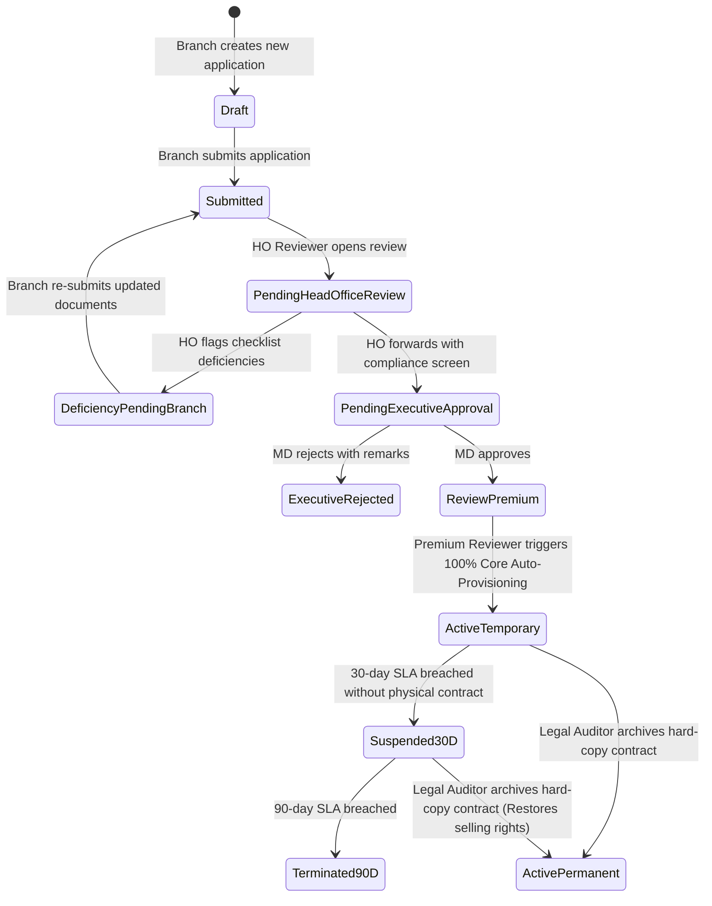

# Business Rules & Client Validations — Unit 6: Next.js Enterprise Web Portal

## Overview
This document specifies client-side validation rules, RBAC UI permission matrices, and user interaction feedback constraints for the enterprise web portal.

---

## 1. Client-Side Form Validation Matrix

| Field | Rule Code | Validation Specification | UI Feedback |
|---|---|---|---|
| Thai National ID | `VAL-ID-01` | Exactly 13 numeric digits; Modulo 11 check digit valid | 🟢 "เลขบัตรประชาชนถูกต้อง" / 🔴 "เลขบัตรประชาชนไม่ถูกต้องตามสูตรคำนวณ" |
| Tax ID (Corporate) | `VAL-TAX-01` | Exactly 13 numeric digits | 🟢 "เลขประจำตัวผู้เสียภาษี 13 หลัก" |
| Credit Limit | `VAL-CREDIT-01` | Numeric $> 0$; if $> 500,000$ THB, Guarantor or Collateral prompt appears | ⚠️ "วงเงินเกิน 500,000 บาท แนะนำให้แนบผู้ค้ำประกันหรือหลักทรัพย์" |
| Motor Term | `VAL-TERM-01` | Must be 15, 30, or 31 days | Dropdown selection only |
| Non-Motor Term | `VAL-TERM-02` | $1 \le \text{Term} \le 45$ days | Input clamped to $\le 45$ |
| Attachment Type | `VAL-FILE-01` | Extension must match magic byte header (`%PDF`, `\xFF\xD8\xFF`, `\x89PNG`) | 🔴 "ไฟล์ไม่ถูกต้องตามชนิดข้อมูลที่ระบุ (Security Violation)" |
| File Size | `VAL-FILE-02` | File size $\le 10$ MB per file | 🔴 "ขนาดไฟล์เกิน 10MB" |
| Archive Box No. | `VAL-ARCH-01` | Mandatory when executing legal contract archive | 🔴 "กรุณากรอกเลขที่กล่องจัดเก็บเอกสาร (Archive Box Number)" |

---

## 2. RBAC UI Permissions Matrix

| UI View / Action | Branch Officer | HO Reviewer | MD Approver | Premium Reviewer | Legal Auditor | System Admin |
|---|:---:|:---:|:---:|:---:|:---:|:---:|
| **Create Application Draft** | ✅ | ❌ | ❌ | ❌ | ❌ | ✅ |
| **Submit Application** | ✅ | ❌ | ❌ | ❌ | ❌ | ✅ |
| **Branch Worklist (Own Branch)** | ✅ | ❌ | ❌ | ❌ | ❌ | ✅ |
| **All-Branch Review Worklist** | ❌ | ✅ | ❌ | ❌ | ❌ | ✅ |
| **Trigger Compliance Screening** | ❌ | ✅ | ❌ | ❌ | ❌ | ✅ |
| **Forward to Executive** | ❌ | ✅ | ❌ | ❌ | ❌ | ✅ |
| **Return Deficiency Checklist** | ❌ | ✅ | ❌ | ❌ | ❌ | ✅ |
| **Executive Decision Console** | ❌ | ❌ | ✅ | ❌ | ❌ | ✅ |
| **Credit & 100% Auto-Provisioning**| ❌ | ❌ | ❌ | ✅ | ❌ | ✅ |
| **SLA Tracker Dashboard** | 👁️ (Read) | 👁️ (Read)| 👁️ (Read)| 👁️ (Read)| ✅ (Full) | ✅ (Full) |
| **Archive Hard Copy (ActivePermanent)**| ❌ | ❌ | ❌ | ❌ | ✅ | ✅ |
| **Branch & User Admin** | ❌ | ❌ | ❌ | ❌ | ❌ | ✅ |

---

## 3. UI State Transitions & Action Feedback

