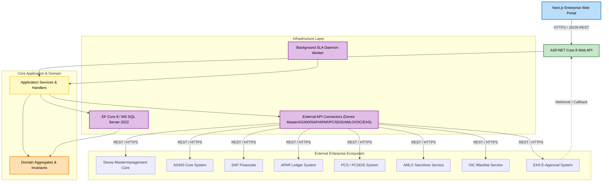

# Component Dependencies & Communication Patterns — Agent & Broker Management System

This document maps the architectural dependencies and runtime communication flows across all system components.

---

## 1. Architectural Dependency Matrix

| Layer / Component | Depends On (Internal) | Depends On (External / Infrastructure) | Consumed By |
|---|---|---|---|
| **Domain** | None (Zero external dependencies) | None | Application, Infrastructure, Web API |
| **Application** | Domain | `IApplicationDbContext`, `IStorageService`, External Client Interfaces | Web API, Background Workers |
| **Infrastructure.Data** | Domain, Application (Interfaces) | Entity Framework Core, MS SQL Server 2022 | Web API (via DI registration) |
| **Infrastructure.Clients** | Domain, Application (Interfaces) | `HttpClient`, External REST APIs (AS400, SAP, APAR, PCSDIS, AMLO, OIC, EAS) | Application Services |
| **Infrastructure.BackgroundWorkers** | Application (Interfaces) | `Microsoft.Extensions.Hosting.BackgroundService` | Web API Runtime |
| **Web API (Presentation)** | Application, Domain, Infrastructure (DI) | ASP.NET Core 8, JWT/OAuth2, Swashbuckle | Next.js Frontend, EAS Webhooks |
| **Next.js Web Client** | Web API REST Endpoints | Axios / TanStack Query, NextAuth / AD SSO | End Users (All Personas) |

---

## 2. Dependency Graph



### Text Alternative
```
1. Next.js Web Client communicates via HTTPS REST with ASP.NET Core 8 Web API.
2. Web API routes requests to Application Services.
3. Application Services manipulate Domain Aggregates and coordinate EF Core Data persistence and External API Connectors.
4. External API Connectors interact with AS400, SAP, APAR, PCSDIS, AMLO, OIC, and EAS.
5. Background SLA Daemon invokes Application Services daily for SLA evaluations.
6. EAS dispatches async Webhook callbacks to Web API.
```

---

## 3. Communication Sequences

### Automated Multi-System Provisioning Sequence
```
Branch/HO/Premium      AppService             AS400          APAR          SAP          PCSDIS
       |                   |                    |              |            |              |
       |-- Approve Credit->|                    |              |            |              |
       |                   |-- Create Agent --->|              |            |              |
       |                   |<-- Return Code ----|              |            |              |
       |                   |-- Map Ledger -------------------->|            |              |
       |                   |<-- Success -----------------------|            |              |
       |                   |-- Create BP Entity --------------------------->|              |
       |                   |<-- Success ------------------------------------|              |
       |                   |-- Setup Node, UE, Comm -------------------------------------->|
       |                   |<-- Success ---------------------------------------------------|
       |                   |
       |                   |-- Set Status: ACTIVE_TEMPORARY (Provisional Selling Active)
       |<-- Provisioned ---|
```
