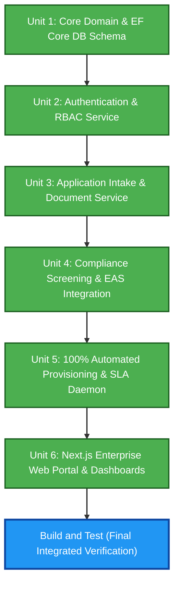

# Unit of Work Dependencies & Execution Order — Agent & Broker Management System

This document specifies the dependency matrix, critical path, and sequential construction order across all 6 Units of Work.

---

## 1. Unit Dependency Matrix

| Unit | Depends On (Prerequisites) | Required By | Critical Path Priority |
|---|---|---|---|
| **Unit 1: Core Domain & EF Core Schema** | None (Base Foundation) | Units 2, 3, 4, 5, 6 | **P1 (Highest - Blocking Foundation)** |
| **Unit 2: Authentication & RBAC** | Unit 1 | Units 3, 4, 5, 6 | **P2 (High - Security & Identity)** |
| **Unit 3: Intake & Document Service** | Units 1, 2 | Units 4, 5, 6 | **P3 (High - Application Data Entry)** |
| **Unit 4: Compliance & EAS Signature** | Units 1, 2, 3 | Units 5, 6 | **P4 (Medium - External Approval)** |
| **Unit 5: Auto-Provisioning & SLA Daemon** | Units 1, 2, 3, 4 | Unit 6 | **P5 (Medium - Background & Core)** |
| **Unit 6: Next.js Enterprise Web Portal** | Units 1, 2, 3, 4, 5 | End-to-End System | **P6 (Final Integration & UI)** |

---

## 2. Dependency Graph



### Text Alternative
```
Sequential Construction Sequence:
1. Unit 1: Core Domain & EF Core Schema (Foundation)
2. Unit 2: Authentication & RBAC (Security Layer)
3. Unit 3: Application Intake & Document Service (Intake Layer)
4. Unit 4: Compliance Screening & EAS Engine (External Review Layer)
5. Unit 5: 100% Automated Provisioning & SLA Auto-Suspension Daemon (Core Automation)
6. Unit 6: Next.js Enterprise Web Portal & Operational Dashboards (User Experience)
7. Final Stage: Build and Test across all units
```

---

## 3. Per-Unit Construction Checkpoints
Each unit will execute through the full Construction lifecycle:
1. **Functional Design**: Domain schemas, DTOs, endpoint signatures, reject checklists.
2. **NFR Requirements**: Security baseline, resiliency, and property-based test invariants.
3. **NFR Design**: Logging, circuit breakers, encryption, and error handling.
4. **Infrastructure Design**: EF Core mapping, BackgroundService configuration, and API routes.
5. **Code Generation**: Part 1 (Planning) + Part 2 (Generation) for implementation and test code.
