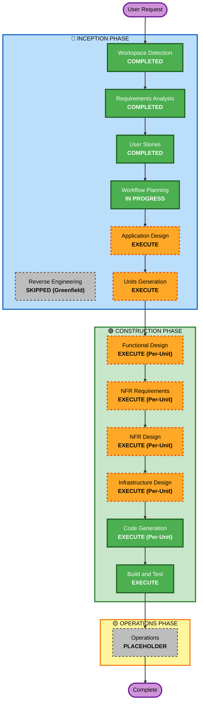

# Execution Plan — Agent & Broker Management System

## Detailed Analysis Summary

### Project Classification & Scope
- **Project Type**: Greenfield Enterprise Web Application
- **Technology Stack**: Next.js 14+ (TypeScript/React) + ASP.NET Core 8 Web API (C#) + MS SQL Server 2022 (EF Core)
- **Primary Modules**:
  1. Agent Intake & Document Digitization (Form F-CM-035 & F-CM-018)
  2. Automated AMLO (ปปง.) & OIC (คปภ.) Compliance Screening
  3. Multi-Department Review & EAS Electronic Signature Integration
  4. 100% Automated Multi-System Core Provisioning (AS400, APAR, SAP, PCSDIS UE/Commissions)
  5. SLA Physical Contract Lifecycle & Automated Policy Submission Suspension (Auto-Suspend Daemon)
  6. Real-Time Operational Dashboards & Monthly Credit Committee Reporting

### Change Impact Assessment
- **User-Facing Changes**: Yes — Full multi-role web portal for Branch BU, Head Office BU, Premium Dept, Legal Dept, Executive Approvers, and IT Admin.
- **Structural & Architectural Design**: Yes — Clean Architecture / Layered Domain-Driven Design (Domain, Application, Infrastructure, API, Web Client).
- **Data Model**: Yes — Relational database schema in MS SQL Server covering Applications, Guarantors, Collateral, Compliance Checks, EAS Signature Logs, Core System Sync Transactions, and Hard-Copy SLA Audit Trails.
- **API Contracts**: Yes — RESTful APIs with Swagger/OpenAPI specifications, JWT/SSO middleware, and mockable external service adapters.
- **NFR & Compliance Impact**: Yes — Full enforcement of Security Baseline, Resiliency Baseline, Property-Based Testing, and ISO 27001 segregation of duties.

### Risk Assessment
- **Risk Level**: Medium-High (Financial and compliance core integrations, strict SLA timer automated suspension).
- **Rollback Complexity**: Moderate (Idempotent provisioning and database migration rollbacks).
- **Testing Complexity**: Comprehensive (xUnit, FluentAssertions, FsCheck/Bogus Property-Based Tests, Integration Tests, Playwright UI Tests).

---

## Workflow Visualization



### Text-Based Alternative
```
Phase 1: INCEPTION
- Stage 1: Workspace Detection (COMPLETED)
- Stage 2: Reverse Engineering (SKIPPED - Greenfield)
- Stage 3: Requirements Analysis (COMPLETED)
- Stage 4: User Stories (COMPLETED)
- Stage 5: Workflow Planning (IN PROGRESS)
- Stage 6: Application Design (EXECUTE)
- Stage 7: Units Generation (EXECUTE)

Phase 2: CONSTRUCTION (Per-Unit Loop & Final Testing)
- Unit Loop: Functional Design -> NFR Requirements -> NFR Design -> Infrastructure Design -> Code Generation
- Final Stage: Build and Test (EXECUTE)

Phase 3: OPERATIONS
- Operations (PLACEHOLDER)
```

---

## Phases to Execute

### 🔵 INCEPTION PHASE
- [x] **Workspace Detection** (COMPLETED)
- [x] **Reverse Engineering** (SKIPPED — Greenfield project without legacy code)
- [x] **Requirements Analysis** (COMPLETED)
- [x] **User Stories** (COMPLETED)
- [x] **Workflow Planning** (IN PROGRESS)
- [ ] **Application Design** (EXECUTE)
  - *Rationale*: Critical to define the modular Clean Architecture, service interfaces (EAS, AS400, SAP, AMLO, OIC), data entities, and component contracts.
- [ ] **Units Generation** (EXECUTE)
  - *Rationale*: Necessary to partition the full-stack system into cohesive, independently testable units of work.

### 🟢 CONSTRUCTION PHASE
- [ ] **Functional Design** (EXECUTE — Per-Unit)
  - *Rationale*: Define detailed domain logic, DTOs, endpoint signatures, and reject checklists.
- [ ] **NFR Requirements** (EXECUTE — Per-Unit)
  - *Rationale*: Validate performance, security headers, authentication filters, and PBT test properties.
- [ ] **NFR Design** (EXECUTE — Per-Unit)
  - *Rationale*: Incorporate circuit breakers, structured JSON logging, and AES-256 data encryption.
- [ ] **Infrastructure Design** (EXECUTE — Per-Unit)
  - *Rationale*: Specify database connection strings, Docker containers, and background worker hosting.
- [ ] **Code Generation** (EXECUTE — Always)
  - *Rationale*: Part 1 Planning + Part 2 Generation for full-stack codebase and test suites.
- [ ] **Build and Test** (EXECUTE — Always)
  - *Rationale*: Comprehensive unit testing, property-based tests, API integration tests, and build verification.

### 🟡 OPERATIONS PHASE
- [ ] **Operations** (PLACEHOLDER — Future deployment & monitoring pipeline)

---

## Proposed Units of Work Decomposition
1. **Unit 1: Core Domain, Database Schema & Entity Framework Models** (.NET Core / MS SQL Server DB context, migrations, seed data, and repository abstractions)
2. **Unit 2: Authentication, RBAC & Organization Service** (AD/SSO token handling, permissions matrix, user management)
3. **Unit 3: Application Intake & Document Management Service** (Forms F-CM-035 & F-CM-018, file upload & encrypted storage)
4. **Unit 4: Compliance Screening & External Integrations Engine** (AMLO, OIC, and EAS Electronic Signature connectors with Mock/Simulation fallback)
5. **Unit 5: Automated Provisioning & Background SLA Suspension Daemon** (100% automated AS400, APAR, SAP, PCSDIS UE setup + 30d/90d Auto-Suspend background worker)
6. **Unit 6: Next.js Enterprise Web Portal & Operational Dashboards** (Multi-role frontend UI, intake forms, review queues, SLA countdowns, and Credit Committee reports)

---

## Success Criteria & Quality Gates
- 100% compliance with Security Baseline (encryption, headers, parameterized queries, AD/SSO auth).
- 100% compliance with Resiliency Baseline (circuit breakers, exponential retry, health check endpoints).
- Property-based testing validation for workflow state transitions and timer boundaries.
- Segregation of duties complying with ISO 27001 (Zero manual IT intervention in core provisioning).
