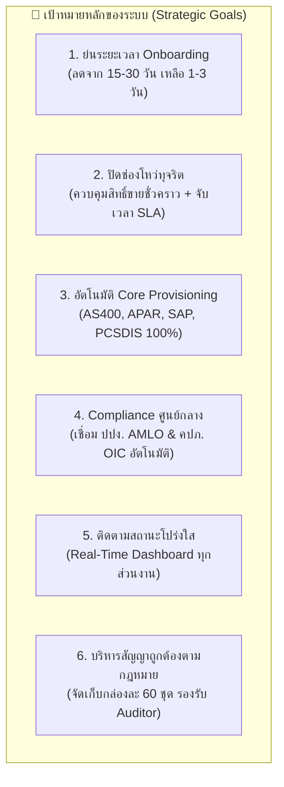
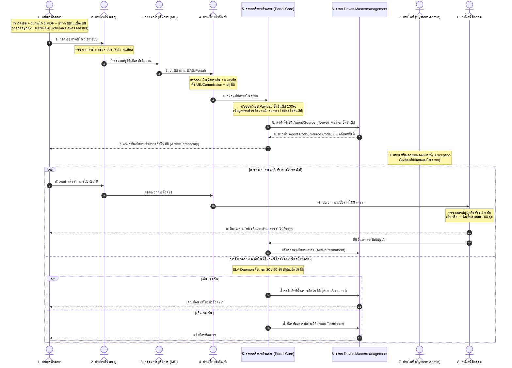
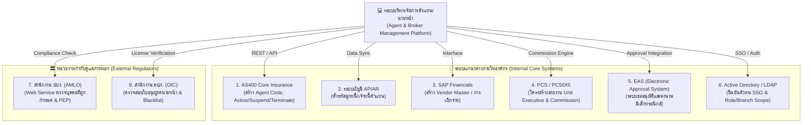
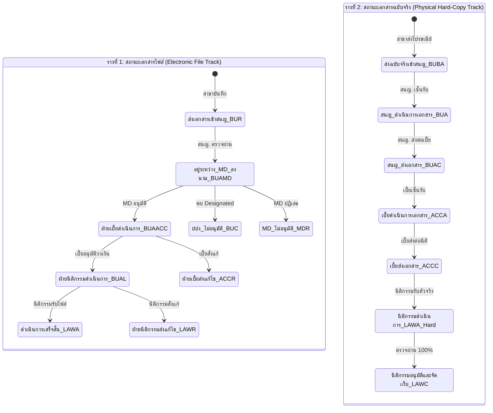
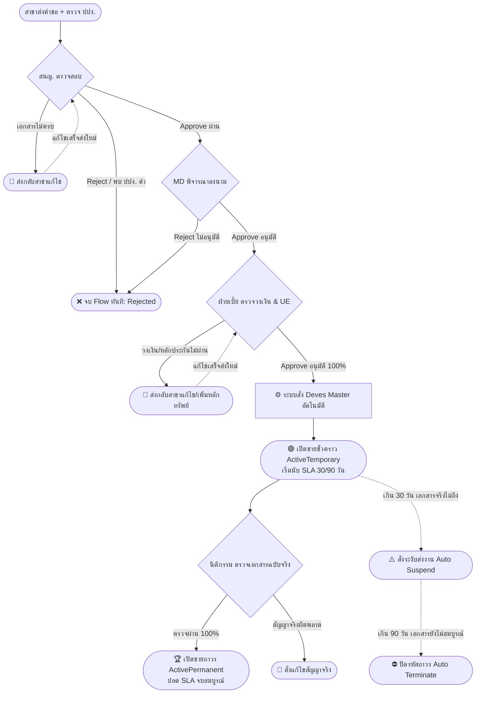

# เอกสารวิเคราะห์เป้าหมายและภาพรวมระบบบริหารจัดการตัวแทน/นายหน้า (Agent & Broker Management System)
## รหัสโครงการอ้างอิง: F-BP-009 / QP-CM-004
**บริษัท เทเวศประกันภัย จำกัด (มหาชน) — Deves Insurance PCL.**

---

## 1. บทนำและบริบทที่มาของโครงการ (Context & Background)

การดำเนินธุรกิจประกันวินาศภัยของ บริษัท เทเวศประกันภัย จำกัด (มหาชน) พึ่งพาช่องทางการขายผ่าน **ตัวแทน (Individual Agent)** และ **นายหน้า (Broker ทั้งบุคคลธรรมดาและนิติบุคคล)** เป็นสัดส่วนหลัก โดยมีสาขาย่อยกระจายอยู่ทั่วประเทศ

### สภาพปัญหาในกระบวนการเดิม (AS-IS Pain Points)
จากการวิเคราะห์เอกสารงานวิจัยสหกิจศึกษา, บันทึกการประชุม (MOM) ฝ่ายนิติกรรมและฝ่ายเบี้ย, ข้อกำหนด ISO (QP-CM-004) และแบบฟอร์มเดิม (`F-CM-035` คำขอเปิดรหัส, `F-CM-018` สัญญาตัวแทน/นายหน้า) พบปัญหาสำคัญ 5 ประการ:

1. **กระบวนการกระดาษล่าช้าและเสี่ยงต่อการสูญหาย (Paper-Based & Postal Delay)**:
   สาขาต้องจัดพิมพ์เอกสารแบบฟอร์มกระดาษ ให้ตัวแทน/ผู้ค้ำประกันลงนาม แล้วจัดส่งชุดเอกสารตัวจริงทางไปรษณีย์จากต่างจังหวัดเข้ามายังสำนักงานใหญ่ (สนญ.) ใช้เวลาเดินทางเฉลี่ย 3-7 วันทำการ เอกสารเสี่ยงต่อการชำรุดหรือสูญหายระหว่างทาง
2. **ไม่สามารถติดตามสถานะเอกสารได้แบบเรียลไทม์ (No Visibility & Audit Log)**:
   เอกสารฉบับกระดาษต้องส่งต่อเวียนระหว่าง 4-5 แผนกในสำนักงานใหญ่ (ฝ่ายธุรกิจ สนญ. → ผู้บริหาร MD → ฝ่ายบริหารจัดการเบี้ยประกันภัย → ฝ่ายนิติกรรม → ฝ่ายเทคโนโลยี IT) สาขาและเจ้าของงานไม่สามารถทราบได้ว่าปัจจุบันเรื่องอยู่ที่ใคร ใครเป็นผู้ถือครอง หรือติดขัดที่ขั้นตอนใด
3. **ช่องโหว่ความเสี่ยงการทุจริตจากการเปิดรหัสขายล่วงหน้า (Fraud Risk during Provisional Period)**:
   ในทางปฏิบัติเพื่อความรวดเร็วทางการค้า เมื่อฝ่ายเบี้ยได้รับเอกสารและตรวจเบื้องต้น จะสแกนเอกสารส่งให้ IT ดำเนินการเปิดรหัส Agent/Source ในระบบ Core ล่วงหน้าทันที เพื่อให้ตัวแทนสามารถนำรหัสไปเสนอขายผลิตภัณฑ์และออกกรมธรรม์ได้ก่อน แต่หากชุดเอกสารฉบับจริงที่ตามมาภายหลังมีปัญหาทางกฎหมาย หลักทรัพย์ค้ำประกันไม่ผ่าน หรือถูกฝ่ายนิติกรรม Reject จะก่อให้เกิดความเสียหายทางการเงินและช่องโหว่การทุจริตอย่างร้ายแรง
4. **ความซ้ำซ้อนของการคัดกรอง Compliance (AMLO / OIC Redundancy)**:
   เจ้าหน้าที่ต้องเข้าไปค้นหาชื่อในเว็บไซต์ภายนอกแบบแมนนวล ทั้งเว็บไซต์สำนักงาน ปปง. (ตรวจสอบบุคคลที่ถูกกำหนดและ PEP) และเว็บไซต์สำนักงาน คปภ. (ตรวจสอบสถานะใบอนุญาตและประวัติ Blacklist) ส่งผลให้เกิดความล่าช้า และบางครั้งฝ่ายเบี้ยต้องมาตรวจซ้ำอีกรอบเนื่องจากไม่มีระบบศูนย์กลางบันทึกหลักฐาน
5. **ภาระงานคีย์ข้อมูลซ้ำซ้อนในระบบ Core หลายระบบ (Manual Multi-System Entry)**:
   เจ้าหน้าที่ IT และฝ่ายเบี้ยต้องนำข้อมูลชุดเดียวกันไปเปิดรหัสในระบบ AS400, บันทึกลูกหนี้ใน APAR, สร้าง Vendor ใน SAP และผูกสายงาน/ค่าคอมมิชชั่นในระบบ PCSDIS แยกกันทีละระบบ ซึ่งเสี่ยงต่อการพิมพ์ผิดและไม่สอดคล้องกัน

---

## 2. เป้าหมายและสิ่งที่ต้องการทำ (Goals & To-Be Vision)

โครงการพัฒนาระบบนี้มีเป้าหมายหลักในการยกระดับวงจรการรับสมัคร อนุมัติ และควบคุมความเสี่ยงของตัวแทน/นายหน้าให้เป็นดิจิทัลเต็มรูปแบบ (End-to-End Digital Transformation)

### สิ่งที่เราอยากทำ (What We Want to Build)
1. **ระบบพอร์ทัลกลางแบบบูรณาการ (Single Enterprise Portal)**: ให้ทุกฝ่าย (สาขา, สนญ., ผู้บริหาร, ฝ่ายเบี้ย, นิติกรรม, IT) ทำงานบนหน้าจอเดียวกันตามสิทธิ์ (RBAC) และขอบเขตสาขา (Branch Scope)
2. **วงจรชีวิต 2 รางขนาน (Dual-Track Lifecycle)**:
   - **Track 1 (ไฟล์ดิจิทัล)**: สแกนชุดเอกสารเป็น PDF รวมไฟล์เดียว เพื่อใช้ตรวจรับ อนุมัติวงเงิน และเปิดสิทธิ์ขายชั่วคราวอย่างรวดเร็ว
   - **Track 2 (เอกสารฉบับจริง)**: ติดตามการส่งไปรษณีย์ การตรวจรับทางกฎหมาย และจัดเก็บสัญญาตัวจริงเข้ากล่องเอกสารถาวร
3. **ระบบจับเวลาและระงับสิทธิ์อัตโนมัติ (Automated SLA Daemon)**:
   - ตรวจจับเอกสารฉบับจริงที่ยังค้างส่งหรือค้างแก้ไข
   - แจ้งเตือนล่วงหน้า 7 วัน / 3 วัน / 1 วัน
   - **ครบ 30 วัน**: สั่งระงับสิทธิ์การขายชั่วคราว (Auto Suspend) ทันที
   - **ครบ 90 วัน**: สั่งปิดรหัสถาวร (Auto Terminate) และแจ้งฝ่ายเบี้ยระงับการจ่ายผลประโยชน์/ติดตามหนี้
4. **ระบบสร้างและตั้งค่ารหัสอัตโนมัติ (Zero-Manual Provisioning Engine)**: ตัดภาระงาน IT โดยระบบเชื่อมต่อ API/Service ไปเปิดรหัสในระบบ Core ทั้ง 4 ระบบอัตโนมัติแบบ Idempotent

---

## 3. การประสานงานร่วมกันระหว่างหลายส่วนงาน (Multi-Department Collaboration)

ระบบนี้มีผู้มีส่วนได้ส่วนเสีย (Stakeholders) ถึง **6 ส่วนงานหลัก** ซึ่งมีบทบาทและภารกิจที่ต้องส่งต่องานกันเป็นลูกโซ่ดังนี้:

### รายละเอียดหน้าที่และความรับผิดชอบรายส่วนงาน:

| ส่วนงาน | บทบาทหลัก | สิทธิ์ข้อมูล (Data Scope) | หน้าที่สำคัญในระบบ |
|---|---|---|---|
| **1. ฝ่ายธุรกิจสาขา (Branch BU)** | ต้นทางคำขอ (Requester) | เฉพาะสาขาตนเอง | • สร้างคำขอ (บุคคลธรรมดา/นิติบุคคล) • **กรอกข้อมูลครบถ้วน 100% ตาม Schema ของ Deves Mastermanagement** เพื่อให้ระบบเปิดรหัสอัตโนมัติได้ทันที • สแกนชุดเอกสารรวมเป็น 1 ไฟล์ PDF แนบเข้าระบบ • กดส่งตรวจ ปปง. เบื้องต้น • จัดส่งเอกสารฉบับจริงทางไปรษณีย์ • รับแจ้งแก้ไขและแนบไฟล์เพิ่มเติม |
| **2. ฝ่ายธุรกิจ สนญ. (HO BU)** | ผู้กลั่นกรองและผู้ดูแลภาพรวม (Reviewer) | ทั่วทั้งองค์กร (Global) | • ตรวจสอบความถูกต้องและวันหมดอายุใบอนุญาต • ตรวจสอบความครบถ้วนของข้อมูลก่อนส่งต่อเข้าสู่ระบบ • ตรวจสอบ ปปง. (บุคคลที่ถูกกำหนด/PEP) และ คปภ. (แดง/ส้ม/เหลือง/เขียว) • ส่งเรื่องเสนอผู้บริหารอนุมัติ |
| **3. กรรมการผู้จัดการ (MD / Executive)** | ผู้อนุมัติระดับบริหาร (Approver) | ทั่วทั้งองค์กร (Global) | • พิจารณาอนุมัติคำขอเปิดตัวแทน/นายหน้า • พิจารณากรณีพิเศษ (PEP หรือ OIC สีส้ม) • ลงนามอิเล็กทรอนิกส์ (EAS / Portal) |
| **4. ฝ่ายบริหารจัดการเบี้ยประกันภัย (Premium Dept)** | ผู้ควบคุมความเสี่ยงเครดิตและการเงิน (Financial Guard) | ทั่วทั้งองค์กร (Global) | • ตรวจสอบเงื่อนไข `วงเงินค้ำประกัน >= เงินเครดิต` • ตรวจสอบเงินเดือนผู้ค้ำประกันและมูลค่าหลักทรัพย์ • กำหนดเงื่อนไข Credit Term (Motor 15/30/31 วัน, Non-Motor ≤ 45 วัน) • **กำหนดค่า Unit Executive (UE) และโครงสร้างค่าคอมมิชชั่น** ที่ส่งต่อให้ระบบ • อนุมัติวงเงิน เพื่อให้ระบบส่งคำสั่งเปิดรหัสอัตโนมัติทันที |
| **5. ฝ่ายเทคโนโลยีสารสนเทศ (IT Dept)** | ผู้ดูแลระบบและเฝ้าระวังการเชื่อมต่อ (System Admin & Monitor) | ผู้ดูแลระบบ (Admin) | • ดูแลความมั่นคงปลอดภัยและการทำงานของระบบโดยรวม • **เฝ้าระวังระบบอัตโนมัติ (Automated Provisioning & Sync Daemon) และตรวจสอบ Exception Dashboard** • บริหารจัดการกรณี API หรือเครือข่ายขัดข้อง (Retry / Fallback) • ดูแล Background Daemon เฝ้าระวัง SLA 30/90 วัน |
| **6. สำนักนิติกรรมประกันภัย (Legal Dept)** | ผู้ตรวจสอบความถูกต้องทางกฎหมายและจัดเก็บ (Legal Compliance & Archive) | ทั่วทั้งองค์กร (Global) | • ตรวจสอบเอกสารฉบับจริง (สัญญา, ใบสมัคร, ค้ำประกัน, มอบอำนาจช่วง) • ทำบันทึกข้อความ (Memo ตรวจรับ / Memo สั่งแก้ไข) • ผช.กจก. และ ผอ. ลงนามในเอกสารจริง • ส่งคืน BU เฉพาะ "หนังสือมอบอำนาจช่วง" เพื่อคืนตัวแทน • จัดเก็บเอกสารฉบับจริงลงกล่อง (กล่องละ 60 ชุด) เพื่อการตรวจนับ Auditor • ยืนยันการจัดเก็บเพื่อเปลี่ยนสถานะเป็นเปิดสิทธิ์ถาวร |

---

### 3.1 ข้อกำหนดความครบถ้วนของข้อมูลสำหรับระบบ Deves Mastermanagement (Mandatory Intake Schema)

เพื่อให้กระบวนการส่งต่อข้อมูลเข้าสู่ระบบ **Deves Mastermanagement** เพื่อเปิด Agent / Source ทำงานเป็นแบบ **อัตโนมัติ 100% (Fully Automated System Provisioning)** ทันทีที่ฝ่ายเบี้ยอนุมัติ โดยไม่ต้องพึ่งพาบุคลากรไอทีมาคีย์ข้อมูลซ้ำ หน้าจอกรอกข้อมูลคำขอ (Intake Console) จึงต้องบังคับตรวจสอบความถูกต้องและความครบถ้วน (Mandatory Schema Validation Rules) 100% ก่อนกดส่งงาน เพื่อให้ระบบมีข้อมูลครบถ้วนพร้อมประกอบ Payload ส่งให้ Deves Master ดำเนินการเปิดรหัสได้ทันทีโดยไม่มี Error ครอบคลุมชุดข้อมูลดังต่อไปนี้:

1. **ข้อมูลผู้ขอเอาประกัน / ตัวแทนนายหน้า (Applicant Identification)**:
   - ประเภท: บุคคลธรรมดา (Individual) หรือ นิติบุคคล (Corporate)
   - คำนำหน้าชื่อ, ชื่อ, นามสกุล (ทั้งภาษาไทยและภาษาอังกฤษ)
   - ชื่อนิติบุคคล และชื่อผู้มีอำนาจลงนาม (กรณี Corporate)
   - เลขประจำตัวประชาชน 13 หลัก (ตรวจสอบ Checksum Modulo 11) หรือเลขทะเบียนนิติบุคคล
   - วันเกิด / วันที่จดทะเบียนนิติบุคคล, สัญชาติ, เพศ, ศาสนา
2. **ข้อมูลสถานที่ติดต่อและที่อยู่ (Addresses & Contact)**:
   - ที่อยู่ตามทะเบียนบ้าน และที่อยู่ปัจจุบัน/ที่อยู่ที่จัดส่งเอกสาร (บ้านเลขที่, หมู่, อาคาร/ซอย, ถนน, ตำบล/แขวง, อำเภอ/เขต, จังหวัด, รหัสไปรษณีย์)
   - เบอร์โทรศัพท์มือถือ, เบอร์โทรศัพท์สำนักงาน, อีเมลสำหรับติดต่อและส่งเอกสารแจ้งเตือน
3. **ข้อมูลบัญชีธนาคารสำหรับโอนค่าคอมมิชชั่น (Bank Account for Payout)**:
   - รหัสธนาคาร / ชื่อธนาคาร, สาขาธนาคาร
   - เลขที่บัญชีธนาคาร (มี Validation ความยาวตามมาตรฐานธนาคารนั้นๆ)
   - ชื่อบัญชี (ต้องตรงกับชื่อผู้สมัครตัวแทน/บริษัทนายหน้า)
4. **ข้อมูลใบอนุญาตนายหน้า/ตัวแทน (OIC License Data)**:
   - เลขที่ใบอนุญาตตัวแทน / นายหน้า
   - ประเภทใบอนุญาต (ประกันวินาศภัย / ประกันชีวิต)
   - วันที่ออกบัตร และวันหมดอายุใบอนุญาต (ต้องยังไม่หมดอายุ)
5. **ข้อมูลการสังกัดและโครงสร้างสายงาน (Agency & Organization Structure)**:
   - รหัสสาขาที่สังกัด (Branch Code เช่น B01, B02)
   - รหัสเจ้าหน้าที่ผู้ดูแล / เจ้าของงาน (Marketing Officer / Handler Code)
   - รหัส Unit Executive (UE Code) ที่ฝ่ายเบี้ยกำหนด
6. **ข้อมูลเครดิต วงเงิน และเงื่อนไขการค้า (Credit Limit & Terms)**:
   - วงเงินเครดิตที่ขอและที่อนุมัติ (ขั้นต่ำ 10,000 บาท)
   - Credit Term Motor: บังคับเลือก 15 วัน, 30 วัน หรือ 31 วัน
   - Credit Term Non-Motor: บังคับระบุไม่เกิน 45 วัน
   - รหัสตารางอัตราผลตอบแทน / ค่าคอมมิชชั่น
7. **ข้อมูลผู้ค้ำประกัน (Guarantor Information)**:
   - ชื่อ-นามสกุล, เลขประจำตัวประชาชน 13 หลัก
   - สถานที่ทำงาน, ตำแหน่งงาน, เงินเดือน/รายได้ประจำต่อเดือน
   - เบอร์โทรศัพท์, ความสัมพันธ์กับผู้สมัคร
8. **ข้อมูลหลักทรัพย์ค้ำประกัน (Collateral Information)**:
   - ประเภท: เงินสด (Cash), หนังสือค้ำประกันธนาคาร (Bank Guarantee), โฉนดที่ดิน (Title Deed), หรือบุคคลค้ำประกันอย่างเดียว
   - เลขที่เอกสารอ้างอิงหลักประกัน, มูลค่าประเมินวงเงินค้ำประกัน (ต้องมีเงื่อนไข `มูลค่าค้ำประกัน >= วงเงินเครดิต`)
9. **ผลการคัดกรอง Compliance (AMLO & OIC)**:
   - ผลการตรวจ ปปง. (Passed, Flagged PEP, Rejected Designated)
   - ผลการตรวจ คปภ. (Green, Yellow, Orange, Red) พร้อมภาพถ่ายหน้าจอหลักฐานแนบในระบบ

---

## 4. การทำงานเชื่อมโยงกับหลายระบบ (Multi-System Architecture & Integration)

ระบบบริหารจัดการตัวแทน/นายหน้าไม่ได้ทำงานแบบโดดเดี่ยว แต่ทำหน้าที่เป็น **ศูนย์กลางการเชื่อมโยงข้อมูล (Hub Integration)** ระหว่างระบบภายในและภายนอกองค์กรถึง 8 ระบบ:

### ตารางแจกแจงสถาปัตยกรรมการเชื่อมต่อแต่ละระบบ:

| # | ระบบงาน | บทบาทหน้าที่ | โปรโตคอล / รูปแบบที่ใช้ | ความถี่ในการทำงาน | แผนสำรองกรณีระบบปลายทางขัดข้อง |
|---|---|---|---|---|---|
| 1 | **AS400 Core Insurance** | ออกรหัส Agent Code, ควบคุมสถานะ Active, Suspended, Terminated | Message Queue / DB Link / REST API | On-Demand (เมื่ออนุมัติ) และ Hourly (โดย SLA Daemon) | Idempotent Retry Policy พร้อมบันทึก Transaction Status (Pending/Failed) |
| 2 | **APAR** | ผูกสมุดบัญชีเงินทดรองและหนี้สินของตัวแทน | Batch / API Interface | เมื่อเปิดรหัสขาย | คิวงานทำงานต่ออัตโนมัติเมื่อระบบฟื้นตัว |
| 3 | **SAP Financials** | สร้างข้อมูลคู่ค้า (Vendor Master) สำหรับจ่ายผลประโยชน์ | RFC / Web Service | เมื่อเปิดรหัสขาย | Re-sync Daemon |
| 4 | **PCS / PCSDIS** | บันทึกโครงสร้าง Unit Executive (UE) และตารางอัตราคอมมิชชั่น | Direct DB Link / Web Service | เมื่อฝ่ายเบี้ยอนุมัติ | แจ้งเตือนฝ่ายเบี้ยตรวจสอบหน้าจอ PCS |
| 5 | **EAS (Electronic Approval)** | ส่งชุดเอกสารให้ MD / ผู้บริหารลงนาม | REST API + Webhook Callback | เมื่อผ่านการตรวจรับ สนญ. | ผู้บริหารสามารถคลิก Approve บน Portal นี้ได้โดยตรง |
| 6 | **Active Directory (AD)** | ยืนยันตัวตนพนักงาน และดึงสาขา/ตำแหน่ง | LDAP / OAuth2 OIDC | ทุกครั้งที่เข้าใช้งาน (Login) | Local Session Cache (15 นาที) |
| 7 | **สำนักงาน ปปง. (AMLO)** | ตรวจสอบรายชื่อผู้ก่อการร้ายและฟอกเงิน | REST Web Service | ตอนสร้างคำขอ และตอน สนญ. ตรวจสอบ | ใช้ฐานข้อมูล Local Sanction List ที่อัปเดตรายวัน |
| 8 | **สำนักงาน คปภ. (OIC)** | ตรวจสอบสถานะใบอนุญาตและระดับโทษ (แดง/ส้ม/เหลือง/เขียว) | Web API / Automated Scraper | ตอนตรวจรับคำขอ | แจ้งเตือนให้เจ้าหน้าที่ตรวจสอบผ่านหน้าเว็บ คปภ. แมนนวล |

---

## 5. วงจรการทำงาน 2 รางขนาน (Dual-Track Workflow Lifecycle)

ระบบออกแบบเป็น **2 สถานะคู่ขนาน (Dual State Machine)** ภายในคำขอเดียวกัน เพื่อแยกความก้าวหน้าของเอกสารสแกนกับการเดินทางของเอกสารตัวจริง:

### ผลลัพธ์ทางธุรกิจของทั้งสองราง:
1. **เมื่อ Track 1 ถึงจุดที่ฝ่ายเบี้ยอนุมัติ (BUAACC -> ACCA)**:
   - ระบบสั่งการเชื่อมต่อไปยัง Deves Mastermanagement แบบอัตโนมัติ 100% เพื่อออกรหัส Agent/Source ทันที
   - สถานะการขายปรับเป็น **`ActiveTemporary` (เปิดสิทธิ์ขายชั่วคราว)** ตัวแทนเริ่มขายงานได้ทันที
   - นาฬิกา SLA 30/90 วันปฏิทินเริ่มนับถอยหลังทันที
2. **เมื่อ Track 2 เดินทางถึงนิติกรรมและตรวจรับสมบูรณ์ (LAWC)**:
   - นิติกรรมบันทึกเลขกล่องจัดเก็บ (เช่น Box No. 2026/04)
   - ส่งคืนหนังสือมอบอำนาจช่วงให้สาขา
   - สถานะการขายปรับเป็น **`ActivePermanent` (เปิดสิทธิ์ขายถาวร)**
   - ปลดตัวจับเวลา SLA ออกอย่างสมบูรณ์

---

### 5.1 ความสัมพันธ์ระหว่าง Action กับผลกระทบต่อ Flow ทั้งระบบ (Action-to-Flow Impact Matrix)

ในระบบนี้ **ทุก Action ที่เกิดขึ้น (Approve, Reject, Return for Correction หรือ SLA Timeout) ล้วนมีผลผูกพันต่อ State Machine และกระบวนการของทุกส่วนงานต่อเนื่องกันทันที (Cascade Effect)** โดยไม่มีการทำงานแบบแยกส่วน:

#### ตารางผลกระทบของ Action ต่อ Flow และระบบงาน:

| Action ที่เกิดขึ้น | จุดที่เกิด Action | ผลกระทบต่อ Flow ในระบบ | ผลกระทบต่อสิทธิ์การขายและระบบ Core |
|---|---|---|---|
| **✅ Approve (อนุมัติ)** | สนญ. / MD / ฝ่ายเบี้ย | • ส่งต่องานไปยังคิวงานของฝ่ายถัดไปตามลำดับ • **จุดเปลี่ยนสำคัญที่สุดคือ "ฝ่ายเบี้ยอนุมัติ":** ระบบจะส่งคำสั่งเปิดรหัสไปยัง **Deves Mastermanagement อัตโนมัติ 100%** ทันที | • ได้รหัส Agent Code / Source Code ทันที • ปรับสถานะเป็น **`ActiveTemporary` (เปิดขายชั่วคราวได้ทันที)** • นาฬิกา SLA 30/90 วันเริ่มนับถอยหลังทันที |
| **✅ Approve ฉบับจริง** | สำนักนิติกรรม (ตรวจเอกสารจริง 4 ฉบับผ่าน 100%) | • นิติกรรมบันทึกเลขกล่องจัดเก็บ (เช่น Box 2026/01) • ระบบส่งแจ้งเตือนส่งคืน "หนังสือมอบอำนาจช่วง" ให้สาขา | • ปรับสถานะเป็น **`ActivePermanent` (เปิดขายถาวร)** • ปลดตัวจับเวลา SLA ออกอย่างสมบูรณ์ ปิดเคสโดยสมบูรณ์ |
| **❌ Reject (ปฏิเสธเด็ดขาด)** | สนญ. / MD / ผลตรวจ ปปง. (Designated) / คปภ. (Red) | • **Flow คำขอนั้นจะ "ยุติลงทันที" (Terminated / Rejected)** • ระบบปิดจ็อบ ไม่อนุญาตให้ไหลไปหาฝ่ายเบี้ยต่อ • บันทึก Audit Log เหตุผลที่ปฏิเสธ และแจ้งเตือนสาขา | • **จะไม่มีการสร้างรหัสใน Deves Mastermanagement หรือ AS400 โดยเด็ดขาด** (ป้องกันความเสี่ยง 100%) |
| **❌ Reject ภายหลัง** | ฝ่ายเบี้ย / นิติกรรม (กรณีพบการทุจริต/เอกสารจริงปลอมแปลง) | • Flow ถูกปรับเป็นสถานะยกเลิกสัญญา (`REVOKED / CANCELLED`) | • **ระบบสั่ง Lock/Terminate รหัสใน Deves Master & AS400 อัตโนมัติทันที** เพื่อระงับการขายทันที ป้องกันความเสียหาย |
| **🔄 Return for Correction (ส่งกลับแก้ไข)** | สนญ. / ฝ่ายเบี้ย / นิติกรรม | • **Flow จะหยุดชะงัก (Pause)** และถอยกลับไปยังสถานะ `RETURNED_FOR_CORRECTION` • เรื่องเด้งกลับไปที่ Dashboard ของสาขา พร้อม Checklist ข้อความระบุสิ่งที่ต้องแก้ไข | • **ไม่สามารถก้าวข้ามไปขั้นตอนถัดไปได้** จนกว่าสาขาจะแนบเอกสารแก้ไข และกด Re-submit เข้ามาใหม่ |
| **⏱️ SLA Auto-Suspend (ครบ 30 วัน)** | SLA Daemon (จับเวลาอัตโนมัติ) | • ระบบตรวจพบว่าเอกสารฉบับจริงยังเดินทางไม่ถึงนิติกรรมภายใน 30 วันปฏิทิน | • **สั่งระงับสิทธิ์ชั่วคราว (Auto Suspend) ใน Deves Master & AS400 อัตโนมัติ** • ตัวแทนไม่สามารถคีย์ส่งงานหรือออกกรมธรรม์ใหม่ได้จนกว่าจะแก้ไข |
| **⛔ SLA Auto-Terminate (ครบ 90 วัน)** | SLA Daemon (จับเวลาอัตโนมัติ) | • เอกสารค้างเกิน 90 วันปฏิทิน | • **สั่งปิดรหัสถาวร (Auto Terminate) ใน Deves Master & AS400 อัตโนมัติ** ปิดสัญญาทันทีตามเกณฑ์ ISO/Audit |

---

## 6. กฎทางธุรกิจและกรณีเฉพาะ (Business Rules Catalog & Invariants)

จากเอกสารการประชุมและกรณีทดสอบจริง มีกฎธุรกิจสำคัญที่ระบบต้องบังคับใช้อย่างเข้มงวด:

### ก. กฎการเงินและเครดิต (Credit & Financial Rules)
- **BR-FIN-01 (เงื่อนไขอนุมัติวงเงิน)**: `มูลค่าหลักทรัพย์ค้ำประกัน + วงเงินผู้ค้ำประกัน >= วงเงินเครดิตที่ขอ` มิฉะนั้นระบบไม่อนุญาตให้ฝ่ายเบี้ยกดอนุมัติ
- **BR-FIN-02 (วงเงินขั้นต่ำ)**: วงเงินเครดิตต้องไม่ต่ำกว่า **10,000 บาท**
- **BR-FIN-03 (Credit Term Motor)**: เงื่อนไขการชำระเบี้ยประกันภัยรถยนต์ ต้องเป็น **15 วัน, 30 วัน หรือ 31 วัน** เท่านั้น
- **BR-FIN-04 (Credit Term Non-Motor)**: เงื่อนไขการชำระเบี้ยประกันภัยทั่วไป ต้อง **ไม่เกิน 45 วัน**

### ข. กฎการปฏิบัติตามกฎหมายและกำกับดูแล (Compliance Rules)
- **BR-COMP-01 (AMLO Designated Person)**: หากตรวจพบเป็นบุคคลที่ถูกกำหนดตามประกาศ ปปง. ระบบจะ **บล็อกคำขอทันที** ไม่ให้ไปต่อ พร้อมแจ้งเตือนผู้บริหารและฝ่ายกำกับ
- **BR-COMP-02 (OIC Red Status)**: หากสถานะใบอนุญาตใน คปภ. เป็นระดับสีแดง (ถูกเพิกถอน/ติดแบล็กลิสต์) ระบบจะ **ปฏิเสธคำขอทันที**
- **BR-COMP-03 (PEP & OIC Orange)**: หากเป็นบุคคลที่มีความเสี่ยงสูง (PEP) หรือ คปภ. สีส้ม ระบบจะเปิดธง `RequiresDirectorApproval = true` บังคับให้ต้องส่งถึงระดับกรรมการ/ผู้ช่วยกรรมการผู้จัดการพิจารณาเป็นกรณีพิเศษ

### ค. ลำดับชั้นความสัมพันธ์ Agent vs Source และขอบเขตการระงับสิทธิ์ (Agent-Source Hierarchy)
- **BR-HIER-01 (ลำดับชั้น 1:N)**: **1 Agent สามารถมีได้มากกว่า 1 Source** (Agent เป็น Entity หลักของผู้ทำสัญญา ส่วน Source คือรหัสหน่วยงาน/ช่องทางการขาย/สังกัดสาขาหรือผลิตภัณฑ์)
- **BR-SUSPEND-01 (การระงับระดับ Agent)**: หากเกิดการระงับที่ระดับ Agent (เช่น สัญญาหลักมีปัญหา, ติดแบล็กลิสต์ ปปง./คปภ., หรือ SLA สัญญาหลักขาด) → **ทุก Source ภายใต้ Agent นั้นจะถูก Lock/Suspend ทั้งหมดทันที** (Cascading Suspension)
- **BR-SUSPEND-02 (การระงับระดับ Source)**: หากเกิดปัญหาเฉพาะ Source ใด Source หนึ่ง (เช่น ผิดเงื่อนไขเฉพาะสาขา) → จะ Lock **เฉพาะคู่ Agent/Source รายการนั้นๆ** โดยที่ Source อื่นภายใต้ Agent เดียวกันยังคงสามารถดำเนินธุรกิจต่อได้

### ง. การบริหารจัดการสัญญาฉบับจริงและการจัดส่งคืน (Physical Contract Archive & Return)
- **BR-ARCH-01 (เอกสารที่จัดเก็บถาวร)**: ใบสมัครฉบับจริง, หนังสือสัญญาค้ำประกัน, และสัญญาตัวแทน/นายหน้า จะถูกจัดเก็บไว้ที่ฝ่ายนิติกรรมอย่างถาวร
- **BR-ARCH-02 (เอกสารส่งคืน)**: เอกสารเพียงฉบับเดียวที่ฝ่ายนิติกรรมลงนามเสร็จแล้วส่งคืนให้ฝ่ายธุรกิจเพื่อส่งต่อให้ตัวแทนคือ **"หนังสือมอบอำนาจช่วง"**
- **BR-ARCH-03 (Audit Log การรับเอกสารจริง)**: ทุกจุดเปลี่ยนผ่านของเอกสารฉบับจริง (สาขา → สนญ. → เบี้ย → นิติ) ระบบจะบันทึก **Audit Log อย่างเข้มงวด** (ระบุ User ID, ชื่อ-สกุล, แผนก, วัน-เวลา, และ IP Address ของผู้กดรับเอกสาร)

---

## 7. ข้อยุติการออกแบบสถาปัตยกรรม (Architectural & Business Decisions)

จากการยืนยันความต้องการของผู้ใช้งานผ่านเอกสาร [`requirement-verification-questions.md`](file:///e:/DVS/Project/AgentBroker_Management/aidlc-docs/inception/requirements/requirement-verification-questions.md) ได้ข้อสรุปเพื่อใช้เป็นแนวทางมาตรฐานในการพัฒนา ดังนี้:

| ข้อ | หัวข้อการตัดสินใจ | ข้อยุติทางธุรกิจ (Finalized Decision) | ผลต่อการพัฒนาระบบ |
|---|---|---|---|
| **Q1** | การเปิดขายชั่วคราว vs รอนิติกรรมตรวจเสร็จ 100% | **เปิดขายชั่วคราวทันที (Provisional Selling)** หลัง MD + เบี้ยอนุมัติ | คง State `ActiveTemporary` และระบบเปิดรหัสขายล่วงหน้าระหว่างรอตัวจริง |
| **Q2** | เกณฑ์การจับเวลา SLA 30/90 วัน | **นับทันทีตั้งแต่วันเปิดขายชั่วคราว (Day 0 = ActiveTemporary)** โดยนับเป็นวันปฏิทินต่อเนื่อง (Calendar Days) | SLA Daemon รันตรวจสอบทุกชั่วโมง: 30 วันระงับชั่วคราว / 90 วันปิดรหัสถาวร |
| **Q3** | กระบวนการส่งกลับแก้ไขเอกสาร | **รองรับทั้ง 2 รูปแบบ**: (1) ฝ่ายที่ตรวจพบ (นิติ/เบี้ย/สนญ.) เป็นผู้สั่ง Re-open แก้ไขในเลขเดิมได้ และ (2) เปิดคำขอใหม่โดยอ้างอิงเลขสัญญาเดิมได้ | เพิ่ม State `RETURNED_FOR_CORRECTION` และเพิ่มฟิลด์ `PreviousContractRef` กรณี Re-apply |
| **Q4** | ขอบเขตการ Lock รหัส ตัวแทน vs นายหน้า | **1 Agent มีหลาย Source**: สั่งระงับระดับ Agent ส่งผลต่อทุก Source ภายใต้, หากระงับเฉพาะ Source จะกระทบเฉพาะคู่ Agent/Source นั้น | ปรับ Core System Integration ให้รองรับทั้งโหมด `SuspendAgent(agentCode)` และ `SuspendSource(agentCode, sourceCode)` |
| **Q5** | สถาปัตยกรรมเชื่อมต่อระบบ EAS | **Native Portal Approval + Microsoft Approvals Integration**: ผู้บริหารลงนามบน Portal ได้โดยตรง พร้อมเชื่อมต่อ Power Automate/Teams Approval ที่ User คุ้นเคย | ไม่ต้องพึ่งพา API จาก Power App EAS เดิม แต่ทำ Webhook รองรับ Microsoft Approvals |
| **Q6** | รูปแบบเลขที่สัญญาทางการ | **`BU-{ปี ค.ศ.}-{Running 5 หลัก}`** เช่น `BU-2026-00001` | ปรับ Generator ให้สร้างรหัสมาตรฐานดิจิทัลตามรูปแบบนี้ |
| **Q7** | การบันทึกรับเอกสารฉบับจริง | **บันทึกสถานะจัดเก็บ (Archived) พร้อม Audit Log การกดรับอย่างละเอียด** | ตาราง `PhysicalDocumentAuditLog` บันทึกทุกขั้นตอนการส่งต่อ-รับมอบเอกสาร |

---

> **สรุปภาพรวม:** การวิเคราะห์ข้อมูลจาก `detail/` และการยืนยันข้อกำหนด 7 ประการ ช่วยให้สถาปัตยกรรมระบบของ **Agent & Broker Management System** ชัดเจน 100% ทั้งในมิติกระบวนการทำงานข้าม 6 ส่วนงาน, การเชื่อมโยง 8 ระบบงาน, การรักษาสมดุลระหว่างความคล่องตัวทางธุรกิจ (เปิดขายได้เร็ว) และการควบคุมความเสี่ยงตามมาตรฐาน ISO 27001 และข้อบังคับทางกฎหมาย

